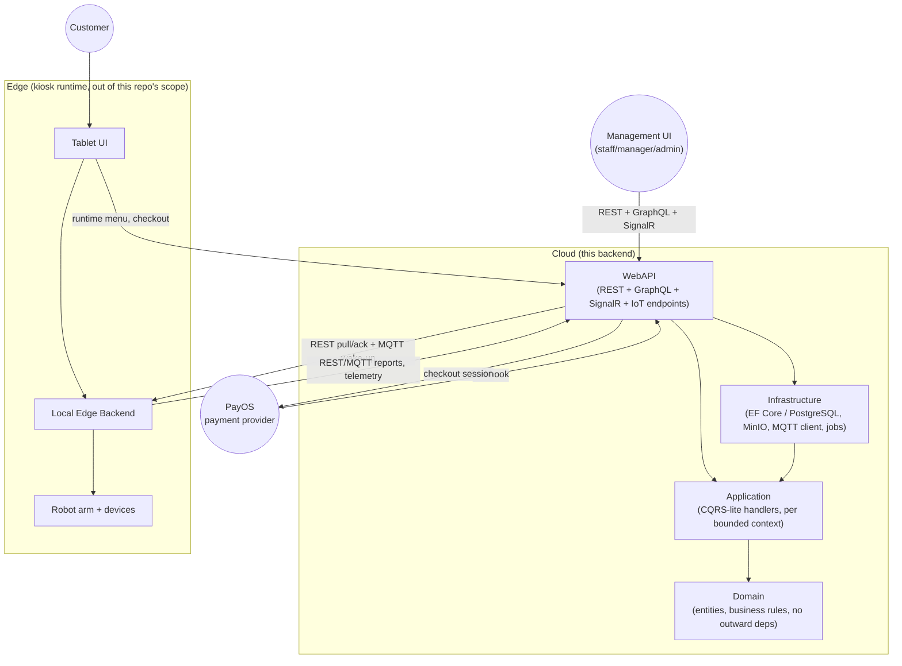

# Project Introduction — IceBot Backend

**Document type**: Team-facing baseline document (working draft for internal alignment). This is **not** the final school/thesis report — it is a shared reference for the project team to agree on scope, terminology, and boundaries before formal report writing begins.

**Source basis**: This document is derived strictly from repo evidence already collected in `deliverables/00_repo_evidence/` — specifically `repo_truth_map.md`, `functional_inventory.md`, and `database_inventory.md` — plus the authoring rules in `deliverables/DELIVERABLES_AGENT.md`. No `src/` or `docs/` files were read beyond what those evidence documents already cite, and none were modified. Statements not directly traceable to evidence are marked `[Assumption]` or `[Open Question]`.

> Note: a fifth input file, `deliverables/00_repo_evidence/evidence_review_final.md`, was requested but does not currently exist in the repository. This document was produced from the four evidence files that do exist; if `evidence_review_final.md` is added later, this introduction should be revisited against it. (A later team review, `deliverables/05_team_review/codex_review_project_intro_srs.md`, found a similarly-named file at `deliverables/05_review_checklists/evidence_review_final.md` — a different path than what was originally requested; this discrepancy is noted here rather than silently resolved.)

---

## 1. Project Overview

IceBot Backend is the server-side system for a **multi-location automated vending platform with robot-arm order fulfillment** — kiosks that prepare ice cream/beverage-style products via a robot arm, with tablet-based customer checkout. The backend is an ASP.NET Core application organized as a **Clean Architecture / Modular Monolith**, structured into bounded contexts (Identity, Tenants, Catalog, Sales Catalog, Orders, Payments, Robot Configuration, Production Configuration/Execution, Production Packages, Devices, Inventory, Operations, Sync).

Evidence: `deliverables/00_repo_evidence/repo_truth_map.md` §1–§2.

## 2. Product Background

The system supports a franchise-style vending business: an organization operates one or more stores, each store hosts one or more kiosks, and each kiosk runs a robot arm plus supporting devices (dispensers, sensors) to produce and hand over items sold through a tablet UI. The backend distinguishes between:

- **Cloud** — organization/store/kiosk management, catalog and menu authoring, robot program/configuration authoring, payment integration, reporting, and central coordination.
- **Edge** — the local kiosk runtime that owns robot execution, local device communication, telemetry capture, and tolerates temporary disconnection from the Cloud.

Evidence: `repo_truth_map.md` §2 (`ARCHITECTURE.md:5-37, 137-174`).

`[Assumption]` The product appears aimed at a franchise/multi-tenant commercial rollout model (see `TenantScopeType` hierarchy and "Franchise Onboarding"/"Production Package" features), rather than a single-site deployment, but the business/commercial motivation itself (why franchising, target market, etc.) is not stated in the evidence files and is out of scope for a code-derived document.

## 3. Project Context

- **Architecture style**: Modular Monolith with bounded-context separation, tactical DDD where domain rules matter, CQRS-lite for complex workflows, and event-driven integration for sync/robot runtime/payment callbacks/operational events. Compile-time dependency direction: `WebAPI → Infrastructure → Application → Domain`.
- **Persistence**: PostgreSQL 17 via EF Core (`IceBotDbContext`). `database_inventory.md` reports 98 `DbSet<T>` properties (verified directly against `src/Infrastructure/Data/IceBotDbContext.cs`, which corrects that file's own "~130" figure) and at least 99 tables created cumulatively across 5 migrations — a lower bound from summed `CreateTable` calls, not an independently re-verified current-schema count. `[Open Question]` whether the current physical table count differs from this migration-based tally. Binary robot artifacts (`.lua` files) are stored in MinIO (S3-compatible object storage), not the database.
- **Communication with Edge/kiosks**: REST (`/api/v1/iot/...`) plus MQTT for best-effort wake-up notifications and (per the evidence) full duplex uplink message consumption; MQTT is explicitly documented as *not* the source of truth for execution state.
- **Realtime UI updates**: SignalR hubs (`/hubs/orders`, `/hubs/operations`, `/hubs/management-dashboard`).
- **Query surface**: REST for most writes and tablet/IoT traffic; GraphQL (HotChocolate) for most management-side reads.

Evidence: `repo_truth_map.md` §2, §6; `database_inventory.md` §7; `functional_inventory.md` (MQTT Edge Integration, SignalR Realtime, GraphQL Management Reads sections).

## 4. Problems to Solve

Based on the business flows and functional inventory, the system exists to address:

1. **Coordinating a physical, robot-executed production process with an online order/payment flow**, where payment success and physical execution are decoupled in time and must be reconciled if execution fails or times out (`docs/flows/CHECKOUT_EXECUTION_FLOW.md`, `functional_inventory.md` SYNC-01/SYNC-02).
2. **Operating kiosks reliably despite intermittent connectivity** between Edge and Cloud — requiring idempotent command dispatch, retry, dead-lettering, and reconciliation jobs rather than assuming always-on connectivity (`repo_truth_map.md` §2, §8; `functional_inventory.md` Sync section).
3. **Managing a multi-tenant, multi-kiosk business** (organizations → stores → kiosks) with scoped role-based access control, so different actors (SystemAdmin, OrgAdmin, Manager, Staff, Technician) see and act on only what they're authorized for (`repo_truth_map.md` §3; `functional_inventory.md` Identity/Tenants sections).
4. **Authoring and safely deploying robot programs** (Fairino `.lua` exports) to physical kiosks, including versioning, technical contracts (declared effects/ordering constraints), inventory-readiness gating before deployment, and rollback (`functional_inventory.md` Robot Configuration, Production Configuration sections).
5. **Standardizing franchise rollout** via reusable "Production Packages" that can be installed, upgraded, forked, and rolled back per organization/store/kiosk (`functional_inventory.md` Production Packages section).
6. **Handling physical production defects and payment edge cases** (wrong output, no output, duplicate payment, failed refund) through explicit incident-resolution and refund workflows rather than leaving them unhandled (`functional_inventory.md` ORD-20–ORD-24, PAY-10–PAY-16).
7. **Giving operations staff visibility and control** over kiosk health, inventory levels, alerts, and maintenance tickets across many physical locations (`functional_inventory.md` Operations, Devices, Inventory sections).

`[Assumption]` These problem statements are inferred by reading what the implemented features solve for; the evidence files do not contain an explicit "problem statement" section from the original project brief, so this list should be reviewed against the team's own stated project goals if one exists outside this repo.

## 5. Proposed Solution

The repository *is* the proposed/implemented solution — an implementation repository containing wired backend code, not a proposal document. `[Inferred]`: static source and wiring evidence show the pieces connected end-to-end (route → handler → domain → persistence); this does not by itself prove the system runs successfully in a given environment, is correctly configured, or passes its test suite (no test-coverage mapping exists in the evidence base). At a high level, the solution consists of:

- A **Cloud backend** (this repository) exposing REST + GraphQL + SignalR + IoT/MQTT surfaces, organized around bounded contexts with EF Core/PostgreSQL persistence.
- A **checkout → payment → execution pipeline**: tablet places an order → Cloud validates and creates `Order`/`PaymentTransaction` → PayOS payment session/QR → webhook confirms payment → Cloud dispatches an `ExecuteOrder` edge command → Edge pulls, executes, and reports back → Cloud finalizes the order. Evidence: `repo_truth_map.md` §5 item 4.
- A **robot configuration pipeline**: Fairino Lua export → artifact/program authoring and technical-contract validation → configuration release → deployment to Full-Edge or low-cost-controller kiosks, with preview/checksum gating and rollback. Evidence: `functional_inventory.md` Robot Configuration + Production Configuration sections.
- A **franchise packaging layer**: Production Packages let a platform-level manifest (products, artifacts, programs, routes) be installed per organization/store/kiosk, upgraded, forked into an organization-owned copy, or rolled back. Evidence: `functional_inventory.md` Production Packages section.
- **Operational tooling**: alerts (auto-raised from device events/inventory thresholds), maintenance tickets, notification delivery, and dashboards for staff to keep kiosks running. Evidence: `functional_inventory.md` Operations, Dashboard sections.

## 6. Target Users / Actors

Per `repo_truth_map.md` §3 and `functional_inventory.md`:

| Actor | Role |
|---|---|
| **SystemAdmin** | Platform-wide administration: accounts, permissions, global catalogs (device types, robot artifact templates, production packages), platform health. |
| **OrgAdmin** | Administers resources within one assigned organization (stores, kiosks, catalog, robot configuration, franchise onboarding). |
| **Manager** | Business/operations management across kiosks: menus, pricing, reports, maintenance coordination, refunds. |
| **Staff** | On-site operations: refill, cleaning, status checks, issue reporting, manual order fulfillment/support, incident handling. |
| **Technician** | Installation, robot/kiosk setup, technical maintenance, device/robot configuration, troubleshooting. |
| **Customer** | Tablet/checkout user; no login, interacts via public v1 endpoints and an order-scoped access token. |
| **Tablet (kiosk client)** | Owns only transient UI/cart/QR state; never starts robot execution directly. |
| **Local Edge Backend / kiosk runtime** | Owns runtime execution truth, local command queue, and telemetry; authenticates via mTLS (Full Edge) or ECDSA-signed requests (low-cost controller). |
| **Payment provider (PayOS)** | External system that calls back via webhook and provides the checkout/QR session. |

## 7. System Scope

Directly evidenced by code in `functional_inventory.md`, which lists 260 identifiable capability rows (its own summary table totals 265 — a 5-row overcount against the Operations and Payments sections that was not corrected in that file; treat 260 as the mechanically-verified count and 265 as an open discrepancy, see §12). Rows marked `Implemented` there are the basis for the list below; the 2 rows marked `Partial` (IDN-15b, SYNC-05) are known-incomplete limitations, not confirmed-complete features — they are called out in §8 rather than folded into this scope list. `functional_inventory.md`'s own `Status` legend distinguishes: `Implemented` = code read directly wiring route/consumer → handler → domain/persistence (i.e. statically code-evidenced, not independently runtime- or test-verified); `Partial` = incomplete/narrower than documented; `Documented-only` = no code found (none of the latter were identified). In scope:

- **Identity & Access**: local + Google (Firebase) login, invitation-based account onboarding, refresh-token/session management, scoped RBAC (role + organization/store/kiosk scope).
- **Tenants**: organization/store/kiosk lifecycle, sales-pause/resume, franchise onboarding workflow, role-scope lookups.
- **Catalog**: ingredients, product categories, global product templates, tenant-scoped products/variants, option groups/options, recipes (with Draft→Published→Active→Retired lifecycle and versioning).
- **Sales Catalog**: menus and menu items, kiosk runtime-menu projection (sellability rules, option filtering by production route).
- **Inventory**: dispenser (container) provisioning/configuration, refill/consume/adjust, rebind on hardware replacement, topology view, readiness evaluation feeding into deployment gating.
- **Orders**: checkout, status tracking, cancellation, management redispatch/remake, manual and packaged-item fulfillment, production incident resolution (inspect → resolve → complete), real-time status via SignalR.
- **Payments**: PayOS session creation, webhook ingestion, manual/automatic reconciliation, refunds (full/voucher), payment diagnostics.
- **Robot Configuration**: Lua artifact upload/publish/retire, global artifact templates, technical contracts (declared effects, ordering constraints), robot program authoring, full authoring-import pipeline (upload → validate → materialize → compose → publish).
- **Production Configuration**: configuration releases, execution routes/robot bindings, deployment (Full Edge and low-cost-controller profiles) with preview/checksum gating, rollback, timeout reconciliation.
- **Production Packages**: package/version authoring, installation preview/install/retry/fork/repair, upgrade preview/execute/cutover/rollback/abandon.
- **Devices**: device type/model catalog, device registration/replacement, execution endpoints (credential provisioning, MQTT credentials), heartbeat/telemetry ingestion, connectivity reconciliation.
- **Operations**: alerts (manual + auto-raised), maintenance tickets, operation logs, notification delivery and requeue.
- **IoT/Edge contract**: REST endpoints for device events, batch telemetry, heartbeat, readiness, command pull/ack, execution reports, production-sync events/checkpoints/state-summaries — mirrored over MQTT for the same handlers.
- **Sync**: dead-letter listing/retry/resolve/ignore for failed sync events; automatic order-execution dispatch and timeout reconciliation.
- **Cross-cutting**: SignalR realtime push (orders/operations/dashboard), GraphQL management reads, management dashboard metrics.

Evidence: `functional_inventory.md` (all sections); summary table at `functional_inventory.md:16-38`.

## 8. Out-of-Scope Items

Explicitly noted as *not* implemented, or implemented only partially, in the evidence:

- **Automatic provider refunds/payouts** — current refund phase is manual cash refund only; no automated provider-side refund/payout exists. (`repo_truth_map.md` §8)
- **Cloud-side live robot job scheduler** — Cloud holds only audit/read-model projections (`OrderExecutionRecord`, `ProductionExecutionRecord`) built from Edge-reported evidence; it does not run a live scheduler. (`repo_truth_map.md` §8)
- **Automated replay for non-`ExecutionReport` dead letters** — sync dead-letter retry (SYNC-05) only supports `ExecutionReport.*` event types; production-event/state-summary dead letters can be resolved/ignored manually but not auto-replayed. (`functional_inventory.md` SYNC-05, `Partial`)
- **Forced password-change lifecycle for admin-set temporary passwords** (IDN-15b) — the code path exists, but per `docs/api/IDENTITY_ONBOARDING_RULES.md` this variant's surrounding lifecycle is explicitly stated as not part of the current contract. (`functional_inventory.md` IDN-15b, `Partial`)
- **Database-native partitioning** — no PostgreSQL table partitioning is implemented anywhere; it exists only as a documented forward-looking plan. (`database_inventory.md` §4, §7)
- **Tenant-scoped EF query filters** — there is no automatic row-level tenant filter in the DbContext; tenant isolation is enforced in application-layer handlers plus composite-FK consistency constraints, not a global filter. (`database_inventory.md` §6)
- **A standalone REST "Dashboard" endpoint** — the management dashboard is exposed only via the GraphQL `dashboard` query; no equivalent REST controller was found. (`functional_inventory.md`, Coverage Gaps)

`[Open Question]` Whether any of the above are planned for a later phase, versus permanently out of scope by design, is not stated in the evidence and should be confirmed with whoever owns the product roadmap.

## 9. Main Features

Grouped by bounded context (see §7 for full detail; row counts from `functional_inventory.md` Summary table):

1. Identity & role-based access control (29 capabilities)
2. Tenant management: organizations, stores, kiosks, franchise onboarding (21)
3. Catalog authoring: ingredients, products, variants, options, recipes (19)
4. Sales catalog & runtime menu projection (11)
5. Inventory: dispenser provisioning, refill, rebind, readiness (15)
6. Order checkout, fulfillment, and incident resolution (25)
7. Payment sessions, webhook handling, refunds (16; `functional_inventory.md`'s own summary table states 17 — see §12 discrepancy note)
8. Device catalog, execution endpoints, telemetry ingestion (25)
9. Robot Lua artifact authoring, import, and program building (20)
10. Production configuration releases and deployment (12)
11. Production package installation and upgrade (franchise rollout) (16)
12. Operations: alerts, maintenance tickets, notifications (22; `functional_inventory.md`'s own summary table states 26 — see §12 discrepancy note)
13. IoT REST + MQTT edge contract (9 + 4)
14. Realtime SignalR push and GraphQL management reads (6 + 1)
15. Edge/cloud sync and dead-letter recovery (7)
16. Management dashboard (2)

## 10. High-Level Architecture Summary

Key points reflected in the diagram (all evidenced in `repo_truth_map.md` §2, §8):

- Compile-time layering is strict: `WebAPI → Infrastructure → Application → Domain`, with `Domain` having no outward dependencies.
- The Edge kiosk runtime is architecturally a separate system from this backend; this repository only defines and consumes the *contract* (REST + MQTT) between Cloud and Edge.
- MQTT is a notification/best-effort channel; Edge must still pull commands over REST and the durable command/report record lives in Cloud's database.

## 11. External Integrations

| Integration | Purpose | Evidence |
|---|---|---|
| **PayOS** (payment provider) | Checkout/QR payment session creation and webhook-based payment confirmation. | `repo_truth_map.md` §3, §8; `functional_inventory.md` PAY-01–PAY-16 |
| **Firebase** (Google Identity) | Verifies Google ID tokens for account login (`GoogleLogin`). | `functional_inventory.md` IDN-02 |
| **MinIO** (S3-compatible object storage) | Stores robot artifact binaries (`.lua` files); only metadata lives in PostgreSQL. | `database_inventory.md` §7 |
| **MQTT broker (Mosquitto, Dynamic Security)** | Edge/cloud messaging transport: command wake-up, uplink telemetry/report consumption, per-endpoint credential provisioning. | `functional_inventory.md` MQTT-01–MQTT-04 |
| **Firebase Cloud Messaging (FCM)** | Push notification delivery to registered account devices (`AccountNotificationDevice`). | `functional_inventory.md` IDN-12–IDN-14, Operations notification-delivery rows |
| **Fairino robotics tooling** | Source of exported `.lua` robot programs and `.icebot.json` technical-contract sidecars consumed by the Robot Configuration authoring pipeline. | `functional_inventory.md` RC-02, RC-08, RC-11 |

`[Assumption]` The evidence establishes only that PayOS, Firebase/Google, MinIO, Mosquitto, FCM, and Fairino are the *currently configured* adapters/integrations. Whether each is a sole/permanent provider (vs. a replaceable adapter), and the commercial/contractual nature of the PayOS and Fairino relationships specifically, is not stated in the evidence and is out of scope for a code-derived document.

## 12. Assumptions and Open Questions

Carried forward from the evidence files (not resolved here, per `deliverables/DELIVERABLES_AGENT.md` instruction to flag rather than invent):

- `[Open Question]` `evidence_review_final.md` was requested as a source for this document but does not exist in `deliverables/00_repo_evidence/`; confirm whether it should be produced first, or whether this document should be revisited once it exists.
- `[Open Question]` Exact request/response DTO shapes per endpoint were not inspected in the underlying evidence; Swagger/OpenAPI or controller source would be the authoritative source if a future deliverable needs this. (`repo_truth_map.md` §10)
- `[Open Question]` The full permission matrix (`docs/api/AUTHORIZATION_RULES.md`) was only partially read during evidence gathering; not all permission codes are enumerated in the evidence. (`repo_truth_map.md` §10)
- `[Open Question]` Whether GraphQL exposes any mutations (vs. read-only, as currently documented) should be reconfirmed against `src/WebAPI/GraphQL/` if precise schema detail is needed later. (`repo_truth_map.md` §10)
- `[Open Question]` Several discrepancies between code and `docs/` were flagged during database evidence-gathering (e.g., `RobotProgram` missing a documented `TemplateProgramId` field, `EdgeCommandDeliveryAttempts` missing a documented time index, ambiguity over whether explicit `Cascade` delete behaviors survive a later global `Restrict` override) — see `database_inventory.md` §9 for the full list. These are flagged for reviewer attention, not resolved here.
- `[Assumption]` The overall business motivation (why this product, target market sizing, competitive context) is not present in the evidence files, since those were derived from code/architecture docs rather than a business plan. If the team has a separate brief/proposal document, it should be reconciled with this section before the final report.
- `[Open Question]` Whether the features listed as `Partial` (IDN-15b, SYNC-05) are planned for completion within this project's remaining timeline, or are accepted as permanent limitations, should be confirmed with the team/supervisor.
- `[Open Question]` `functional_inventory.md`'s own Summary table totals 265 rows, but a direct count of that file's `ID`-prefixed rows yields 260 — the Operations section is short 4 rows against its stated 26, and Payments is short 1 row against its stated 17. This is an error in the evidence file itself (not corrected here per the rule against modifying `00_repo_evidence/`); 260 is the mechanically-verified figure and is used throughout this document, with 265 flagged as the file's own uncorrected total. (Flagged in `deliverables/05_team_review/codex_review_project_intro_srs.md`.)
- `[Open Question]` `database_inventory.md` states "~130 `DbSet<T>` properties" for `IceBotDbContext`; a direct count against `src/Infrastructure/Data/IceBotDbContext.cs` finds 98. This document uses the verified 98 figure; the discrepancy in the evidence file itself is not corrected here.
- `[Open Question]` Whether scoped RBAC is enforced on *every* management endpoint, GraphQL resolver, and SignalR hub method (as opposed to the specific endpoints directly cited in `functional_inventory.md`) was not settled by an exhaustive authorization-coverage audit; the evidence supports the pattern on the cited endpoints, not a verified universal guarantee.
- `[Open Question]` Several platform/operational concerns raised by team review were not found addressed in the evidence base and are not claimed here: identity/reference-data bootstrap seeding beyond the one `PaymentMethodCatalogHostedService` note in `functional_inventory.md`'s Notes section, API versioning/deprecation policy, a structured error/problem-response contract, rate limiting, CORS policy, request-size limits, and backup/restore or disaster-recovery (RPO/RTO) provisions. Whether these exist elsewhere in the codebase or are genuinely absent was not determined by this evidence pass.
- `[Open Question]` Whether soft-deleted records can be viewed or restored by any actor, and what the audit-visibility rules are for deleted data, was not established in the evidence base beyond the structural soft-delete mechanism described in `database_inventory.md` §7.

---

*End of baseline document. This file is intended to be reviewed and iterated on by the team before being adapted into the formal school/thesis report structure.*
