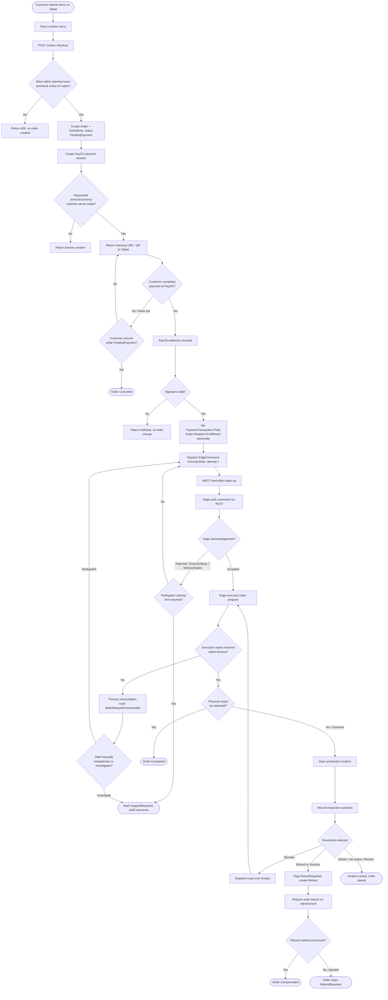

# Activity Diagram — Order Lifecycle (Checkout Through Completion or Incident)

**Document type**: Team-facing UML baseline (working draft), part of the `deliverables/03_uml/` set. Mermaid does not have a distinct "activity diagram" type; this uses `flowchart TD` with decision diamonds, which is the standard Mermaid approximation of a UML activity diagram.

**Source basis**: `deliverables/00_repo_evidence/functional_inventory.md` (Orders, Payments, Sync sections) and `deliverables/02_srs/srs.md` §4.7–§4.8, §4.15 (FR-057–FR-067, FR-068–FR-078, FR-130), Business Rules BR-03/BR-04/BR-11/BR-15 in `srs.md` §7. No `src/` or `docs/` files were modified; `srs.md`/`project_introduction.md` were not modified.

**Scope note**: This diagram shows the **decision logic and branching** of one order's lifecycle end-to-end (including the production-incident and refund branches), complementing `sequence_order_flow.md` and `sequence_robot_execution.md`, which show actor-to-actor message timing instead of decision flow.

---

## Diagram

## Explanation

- The **store/kiosk-open gate** at checkout and the **amount/currency match** gate at payment-session creation are both hard preconditions evidenced directly in `functional_inventory.md`/`srs.md` (ORD-01, PAY-01) — they are drawn as decision diamonds because a mismatch produces a distinct rejected outcome, not a silent fallback.
- **Payment success and physical execution are decoupled**: the diagram shows the webhook branch (payment) fully resolving before dispatch begins, matching BR-03 — the system does not attempt to execute speculatively before payment is confirmed.
- The **acknowledgement branch** (Accepted vs. Rejected/ExecutorBusy/DeliveryFailed) and the subsequent **attempt-limit check** reflect FR-060's evidenced behavior: redispatch is possible but bounded, not infinite.
- The **timeout reconciliation branch** intentionally leads to a human decision point (`ManualCheck`), not an automatic resolution — per `srs.md`'s own wording, reconciliation "never asserts a physical execution outcome," so the diagram does not show the system auto-completing or auto-failing an order purely from a timeout.
- The **production incident sub-flow** (inspect → resolve → remake/refund/close) mirrors BR-15 ("inspection cannot be skipped before resolution") and the five resolution options evidenced in `functional_inventory.md` ORD-20–ORD-24: deliver, discard, remake, refund/voucher, review, no-action. Some resolution branches are merged in the diagram (`Deliver / No action / Review`) since they share the same "incident closed, order stands" terminal state and splitting them further would add diagram nodes without adding decision-relevant detail.
- Refund rejection requires a mandatory reason (BR-11) and leaves the order in `RefundRequired` rather than a terminal state — shown as a loop-back-style terminal box rather than a hard stop, since the evidence does not describe an automatic further transition from there.

## Evidence Notes

- Checkout store/kiosk-open precondition: `functional_inventory.md` ORD-01, SC-08; `srs.md` FR-057, FR-045.
- Payment-session amount/currency validation: `functional_inventory.md` PAY-01; `srs.md` FR-068.
- Customer cancel while PendingPayment only: `functional_inventory.md` ORD-02, ORD-03; `srs.md` FR-058.
- Webhook signature verification and atomic Paid/ReadyForFulfillment transition: `functional_inventory.md` PAY-03; `srs.md` FR-070, NFR-012.
- Payment/execution decoupling: `repo_truth_map.md` §5 item 4; `srs.md` BR-03.
- Dispatch, MQTT wake-up, REST pull: `functional_inventory.md` SYNC-01, MQTT-01, IOT-05; `srs.md` FR-130, FR-125, FR-120.
- Acknowledgement outcomes and manual redispatch with attempt limit: `functional_inventory.md` IOT-06, ORD-06; `srs.md` FR-121, FR-060.
- Timeout reconciliation (observation status only, no physical-outcome assertion): `functional_inventory.md` SYNC-02; `srs.md` FR-130.
- Production incident lifecycle (open → inspect → resolve → close) and the five resolution options: `functional_inventory.md` ORD-20–ORD-24; `srs.md` FR-066, BR-15.
- Production remake dispatch reusing the same dispatch handler as initial execution: `functional_inventory.md` ORD-07; `srs.md` FR-061.
- Refund request, mandatory reject reason, mark-processed/reject/cancel transitions: `functional_inventory.md` PAY-11–PAY-14; `srs.md` FR-076, FR-077, BR-11.
- `[Inferred]` The exact wording of terminal states (`Compensated`, `RefundRequired` staying non-terminal) reflects `Order.Status`'s documented enum values in `database_inventory.md` §2 ("15 values incl. `RefundRequired`, `FulfillmentIssue`, `Compensated`") combined with the transition rules in the cited FRs; the full state-machine transition table itself was not independently re-derived from `src/Domain/Orders/Entities/Order.cs` line-by-line for this diagram.
