# Class Diagram — IceBot Backend Domain Model

**Document type**: Team-facing UML baseline (working draft), part of the `deliverables/03_uml/` set.

**Source basis**: `deliverables/00_repo_evidence/database_inventory.md` §1–§3, §6 (entity list, attributes, relationships, multi-tenancy fields) and `deliverables/00_repo_evidence/functional_inventory.md`/`srs.md` §6 (Data Requirements) for cross-checking which relationships are actively used by a requirement. No `src/` or `docs/` files were modified; `srs.md`/`project_introduction.md` were not modified.

**Readability note**: `database_inventory.md` §1 lists 98 `DbSet<T>` entities across 14 bounded contexts. Showing all of them in one diagram would not be readable, so this diagram keeps one class per bounded-context **aggregate root** plus its most business-meaningful direct children, and omits: append-only history/log tables (`OrderStatusHistory`, `OperationLog`, etc. — mentioned in Notes instead), the full `ProductionPackage` upgrade sub-family (10 child entities), and pure read-model/projection rows (`KioskConnectivityProjection`, `ExecutionEndpointReadinessProjection`, etc.). The full entity list remains authoritative in `database_inventory.md` §1.

---

## Diagram

```mermaid
classDiagram
    class Organization {
        +Guid Id
        +string Code
        +string Name
        +EntityStatus Status
    }
    class Store {
        +Guid Id
        +Guid OrganizationId
        +string Code
        +StoreType StoreType
        +TimeZone
        +SalesPausedAt
    }
    class Kiosk {
        +Guid Id
        +Guid OrganizationId
        +Guid StoreId
        +string Code
        +KioskStatus Status
        +KioskOperationalState OperationalState
    }
    class FranchiseOnboarding {
        +Guid OrganizationId
        +string IdempotencyKey
        +FranchiseOnboardingStatus Status
        +Guid StoreId
        +Guid KioskId
    }

    class Account {
        +Guid Id
        +string UserName
        +string Email
        +AccountStatus Status
        +string GoogleSubjectId
    }
    class AccountRole {
        +Guid AccountId
        +long RoleId
        +Guid OrganizationId
        +Guid StoreId
        +Guid KioskId
        +bool IsActive
    }
    class Role {
        +long Id
        +string Code
        +bool IsSystemRole
    }

    class Product {
        +Guid Id
        +Guid TemplateProductId
        +string Code
        +decimal BasePrice
        +TenantScopeType ScopeType
    }
    class ProductVariant {
        +Guid ProductId
        +string Code
        +FulfillmentType FulfillmentType
        +decimal BasePrice
    }
    class OptionGroup {
        +Guid ProductId
        +SelectionType SelectionType
        +int MinSelections
        +int MaxSelections
    }
    class ProductOption {
        +Guid OptionGroupId
        +ProductOptionExecutionImpact ExecutionImpact
        +decimal PriceDelta
        +bool IsDefault
    }
    class Recipe {
        +Guid ProductVariantId
        +Guid TemplateRecipeId
        +int Version
        +RecipeStatus Status
        +bool IsDefault
    }
    class RecipeItem {
        +Guid RecipeId
        +Guid IngredientId
        +decimal Quantity
        +int StepOrder
    }
    class Ingredient {
        +Guid Id
        +string Code
        +string Unit
        +bool IsAllergen
    }

    class Menu {
        +Guid Id
        +MenuStatus Status
        +TenantScopeType ScopeType
        +string Currency
    }
    class MenuItem {
        +Guid MenuId
        +Guid ProductId
        +Guid ProductVariantId
        +Guid RecipeId
        +decimal Price
        +MenuItemStatus Status
    }

    class IngredientDispenserState {
        +Guid DeviceId
        +Guid IngredientId
        +string ContainerCode
        +decimal EstimatedQuantity
        +IngredientLevelStatus CurrentLevelStatus
        +bool IsActive
    }
    class StockMovement {
        +Guid IngredientDispenserStateId
        +string MovementType
        +decimal Quantity
        +decimal BalanceAfter
    }

    class Order {
        +Guid Id
        +Guid KioskId
        +string OrderNumber
        +OrderStatus Status
        +PaymentStatus PaymentStatus
        +decimal TotalAmount
    }
    class OrderItem {
        +Guid OrderId
        +string ProductCodeSnapshot
        +decimal UnitPrice
        +OrderItemStatus Status
    }
    class ProductionIncident {
        +Guid OrderId
        +Guid OrderItemId
        +ProductionIncidentStatus Status
        +InspectionOutcome
        +Resolution
    }

    class PaymentTransaction {
        +Guid OrderId
        +string TransactionNumber
        +decimal Amount
        +PaymentTransactionStatus Status
        +PaymentSettlementDisposition SettlementDisposition
    }
    class Refund {
        +Guid PaymentTransactionId
        +string RefundNumber
        +decimal Amount
        +RefundStatus Status
    }
    class PaymentMethod {
        +long Id
        +string Provider
        +bool IsOnline
    }

    class DeviceType {
        +long Id
        +string Code
    }
    class DeviceModel {
        +long DeviceTypeId
        +string CapabilitiesJson
    }
    class Device {
        +Guid DeviceTypeId
        +Guid KioskId
        +string Code
        +DeviceStatus Status
        +string SerialNumber
    }
    class KioskExecutionEndpoint {
        +Guid KioskId
        +string EndpointCode
        +KioskExecutionProfile ExecutionProfile
        +Guid FullEdgeRuntimeId
        +Guid ControllerId
    }
    class DeviceEvent {
        +Guid DeviceId
        +Guid KioskId
        +string EventId
        +Severity
    }

    class RobotProgram {
        +Guid OrganizationId
        +TenantScopeType ScopeType
        +RobotProgramStatus Status
        +string ProgramManifestJson
    }
    class RobotProgramArtifact {
        +Guid RobotProgramId
        +Guid RobotArtifactId
        +int RunOrder
    }
    class RobotArtifact {
        +Guid OrganizationId
        +string ArtifactCode
        +string Checksum
        +RobotArtifactStatus Status
    }
    class RobotArtifactTechnicalContract {
        +Guid OrganizationId
        +string ContractCode
        +int SchemaVersion
        +RobotArtifactContractStatus Status
    }

    class ConfigurationRelease {
        +Guid OrganizationId
        +long ReleaseNumber
        +ConfigurationReleaseStatus Status
        +string ManifestJson
    }
    class ExecutionRoute {
        +Guid ConfigurationReleaseId
        +Guid ProductVariantId
        +Guid RecipeId
        +string RouteCode
    }
    class KioskConfigurationDeployment {
        +Guid KioskId
        +Guid ConfigurationReleaseId
        +KioskConfigurationDeploymentStatus Status
    }

    class ProductionPackage {
        +Guid Id
        +string Code
    }
    class ProductionPackageVersion {
        +Guid ProductionPackageId
        +string ManifestJson
    }
    class ProductionPackageInstallation {
        +Guid OrganizationId
        +Guid ProductionPackageVersionId
        +string IdempotencyKey
    }

    class Alert {
        +Guid KioskId
        +string AlertCode
        +string CorrelationKey
        +AlertStatus Status
    }
    class MaintenanceTicket {
        +Guid OrganizationId
        +Guid StoreId
        +Guid KioskId
        +string TicketNumber
        +MaintenanceTicketStatus Status
    }

    class EdgeCommand {
        +Guid KioskId
        +Guid TargetExecutionEndpointId
        +EdgeCommandType CommandType
        +EdgeCommandStatus Status
    }
    class OrderExecutionRecord {
        +Guid SourceCommandId
        +Guid KioskExecutionEndpointId
        +ProductionExecutionStatus Status
    }

    Organization "1" --> "many" Store : owns
    Store "1" --> "many" Kiosk : owns
    Organization "1" --> "many" FranchiseOnboarding : provisions
    FranchiseOnboarding --> "0..1" Store : creates
    FranchiseOnboarding --> "0..1" Kiosk : creates

    Account "1" --> "many" AccountRole : has
    AccountRole "many" --> "1" Role : grants

    Product "1" --> "many" ProductVariant : has
    Product "1" --> "many" OptionGroup : has
    OptionGroup "1" --> "many" ProductOption : has
    Product "0..1" --> "many" Product : TemplateProductId
    ProductVariant "1" --> "many" Recipe : produced by
    Recipe "1" --> "many" RecipeItem : has
    RecipeItem "many" --> "1" Ingredient : uses
    Recipe "0..1" --> "many" Recipe : TemplateRecipeId
    ProductOption "many" --> "many" Ingredient : ProductOptionIngredientRequirement

    Menu "1" --> "many" MenuItem : has
    MenuItem "many" --> "1" ProductVariant : references
    MenuItem "many" --> "0..1" Recipe : references

    Device "1" --> "many" IngredientDispenserState : hosts
    IngredientDispenserState "many" --> "1" Ingredient : holds
    IngredientDispenserState "1" --> "many" StockMovement : records

    Kiosk "1" --> "many" Order : receives
    Order "1" --> "many" OrderItem : has
    OrderItem "1" --> "0..1" ProductionIncident : may raise
    Order "1" --> "many" PaymentTransaction : paid by
    PaymentTransaction "many" --> "1" PaymentMethod : uses
    PaymentTransaction "1" --> "many" Refund : may have

    DeviceType "1" --> "many" DeviceModel : has
    DeviceModel "1" --> "many" Device : instantiates
    Kiosk "1" --> "many" Device : hosts
    Kiosk "1" --> "many" KioskExecutionEndpoint : exposes
    Device "1" --> "many" DeviceEvent : reports

    RobotProgram "1" --> "many" RobotProgramArtifact : orders
    RobotProgramArtifact "many" --> "1" RobotArtifact : references
    RobotArtifact "many" --> "0..1" RobotArtifactTechnicalContract : bound to

    ConfigurationRelease "1" --> "many" ExecutionRoute : defines
    ExecutionRoute "many" --> "1" ProductVariant : targets
    ExecutionRoute "many" --> "1" Recipe : targets
    ExecutionRoute "many" --> "many" RobotProgram : ExecutionRouteRobotBinding
    ConfigurationRelease "1" --> "many" KioskConfigurationDeployment : deployed as
    KioskConfigurationDeployment "many" --> "1" Kiosk : targets
    KioskConfigurationDeployment "many" --> "1" KioskExecutionEndpoint : targets

    ProductionPackage "1" --> "many" ProductionPackageVersion : has
    ProductionPackageVersion "1" --> "many" ProductionPackageInstallation : installed as
    ProductionPackageInstallation "1" --> "0..1" ConfigurationRelease : materializes

    Kiosk "1" --> "many" Alert : raises
    Device "0..1" --> "many" Alert : source of
    Kiosk "1" --> "many" MaintenanceTicket : has

    Kiosk "1" --> "many" EdgeCommand : addressed to
    KioskExecutionEndpoint "1" --> "many" EdgeCommand : targets
    EdgeCommand "1" --> "many" OrderExecutionRecord : evidenced by
    Order "1" --> "0..many" OrderExecutionRecord : tracked by
```

## Explanation

- **Tenants** (`Organization → Store → Kiosk`) is the multi-tenancy root; every FK in this chain is non-nullable at the type level, so a Kiosk cannot exist without a Store and Organization.
- **Catalog** shows the template/lineage pattern (`Product.TemplateProductId`, `Recipe.TemplateRecipeId`) used to clone global templates into tenant-scoped products/recipes, plus the Draft→Published→Active→Retired recipe lifecycle referenced from `RecipeItem`.
- **Sales Catalog** (`Menu`/`MenuItem`) references `Product`/`ProductVariant`/`Recipe` but does not own them — a `MenuItem` is a sellable projection, not a copy.
- **Orders/Payments** shows `Order` as the aggregate that both fulfillment (`OrderItem` → `ProductionIncident`) and money (`PaymentTransaction` → `Refund`) hang off of; `OrderItem` itself carries immutable order-time snapshot fields rather than a live FK to catalog state, so it is not shown pointing back into Catalog.
- **Devices/RobotConfiguration/ProductionConfiguration** together model the "author once, deploy many times" chain: a `RobotProgram` is an ordered manifest of `RobotArtifact`s, a `ConfigurationRelease` binds a recipe/variant to a program via `ExecutionRoute`, and a `KioskConfigurationDeployment` is one concrete deployment of a release to one kiosk's execution endpoint.
- **Production Packages** is shown only at the Package→Version→Installation level; the full upgrade/materialization/composition sub-family (10+ additional entities per `database_inventory.md` §1) is omitted here for readability and is fully listed in `requirements_traceability_matrix.md` DR-10.
- **Sync** is represented only by `EdgeCommand`/`OrderExecutionRecord` (the command-dispatch and execution-evidence pair most directly tied to the order/robot flow); `SyncEventInbox`, `SyncDeadLetter`, `ProductionEventCheckpoint`, and `EdgeStateSummary` are omitted from the diagram and covered instead in `sequence_robot_execution.md`.
- Attribute lists are trimmed to identifying keys, status/lifecycle enums, and money/quantity fields per `database_inventory.md` §2's own stated scope — full property lists live in the cited entity files, not reproduced here.

## Evidence Notes

- Entity list and table names: `database_inventory.md` §1.
- Attributes: `database_inventory.md` §2 (per-bounded-context attribute tables).
- Relationships and cardinalities: `database_inventory.md` §3 ("Notable relationship shapes"), including composite tenant-consistency FKs (`DeviceEvent → Device` via `(DeviceId, KioskId)`, `EdgeCommand → KioskExecutionEndpoint` via `(TargetExecutionEndpointId, KioskId)`, `KioskConfigurationDeployment → ConfigurationRelease` via `(ConfigurationReleaseId, OrganizationId)`) — drawn here as plain associations without repeating the composite-key detail, since that level of physical detail belongs to `erd.md`, not a conceptual class diagram.
- Self-referencing lineage FKs (`Product.TemplateProductId`, `Recipe.TemplateRecipeId`): `database_inventory.md` §3.
- `[Inferred]` `ExecutionRouteRobotBinding` is drawn as a plain many-to-many association between `ExecutionRoute` and `RobotProgram`; the join entity itself (with its own ordering/priority fields) is omitted from the diagram for readability. Evidence: `database_inventory.md` §1 (ProductionConfiguration entity list).
- `[Inferred]` `ProductOptionIngredientRequirement` is drawn as a plain many-to-many association between `ProductOption` and `Ingredient`, omitting the join entity's own quantity/unit fields for readability. Evidence: `database_inventory.md` §1 (Catalog entity list), §2 (Catalog attributes).
- `RobotProgram`'s `ScopeType.Global` rejection and the `TenantScopeType` hierarchy generally are documented in `database_inventory.md` §6 but not shown as a diagram constraint — see `erd.md` and `requirements_traceability_matrix.md` DR-15 for that nuance.
- No `src/` files were opened directly for this document; all attributes and relationships are as reported in `database_inventory.md`, which itself cites exact file/line evidence per claim.
