# Entity-Relationship Diagram — IceBot Backend

**Document type**: Team-facing UML baseline (working draft), part of the `deliverables/03_uml/` set.

**Source basis**: `deliverables/00_repo_evidence/database_inventory.md` §1 (entity list), §2 (attributes), §3 (relationships, composite tenant-consistency FKs), §4 (constraints/indexes). No `src/` or `docs/` files were modified; `srs.md`/`project_introduction.md` were not modified.

**Readability note**: The merged `IceBotDbContext` exposes 100 `DbSet<T>` declarations. This diagram adds the two post-sync persisted concepts while retaining a readable core. Static counts and changes are evidenced by `backend_update_impact_2026-08-11.md`; the pre-sync database inventory requires regeneration, and no live schema is asserted.

---

## Diagram

```mermaid
erDiagram
    ORGANIZATION ||--o{ STORE : owns
    STORE ||--o{ KIOSK : owns
    ORGANIZATION ||--o{ FRANCHISE_ONBOARDING : provisions

    ACCOUNT ||--o{ ACCOUNT_ROLE : has
    ROLE ||--o{ ACCOUNT_ROLE : grants
    ACCOUNT }o--o{ STORE : "AccountStores (join)"

    PRODUCT_CATEGORY ||--o{ PRODUCT : categorizes
    PRODUCT ||--o{ PRODUCT_VARIANT : has
    PRODUCT ||--o{ OPTION_GROUP : has
    OPTION_GROUP ||--o{ PRODUCT_OPTION : has
    PRODUCT_OPTION }o--o{ INGREDIENT : "ProductOptionIngredientRequirement"
    PRODUCT_VARIANT ||--o{ RECIPE : "produced via"
    RECIPE ||--o{ RECIPE_ITEM : has
    RECIPE_ITEM }o--|| INGREDIENT : uses

    KIOSK ||--o{ MENU : offers
    MENU ||--o{ MENU_ITEM : has
    MENU_ITEM }o--|| PRODUCT_VARIANT : sells
    MENU_ITEM }o--o{ PRODUCT_OPTION : "MenuItemProductOption"

    DEVICE_TYPE ||--o{ DEVICE_MODEL : has
    DEVICE_MODEL ||--o{ DEVICE : instantiates
    KIOSK ||--o{ DEVICE : hosts
    DEVICE ||--o{ INGREDIENT_DISPENSER_STATE : hosts
    INGREDIENT_DISPENSER_STATE }o--|| INGREDIENT : holds
    INGREDIENT_DISPENSER_STATE ||--o{ STOCK_MOVEMENT : records
    INGREDIENT_DISPENSER_STATE ||--o{ INVENTORY_SENSOR_OBSERVATION : observes
    KIOSK_EXECUTION_ENDPOINT ||--o{ INVENTORY_SENSOR_OBSERVATION : receives
    DEVICE ||--o{ DEVICE_EVENT : reports
    KIOSK ||--o{ KIOSK_EXECUTION_ENDPOINT : exposes
    KIOSK_EXECUTION_ENDPOINT ||--o| EXECUTION_ENDPOINT_MQTT_CREDENTIAL : "1:1"

    KIOSK ||--o{ ORDER : receives
    ORDER ||--o{ ORDER_ITEM : has
    ORDER_ITEM ||--o{ ORDER_ITEM_OPTION : has
    ORDER_ITEM ||--o| PRODUCTION_INCIDENT : "may raise"
    ORDER ||--o{ ORDER_STATUS_HISTORY : logs

    ORDER ||--o{ PAYMENT_TRANSACTION : "paid by"
    PAYMENT_METHOD ||--o{ PAYMENT_TRANSACTION : used_via
    PAYMENT_TRANSACTION ||--o{ PAYMENT_CALLBACK : receives
    PAYMENT_TRANSACTION ||--o{ REFUND : "may have"

    RECIPE ||--o{ EXECUTION_ROUTE : "targeted by"
    PRODUCT_VARIANT ||--o{ EXECUTION_ROUTE : "targeted by"
    ROBOT_ARTIFACT_TECHNICAL_CONTRACT ||--o| ROBOT_ARTIFACT : "bound to"
    ROBOT_PROGRAM ||--o{ ROBOT_PROGRAM_ARTIFACT : orders
    ROBOT_PROGRAM_ARTIFACT }o--|| ROBOT_ARTIFACT : references
    CONFIGURATION_RELEASE ||--o{ EXECUTION_ROUTE : defines
    EXECUTION_ROUTE }o--o{ ROBOT_PROGRAM : "ExecutionRouteRobotBinding"
    RECIPE ||--o{ PRODUCTION_PROGRAM_BINDING : confirms
    PRODUCT_VARIANT ||--o{ PRODUCTION_PROGRAM_BINDING : binds
    ROBOT_PROGRAM ||--o{ PRODUCTION_PROGRAM_BINDING : binds
    PRODUCTION_PROGRAM_BINDING ||--o{ EXECUTION_ROUTE_ROBOT_BINDING : snapshots
    CONFIGURATION_RELEASE ||--o{ KIOSK_CONFIGURATION_DEPLOYMENT : "deployed as"
    KIOSK ||--o{ KIOSK_CONFIGURATION_DEPLOYMENT : receives
    KIOSK_EXECUTION_ENDPOINT ||--o{ KIOSK_CONFIGURATION_DEPLOYMENT : targets

    PRODUCTION_PACKAGE ||--o{ PRODUCTION_PACKAGE_VERSION : has
    PRODUCTION_PACKAGE_VERSION ||--o{ PRODUCTION_PACKAGE_INSTALLATION : "installed as"
    PRODUCTION_PACKAGE_INSTALLATION ||--o| CONFIGURATION_RELEASE : materializes

    KIOSK ||--o{ ALERT : raises
    DEVICE ||--o{ ALERT : "source of"
    KIOSK ||--o{ MAINTENANCE_TICKET : has
    KIOSK ||--o{ OPERATION_LOG : logs

    KIOSK_EXECUTION_ENDPOINT ||--o{ EDGE_COMMAND : "target"
    KIOSK ||--o{ EDGE_COMMAND : "addressed to"
    EDGE_COMMAND ||--o{ EDGE_COMMAND_DELIVERY_ATTEMPT : has
    EDGE_COMMAND ||--o{ ORDER_EXECUTION_RECORD : "evidenced by"
    ORDER ||--o{ ORDER_EXECUTION_RECORD : "tracked by"
    KIOSK_EXECUTION_ENDPOINT ||--o{ PRODUCTION_EVENT_CHECKPOINT : "resume cursor"

    ORGANIZATION {
        guid Id PK
        string Code UK "unique among non-deleted rows"
        string Name
        enum Status
    }
    STORE {
        guid Id PK
        guid OrganizationId FK
        string Code UK "unique per (OrganizationId, Code), non-deleted"
        enum StoreType
        timestamp SalesPausedAt
    }
    KIOSK {
        guid Id PK
        guid OrganizationId FK
        guid StoreId FK
        string Code UK "unique per OrganizationId, non-deleted"
        enum Status
        enum OperationalState
    }
    FRANCHISE_ONBOARDING {
        guid Id PK
        guid OrganizationId FK
        string IdempotencyKey
        string RequestChecksum
        enum Status
        guid StoreId FK "nullable, filled progressively"
        guid KioskId FK "nullable, filled progressively"
    }
    ACCOUNT {
        guid Id PK
        string UserName UK
        string Email UK
        enum Status
    }
    ACCOUNT_ROLE {
        guid Id PK
        guid AccountId FK
        long RoleId FK
        guid OrganizationId FK "nullable, role scope"
        guid StoreId FK "nullable, role scope"
        guid KioskId FK "nullable, role scope"
        bool IsActive
    }
    ROLE {
        long Id PK
        string Code UK
        bool IsSystemRole
    }
    PRODUCT {
        guid Id PK
        guid TemplateProductId FK "self-FK, nullable"
        guid CategoryId FK
        string Code UK "unique per scope tuple, non-deleted"
        decimal BasePrice
        enum ScopeType "default Global"
    }
    RECIPE {
        guid Id PK
        guid ProductVariantId FK
        guid TemplateRecipeId FK "self-FK, nullable"
        int Version
        enum Status "Draft-Published-Active-Retired"
        bool IsDefault "unique per variant when true and non-retired"
    }
    INGREDIENT {
        guid Id PK
        string Code UK
        string Unit
    }
    MENU {
        guid Id PK
        enum Status
        enum ScopeType "default Organization, no Global fallback"
        string Currency
    }
    MENU_ITEM {
        guid Id PK
        guid MenuId FK
        guid ProductId FK
        guid ProductVariantId FK
        guid RecipeId FK "nullable"
        decimal Price
        enum Status
    }
    INGREDIENT_DISPENSER_STATE {
        guid Id PK
        guid DeviceId FK
        guid IngredientId FK
        string ContainerCode UK "unique per (DeviceId, ContainerCode) when active"
        decimal EstimatedQuantity
        bool IsActive
    }
    ORDER {
        guid Id PK
        guid KioskId FK "required"
        guid OrganizationId FK "nullable convenience column"
        guid StoreId FK "nullable convenience column"
        string OrderNumber UK "unfiltered unique"
        enum Status "15-value state machine"
        enum PaymentStatus
        decimal TotalAmount
    }
    ORDER_ITEM {
        guid Id PK
        guid OrderId FK
        string ProductCodeSnapshot "immutable order-time snapshot"
        decimal UnitPrice
        enum Status
    }
    PRODUCTION_INCIDENT {
        guid Id PK
        guid OrderId FK
        guid OrderItemId FK
        enum Status "Open-AwaitingInspection-ResolutionSelected-ResolutionInProgress-Resolved"
    }
    PAYMENT_TRANSACTION {
        guid Id PK
        guid OrderId FK
        long PaymentMethodId FK
        string TransactionNumber UK "unfiltered unique, immutable"
        decimal Amount
        enum Status
        enum SettlementDisposition "at most one Primary per order"
    }
    REFUND {
        guid Id PK
        guid PaymentTransactionId FK
        string RefundNumber UK "unfiltered unique, immutable"
        decimal Amount
        enum Status
    }
    DEVICE {
        guid Id PK
        guid DeviceTypeId FK
        guid DeviceModelId FK "nullable"
        guid KioskId FK "nullable"
        string Code UK "unique per KioskId"
        string SerialNumber UK "globally unique"
        enum Status
    }
    KIOSK_EXECUTION_ENDPOINT {
        guid Id PK
        guid KioskId FK
        string EndpointCode UK "unique per kiosk"
        enum ExecutionProfile "FullEdge or LowCostController"
        guid FullEdgeRuntimeId "mutually exclusive with ControllerId, check-constrained"
        guid ControllerId "mutually exclusive with FullEdgeRuntimeId"
    }
    ROBOT_ARTIFACT {
        guid Id PK
        guid OrganizationId FK "required, non-nullable"
        string ArtifactCode UK "unique per (OrganizationId, ArtifactCode, Checksum)"
        string Checksum
        enum Status
    }
    ROBOT_PROGRAM {
        guid Id PK
        guid OrganizationId FK
        enum ScopeType "Global rejected at creation despite enum defining it"
        enum Status
    }
    CONFIGURATION_RELEASE {
        guid Id PK
        guid OrganizationId FK "required"
        long ReleaseNumber "unique per OrganizationId"
        enum Status
    }
    EXECUTION_ROUTE {
        guid Id PK
        guid ConfigurationReleaseId FK
        guid ProductVariantId FK
        guid RecipeId FK
        string RouteCode
    }
    KIOSK_CONFIGURATION_DEPLOYMENT {
        guid Id PK
        guid KioskId FK
        guid ConfigurationReleaseId FK
        enum Status "at most one Pending or Installed per kiosk"
    }
    PRODUCTION_PACKAGE_INSTALLATION {
        guid Id PK
        guid OrganizationId FK
        guid ProductionPackageVersionId FK
        string IdempotencyKey
    }
    ALERT {
        guid Id PK
        guid KioskId FK
        guid DeviceId FK "nullable"
        string AlertCode
        string CorrelationKey
        enum Status
    }
    MAINTENANCE_TICKET {
        guid Id PK
        guid OrganizationId FK
        guid StoreId FK
        guid KioskId FK
        string TicketNumber UK
        enum Status
    }
    EDGE_COMMAND {
        guid Id PK
        guid KioskId FK
        guid TargetExecutionEndpointId FK "composite with KioskId"
        enum CommandType "ExecuteOrder or DeployConfiguration"
        enum Status
    }
    ORDER_EXECUTION_RECORD {
        guid Id PK
        guid SourceCommandId FK "composite with KioskExecutionEndpointId"
        guid KioskExecutionEndpointId FK
        enum Status
    }
```

## Explanation

- Diamond-notation (`||--o{`) reads as "one owning row relates to zero-or-many dependent rows," matching the `Restrict`-by-default delete behavior described in `database_inventory.md` §3 — deleting an `Organization` with existing `Store` rows is blocked by the database, not cascaded, except for the small set of documented parent-owns-child `Cascade` exceptions (technical-contract → declared effects, authoring import → items, production-package parent → child).
- Several relationships shown here as plain FKs are actually enforced by **composite tenant-consistency foreign keys** in the real schema (e.g. `EDGE_COMMAND.TargetExecutionEndpointId` is paired with `KioskId` against `KioskExecutionEndpoint(Id, KioskId)`, and `KIOSK_CONFIGURATION_DEPLOYMENT` is paired against `ConfigurationRelease(Id, OrganizationId)`), which make it structurally impossible to persist a cross-tenant row for that specific relationship — the composite nature is called out in each entity's attribute notes rather than drawn as a separate diagram element, to keep the diagram legible.
- `PK`/`FK`/`UK` annotations reflect what `database_inventory.md` §4 documents as **actually indexed/constrained** in code (including which unique indexes are soft-delete-aware vs. unfiltered), not a generic assumption — e.g. `Order.OrderNumber`, `PaymentTransaction.TransactionNumber`, and `Refund.RefundNumber` are deliberately **unfiltered** unique indexes (still unique even across soft-deleted rows), unlike most other business codes in the schema.
- `RECIPE.IsDefault`, `PRODUCT_OPTION.IsDefault`, `PAYMENT_TRANSACTION.SettlementDisposition`, `KIOSK_CONFIGURATION_DEPLOYMENT.Status`, `PRODUCTION_PACKAGE_UPGRADE.Status` (omitted table), and `INGREDIENT_DISPENSER_STATE.(DeviceId, ContainerCode)` each have their own distinct **partial/filtered unique index** enforcing a "one active X per Y" business rule — each with its own filter predicate, not a shared mechanism (`srs.md` §6.4, BR-12).
- `RobotProgram.ScopeType` is called out explicitly because it is a concrete counter-example to the otherwise-uniform `TenantScopeType` hierarchy: the enum defines a `Global` value, but `RobotProgram.ValidateScope()` rejects it at creation — see `database_inventory.md` §6 and §9 item 1.

## Evidence Notes

- Full pre-sync entity list: `database_inventory.md` §1. Post-sync additions/counts: `backend_update_impact_2026-08-11.md` §4 and current migrations; the merged DbContext has 100 DbSet declarations.
- Attribute selection (identifying keys, business-meaningful fields, status enums, money/quantity fields): `database_inventory.md` §2.
- Relationship shapes, including composite tenant-consistency FKs, true 1:1s, self-referencing lineage FKs, and the `Account ↔ Store` many-to-many join: `database_inventory.md` §3.
- Soft-delete-aware vs. unfiltered unique indexes: `database_inventory.md` §4 ("Soft-delete-aware uniqueness" and its following paragraph).
- Partial/filtered unique indexes (six distinct business invariants): `database_inventory.md` §4 ("Partial/filtered unique indexes enforcing a business invariant").
- Check constraints (`KioskExecutionEndpoint` profile/identity consistency; `ProductionPackageInstallation` kiosk-requires-store): `database_inventory.md` §4.
- Global `Restrict` delete-behavior convention and its documented `Cascade` exceptions: `database_inventory.md` §3 ("Global relationship convention"). `[Unclear]` whether the later global convention loop silently reverts the explicit `Cascade` exceptions back to `Restrict` was not settled by static reading alone (`database_inventory.md` §9 item 6; `srs.md` NFR-004) — the diagram shows the intended relationship, not a runtime-verified one.
- `TenantScopeType` hierarchy and `RobotProgram`'s `Global`-rejection exception: `database_inventory.md` §6, §9 item 1.
- Omitted for readability (full list remains in `database_inventory.md` §1): `ProductionPackage` upgrade/materialization/composition sub-family (`ProductionPackageUpgrade`, `ProductionPackageUpgradeMenuChange`, `...MenuOptionChange`, `...EndpointTarget`, `...RollbackAttempt`, `...CatalogIdentityChange`, `...AvailabilityChange`, `ProductionPackageMaterialization`, `ProductionComposition`, and the `ProductDefinition`/`ArtifactDefinition`/`ProgramBlueprint`/`ProgramSlot`/`RouteBlueprint` child tables of `ProductionPackageVersion`); pure read-model/projection tables (`KioskConnectivityProjection`, `ExecutionEndpointReadinessProjection`, `ExecutionEndpointCapabilityProjection`); most append-only history tables beyond the one shown (`OrderItemStatusHistory`, `ProductionIncidentHistory`, `InventoryTopologyChangeRecord`, `InventoryTopologyRebindRecord`); `SyncEventInbox`, `SyncDeadLetter(RetryAttempt)`, `EdgeStateSummary` (Sync-context tables covered narratively in `sequence_robot_execution.md` instead); `ExecutionEndpointCredentialBinding`, `ExecutionEndpointRequestNonce`, `ExecutionEndpointSupportedRobotTarget`; `NotificationDelivery`; `RobotArtifactTemplate`, `RobotAuthoringImport(Item)`.
