# Use Case Diagram — IceBot Backend

**Document type**: Team-facing UML baseline (working draft), part of the `deliverables/03_uml/` set. Mermaid does not have a native UML use-case notation, so actors are drawn as circles (`(( ))`) and use cases as stadium shapes (`([ ])`) inside `flowchart` subgraphs grouped by bounded context — the closest readable approximation available in Mermaid.

**Source basis**: `deliverables/00_repo_evidence/repo_truth_map.md` §3 (actors), `functional_inventory.md` (per-row Actor/Feature columns), `deliverables/01_project_introduction/project_introduction.md` §6/§9, `deliverables/02_srs/srs.md` §4 (FR Actor fields). No `src/` or `docs/` files were read beyond what these evidence documents already cite, and none were modified; `srs.md`/`project_introduction.md` were not modified.

**Readability note**: This diagram groups the 133 SRS functional requirements (derived from 260 `functional_inventory.md` rows) into ~35 representative use cases at the bounded-context level, not one use case per FR. Where several internal roles share access to a use case per `functional_inventory.md`'s Actor column, only the primary/most restrictive actor is connected by an edge, with a `+` note; the full role list for any use case is in the cited SRS FR.

---

## Diagram

```mermaid
flowchart LR
    Customer((Customer))
    Tablet((Tablet kiosk client))
    SystemAdmin((SystemAdmin))
    OrgAdmin((OrgAdmin))
    Manager((Manager))
    Staff((Staff))
    Technician((Technician))
    Edge((Local Edge Backend))
    PayOS((PayOS))

    subgraph IDN["Identity and Access (FR-001..FR-016)"]
        UC_Login(["Login local or Google"])
        UC_OwnProfile(["Manage own profile and sessions"])
        UC_ManageAccounts(["Onboard and manage internal accounts"])
        UC_AssignRoles(["Assign roles and scope"])
        UC_RBAC(["Enforce scoped RBAC on every request"])
    end

    subgraph TEN["Tenants (FR-017..FR-021)"]
        UC_Orgs(["Manage organizations"])
        UC_Stores(["Manage stores incl. sales pause/resume"])
        UC_Kiosks(["Manage kiosk lifecycle and operational state"])
        UC_Onboarding(["Run franchise onboarding workflow"])
    end

    subgraph DEV["Devices (FR-022..FR-032)"]
        UC_DeviceCatalog(["Author device type and model catalog"])
        UC_DeviceReg(["Register and retire kiosk devices"])
        UC_Endpoints(["Provision execution endpoints and credentials"])
        UC_Telemetry(["Report heartbeat, events, and readiness"])
    end

    subgraph CAT["Catalog (FR-033..FR-041)"]
        UC_Ingredients(["Author ingredients and categories"])
        UC_Products(["Author products, variants, and options"])
        UC_Recipes(["Author and version recipes"])
    end

    subgraph SC["Sales Catalog (FR-042..FR-047)"]
        UC_Menus(["Author menus and menu items"])
        UC_RuntimeMenu(["Fetch kiosk runtime menu"])
    end

    subgraph INV["Inventory (FR-048..FR-056)"]
        UC_Dispensers(["Provision and configure dispensers"])
        UC_Stock(["Refill, adjust, and rebind stock"])
        UC_Readiness(["View topology and inventory readiness"])
    end

    subgraph ORD["Orders (FR-057..FR-067)"]
        UC_Checkout(["Place order checkout"])
        UC_TrackOrder(["Track and cancel own order"])
        UC_Fulfillment(["Manage manual/packaged fulfillment"])
        UC_Incident(["Resolve production incident"])
    end

    subgraph PAY["Payments (FR-068..FR-078)"]
        UC_PaySession(["Create payment session"])
        UC_Webhook(["Confirm payment via webhook"])
        UC_Reconcile(["Reconcile stuck payment sessions"])
        UC_Refund(["Request and process refund"])
    end

    subgraph RC["Robot Configuration (FR-088..FR-101)"]
        UC_Artifacts(["Author and publish robot Lua artifacts"])
        UC_Programs(["Author robot programs"])
        UC_Import(["Run authoring import pipeline"])
    end

    subgraph PC["Production Configuration (FR-102..FR-110)"]
        UC_Release(["Author configuration release and routes"])
        UC_Deploy(["Deploy configuration to kiosk"])
        UC_Rollback(["Roll back deployment"])
    end

    subgraph PP["Production Packages (FR-111..FR-119)"]
        UC_PkgAuthor(["Author production package"])
        UC_PkgInstall(["Install, fork, and repair package"])
        UC_PkgUpgrade(["Preview and execute package upgrade"])
    end

    subgraph IOT["IoT/Edge Command Contract (FR-120..FR-127)"]
        UC_Pull(["Pull and acknowledge commands"])
        UC_Report(["Report execution results"])
    end

    subgraph OPS["Operations (FR-079..FR-087)"]
        UC_Alerts(["Manage alerts"])
        UC_Maintenance(["Manage maintenance tickets"])
        UC_Logs(["View operation logs and notification outbox"])
    end

    subgraph SYNC["Sync (FR-130..FR-132)"]
        UC_DeadLetter(["Manage sync dead letters"])
    end

    subgraph XCUT["Cross-cutting (FR-128, FR-129, FR-133)"]
        UC_Dashboard(["View management dashboard"])
        UC_Realtime(["Receive realtime SignalR updates"])
    end

    Customer --> Tablet
    Tablet --> UC_RuntimeMenu
    Tablet --> UC_Checkout
    Tablet --> UC_TrackOrder
    Tablet --> UC_PaySession
    Tablet -.-> UC_Realtime

    SystemAdmin --> UC_ManageAccounts
    SystemAdmin --> UC_AssignRoles
    SystemAdmin --> UC_Orgs
    SystemAdmin --> UC_DeviceCatalog
    SystemAdmin --> UC_PkgAuthor

    OrgAdmin --> UC_Stores
    OrgAdmin --> UC_Kiosks
    OrgAdmin --> UC_Onboarding
    OrgAdmin --> UC_Artifacts
    OrgAdmin --> UC_Programs
    OrgAdmin --> UC_Import
    OrgAdmin --> UC_Release
    OrgAdmin --> UC_Deploy
    OrgAdmin --> UC_Rollback
    OrgAdmin --> UC_PkgInstall
    OrgAdmin --> UC_PkgUpgrade
    OrgAdmin --> UC_Products

    Manager --> UC_Menus
    Manager --> UC_Recipes
    Manager --> UC_Fulfillment
    Manager --> UC_Refund
    Manager --> UC_Reconcile
    Manager --> UC_Maintenance
    Manager --> UC_Alerts
    Manager --> UC_Dashboard

    Staff --> UC_Fulfillment
    Staff --> UC_Incident
    Staff --> UC_Maintenance
    Staff --> UC_Alerts

    Technician --> UC_DeviceReg
    Technician --> UC_Endpoints
    Technician --> UC_Dispensers
    Technician --> UC_Stock
    Technician --> UC_Readiness
    Technician --> UC_Maintenance
    Technician --> UC_Logs

    Edge --> UC_Telemetry
    Edge --> UC_Pull
    Edge --> UC_Report

    PayOS --> UC_Webhook

    UC_ManageAccounts -.include.-> UC_RBAC
    UC_Orgs -.include.-> UC_RBAC
    UC_Deploy -.include.-> UC_Readiness
    UC_Webhook -.include.-> UC_Checkout
    UC_Report -.include.-> UC_Fulfillment
    UC_Ingredients -.include.-> UC_Products
    UC_DeadLetter -.include.-> UC_Report
```

## Explanation

- **Customer** interacts only through the **Tablet** client — evidence explicitly distinguishes the two (`repo_truth_map.md` §3: "Tablet ... owns transient UI/cart/QR state only, never starts robot execution directly"), so the diagram shows `Customer --> Tablet` rather than connecting Customer directly to backend use cases.
- Internal roles (**SystemAdmin, OrgAdmin, Manager, Staff, Technician**) are drawn as separate actors per the RBAC role table (`repo_truth_map.md` §3), each connected only to the use cases where they are the primary/most-restrictive actor in `functional_inventory.md`; most use cases are actually reachable by more than one role (see the cited FR in `srs.md` §4 for the exact allowed-role list).
- **Local Edge Backend** and **PayOS** are external systems, not human actors, but are included because the evidence treats them as first-class actors with their own authentication/contract (mTLS/ECDSA for Edge, webhook signature for PayOS).
- Dashed `-.include.->` edges mark a use case that always invokes another as part of its own execution (e.g., every management use case implicitly goes through RBAC enforcement; a payment webhook always feeds into the checkout/order lifecycle).
- Use cases are grouped into subgraphs matching the bounded contexts used throughout `srs.md` §4 and `functional_inventory.md`, so a reader can trace any box here back to its FR range and then to its exact evidence rows.
- **System-only background jobs** (reconciliation, cleanup, metrics — FR-031, FR-065, FR-073, FR-101, FR-110, FR-119, FR-130, FR-131) are intentionally omitted from this diagram: they have no human/external actor, and use-case diagrams conventionally model actor-triggered behavior. They are shown instead in the sequence diagrams where relevant (e.g., `sequence_robot_execution.md` covers the dispatch/timeout reconciliation path).

## Evidence Notes

- Actors: `repo_truth_map.md` §3 ("Main Actors" table); `project_introduction.md` §6.
- Use case groupings and FR ranges: `srs.md` §4.1–§4.16 (section headers cited per subgraph); each use case traces to the `functional_inventory.md` row IDs listed under its corresponding FR(s) in `requirements_traceability_matrix.md`.
- Tablet/Customer distinction: `repo_truth_map.md` §3, citing `docs/iot/IOT_CONTRACT.md:26-35` (not re-read directly here; inherited via `repo_truth_map.md`).
- PayOS webhook actor: `repo_truth_map.md` §3, §6; `functional_inventory.md` PAY-03.
- Local Edge Backend authentication (mTLS / ECDSA P-256): `repo_truth_map.md` §3, §8; `functional_inventory.md` DEV-10–DEV-17 (individually listed in `srs.md` FR-025).
- `[Inferred]` The exact "include" relationships shown with dashed arrows are a diagram-level simplification of documented control flow (e.g., "webhook confirms payment, which is part of the order lifecycle") rather than a UML `<<include>>` relationship stated verbatim anywhere in the evidence; the underlying flows themselves are evidenced (see `repo_truth_map.md` §5 item 4, §8).
- No frontend/tablet/mobile client implementation exists in this repository; the Tablet actor's use cases are the API surface it is documented to consume, not observed client code (`project_introduction.md` §12, `srs.md` §3.1).
