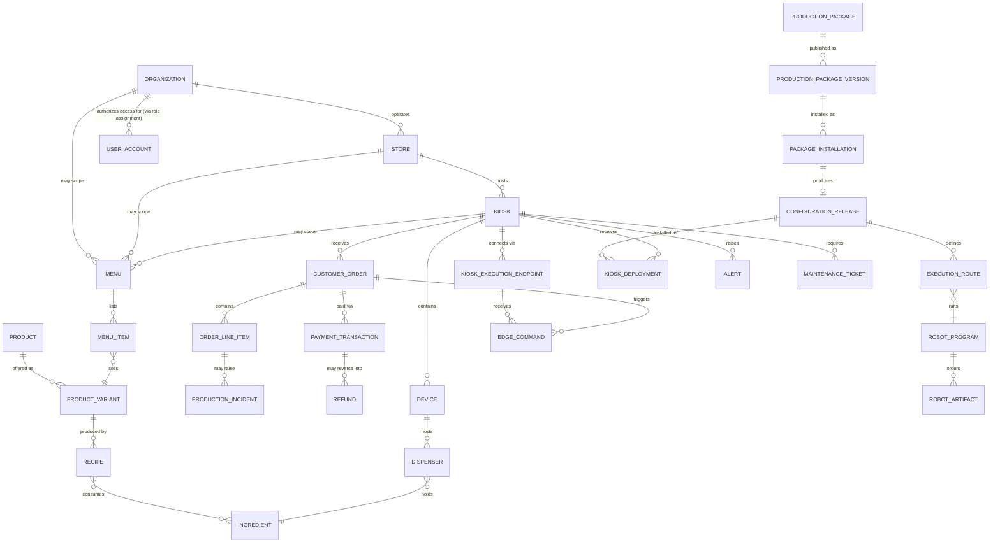

# Conceptual Database Design — IceBot Backend

**Document type**: Team-facing database design baseline (working draft), part of the `deliverables/04_database_design/` set. This is **not** the final school-template report — it is a shared reference for internal alignment.

**Definition used**: Per this task's instructions, conceptual design captures business-level data concepts and their relationships, deliberately excluding database-specific implementation detail (no table names, column types, keys, or indexes). Those live in `logical_database_design.md` and `physical_database_design.md`.

**Source basis**: `deliverables/00_repo_evidence/database_inventory.md` (entities, relationships, multi-tenancy fields), `deliverables/00_repo_evidence/repo_truth_map.md` (business flows, actors, bounded contexts), `deliverables/02_srs/srs.md` §2, §6, §7 (product functions, data requirements, business rules), `deliverables/02_srs/requirements_traceability_matrix.md` (DR rows), `deliverables/03_uml/erd.md` and `deliverables/03_uml/class_diagram.md` (entity/relationship shape, already trimmed for readability). No `src/` or `docs/` files were read beyond what these evidence documents cite, and none were modified; `srs.md`, `requirements_traceability_matrix.md`, and the UML files were not modified.

**Naming note**: This document uses singular, business-facing names (e.g. "Organization," "Customer Order," "Robot Program") rather than the plural physical table names (`Organizations`, `Orders`, `RobotPrograms`) used in `logical_database_design.md`/`physical_database_design.md`. Most conceptual entities below map one-to-one to a physical entity documented in `database_inventory.md` §1, but several are deliberate **many-to-one business abstractions** that merge two or more related physical tables under one business-facing name for readability — these are explicitly listed in §2.14's mapping table rather than implied to be a strict one-to-one correspondence throughout.

---

## 1. Business Domains (Subject Areas)

The business data model is organized around the following subject areas, matching the bounded contexts confirmed in `repo_truth_map.md` §4 and `database_inventory.md` §1:

1. Tenant & Franchise Structure
2. Identity & Access
3. Product & Recipe Catalog
4. Sellable Menu
5. Ingredient Inventory
6. Customer Order & Fulfillment
7. Payment & Refund
8. Physical Device & Connectivity
9. Robot Program Authoring
10. Production Configuration & Deployment
11. Franchise Packaging
12. Operations & Support
13. Edge Synchronization Evidence

`[Supported]` This grouping is the same one used throughout `srs.md` §4 and `database_inventory.md` §1 — it is not a new categorization invented for this document.

---

## 2. Conceptual Entities and Relationships by Domain

### 2.1 Tenant & Franchise Structure
- **Organization** — the top-level business entity (a franchise brand or independent operator).
- **Store** — a physical retail location belonging to one Organization.
- **Kiosk** — a single vending unit belonging to one Store. `[Assumption]` Kiosks are described throughout the evidence as running a robot arm and supporting devices, but `database_inventory.md` does not prove that every Kiosk row always has an installed robot arm or device attached — `Device`/`KioskExecutionEndpoint` records are optional per kiosk, particularly during provisioning.
- **Franchise Onboarding** — a business process record tracking the guided setup of a new Store and Kiosk (and optionally an initial Production Package) for an Organization.

Relationships: an Organization has many Stores; a Store has many Kiosks; a Franchise Onboarding belongs to one Organization and, as it progresses, comes to reference the Store and Kiosk it creates. `[Supported]` — `database_inventory.md` §1, §6.

### 2.2 Identity & Access
- **User Account** — an internal person (SystemAdmin, OrgAdmin, Manager, Staff, or Technician) who can log in and act on the system.
- **Role** — a named permission level (e.g. SystemAdmin, OrgAdmin, Manager, Staff, Technician).
- **Role Assignment** — the binding of one Account to one Role at a specific scope (a given Organization, Store, or Kiosk, or platform-wide).
- **Invitation** — a one-time credential used to activate a newly created Account.

Relationships: an Account may hold many Role Assignments (one per scope it operates in); each Role Assignment references exactly one Role. `[Supported]` — `database_inventory.md` §1 (Identity), §2 (Identity).

`[Unclear]` **Customer** is a business actor (the person buying from a kiosk) but is **not** represented by a stored account or profile anywhere in the evidence — customers are anonymous and are identified only transiently by an order-scoped access token attached to a Customer Order. This document lists Customer as a conceptual actor for completeness, not as a data entity with its own table. Evidence: `srs.md` §2.3, §3.1; `repo_truth_map.md` §3.

### 2.3 Product & Recipe Catalog
- **Ingredient** — a raw material used in production (e.g. a syrup or topping).
- **Product** — a sellable item definition, which may be a reusable global template or scoped to a specific Organization/Store/Kiosk.
- **Product Variant** — a concrete purchasable version of a Product (e.g. a size).
- **Option Group** and **Product Option** — customer-selectable choices attached to a Product (e.g. flavor), each option optionally carrying a price adjustment and a flag for whether it affects the robot's production process.
- **Recipe** — a versioned, ingredient-based production instruction for a Product Variant, following a Draft → Published → Active → Retired lifecycle.

Relationships: a Product has many Product Variants and Option Groups; an Option Group has many Product Options; a Product Variant has many Recipes over time, of which at most one may be the **default, non-retired** Recipe at a time (this is the exact predicate evidenced — it is not the same as "at most one `Active`-status Recipe," which is not separately established); a Recipe references the Ingredients it needs. Products and Recipes may also be cloned from a global template, recorded as a lineage relationship back to their source template. `[Supported]` — `database_inventory.md` §1 (Catalog), §2 (Catalog), §3 (self-referencing lineage FKs).

### 2.4 Sellable Menu
- **Menu** — a curated, kiosk/store/organization-scoped collection of items available for sale within an effective date range.
- **Menu Item** — one sellable entry on a Menu, referencing a Product Variant (and optionally a specific Recipe) at a specific price.

Relationships: a Menu has many Menu Items; a Menu Item references one Product Variant and may reference a subset of that product's Options. `[Supported]` — `database_inventory.md` §1 (SalesCatalog), §2 (SalesCatalog/Orders).

### 2.5 Ingredient Inventory
- **Dispenser (Container)** — a physical ingredient-holding unit attached to a Device, tracking an estimated quantity and capacity.
- **Stock Movement** — a recorded change in a Dispenser's estimated quantity (refill, consumption, or manual adjustment).
- **Inventory Topology Event** — a record of a Dispenser's configuration change or hardware rebind, kept for audit history.

Relationships: a Device hosts many Dispensers; a Dispenser holds one Ingredient and accumulates many Stock Movements over time. `[Supported]` — `database_inventory.md` §1 (Inventory), §2 (Inventory).

### 2.6 Customer Order & Fulfillment
- **Customer Order** — one checkout transaction placed at a Kiosk, carrying a lifecycle status (from placement through payment, execution, and completion or cancellation).
- **Order Line Item** — one purchased Menu Item within a Customer Order, capturing an immutable snapshot of its price and recipe at order time (so later catalog changes cannot alter historical records).
- **Order Status History** — an append-only log of a Customer Order's lifecycle transitions.
- **Production Incident** — a record opened when a Customer Order's physical output is defective, missing, or uncertain, tracking inspection and resolution.

Relationships: a Kiosk receives many Customer Orders; a Customer Order has many Order Line Items; an Order Line Item may give rise to one or more Production Incidents over time (e.g., a remake attempt following an earlier incident could itself later need one). `[Supported]` — `database_inventory.md` §1 (Orders), §2 (SalesCatalog/Orders). `[Unclear]` No unique constraint tying a Production Incident to a single Order Line Item was found in the evidence, so "at most one incident per line item" is not asserted here.

### 2.7 Payment & Refund
- **Payment Method** — a configured way to pay, tracking a provider, a method type, and whether it is an online method. PayOS is the current, and so far only, configured example of a Payment Method — this is a statement about today's configuration, not a claim that the Payment Method concept means "PayOS" specifically.
- **Payment Transaction** — one attempt to collect payment for a Customer Order, tracking amount, provider references, and settlement status.
- **Payment Callback** — a raw record of a payment-provider notification received for a Payment Transaction, kept as evidence.
- **Refund** — a compensation record issued against a paid Payment Transaction, tracking an amount, status, and provider refund reference. `[Unclear]` Business-process language elsewhere (e.g. a "full money refund vs. voucher" resolution choice) references a voucher-style compensation option, but `database_inventory.md`'s attribute list for `Refund` does not itemize a voucher-vs-money type field — whether voucher compensation is modeled inside `Refund` or tracked by some other mechanism is not established by the evidence reviewed for this document.

Relationships: a Customer Order is paid through one or more Payment Transactions (over time, e.g. after a failed attempt); a Payment Transaction may accumulate many Payment Callbacks and may lead to a Refund. `[Supported]` — `database_inventory.md` §1 (Payments), §2 (Payments).

### 2.8 Physical Device & Connectivity
- **Device Type** and **Device Model** — a reusable catalog describing categories of hardware (e.g. a dispenser class) and specific models within them.
- **Device** — one physical unit installed at a Kiosk (a dispenser, sensor, etc.).
- **Device Event** — a reported warning/error/critical occurrence from a Device.
- **Kiosk Execution Endpoint** — the addressable connection point a Kiosk's Edge runtime uses to receive commands and report status, authenticated either as a "Full Edge" (certificate-based) or "Low-Cost Controller" (signed-request) profile.

Relationships: a Device Type has many Device Models; a Kiosk hosts many Devices and exposes one or more Execution Endpoints; a Device reports many Device Events over time. `[Supported]` — `database_inventory.md` §1 (Devices), §2 (Devices).

### 2.9 Robot Program Authoring
- **Robot Artifact** — one immutable, checksummed Lua script exported from the robotics authoring tool (Fairino), always owned by exactly one Organization.
- **Robot Artifact Template** — the global (organization-independent), reusable counterpart of a Robot Artifact, from which an Organization may clone its own owned copy. This is a distinct entity from Robot Artifact, not the same entity at a different scope.
- **Robot Artifact Technical Contract** — a declared, versioned description of what a Robot Artifact does (its effects and ordering constraints), used to validate compatibility before use. Unlike Robot Artifact, this concept may itself be either global (shared) or Organization-owned.
- **Robot Program** — an ordered, reusable manifest of Robot Artifacts, representing one complete production sequence.
- **Robot Authoring Import** — a business process record for a bulk authoring-tool export being validated and turned into Robot Artifacts/Programs.

Relationships: a Robot Program is composed of many ordered Robot Artifacts; a Robot Artifact may be bound to one Technical Contract. A Robot Artifact itself is always owned by exactly one Organization — the separate, global (organization-independent) counterpart used as a shared starting point is its own distinct concept, a **Robot Artifact Template**, not the same entity in a different scope. A Robot Artifact Technical Contract, by contrast, genuinely can be either global (shared) or Organization-scoped, since its ownership field is optional. `[Supported]` — `database_inventory.md` §1 (RobotConfiguration), §2 (RobotConfiguration).

### 2.10 Production Configuration & Deployment
- **Configuration Release** — an immutable, versioned manifest for one Organization, binding Product Variants and Recipes to Robot Programs.
- **Execution Route** — one binding rule within a Configuration Release, connecting a specific Product Variant/Recipe combination to the Robot Program(s) that produce it.
- **Kiosk Deployment** — a record of one Configuration Release being installed onto one Kiosk's Execution Endpoint, tracking success/failure.

Relationships: a Configuration Release has many Execution Routes; a Configuration Release is deployed to many Kiosks over time via Kiosk Deployments. `[Supported]` — `database_inventory.md` §1 (ProductionConfiguration/ProductionExecution/ProductionPackages), §2.

### 2.11 Franchise Packaging
- **Production Package** — a platform-level, reusable business template (a bundle of Products, Robot Artifacts, Robot Programs, and Routes) intended for repeated franchise rollout.
- **Production Package Version** — one immutable, published edition of a Production Package's manifest.
- **Production Package Installation** — a record of one Organization/Store/Kiosk installing a specific Production Package Version, which in turn materializes catalog, robot, and configuration data for that tenant.

Relationships: a Production Package has many Versions; a Version may be installed many times (once per adopting Organization/Store/Kiosk). `[Supported]` — `database_inventory.md` §1 (ProductionConfiguration/ProductionExecution/ProductionPackages). `[Inferred]` An Installation is described in the evidence as materializing catalog/robot/configuration data for its tenant, which in practice results in a Configuration Release; the exact one-Installation-to-one-Release cardinality (versus, e.g., an Installation producing multiple releases over repeated materializations) is not established by the cited entity summary alone.

### 2.12 Operations & Support
- **Alert** — an actionable notice raised automatically (from device problems or low inventory) or manually, tracked to acknowledgement and resolution.
- **Maintenance Ticket** — a work item tracking a physical issue at a Kiosk through assignment, work, and resolution.
- **Operation Log Entry** — a general-purpose audit record of an operational event.
- **Notification Delivery** — a durable record of one push notification queued to be sent to a User Account.

Relationships: a Kiosk (and optionally a specific Device) is the subject of many Alerts and Maintenance Tickets. `[Supported]` — `database_inventory.md` §1 (Operations), §2 (Operations/Sync).

### 2.13 Edge Synchronization Evidence
- **Edge Command** — one instruction dispatched from Cloud to a Kiosk's Execution Endpoint (e.g. "execute this order" or "deploy this configuration").
- **Execution Evidence Record** — Cloud's own audit/read-model record of what the Edge runtime reported happened for a given Edge Command (conceptually covering both order-level and production-step-level evidence).
- **Sync Event / Dead Letter** — an inbound Edge-to-Cloud event awaiting processing, or one that failed processing and needs manual attention.

Relationships: a Kiosk Execution Endpoint is the target of many Edge Commands; each Edge Command accumulates delivery attempts and may accumulate Execution Evidence Records reporting what the Edge runtime observed. `[Supported]` — `database_inventory.md` §1 (Sync, ProductionConfiguration/ProductionExecution/ProductionPackages), §2 (Operations/Sync). `[Inferred]` Execution Evidence Records are accepted, asynchronously-reported evidence, not a guaranteed side effect of dispatch — a command may have zero, one, or multiple associated evidence records, and evidence may be absent or delayed; "once acted on" should not be read as a guarantee.

### 2.14 Conceptual-to-Physical Mapping Notes

Per the naming note in the header, most conceptual entities above map one-to-one to a single physical entity in `database_inventory.md` §1 (e.g. Organization → `Organization`, Ingredient → `Ingredient`, Dispenser → `IngredientDispenserState` — a rename, not a merge). The following conceptual entities are instead deliberate **many-to-one business abstractions**, merging two or more physical entities under one business-facing name for readability:

| Conceptual entity | Physical entities merged | Why merged here |
|---|---|---|
| Inventory Topology Event | `InventoryTopologyChangeRecord`, `InventoryTopologyRebindRecord` | Both are audit records of a Dispenser's configuration changing; the business reader cares that "something about the container setup changed," not which of two history tables recorded it. |
| Kiosk Deployment | `KioskConfigurationDeployment` (Full Edge path), `ControllerArtifactSetDeployment`(+`Item`) (low-cost-controller path) | Both represent "a Configuration Release being installed onto a kiosk"; the transport-profile split is a physical/logical distinction (see `logical_database_design.md` §2.10), not a separate business concept. |
| Execution Evidence Record | `OrderExecutionRecord`, `ProductionExecutionRecord` | Both are Cloud-side audit/read-model projections of what an Edge Command's execution produced; conceptually both answer "what happened when this command ran." |
| Sync Event / Dead Letter | `SyncEventInbox`, `SyncDeadLetter`, `SyncDeadLetterRetryAttempt` | All three describe the same business idea (an inbound Edge event being processed, or having failed and being retried) at different stages of one workflow. |

`[Assumption]` This mapping table is this document's own abstraction choice for business readability; `database_inventory.md` does not itself define or endorse these specific groupings.

---

## 3. Conceptual Diagram

`[Inferred]` This diagram is deliberately drawn without attributes, primary keys, or cardinality-optionality refinement (e.g. exact 0..1 vs 1..1) — those distinctions belong to the logical design. The relationship set itself is `[Supported]` by `database_inventory.md` §3 and `erd.md`/`class_diagram.md`, simplified and renamed to conceptual terms.

---

## 4. Assumptions and Unclear Items

- `[Assumption]` "Customer" is treated as a business actor rather than a stored entity throughout this document; if a future requirement introduces customer accounts/loyalty profiles, this conceptual model would need a new subject area.
- `[Assumption]` The Business Domains grouping in §1 mirrors the bounded-context grouping already used in the evidence base; it is a presentation choice, not a claim that the business itself organizes its data exactly this way outside the software.
- `[Unclear]` Whether Payment Method conceptually represents "a way to pay" in general (cash, card, bank transfer) or specifically "a configured provider integration" is not settled by the evidence — `database_inventory.md` §2 describes `PaymentMethod.Provider`/`MethodType`/`IsOnline` fields consistent with either reading.
- `[Unclear]` Whether "Franchise Onboarding" and "Production Package Installation" are conceptually one workflow or two independent ones is not fully settled: a Franchise Onboarding can optionally trigger a package installation, but each is tracked as its own record with its own lifecycle. This document treats them as two related but distinct concepts, per `database_inventory.md` §2 (Tenants) and §1 (ProductionConfiguration/ProductionExecution/ProductionPackages).
- `[Assumption]` Every Kiosk is assumed, for business-narrative purposes, to run a robot arm and supporting devices; the evidence does not prove this holds for every Kiosk row (see §2.1).
- `[Assumption]` This document assumes Customer will remain permanently anonymous with no future stored profile; the evidence only describes the current (anonymous, order-token-scoped) state and does not state this is a permanent design decision.
- `[Assumption]` One conceptual business domain (§1) is assumed to map directly to one bounded context in the codebase; the evidence supports this for the current state of the repository but does not claim it as an architectural guarantee going forward.

---

## 5. Open Questions

- `[Open Question]` The overall business motivation and target market for the franchise/vending model are not present in the evidence base (`project_introduction.md` §12) — this affects how conceptual entities like Organization/Franchise Onboarding should be framed in a business (as opposed to technical) narrative for a final report.
- `[Open Question]` Whether "Customer" should eventually become a first-class conceptual entity (e.g. for loyalty, order history across visits) is not addressed anywhere in the evidence; today's model deliberately keeps customers anonymous and order-scoped.
- `[Open Question]` The conceptual boundary between "Production Configuration & Deployment" and "Franchise Packaging" is thin: an installed Production Package effectively produces a Configuration Release. Whether the team wants to present these as one merged subject area in the final academic report or keep them separate (as in this document, matching the underlying bounded contexts) should be a team decision.
- `[Open Question]` Whether the business intends Payment Method to represent multiple concurrently active payment providers (the schema structurally allows it) or is expected to remain PayOS-only going forward is not stated in the evidence (`project_introduction.md` §11 marks provider exclusivity as an `[Assumption]`).
- `[Open Question]` Whether voucher compensation (referenced in business-process language as an alternative to a money Refund) is intended to be modeled as a field/type within `Refund`, as a separate entity, or handled entirely outside the current data model was not resolved by this evidence pass — see §2.7.
- `[Open Question]` Whether the four many-to-one abstractions listed in §2.14 (Inventory Topology Event, Kiosk Deployment, Execution Evidence Record, Sync Event/Dead Letter) should instead be split into their underlying physical entities for the final academic report, or kept merged for business readability, is a team style decision not settled by the evidence.
