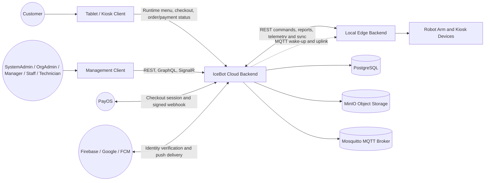
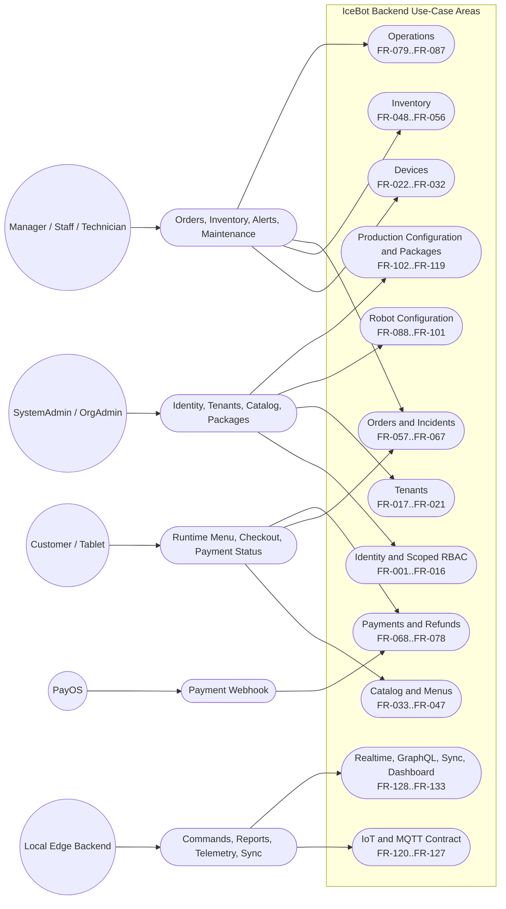
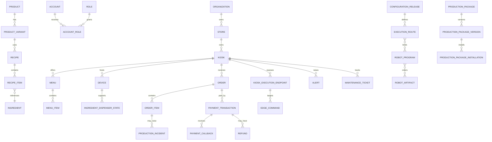

# CAPSTONE PROJECT REPORT

## REPORT 3 — SOFTWARE REQUIREMENT SPECIFICATION

**Project name:** `[Official project name — to be confirmed by the team]`

**Working product name:** IceBot Backend

**Project code:** `[Project code]`

**Group name:** `[Group name]`
**Location and date:** `[Location, month, year]`

# I. Record of Changes

*A — Added; M — Modified; D — Deleted*

| Date | A/M/D | In charge | Change Description |
|---|---|---|---|
| `[dd/mm/yyyy]` | A | `[Author/team member]` | Initial school-template SRS draft prepared from the evidence-based SRS and Requirements Traceability Matrix. |
| `[dd/mm/yyyy]` | M | `[Reviewer/team member]` | Review corrections applied to actor terminology, non-screen classification, ERD descriptions, NFR confidence statuses, and internal references. |

# II. Software Requirement Specification

## 1. Product Overview

### Overall Product Description

IceBot Backend is the Cloud-side server application for a multi-location automated vending platform with robot-arm order fulfilment. It provides public checkout and order-status interfaces for kiosk tablets, authenticated management interfaces for internal users, payment-provider integration, contracts for kiosk Edge runtimes, and centralized persistence and operational coordination.

The application is an ASP.NET Core modular monolith organized into bounded contexts for Identity, Tenants, Devices, Catalog, Sales Catalog, Inventory, Orders, Payments, Operations, Robot Configuration, Production Configuration, Production Packages, Production Execution, and Sync. REST is the principal command and integration surface. GraphQL supports management-oriented reads, SignalR publishes human-interface updates, and MQTT supports Edge wake-up and uplink delivery alongside durable HTTP interactions. PostgreSQL is the current persistence platform, and robot program binaries are stored in MinIO.

The requirements in this draft describe the implementation evidenced by the repository. **Supported** means statically code-evidenced, not runtime-accepted or production-verified. Claims with incomplete, indirect, conflicting, or unevidenced support retain the statuses **Inferred**, **Assumption**, **Unclear**, or **Needs Review**.

### System Context

The Cloud backend does not directly operate the robot arm. The kiosk-local Edge runtime owns physical execution, local device communication, and temporary offline operation. Payment confirmation and physical execution are separate stages: a verified payment makes an order eligible for fulfilment, after which an Edge command is dispatched and execution evidence is returned asynchronously.

### External Actors and Systems

| Actor or system | Interaction with IceBot Backend |
|---|---|
| Customer | Selects products through a tablet client, submits checkout, pays, and views order/payment status without an internal account. |
| Tablet / kiosk client | Calls the public runtime-menu, checkout, payment-session, order-status, and cancellation contracts; holds transient UI/cart/QR state only. |
| SystemAdmin | Performs platform-wide identity, authorization, reference catalog, package, and platform administration. |
| OrgAdmin | Administers organization-scoped stores, kiosks, catalog, robot configuration, deployment, and package workflows. |
| Manager | Manages menus, business operations, orders, payments/refunds, reports, alerts, and maintenance within assigned scope. |
| Staff | Performs on-site fulfilment support, incident handling, refill/cleaning activities, alerts, and maintenance tasks within assigned scope. |
| Technician | Provisions and troubleshoots kiosks, devices, execution endpoints, inventory topology, robot configuration, and deployments. |
| Local Edge Backend | Pulls and acknowledges commands and reports heartbeat, readiness, telemetry, device events, execution results, and production-sync evidence. |
| PayOS | Creates the current checkout/QR session and sends signed payment notifications to the webhook endpoint. |
| Firebase / Google / FCM | Supports Google identity-token verification and push-notification delivery under the current adapter configuration. |
| PostgreSQL | Persists domain, workflow, audit, retry, projection, and configuration data through EF Core. |
| MinIO | Stores robot Lua artifact bytes while PostgreSQL stores artifact metadata, checksum, size, and storage keys. |
| Mosquitto | Provides the current MQTT broker and endpoint credential integration. MQTT is not the durable source of truth for execution state. |

### Known Assumptions and Dependencies

- `[Assumption]` PayOS, Firebase/Google, FCM, MinIO, Mosquitto, PostgreSQL 17, and the configured database name represent the current implementation/deployment baseline; the evidence does not establish that each is a permanent product constraint.
- `[Assumption]` Frontend, tablet, mobile, and Edge-runtime behavior is known only through backend-facing contracts. Their implementation is not verified by this repository.
- The Cloud depends on PayOS for payment sessions and callbacks, Firebase for the configured external authentication/push paths, MinIO for robot artifact objects, PostgreSQL for persistence, and Mosquitto for the configured MQTT paths.
- Edge connectivity may be intermittent. Durable state, idempotency, retry, reconciliation, and dead-letter handling are therefore required at the documented boundaries.
- `[Needs Review]` No mapped test-execution evidence currently proves runtime satisfaction of requirements marked Supported.
- `[Needs Review]` Complete authorization coverage across every REST action, GraphQL resolver, and SignalR method has not been exhaustively audited.
- `[Needs Review]` API version/deprecation rules, common error envelope, rate limits, CORS, request-size limits, backup/restore, RPO/RTO, and mandatory deployment profiles are not established in the evidence set.

## 2. User Requirements

### 2.1 Actors

| ID | Actor | Type | User requirement summary |
|---|---|---|---|
| ACT-01 | Customer | Human, anonymous | Browse the kiosk's available menu, place and pay for an order, and track that order through an order-scoped access token. |
| ACT-02 | Tablet / Kiosk Client | External client | Present customer functions and call only the documented public/customer contracts; it must not directly initiate robot execution. |
| ACT-03 | SystemAdmin | Internal role | Administer platform-level identities, roles, reference catalogs, packages, and platform-wide resources. |
| ACT-04 | OrgAdmin | Internal role | Administer resources belonging to an assigned organization and its subordinate stores/kiosks. |
| ACT-05 | Manager | Internal role | Manage sales, orders, payments/refunds, menus, reporting, alerts, and maintenance within assigned scope. |
| ACT-06 | Staff | Internal role | Perform day-to-day kiosk operations, fulfilment support, incident handling, and maintenance actions. |
| ACT-07 | Technician | Internal role | Provision, configure, deploy, diagnose, repair, and maintain technical kiosk resources. |
| ACT-08 | Local Edge Backend | External software system | Authenticate as an execution endpoint, retrieve commands, and report runtime/production/device evidence. |
| ACT-09 | PayOS | External provider | Receive checkout-session requests and submit signed payment notifications. |
| ACT-10 | System Scheduler / Background Worker | Internal system actor | Run retention, reconciliation, timeout, cleanup, notification, and metrics tasks without a human trigger. |

`[Needs Review]` The exact permission-to-action matrix remains subject to a complete authorization audit. This actor table summarizes evidenced role intent and does not grant access independently of endpoint policy and scope validation.

### 2.2 Use Cases

#### 2.2.1 Diagram(s)

The following diagram is a readable aggregation of the detailed FRs. It groups related functions by bounded context rather than presenting one node per requirement.

#### 2.2.2 Descriptions

| Use Case ID | Use case | Primary actors | Outcome | Related requirements |
|---|---|---|---|---|
| UC-01 | Authenticate and manage access | Anonymous, authenticated account, SystemAdmin, OrgAdmin, Manager | Accounts authenticate, manage their sessions/profile, and receive authorized scoped access. | FR-001–FR-016 |
| UC-02 | Administer tenant hierarchy | SystemAdmin, OrgAdmin, Manager | Organizations, stores, kiosks, scope options, and onboarding workflows are managed within allowed scope. | FR-017–FR-021 |
| UC-03 | Provision devices and connectivity | SystemAdmin, OrgAdmin, Technician, Local Edge Backend | Device catalogs, devices, endpoints, credentials, heartbeat, events, telemetry, readiness, and connectivity state are maintained. | FR-022–FR-032 |
| UC-04 | Author products and recipes | SystemAdmin, OrgAdmin, Manager | Ingredients, products, variants, options, and lifecycle-controlled recipes are created and maintained. | FR-033–FR-041 |
| UC-05 | Publish and consume sellable menus | OrgAdmin, Manager, Tablet/Kiosk Client | Menus/menu items are authored and a kiosk-specific sellable runtime projection is returned. | FR-042–FR-047 |
| UC-06 | Operate ingredient inventory | Staff, Technician, Manager, system execution workflow | Dispensers are provisioned/refilled/rebound, movements are recorded, and readiness is evaluated. | FR-048–FR-056 |
| UC-07 | Complete customer order and fulfilment | Customer, Tablet/Kiosk Client, Manager, Staff, Local Edge Backend | A validated order progresses through payment, dispatch, production evidence, completion, cancellation, remake, or support/incident handling. | FR-057–FR-067; FR-130 |
| UC-08 | Process payment and refund cases | Customer, Tablet/Kiosk Client, PayOS, Manager, System Scheduler / Background Worker | Payment sessions and callbacks are processed; pending sessions and manual refund workflows are managed. | FR-068–FR-078 |
| UC-09 | Operate and maintain kiosks | Manager, Staff, Technician, System Scheduler / Background Worker | Alerts, maintenance tickets, operational logs, notifications, and realtime operational changes are managed. | FR-079–FR-087 |
| UC-10 | Author and deploy robot configuration | SystemAdmin, OrgAdmin, Technician | Lua artifacts/programs and configuration releases are validated, published, deployed, inspected, and rolled back. | FR-088–FR-110 |
| UC-11 | Install and upgrade production packages | SystemAdmin, OrgAdmin, System Scheduler / Background Worker | Versioned packages are installed, repaired, forked, upgraded, cut over, rolled back, or abandoned. | FR-111–FR-119 |
| UC-12 | Exchange Edge commands and evidence | Local Edge Backend, System Scheduler / Background Worker, authorized management users | Commands are pulled/acknowledged, execution, sync, and inventory-observation evidence is ingested, dead letters are handled, and relevant clients receive realtime invalidations. | FR-120–FR-134 |

Detailed preconditions, main flows, exception flows, validations, evidence references, and confidence statuses are specified under Section 3.2.

The actor lists summarize each consolidated FR range. They are not an authorization matrix and do not grant every listed role access to every function in the range. Exact role, policy, and tenant-scope requirements must be verified in the corresponding FR and implementation evidence. `Authorized management users` is a summary label, not an additional actor or role.

## 3. Functional Requirements

### 3.1 System Functional Overview

#### 3.1.1 Screens Flow

**[Needs Team/UI Review]** This backend repository does not contain an authoritative frontend, tablet, mobile, or management-screen implementation. An API route or GraphQL query does not prove that a corresponding screen exists. The team must supply the owning UI repositories/builds and an approved screen-flow diagram before this section can be completed.

The minimum flows to validate with the UI teams are:

- customer tablet: runtime menu → selection/options → checkout → QR/payment → order status/support;
- internal account: login → scoped navigation → management feature → confirmation/error feedback;
- operations: dashboard/queue → kiosk/order/alert/ticket detail → permitted intervention;
- technical administration: kiosk/device/endpoint → configuration/robot artifact → preview/deploy → deployment status/rollback.

#### 3.1.2 Screen Descriptions

**[Needs Team/UI Review]** No screen names, layouts, fields, navigation paths, screenshots, or user-facing validation messages are claimed from backend evidence. The team must complete the following table from the approved client implementations.

| Screen ID | Screen name | Client/application | Actor | Purpose | Related API/query/event | Related FRs | Review status |
|---|---|---|---|---|---|---|---|
| `[UI-xx]` | `[Screen name]` | `[Tablet / Management / Mobile / Edge UI]` | `[Actor]` | `[Purpose]` | `[Contract]` | `[FR IDs]` | `[Needs Team/UI Review]` |

#### 3.1.3 Screen Authorization

**[Needs Team/UI Review]** Backend policies and tenant checks cannot establish client-side screen visibility. The final matrix must compare UI navigation/activity permissions with backend enforcement. UI hiding is not an authorization boundary.

| Screen or activity | SystemAdmin | OrgAdmin | Manager | Staff | Technician | Customer | Backend policy/scope evidence | Review status |
|---|---|---|---|---|---|---|---|---|
| `[Screen/activity]` |  |  |  |  |  |  | `[Policy and FR]` | `[Needs Team/UI Review]` |

#### 3.1.4 Non-Screen Functions

The following backend capabilities are non-screen functions even when a UI may trigger or observe them.

| Category | Examples | Requirement range | Primary trigger |
|---|---|---|---|
| Public/customer APIs | Runtime menu, checkout, payment session/status, order status/cancel | FR-045–FR-046, FR-057–FR-058, FR-068–FR-069 | Tablet HTTP request |
| Authenticated management and operational APIs/queries | Identity, tenants, devices, catalog, menus, inventory, orders, payments, operations, configuration, packages, and scoped dashboards. The cited range also contains customer-, provider-, Edge-, and system-triggered functions; detailed FR actor and trigger fields remain authoritative. | FR-001–FR-119, FR-129, FR-133–FR-135 | Authenticated REST/GraphQL/MQTT request where specified by the owning FR |
| Payment callback | Signed PayOS payment notification | FR-070 | Provider webhook |
| IoT REST contract | Heartbeat, events, telemetry, readiness, command pull/ack/report, production sync | FR-027–FR-030, FR-120–FR-124 | Authenticated Edge HTTP request |
| MQTT integration | Command-available wake-up, uplink consumption, topic/payload guards, credentials | FR-026, FR-125–FR-127 | Backend publish or broker delivery |
| Background processing | Connectivity, payment, deployment, package-upgrade and order-dispatch reconciliation; retention, cleanup, metrics, notification delivery | FR-031, FR-065, FR-073, FR-086, FR-101, FR-110, FR-119, FR-130–FR-131; NFR-003, NFR-014, NFR-021 | Hosted schedule/worker |
| Realtime publication | Order, payment, operations, and dashboard invalidation events | FR-067, FR-078, FR-087, FR-128, FR-133 | Committed application change |
| Sync/dead-letter processing | Durable ingestion, failure capture, retry/resolve/ignore | FR-124, FR-132 | Edge event or operator action |

#### 3.1.5 Entity Relationship Diagram

The following diagram is a deliberately compact view of the principal business relationships. The detailed ERD and conceptual/logical/physical designs remain the authoritative sources for omitted entities, exact keys, optionality, indexes, and constraints. Conceptual many-to-many edges summarize explicit join entities; for example, `RobotProgramArtifact` connects robot programs and artifacts and carries ordering information.

`[Needs Review]` The compact diagram must not be used to infer exact mandatory cardinality. For example, collection navigation proves that a dependent may reference a principal; it does not by itself prove that every principal has at least one dependent. The `OrderItem` to `ProductionIncident` relationship is shown as zero-to-many because the reviewed database evidence does not identify a unique constraint enforcing at most one incident per order item. This differs from the zero-to-one notation in `deliverables/03_uml/erd.md` and remains `[Needs Review]` until the team aligns the baseline diagram or confirms an intended constraint. The detailed design also retains unresolved questions about other selected cardinalities, the effective global Restrict/Cascade behavior, soft-delete filtering, and current physical-table counts.

Principal entity descriptions:

| Entity or data group | Description | Evidence / qualification | Status |
|---|---|---|---|
| Organization | Tenant root for stores and tenant-scoped configuration/data. | `database_inventory.md` §§2, 6; conceptual and logical database designs. Database-wide tenant enforcement must not be inferred. | Supported |
| Store and Kiosk | Physical operating hierarchy beneath an organization; kiosks host devices, orders, and execution endpoints. | `database_inventory.md` §§2–3. | Supported |
| Account and AccountRole | User identity and scoped role assignment used by management authorization. | `database_inventory.md` §§2–3; `functional_inventory.md` IDN-18–IDN-28. | Supported |
| Device, DeviceModel, and KioskExecutionEndpoint | Provisioned equipment, its model, and the authenticated Edge execution endpoint associated with a kiosk. | `database_inventory.md` §§2–3; `functional_inventory.md` DEV-01–DEV-22. | Supported |
| Product, ProductVariant, Recipe, and RecipeItem | Catalog and production-definition data describing a product variant and its recipe ingredients. | `database_inventory.md` §§2–3; `functional_inventory.md` CAT-01–CAT-19. | Supported |
| Menu and MenuItem | Tenant/store/kiosk-scoped sales catalog and its sellable product-variant entries. | `database_inventory.md` §§2–3; `functional_inventory.md` SC-01–SC-07. | Supported |
| Order, OrderItem, and OrderItemOption | Customer order aggregate, ordered lines, option selections, and order-time snapshots. | `database_inventory.md` §§2–3, 5; `functional_inventory.md` ORD-01–ORD-23. | Supported |
| PaymentTransaction, PaymentCallback, and Refund | Payment attempts, provider callback evidence, and refund workflow records related to an order. | `database_inventory.md` §§2–3; `functional_inventory.md` PAY-01–PAY-16. | Supported |
| ProductionIncident | Production problem associated with an order item and its inspection/resolution history. | `database_inventory.md` §§2–3; `functional_inventory.md` ORD-20–ORD-23. Cardinality discrepancy noted above. | Needs Review |
| RobotArtifact, RobotProgram, and RobotProgramArtifact | Stored robot artifact metadata, executable program definitions, and the ordered join between them. | `database_inventory.md` §§2–3; robot-configuration database design. Binary content is external to PostgreSQL. | Supported |
| ConfigurationRelease and ExecutionRoute | Published configuration and route bindings used for kiosk execution. | `database_inventory.md` §§2–3; `functional_inventory.md` PC-01–PC-13. | Supported |
| EdgeCommand and KioskExecution | Durable Cloud-to-Edge command and the corresponding observed execution lifecycle/evidence. | `database_inventory.md` §§2–3; `functional_inventory.md` IOT-05–IOT-07, SYNC-01–SYNC-03. A command does not prove the physical outcome. | Supported |

### 3.2 Feature Sections

Each FR preserves the evidence route from the baseline SRS. The field **Related data/entities and implementation references** may contain either evidenced data entities, implementation symbols, or both. Where it lists only an inventory ID, handler, controller, service, or route, it is an implementation reference and must not be read as an exhaustive entity mapping. Entity claims must be checked against `database_inventory.md` and the database-design deliverables.

#### 3.2.1 Identity

##### FR-001 — Local Login
- **Function description**: The system shall authenticate an Active account via email/username and password.
- **Actors / roles**: Anonymous.
- **Trigger**: `POST /api/v1/authentication/login`.
- **Business rules / validations / preconditions**: Account exists, is Active, and has local login enabled.
- **Main Flow**: 1) Validate credentials against stored hash. 2) On success, issue access/refresh token pair and account summary.
- **Alternative/Exception Flow**: On 5 cumulative failed attempts, lock the account for 15 minutes.
- **Related data/entities and implementation references**: `IDN-01`; `AuthenticationController.Login`, `AccountAuthenticationService.LoginAsync`.
- **Evidence**: `functional_inventory.md` IDN-01.
- **Status**: Supported.

##### FR-002 — Google (Firebase) Login
- **Function description**: The system shall authenticate via a verified Firebase Google ID token.
- **Actors / roles**: Anonymous.
- **Trigger**: `POST /api/v1/authentication/google`.
- **Business rules / validations / preconditions**: Verified token email matches the account's configured `GoogleEmail`.
- **Main Flow**: 1) Verify ID token via `IExternalIdentityProvider`. 2) Bind `GoogleSubjectId` on first login. 3) Issue token pair.
- **Alternative/Exception Flow**: Reject if a later login presents a mismatched subject identity for the same email.
- **Related data/entities and implementation references**: `IDN-02`; `AccountAuthenticationService.LoginWithExternalProviderAsync`.
- **Evidence**: `functional_inventory.md` IDN-02.
- **Status**: Supported.

##### FR-003 — Refresh Access Token
- **Function description**: The system shall reissue an access token from a valid, non-revoked refresh token.
- **Actors / roles**: Authenticated (via refresh token).
- **Trigger**: `POST /api/v1/authentication/refresh`.
- **Business rules / validations / preconditions**: Refresh token unexpired and unrevoked.
- **Main Flow**: 1) Validate refresh token. 2) Re-check persisted account status. 3) Issue new token pair.
- **Alternative/Exception Flow**: If the account is no longer Active, revoke remaining sessions instead of issuing tokens.
- **Related data/entities and implementation references**: `IDN-03`.
- **Evidence**: `functional_inventory.md` IDN-03.
- **Status**: Supported.

##### FR-004 — View and Revoke Active Sessions
- **Function description**: The system shall let a token holder revoke one refresh token, and let an authenticated account list its active sessions, revoke one owned session, or revoke all active sessions.
- **Actors / roles**: Anonymous (token holder) / logged-in account.
- **Trigger**: `POST /api/v1/authentication/revoke`; `POST /api/v1/authentication/revoke-all`; `GET /api/v1/me/sessions`; `DELETE /api/v1/me/sessions/{sessionId}`.
- **Business rules / validations / preconditions**: Token exists (single-revoke) or caller is authenticated (revoke-all).
- **Main Flow**: 1) List active refresh-token sessions with a current-session marker and recorded metadata when requested. 2) Locate the selected token/session(s). 3) Mark them revoked with a reason.
- **Alternative/Exception Flow**: Reject invalid identifiers; a caller cannot revoke another account's session. `[Needs Team/UI Review]` Final privacy and retention rules for presentation of IP address and user-agent metadata.
- **Related data/entities and implementation references**: `IDN-04`, `IDN-05`.
- **Evidence**: `functional_inventory.md` IDN-04, IDN-05.
- **Status**: Supported.

##### FR-005 — Forgot Password / Reset Password
- **Function description**: The system shall issue a time-limited password-reset token by email and allow the holder to set a new password.
- **Actors / roles**: Anonymous.
- **Trigger**: `POST /api/v1/authentication/forgot-password`; `POST /api/v1/authentication/reset-password`.
- **Business rules / validations / preconditions**: Account is Active with local login enabled (forgot-password); reset token valid, unused, unexpired (reset-password).
- **Main Flow**: 1) Issue 30-minute reset token, email it. 2) On reset, verify token, set new password. 3) Revoke all existing refresh sessions.
- **Alternative/Exception Flow**: Forgot-password always returns a generic success message regardless of account existence, to prevent enumeration.
- **Related data/entities and implementation references**: `IDN-06`, `IDN-07`.
- **Evidence**: `functional_inventory.md` IDN-06, IDN-07.
- **Status**: Supported.

##### FR-006 — Change Own Password
- **Function description**: The system shall let a logged-in account change its own password after verifying the current password.
- **Actors / roles**: Logged-in account.
- **Trigger**: `PUT /api/v1/me/password`.
- **Business rules / validations / preconditions**: Current password matches stored hash.
- **Main Flow**: 1) Verify current password. 2) Set new password. 3) Revoke all refresh sessions.
- **Alternative/Exception Flow**: Reject if current password is incorrect.
- **Related data/entities and implementation references**: `IDN-08`.
- **Evidence**: `functional_inventory.md` IDN-08.
- **Status**: Supported.

##### FR-007 — View / Update Own Profile and Effective Access
- **Function description**: The system shall let a logged-in account view and update its own profile fields, and inspect its own token-embedded roles/scope.
- **Actors / roles**: Logged-in account.
- **Trigger**: `GET /api/v1/me`; `PUT /api/v1/me/profile`; `GET /api/v1/me/access`.
- **Business rules / validations / preconditions**: Valid JWT.
- **Main Flow**: 1) Return/update profile fields (`FullName`, `PhoneNumber`, `Address`, `Gender`, `ImageUrl`). 2) `/me/access` returns roles/scope from token claims without DB recomputation.
- **Alternative/Exception Flow**: None material.
- **Related data/entities and implementation references**: `IDN-09`, `IDN-10`, `IDN-11`.
- **Evidence**: `functional_inventory.md` IDN-09, IDN-10, IDN-11.
- **Status**: Supported.

##### FR-008 — Manage Own Push-Notification Device Registrations
- **Function description**: The system shall let a logged-in account register/refresh, list, and unregister its own push-notification (FCM-style) device installations.
- **Actors / roles**: Logged-in account.
- **Trigger**: `PUT /api/v1/me/notification-devices/{installationId}`; `GET /api/v1/me/notification-devices`; `DELETE /api/v1/me/notification-devices/{installationId}`.
- **Business rules / validations / preconditions**: Valid JWT.
- **Main Flow**: 1) Register/refresh installation. 2) Invalidate any other active registration already owning the same push-token hash. 3) List/unregister on request.
- **Alternative/Exception Flow**: None material.
- **Related data/entities and implementation references**: `IDN-12`, `IDN-13`, `IDN-14`.
- **Evidence**: `functional_inventory.md` IDN-12, IDN-13, IDN-14.
- **Status**: Supported.

##### FR-009 — Invitation-Based Internal Account Onboarding
- **Function description**: The system shall let a SystemAdmin or authorized OrgAdmin create an organization-owned internal account as `Invited` by default with a single-use invitation link, optionally emailed, or use the narrower admin-assigned initial-password variant.
- **Actors / roles**: SystemAdmin / authorized OrgAdmin.
- **Trigger**: `POST /api/v1/management/organizations/{organizationId}/accounts`.
- **Business rules / validations / preconditions**: Requested role/scope assignment is valid for the caller.
- **Main Flow**: 1) Create account `Invited`. 2) Generate single-use invitation link. 3) Optionally send invitation email.
- **Alternative/Exception Flow**: With `CreateInvitation=false` + `InitialPassword`, the account is created with a password set directly and no invitation — this variant's surrounding lifecycle (forced password change, restricted first login) is stated in `docs/api/IDENTITY_ONBOARDING_RULES.md` as not part of the current contract.
- **Related data/entities and implementation references**: `IDN-15`, `IDN-15b`.
- **Evidence**: `functional_inventory.md` IDN-15, IDN-15b.
- **Status**: Needs Review. The invitation path is Supported; the temporary-password variant is incomplete and is not promoted to a separate supported status.

##### FR-010 — Accept Invitation / Regenerate Invitation
- **Function description**: The system shall activate an `Invited` account from a valid invitation token, and let an authorized SystemAdmin or OrgAdmin regenerate an organization-owned invitation.
- **Actors / roles**: Anonymous (invitation-token holder) / SystemAdmin / authorized OrgAdmin.
- **Trigger**: `POST /api/v1/authentication/accept-invitation`; `POST /api/v1/management/organizations/{organizationId}/accounts/{accountId}/invitation`.
- **Business rules / validations / preconditions**: Invitation token valid, unexpired, unrevoked, unaccepted.
- **Main Flow**: 1) Validate token. 2) Set password only if local login is enabled. 3) Mark `EmailConfirmed` only if backend-emailed. 4) Revoke prior sessions. Regeneration revokes any previously active invitation and requires `Invited` status.
- **Alternative/Exception Flow**: At most one active invitation per account is allowed.
- **Related data/entities and implementation references**: `IDN-16`, `IDN-17`.
- **Evidence**: `functional_inventory.md` IDN-16, IDN-17.
- **Status**: Supported.

##### FR-011 — List / View / Update / Disable Internal Accounts
- **Function description**: The system shall let authorized roles list, view, update, and disable internal accounts scoped to their organization/store/kiosk role assignment.
- **Actors / roles**: SystemAdmin / authorized OrgAdmin.
- **Trigger**: Organization-owned `/api/v1/management/organizations/{organizationId}/accounts` route family.
- **Business rules / validations / preconditions**: Caller has `accounts.read`/`accounts.manage` policy and target account is within scope (non-SystemAdmin callers).
- **Main Flow**: 1) List/view filtered by search/status and scope. 2) Update profile/auth-method toggles (requires an existing password before enabling local login; clears `GoogleSubjectId` when `GoogleEmail` changes). 3) Disable sets `Disabled` and revokes sessions.
- **Alternative/Exception Flow**: None material.
- **Related data/entities and implementation references**: `IDN-18`, `IDN-19`, `IDN-20`, `IDN-21`.
- **Evidence**: `functional_inventory.md` IDN-18, IDN-19, IDN-20, IDN-21.
- **Status**: Supported.

##### FR-012 — Admin Set/Reset Account Password
- **Function description**: The system shall let a SystemAdmin or authorized OrgAdmin set an organization-owned internal account's password directly.
- **Actors / roles**: SystemAdmin / authorized OrgAdmin.
- **Trigger**: `PUT /api/v1/management/organizations/{organizationId}/accounts/{accountId}/password`.
- **Business rules / validations / preconditions**: Caller has `accounts.manage` policy.
- **Main Flow**: 1) Set new password (credential material only, not an auth-method toggle). 2) Revoke that account's refresh sessions.
- **Alternative/Exception Flow**: None material.
- **Related data/entities and implementation references**: `IDN-22`.
- **Evidence**: `functional_inventory.md` IDN-22.
- **Status**: Supported.

##### FR-013 — Assign / Replace Account Role Assignments
- **Function description**: The system shall let authorized roles assign one role+scope to an account, or atomically replace its full active role-assignment set.
- **Actors / roles**: SystemAdmin / authorized OrgAdmin.
- **Trigger**: `POST/PUT /api/v1/management/organizations/{organizationId}/accounts/{accountId}/roles`.
- **Business rules / validations / preconditions**: Requested assignments belong to the route organization and are assignable within the caller's scope. OrgAdmin cannot grant SystemAdmin or mutate an account whose active assignments escape the organization boundary.
- **Main Flow**: 1) Validate role-assignment permission and scope. 2) Assign or atomically replace role set, rejecting duplicate role/scope entries.
- **Alternative/Exception Flow**: Reject if the caller cannot assign the target role or the scope is invalid.
- **Related data/entities and implementation references**: `IDN-23`, `IDN-24`.
- **Evidence**: `functional_inventory.md` IDN-23, IDN-24.
- **Status**: Supported.

##### FR-014 — View Account Effective Access
- **Function description**: The system shall return a target account's active role scopes to a caller sharing an active scope with that account.
- **Actors / roles**: SystemAdmin / authorized OrgAdmin.
- **Trigger**: `GET /api/v1/management/organizations/{organizationId}/accounts/{accountId}/effective-access`.
- **Business rules / validations / preconditions**: Caller shares an active scope with the target account.
- **Main Flow**: 1) Resolve target account's active role scopes and effective org/store/kiosk ids.
- **Alternative/Exception Flow**: Reject if the caller has no shared scope with the target.
- **Related data/entities and implementation references**: `IDN-25`.
- **Evidence**: `functional_inventory.md` IDN-25.
- **Status**: Supported.

##### FR-015 — List Assignable Roles / View Permission Matrix
- **Function description**: The system shall list roles the caller is permitted to assign, and expose a static read-only policy→allowed-roles matrix.
- **Actors / roles**: SystemAdmin / authorized OrgAdmin (assignable options); SystemAdmin (permission matrix).
- **Trigger**: `GET /api/v1/management/accounts/assignable-role-options`; `GET /api/v1/management/permission-matrix`.
- **Business rules / validations / preconditions**: Caller is authorized for account management; the platform permission matrix requires its dedicated view permission.
- **Main Flow**: 1) Return roles the caller may assign with required scope metadata. 2) Return the static platform policy matrix only to SystemAdmin.
- **Alternative/Exception Flow**: None material.
- **Related data/entities and implementation references**: `IDN-26`, `IDN-27`.
- **Evidence**: `functional_inventory.md` IDN-26, IDN-27.
- **Status**: Supported.

##### FR-016 — Enforce Scoped RBAC on Management Endpoints
- **Function description**: The system shall enforce scoped RBAC (role + matching organization/store/kiosk scope from the same `AccountRole`) on management endpoints decorated with an authorization policy.
- **Actors / roles**: System (cross-cutting).
- **Trigger**: Any request to a `[Authorize(Policy=...)]`-decorated endpoint.
- **Business rules / validations / preconditions**: Caller presents a JWT with role + `role_scope` claims.
- **Main Flow**: 1) Match required policy against caller's roles/scope. 2) Allow if a matching `AccountRole` exists.
- **Alternative/Exception Flow**: Return 401 (unauthenticated) or 403 (authenticated but out-of-scope/role); reject cross-scope composition (e.g., a role valid for one org combined with a different org's resource).
- **Related data/entities and implementation references**: `IDN-28`.
- **Evidence**: `functional_inventory.md` IDN-28.
- **Status**: Needs Review. The cited endpoints are Supported, but the universal cross-surface authorization claim has not been exhaustively audited.

#### 3.2.2 Tenants

##### FR-017 — Organization Lifecycle Management
- **Function description**: The system shall let SystemAdmin create organizations and let SystemAdmin/OrgAdmin view/update/activate/disable them per role scope.
- **Actors / roles**: SystemAdmin / OrgAdmin.
- **Trigger**: `POST/GET/PUT/PATCH /api/v1/management/organizations[/{id}]`.
- **Business rules / validations / preconditions**: Unique uppercase `Code` (create); organization not soft-deleted (update).
- **Main Flow**: 1) Create with unique code. 2) SystemAdmin views/updates all fields; OrgAdmin views/updates only Name/Email/Phone/Address for their assigned organization. 3) SystemAdmin-only activate/disable.
- **Alternative/Exception Flow**: Reject updates to a soft-deleted organization.
- **Related data/entities and implementation references**: `TEN-01`, `TEN-02`, `TEN-03`, `TEN-04`.
- **Evidence**: `functional_inventory.md` TEN-01, TEN-02, TEN-03, TEN-04.
- **Status**: Supported.

##### FR-018 — Store Lifecycle and Sales-Pause Management
- **Function description**: The system shall let authorized roles create, view, update, activate/disable, pause, and resume stores under an organization.
- **Actors / roles**: SystemAdmin / OrgAdmin / Manager.
- **Trigger**: `POST/GET/PUT/PATCH /api/v1/management/(organizations/{organizationId}/)stores[/{storeId}][/activate|disable|sales-pause|sales-resume]`.
- **Business rules / validations / preconditions**: Parent organization active (create, activate); store active (pause).
- **Main Flow**: 1) Create store with unique code within organization, validated opening-hours/time zone. 2) Update details (`Code` immutable; time-zone change requires sales-paused state first). 3) Pause requires a reason and optional auto-resume time, without cancelling existing orders; resume clears pause state immediately.
- **Alternative/Exception Flow**: Disabling a store does not cascade-disable its kiosks.
- **Related data/entities and implementation references**: `TEN-05`, `TEN-06`, `TEN-07`, `TEN-08`, `TEN-09`, `TEN-10`.
- **Evidence**: `functional_inventory.md` TEN-05, TEN-06, TEN-07, TEN-08, TEN-09, TEN-10.
- **Status**: Supported.

##### FR-019 — Kiosk Lifecycle, Details, and Operational State
- **Function description**: The system shall let authorized roles create, view, update, and independently manage a kiosk's lifecycle status and operational (sales-admission) state.
- **Actors / roles**: SystemAdmin / OrgAdmin / Manager / Technician.
- **Trigger**: `POST/GET/PUT/PATCH /api/v1/management/(stores/{storeId}/)kiosks[/{kioskId}][/status|operational-state]`.
- **Business rules / validations / preconditions**: Parent store/organization active (create, or set `Active` lifecycle status).
- **Main Flow**: 1) Create in `Provisioning` status, code unique across organization, inheriting `OrganizationId`. 2) Update details keeping `Code`/`StoreId`/`OrganizationId` immutable. 3) Change lifecycle status (`Provisioning`/`Active`/`Disabled`/`Retired`), publishing `KioskStatusChanged`. 4) Change operational state (`Operational`/`PausedByOperator`/`Maintenance`/`Cleaning`/`Restocking`/`EmergencyStopRequested`/`OutOfService`) independently, with a required audit reason.
- **Alternative/Exception Flow**: Reject `Maintenance`/`Cleaning`/`Restocking` while an execution is running.
- **Related data/entities and implementation references**: `TEN-11`, `TEN-12`, `TEN-13`, `TEN-14`, `TEN-15`.
- **Evidence**: `functional_inventory.md` TEN-11, TEN-12, TEN-13, TEN-14, TEN-15.
- **Status**: Supported.

##### FR-020 — Franchise Onboarding Workflow
- **Function description**: The system shall run an idempotent, checkpointed workflow that provisions a Store, then a Kiosk, then optionally installs a production package, and shall support listing, resuming, and cancelling it.
- **Actors / roles**: OrgAdmin / SystemAdmin.
- **Trigger**: `POST .../franchise-onboardings`; `POST .../{onboardingId}/resume`; `GET .../franchise-onboardings[/{id}]`; `POST .../{onboardingId}/cancel`.
- **Business rules / validations / preconditions**: `Idempotency-Key` header supplied for start; only Pending/Failed onboardings may be cancelled.
- **Main Flow**: 1) Start with idempotency key, store/kiosk requests, optional package selection. 2) Progress through checkpoints, stopping deliberately at `ReadyForActivation` without auto-activating. 3) Resume from last completed checkpoint using a claim/lease to prevent concurrent runs, without recreating already-provisioned resources.
- **Alternative/Exception Flow**: Cancel requires a reason and does not delete already-provisioned resources; Running/ReadyForActivation onboardings cannot be cancelled.
- **Related data/entities and implementation references**: `TEN-16`, `TEN-17`, `TEN-18`, `TEN-19`.
- **Evidence**: `functional_inventory.md` TEN-16, TEN-17, TEN-18, TEN-19.
- **Status**: Supported.

##### FR-021 — Role Scope Options Lookup and Tenant Tree Navigation
- **Function description**: The system shall return valid organization/store/kiosk scope choices for a target role, and expose the management-visible tenant hierarchy via GraphQL only.
- **Actors / roles**: SystemAdmin / OrgAdmin / Manager / Technician.
- **Trigger**: `GET /api/v1/management/role-scope-options?roleCode=`; GraphQL `tenantTree`.
- **Business rules / validations / preconditions**: Caller can assign the target role (scope lookup); caller has `tenant-tree.view` policy (tree).
- **Main Flow**: 1) Filter allowed org/store/kiosk scope to the caller's own allowed scope. 2) Return nested org/store/kiosk hierarchy for RBAC scope selection and navigation.
- **Alternative/Exception Flow**: The REST route for tenant tree was intentionally removed in favor of GraphQL-only.
- **Related data/entities and implementation references**: `TEN-20`, `TEN-21`.
- **Evidence**: `functional_inventory.md` TEN-20, TEN-21.
- **Status**: Supported.

#### 3.2.3 Devices

##### FR-022 — Device Type / Model Catalog Authoring and Read
- **Function description**: The system shall let SystemAdmin author a global, tenant-independent device-type and device-model catalog, readable by any device-management role.
- **Actors / roles**: SystemAdmin (author) / all device-management roles (read).
- **Trigger**: `POST/PUT/PATCH /api/v1/management/device-types[/{id}]`; `POST/PUT/DELETE .../models[/{id}]`; `GET` variants.
- **Business rules / validations / preconditions**: Immutable, unique type/model code; models only under an active DeviceType.
- **Main Flow**: 1) Author type with capability/active flag. 2) Author model with capability list. 3) Any authenticated device-management user reads without tenant scope.
- **Alternative/Exception Flow**: Block retiring a model still assigned to any non-retired device.
- **Related data/entities and implementation references**: `DEV-01`, `DEV-02`, `DEV-03`.
- **Evidence**: `functional_inventory.md` DEV-01, DEV-02, DEV-03.
- **Status**: Supported.

##### FR-023 — Device Registration, Update, Status, and Retirement
- **Function description**: The system shall let authorized roles register a physical device under a kiosk, view/update it, change its operational status, and retire it.
- **Actors / roles**: SystemAdmin / OrgAdmin / Manager / Staff / Technician.
- **Trigger**: `POST/GET/PUT/PATCH/DELETE /api/v1/management/kiosks/{kioskId}/devices[/{deviceId}][/status]`.
- **Business rules / validations / preconditions**: Active, compatible DeviceType/DeviceModel; kiosk-unique code and globally unique serial number.
- **Main Flow**: 1) Register in `Provisioning` status. 2) List/view scoped to caller's assignment. 3) Update details re-validating type/model/serial. 4) Change status among non-terminal states. 5) Retire (soft-delete), atomically retiring active dispenser topology states.
- **Alternative/Exception Flow**: `Retired` status must use the dedicated retire endpoint, not the status-change endpoint; retire is blocked while the owning kiosk has an Accepted/Running execution.
- **Related data/entities and implementation references**: `DEV-04`, `DEV-05`, `DEV-06`, `DEV-07`, `DEV-08`.
- **Evidence**: `functional_inventory.md` DEV-04, DEV-05, DEV-06, DEV-07, DEV-08.
- **Status**: Supported.

##### FR-024 — Device Replacement (Hardware Swap)
- **Function description**: The system shall transfer active container/ingredient mappings and positive estimates from a source device to an already-provisioned replacement device in the same kiosk, then retire the source.
- **Actors / roles**: SystemAdmin / OrgAdmin / Manager / Technician.
- **Trigger**: `POST /api/v1/management/kiosks/{kioskId}/devices/{deviceId}/replace`.
- **Business rules / validations / preconditions**: Caller holds both `devices.manage` and `inventory.configure`; replacement device already provisioned in the same kiosk.
- **Main Flow**: 1) Transfer container/ingredient mappings and estimates with balanced stock movements and rebind audit records. 2) Retire source device. All in one transaction.
- **Alternative/Exception Flow**: None material beyond the transactional guarantee.
- **Related data/entities and implementation references**: `DEV-09`.
- **Evidence**: `functional_inventory.md` DEV-09.
- **Status**: Supported.

##### FR-025 — Execution Endpoint Provisioning and Lifecycle
- **Function description**: The system shall let authorized roles create an execution endpoint, configure its supported robot targets, provision/activate its transport credential, manage its lifecycle (disable/reactivate/retire), and rotate its credential.
- **Actors / roles**: SystemAdmin / OrgAdmin / Manager / Technician.
- **Trigger**: `POST/PUT/PATCH .../kiosks/{kioskId}/execution-endpoints[/{endpointId}][/supported-robot-targets|provision|disable|reactivate|retire|credential]`.
- **Business rules / validations / preconditions**: Kiosk-unique endpoint code; endpoint Provisioning/Disabled for target replacement; at least one supported robot target and a unique profile identity before activation.
- **Main Flow**: 1) Create in `Provisioning`, binding Full Edge to mTLS or Low-Cost Controller to signed-command auth. 2) Replace supported robot target set. 3) Provision credential (fingerprint or ECDSA public key) and activate. 4) Manage Active↔Disabled↔Retired lifecycle. 5) Rotate credential, revoking the previous binding.
- **Alternative/Exception Flow**: Retirement requires the MQTT credential to already be revoked; activation is blocked without a valid credential/profile identity.
- **Related data/entities and implementation references**: `DEV-10`, `DEV-11`, `DEV-12`, `DEV-13`, `DEV-14`, `DEV-17`.
- **Evidence**: `functional_inventory.md` DEV-10, DEV-11, DEV-12, DEV-13, DEV-14, DEV-17.
- **Status**: Supported.

##### FR-026 — MQTT Subscriber Credential Lifecycle and Reconciliation
- **Function description**: The system shall manage a separate endpoint-scoped MQTT credential lifecycle (provision/rotate/revoke) via broker provisioning calls, and periodically reclaim stale pending operations.
- **Actors / roles**: SystemAdmin / OrgAdmin / Manager / Technician (credential ops); System (reconciliation job).
- **Trigger**: `POST/PATCH/DELETE .../execution-endpoints/{endpointId}/mqtt-credential`; `MqttCredentialReconciliationJob` (periodic).
- **Business rules / validations / preconditions**: Endpoint exists.
- **Main Flow**: 1) Provision/rotate returns a one-time generated password plus username/topics. 2) Revoke confirms removal. 3) Job reclaims operations left pending past a lease, marking failed provision/rotation for manual retry and completing/retrying interrupted revocations.
- **Alternative/Exception Flow**: The generated password is returned only once and not persisted.
- **Related data/entities and implementation references**: `DEV-15`, `DEV-16`.
- **Evidence**: `functional_inventory.md` DEV-15, DEV-16.
- **Status**: Supported.

##### FR-027 — Kiosk Heartbeat Ingestion
- **Function description**: The system shall ingest a kiosk heartbeat, deduplicated by `(kioskId, originNodeId, heartbeatSequence)`, advancing connectivity only for the newest sequence.
- **Actors / roles**: Edge runtime / execution endpoint.
- **Trigger**: `POST /api/v1/iot/execution-endpoints/{endpointId}/heartbeat` (also reachable via MQTT, see MQTT-02).
- **Business rules / validations / preconditions**: Authenticated execution endpoint; origin node matches the endpoint's bound profile identity.
- **Main Flow**: 1) Validate origin node. 2) Deduplicate by sequence. 3) Advance `LastOnlineAt`/connectivity for the newest sequence and publish `KioskStatusChanged` on connectivity change.
- **Alternative/Exception Flow**: Stale/duplicate sequences are accepted but do not advance connectivity state.
- **Related data/entities and implementation references**: `DEV-18`.
- **Evidence**: `functional_inventory.md` DEV-18.
- **Status**: Supported.

##### FR-028 — Device Event Ingestion and Automatic Alerting
- **Function description**: The system shall ingest one Warning/Error/Critical device-event record, globally deduplicated by `eventId`, and atomically raise or update an Open Alert for current Error/Critical events.
- **Actors / roles**: Edge runtime / execution endpoint.
- **Trigger**: `POST /api/v1/iot/execution-endpoints/{endpointId}/device-events` (also via MQTT).
- **Business rules / validations / preconditions**: Authenticated execution endpoint.
- **Main Flow**: 1) Deduplicate by `eventId`. 2) Persist event. 3) Raise/correlate an Open Alert within the alert-automation age window, with critical push notification.
- **Alternative/Exception Flow**: Non-Error/Critical events are recorded but do not raise alerts.
- **Related data/entities and implementation references**: `DEV-19`.
- **Evidence**: `functional_inventory.md` DEV-19.
- **Status**: Supported.

##### FR-029 — Batched Telemetry Replay
- **Function description**: The system shall replay a batch of typed heartbeat/device-event/local-log items with item-level atomicity and idempotent status per item.
- **Actors / roles**: Edge runtime / execution endpoint.
- **Trigger**: `POST /api/v1/iot/execution-endpoints/{endpointId}/telemetry-events` (also via MQTT).
- **Business rules / validations / preconditions**: Authenticated execution endpoint.
- **Main Flow**: 1) Deduplicate each item by event id via a durable receipt store. 2) Delegate each item to its dedicated ingest handler. 3) Return per-item accepted/duplicate/rejected result.
- **Alternative/Exception Flow**: Partial success returns HTTP 207 with mixed per-item outcomes.
- **Related data/entities and implementation references**: `DEV-20`.
- **Evidence**: `functional_inventory.md` DEV-20.
- **Status**: Supported.

##### FR-030 — Execution Readiness Snapshot Ingestion
- **Function description**: The system shall apply a complete, monotonically-revisioned readiness/activity/safety/capability snapshot per execution endpoint.
- **Actors / roles**: Edge runtime / execution endpoint.
- **Trigger**: `POST /api/v1/iot/execution-endpoints/{endpointId}/readiness` (also via MQTT).
- **Business rules / validations / preconditions**: Reported `SourceExecutorId` matches the authenticated endpoint's bound profile identity.
- **Main Flow**: 1) Validate profile identity match. 2) Apply snapshot only if `StateRevision` is newer than stored. 3) Publish `ExecutionReadinessChanged`.
- **Alternative/Exception Flow**: Stale/duplicate revisions are ignored.
- **Related data/entities and implementation references**: `DEV-21`.
- **Evidence**: `functional_inventory.md` DEV-21.
- **Status**: Supported.

##### FR-031 — Kiosk Connectivity Timeout Reconciliation
- **Function description**: The system shall periodically mark an active kiosk's connectivity `Unreachable` once its last observed heartbeat exceeds a configured timeout.
- **Actors / roles**: System (background job).
- **Trigger**: `KioskConnectivityReconciliationJob` (periodic).
- **Business rules / validations / preconditions**: Kiosk previously marked online with a stale last-heartbeat timestamp.
- **Main Flow**: 1) Scan kiosks serialized per kiosk. 2) Mark `Unreachable` and publish `KioskStatusChanged` (connectivity only, not lifecycle/operational state).
- **Alternative/Exception Flow**: None material.
- **Related data/entities and implementation references**: `DEV-22`.
- **Evidence**: `functional_inventory.md` DEV-22.
- **Status**: Supported.

##### FR-032 — Kiosk Status Overview and Curated Telemetry History
- **Function description**: The system shall provide a tenant-scoped kiosk lifecycle/operational/connectivity overview, and curated, kiosk-scoped heartbeat and device-event history.
- **Actors / roles**: SystemAdmin / OrgAdmin / Manager / Staff / Technician.
- **Trigger**: GraphQL `getKioskStatusOverview`; `GET /api/v1/management/kiosks/{kioskId}/heartbeats`; `GET .../device-events`.
- **Business rules / validations / preconditions**: Caller holds `operations.view` policy.
- **Main Flow**: 1) Aggregate kiosk state for dashboards. 2) Return paged, curated heartbeat/event history without raw payload by default.
- **Alternative/Exception Flow**: None material.
- **Related data/entities and implementation references**: `DEV-23`, `DEV-24`, `DEV-25`.
- **Evidence**: `functional_inventory.md` DEV-23, DEV-24, DEV-25.
- **Status**: Supported.

#### 3.2.4 Catalog

##### FR-033 — Ingredient Master Data Authoring
- **Function description**: The system shall let a catalog manager create, update, search/page, activate/deactivate, and guardedly delete ingredient master data.
- **Actors / roles**: Catalog/Product manager.
- **Trigger**: `POST/PUT/GET/PATCH/DELETE /api/v1/management/ingredients[/{id}][/status]`.
- **Business rules / validations / preconditions**: Unique code (create).
- **Main Flow**: 1) Create/update with unique code. 2) Toggle `IsActive` idempotently. 3) Delete only if unreferenced by any recipe or inventory data.
- **Alternative/Exception Flow**: Reject deletion (409) if referenced.
- **Related data/entities and implementation references**: `CAT-01`, `CAT-02`, `CAT-03`, `CAT-04`.
- **Evidence**: `functional_inventory.md` CAT-01, CAT-02, CAT-03, CAT-04.
- **Status**: Supported.

##### FR-034 — Product Category Authoring and Lifecycle
- **Function description**: The system shall let a manager create, edit, activate/deactivate, and delete product categories with unique codes.
- **Actors / roles**: Catalog/Product manager.
- **Trigger**: `GET/POST/PUT/PATCH/DELETE /api/v1/management/product-categories[/{id}][/status]`.
- **Business rules / validations / preconditions**: Unique code.
- **Main Flow**: 1) CRUD + status toggle per standard lifecycle.
- **Alternative/Exception Flow**: None material beyond code uniqueness.
- **Related data/entities and implementation references**: `CAT-05`.
- **Evidence**: `functional_inventory.md` CAT-05.
- **Status**: Supported.

##### FR-035 — Global Product Template Authoring
- **Function description**: The system shall maintain organization-agnostic global product templates that tenant products can be cloned from.
- **Actors / roles**: SystemAdmin / template author.
- **Trigger**: `GET/POST/PUT/PATCH/DELETE /api/v1/management/product-templates[/{id}]`.
- **Business rules / validations / preconditions**: `StoreId`/`KioskId` forced null; `ScopeType=Global`.
- **Main Flow**: 1) Author template with same field set as a tenant product but global scope.
- **Alternative/Exception Flow**: None material.
- **Related data/entities and implementation references**: `CAT-06`.
- **Evidence**: `functional_inventory.md` CAT-06.
- **Status**: Supported.

##### FR-036 — Tenant-Scoped Product Authoring, Availability, and Deletion
- **Function description**: The system shall let a manager author products scoped to Organization/Store/Kiosk with validated tenant scope, toggle availability, and guardedly delete.
- **Actors / roles**: OrgAdmin / Product manager.
- **Trigger**: `GET/POST/PUT/PATCH/DELETE /api/v1/management/organizations/{organizationId}/products[/{productId}][/availability]`.
- **Business rules / validations / preconditions**: Tenant scope is global XOR org/store/kiosk-consistent.
- **Main Flow**: 1) Create/update with scope validation. 2) Toggle `IsAvailable` independent of lifecycle scope validation. 3) Delete only if not referenced by a non-deleted MenuItem, cascading soft-delete to variants under a mutation lock.
- **Alternative/Exception Flow**: Reject deletion (409) if referenced by a MenuItem.
- **Related data/entities and implementation references**: `CAT-07`, `CAT-08`, `CAT-09`.
- **Evidence**: `functional_inventory.md` CAT-07, CAT-08, CAT-09.
- **Status**: Supported.

##### FR-037 — Clone Product From Global Template
- **Function description**: The system shall let a manager materialize a tenant-scoped product (variants, option groups/options, ingredient requirements, latest published default-safe recipe per variant) from a global template in one operation.
- **Actors / roles**: Product manager.
- **Trigger**: `POST /api/v1/management/organizations/{organizationId}/products/from-template`.
- **Business rules / validations / preconditions**: Source template exists and is eligible for cloning.
- **Main Flow**: 1) Copy template structure into a new tenant-scoped product. 2) Default the clone to unavailable.
- **Alternative/Exception Flow**: None material.
- **Related data/entities and implementation references**: `CAT-10`.
- **Evidence**: `functional_inventory.md` CAT-10.
- **Status**: Supported.

##### FR-038 — Product Variant Authoring and Lifecycle
- **Function description**: The system shall let a manager add, edit, toggle availability of, and delete product variants under a definition-mutation ownership guard.
- **Actors / roles**: Product manager.
- **Trigger**: `POST/PUT/PATCH/DELETE .../products/{productId}/variants[/{variantId}][/availability]`.
- **Business rules / validations / preconditions**: Owning product exists and is mutable.
- **Main Flow**: 1) CRUD + availability toggle per variant.
- **Alternative/Exception Flow**: None material.
- **Related data/entities and implementation references**: `CAT-11`.
- **Evidence**: `functional_inventory.md` CAT-11.
- **Status**: Supported.

##### FR-039 — Option Group Authoring and Lifecycle
- **Function description**: The system shall let a manager define option groups per product with a selection cardinality (Single/Multiple, min/max) enforced at creation.
- **Actors / roles**: Product manager.
- **Trigger**: `POST/PUT/PATCH/DELETE .../products/{productId}/option-groups[/{optionGroupId}]` (also under product-templates).
- **Business rules / validations / preconditions**: Owning product/template exists.
- **Main Flow**: 1) Create/update group with `SelectionType`, `MinSelections`, `MaxSelections`.
- **Alternative/Exception Flow**: None material.
- **Related data/entities and implementation references**: `CAT-12`.
- **Evidence**: `functional_inventory.md` CAT-12.
- **Status**: Supported.

##### FR-040 — Product Option Authoring, Lifecycle, and Ingredient Requirements
- **Function description**: The system shall let a manager define selectable product options with a price delta and an execution-impact classification, and attach ingredient execution requirements for production-affecting options.
- **Actors / roles**: Product manager.
- **Trigger**: `POST/PUT/PATCH/DELETE .../option-groups/{optionGroupId}/options[/{productOptionId}]`; `PUT .../options/{productOptionId}/ingredient-requirements`.
- **Business rules / validations / preconditions**: Ingredient requirements restricted to `ProductionAffecting` options; each ingredient active with matching unit; no duplicate ingredients within one option.
- **Main Flow**: 1) CRUD + availability toggle per option. 2) Replace ingredient requirement list under validation.
- **Alternative/Exception Flow**: Reject inactive ingredients or unit mismatches (400/409).
- **Related data/entities and implementation references**: `CAT-13`, `CAT-14`.
- **Evidence**: `functional_inventory.md` CAT-13, CAT-14.
- **Status**: Supported.

##### FR-041 — Recipe Authoring, Item Replacement, Status Lifecycle, and Versioning
- **Function description**: The system shall let a manager author a Draft recipe per product variant, replace its ingredient list while Draft, enforce a strict Draft→Published→Active→Retired lifecycle, and create new Draft versions from an existing recipe.
- **Actors / roles**: Product/Recipe manager.
- **Trigger**: `POST/PUT/GET .../recipes[/{recipeId}][/items|status|versions]` (also under product-templates).
- **Business rules / validations / preconditions**: At most one active/non-retired default recipe per variant; ≥1 required ingredient to publish; item replacement only while Draft; versioning only from a Published/Active/Retired source.
- **Main Flow**: 1) Create Draft recipe. 2) Replace 1–100 validated recipe items. 3) Transition status per lifecycle rules. 4) Create a new Draft version copying items from a non-Draft source.
- **Alternative/Exception Flow**: Recipes are retired, not deleted — there is no dedicated delete endpoint.
- **Related data/entities and implementation references**: `CAT-15`, `CAT-16`, `CAT-17`, `CAT-18`, `CAT-19`.
- **Evidence**: `functional_inventory.md` CAT-15, CAT-16, CAT-17, CAT-18, CAT-19.
- **Status**: Supported.

#### 3.2.5 Sales Catalog

##### FR-042 — Menu Authoring, Status Lifecycle, and Deletion
- **Function description**: The system shall let a sales manager author menus scoped to Organization/Store/Kiosk, transition menu status with an activation preflight, and soft-delete a menu with its items together.
- **Actors / roles**: Sales manager.
- **Trigger**: `GET/POST/PUT/PATCH/DELETE .../menus[/{menuId}][/status]`.
- **Business rules / validations / preconditions**: Validated tenant scope, code uniqueness, effective window.
- **Main Flow**: 1) Create/update with scope validation. 2) On activation, re-validate every currently Active MenuItem's authoring preflight (product/variant/recipe ownership, currency match, option satisfiability), rejecting (409) if any fails. 3) Soft-delete cascades to items.
- **Alternative/Exception Flow**: Reject activation if any active item fails preflight.
- **Related data/entities and implementation references**: `SC-01`, `SC-02`, `SC-03`.
- **Evidence**: `functional_inventory.md` SC-01, SC-02, SC-03.
- **Status**: Supported.

##### FR-043 — Menu Item Authoring, Status Lifecycle, and Deletion
- **Function description**: The system shall let a sales manager add/update menu items referencing an existing product variant and same-product options, transition item status with an activation preflight, and soft-delete items.
- **Actors / roles**: Sales manager.
- **Trigger**: `POST/PUT/PATCH/DELETE .../menus/{menuId}/items[/{menuItemId}][/status]`.
- **Business rules / validations / preconditions**: Referenced variant/options belong to the same product; distributed mutation lock on Menu+Product.
- **Main Flow**: 1) Add/update item under lock. 2) Activation preflight: product/variant existence and currency match, machine-produced variants require a Published/Active recipe with only active ingredients, option groups statically satisfiable. 3) Soft-delete preserving historical order references.
- **Alternative/Exception Flow**: Reject activation (409) on preflight failure.
- **Related data/entities and implementation references**: `SC-04`, `SC-05`, `SC-06`.
- **Evidence**: `functional_inventory.md` SC-04, SC-05, SC-06.
- **Status**: Supported.

##### FR-044 — Menu / Menu Item List and Detail Read
- **Function description**: The system shall allow searching and paging menus and menu items by store/kiosk scope.
- **Actors / roles**: Sales manager.
- **Trigger**: `GET .../menus[/{menuId}]`.
- **Business rules / validations / preconditions**: None beyond `menus.view`-equivalent access.
- **Main Flow**: 1) Return paged/filtered results.
- **Alternative/Exception Flow**: None material.
- **Related data/entities and implementation references**: `SC-07`.
- **Evidence**: `functional_inventory.md` SC-07.
- **Status**: Supported.

##### FR-045 — Kiosk Runtime Menu Projection
- **Function description**: The system shall produce a per-kiosk sellable runtime menu snapshot with a deterministic content revision usable as an HTTP ETag, gated on store opening hours and kiosk online-sales availability.
- **Actors / roles**: Kiosk tablet / anonymous.
- **Trigger**: `GET /api/v1/kiosks/{kioskId}/runtime-menu`.
- **Business rules / validations / preconditions**: Store within opening hours and kiosk online-sales-eligible.
- **Main Flow**: 1) Evaluate sales admission before cache access. 2) Read or build the kiosk projection through the optional bounded cache. 3) Create request-specific `SnapshotId`/`GeneratedAt`, return `Revision`/ETag, and support `If-None-Match` → 304.
- **Alternative/Exception Flow**: Return 409 if sales admission fails. Cache failure falls back to the database projection and records cache observability evidence.
- **Related data/entities and implementation references**: `SC-08`.
- **Evidence**: `functional_inventory.md` SC-08.
- **Status**: Supported.

##### FR-046 — Menu Item Sellability and Option Selectability Evaluation
- **Function description**: The system shall exclude non-sellable menu items from the runtime menu and validate/derive satisfiability of customer product-option selections.
- **Actors / roles**: Kiosk tablet / Sales manager (via checkout and activation).
- **Trigger**: Internal to runtime-menu projection (FR-045) and checkout order placement.
- **Business rules / validations / preconditions**: Menu Active and in effective window and tenant-scope-matched to kiosk.
- **Main Flow**: 1) Exclude items whose product/variant/recipe/route conditions are not met. 2) Validate selected options against group min/max cardinality and availability; separately determine whether a group's cardinality is currently satisfiable.
- **Alternative/Exception Flow**: Machine-produced variants additionally require an active recipe with only active ingredients and an active production route.
- **Related data/entities and implementation references**: `SC-09`, `SC-10`.
- **Evidence**: `functional_inventory.md` SC-09, SC-10.
- **Status**: Supported.

##### FR-047 — Machine-Produced Option Filtering by Production Route
- **Function description**: The system shall, for machine-produced menu items, expose only production-affecting options that the kiosk's active production route declares as supported, while always exposing commercial-only options for Packaged items and all options for Manual items.
- **Actors / roles**: Kiosk tablet (via runtime-menu).
- **Trigger**: Internal to runtime-menu projection (FR-045).
- **Business rules / validations / preconditions**: Kiosk has an active production route for the variant/recipe.
- **Main Flow**: 1) Filter `MenuItemProductOption` set by the active route's supported option codes.
- **Alternative/Exception Flow**: Inventory stock is explicitly not consulted for sellability — the system is reporting/operations-only for inventory in this respect.
- **Related data/entities and implementation references**: `SC-11`.
- **Evidence**: `functional_inventory.md` SC-11.
- **Status**: Supported.

#### 3.2.6 Inventory

##### FR-048 — Dispenser (Container) Provisioning and Configuration Update
- **Function description**: The system shall provision a dispenser state binding a device+container to an active ingredient, and let a configurator update its capacity/unit/calibration profile subject to guards.
- **Actors / roles**: Kiosk technician / Inventory configurator.
- **Trigger**: `POST/PUT /api/v1/management/kiosks/{kioskId}/inventory/dispenser-states[/{id}]`.
- **Business rules / validations / preconditions**: Device declares `IngredientDispenser` capability and is not Retired; container code unique per device.
- **Main Flow**: 1) Provision with capacity/unit/calibration profile. 2) Update, auditing before/after capacity and unit.
- **Alternative/Exception Flow**: Reject a unit change once the dispenser has an estimated quantity or stock history (409) — requires retirement and a new state instead.
- **Related data/entities and implementation references**: `INV-01`, `INV-02`.
- **Evidence**: `functional_inventory.md` INV-01, INV-02.
- **Status**: Supported.

##### FR-049 — Dispenser Retire/Reactivate and Guarded Deletion
- **Function description**: The system shall let a configurator retire/reactivate a dispenser state (subject to device/ingredient/capability checks) and delete only unused states.
- **Actors / roles**: Inventory configurator.
- **Trigger**: `PATCH .../dispenser-states/{id}/status`; `DELETE .../dispenser-states/{id}`.
- **Business rules / validations / preconditions**: Reactivation blocked if device Retired, ingredient inactive, or device model lacks dispenser capability.
- **Main Flow**: 1) Toggle active status with audit. 2) Delete only if no stock-movement or rebind history exists.
- **Alternative/Exception Flow**: Reject deletion (409) if history exists.
- **Related data/entities and implementation references**: `INV-03`, `INV-04`.
- **Evidence**: `functional_inventory.md` INV-03, INV-04.
- **Status**: Supported.

##### FR-050 — Device/Container Rebind (Hardware Replacement)
- **Function description**: The system shall, on hardware/container replacement, retire the source dispenser state, create a new replacement, and require an explicit Discard/Transfer disposition of any positive source estimate.
- **Actors / roles**: Inventory configurator.
- **Trigger**: `POST .../dispenser-states/{dispenserStateId}/rebind`.
- **Business rules / validations / preconditions**: Transfer disposition permitted only for same ingredient+unit; kiosk has no accepted/running execution.
- **Main Flow**: 1) Retire source. 2) Create replacement. 3) Apply disposition and record audited rebind history.
- **Alternative/Exception Flow**: Block rebind while an execution is Accepted/Running.
- **Related data/entities and implementation references**: `INV-05`.
- **Evidence**: `functional_inventory.md` INV-05.
- **Status**: Supported.

##### FR-051 — Dispenser Refill and Estimate Adjustment
- **Function description**: The system shall let an operator increase a dispenser's estimated quantity by a refill amount or manually set an absolute estimate, recording a stock movement and a real-time inventory-changed notification each time.
- **Actors / roles**: Kiosk technician / Manager.
- **Trigger**: `POST .../dispenser-states/{id}/refill`; `POST .../{id}/adjust-estimate`.
- **Business rules / validations / preconditions**: Refill amount must not exceed capacity.
- **Main Flow**: 1) Refill increments estimate, records `REFILL` movement. 2) Adjust sets absolute estimate, records `ADJUST_ESTIMATE` movement capturing the delta.
- **Alternative/Exception Flow**: Reject refill exceeding capacity.
- **Related data/entities and implementation references**: `INV-06`, `INV-07`.
- **Evidence**: `functional_inventory.md` INV-06, INV-07.
- **Status**: Supported.

##### FR-052 — Dispenser Consumption Recording (Execution-Driven)
- **Function description**: The system shall decrement a dispenser's estimated quantity on production consumption, reject over-consumption, and reconcile against an optionally reported balance.
- **Actors / roles**: Edge runtime / execution engine (via Orders/EdgeIntegration pipeline).
- **Trigger**: Domain method invocation (`Consume`/`ConsumeWithEvidence`) during order execution.
- **Business rules / validations / preconditions**: Sufficient current estimate.
- **Main Flow**: 1) Decrement estimate. 2) Record stock movement. 3) Reconcile against reported balance if provided.
- **Alternative/Exception Flow**: Raise a domain error on balance mismatch; reject consumption exceeding the current estimate.
- **Related data/entities and implementation references**: `INV-08`.
- **Evidence**: `functional_inventory.md` INV-08.
- **Status**: Inferred. The domain method is Supported in isolation, but the end-to-end execution-driven calling path was not directly verified in this evidence pass.

##### FR-053 — Kiosk Inventory Topology, Rebind History, and Unified History Timeline
- **Function description**: The system shall present, per kiosk, every dispenser-capable device with computed warnings, and shall expose per-dispenser rebind history and a merged reverse-chronological history timeline.
- **Actors / roles**: Manager / Technician.
- **Trigger**: `GET .../inventory/topology`; `GET .../dispenser-states/{id}/rebind-history`; `GET .../dispenser-states/{id}/history`.
- **Business rules / validations / preconditions**: Caller holds `inventory.view`.
- **Main Flow**: 1) Topology view flags inactive devices/containers/ingredients. 2) Rebind history returns full audited disposition/transfer detail. 3) Unified timeline merges stock movements, topology changes, and rebinds, resolving human actors where available.
- **Alternative/Exception Flow**: None material.
- **Related data/entities and implementation references**: `INV-09`, `INV-10`, `INV-11`.
- **Evidence**: `functional_inventory.md` INV-09, INV-10, INV-11.
- **Status**: Supported.

##### FR-054 — Dispenser/Stock-Movement Listing and Inventory Summary Rollup
- **Function description**: The system shall let a manager list dispenser states and stock movements filtered by tenant scope and activity, and view a scoped low-stock/empty rollup via GraphQL.
- **Actors / roles**: Manager.
- **Trigger**: `GET /api/v1/management/inventory/dispenser-states`; `GET .../stock-movements`; GraphQL `getInventorySummary`.
- **Business rules / validations / preconditions**: Caller holds `inventory.view`.
- **Main Flow**: 1) Return paged, filtered lists. 2) Return `TotalDispenserCount`/`LowStockCount`/`EmptyCount`/per-item detail.
- **Alternative/Exception Flow**: The summary rollup has no REST equivalent — GraphQL only.
- **Related data/entities and implementation references**: `INV-12`, `INV-13`.
- **Evidence**: `functional_inventory.md` INV-12, INV-13.
- **Status**: Supported.

##### FR-055 — Inventory Readiness Evaluation
- **Function description**: The system shall classify each required recipe ingredient's readiness (Ready, MissingIngredient, ContainerInactive, DeviceUnavailable, CalibrationMissing) and derive kiosk-level readiness from the worst-precedence blocking ingredient.
- **Actors / roles**: System (deployment/production-route gating).
- **Trigger**: Internal service call (`IInventoryReadinessEvaluator.EvaluateKioskAsync`/`EvaluateOrganizationAsync`), consumed by Production Configuration deployment gating (see FR-XXX PC section).
- **Business rules / validations / preconditions**: A kiosk or organization scope and route inputs (recipe, supported option codes) are supplied.
- **Main Flow**: 1) Evaluate each required ingredient. 2) Evaluate required option groups separately. 3) Return worst-precedence classification.
- **Alternative/Exception Flow**: None material.
- **Related data/entities and implementation references**: `INV-14`.
- **Evidence**: `functional_inventory.md` INV-14.
- **Status**: Supported.

##### FR-056 — Dispenser Level-to-Quantity Calibration Profile Validation
- **Function description**: The system shall, when a calibration profile is supplied, require exactly Low/Medium/Full points with strictly increasing quantities not exceeding capacity.
- **Actors / roles**: Inventory configurator (via provisioning/update/rebind).
- **Trigger**: Embedded in create/update/rebind requests (FR-048, FR-050).
- **Business rules / validations / preconditions**: Profile supplied.
- **Main Flow**: 1) Validate point set and ordering. 2) Serialize/store profile.
- **Alternative/Exception Flow**: Reject `Unknown` or duplicate levels.
- **Related data/entities and implementation references**: `INV-15`.
- **Evidence**: `functional_inventory.md` INV-15.
- **Status**: Supported.

##### FR-134 — Ingest Inventory Sensor Observations
- **Function description**: The system shall ingest authenticated Edge dispenser-level observations as idempotent inventory evidence and apply only newer observations to the dispenser projection.
- **Actors / roles**: Local Edge Backend via MQTT.
- **Trigger**: MQTT uplink message type `inventory-observations`.
- **Business rules / validations / preconditions**: Active endpoint and credential; bound executor identity; batch of 1–100 observations; dispenser/device belongs to the endpoint kiosk.
- **Main Flow**: 1) Validate source event, sequence, level, time skew, scope, and payload. 2) Persist the observation. 3) Apply a newer observation and optionally derive quantity from calibration. 4) Publish an inventory-change notification after commit.
- **Alternative/Exception Flow**: Duplicates do not reapply; conflicting source-event reuse is rejected; stale observations remain evidence without replacing the projection. Observations do not create stock movements or prove consumption.
- **Related data/entities and implementation references**: `InventorySensorObservation`; FR-126.
- **Evidence**: `backend_update_impact_2026-08-11.md` §§4–6; updated baseline SRS and RTM.
- **Status**: Supported. Replay/dead-letter, retention, and operator diagnostics are `[Needs Review]`.

#### 3.2.7 Orders

##### FR-057 — Place Order (Checkout)
- **Function description**: The system shall let a customer place a kiosk order with idempotent, server-priced checkout.
- **Actors / roles**: Customer (Tablet).
- **Trigger**: `POST /api/v1/orders` (+ `Idempotency-Key` header).
- **Business rules / validations / preconditions**: Kiosk online for sales; items resolvable against the current runtime menu.
- **Main Flow**: 1) Re-price items server-side. 2) Create `Order`/`OrderItems` in `PendingPayment`. 3) Return `OrderAccessToken` and totals.
- **Alternative/Exception Flow**: Repeated requests with the same idempotency key return the original result rather than creating a duplicate order.
- **Related data/entities and implementation references**: `ORD-01`.
- **Evidence**: `functional_inventory.md` ORD-01.
- **Status**: Supported.

##### FR-058 — Get Order Status and Cancel Pending Order (Customer)
- **Function description**: The system shall let a customer poll their order's status via an access token, and cancel it only while Draft/PendingPayment and unpaid.
- **Actors / roles**: Customer (Tablet).
- **Trigger**: `GET /api/v1/orders/{orderId}`; `POST /api/v1/orders/{orderId}/cancel`.
- **Business rules / validations / preconditions**: Valid `Order-Access-Token`; order unpaid and non-terminal (cancel).
- **Main Flow**: 1) Return status incl. `CustomerStatus`/`CanRetryPayment`/`RequiresStaffSupport`. 2) Cancel transitions order to Cancelled.
- **Alternative/Exception Flow**: Reject cancellation once payment has progressed beyond PendingPayment.
- **Related data/entities and implementation references**: `ORD-02`, `ORD-03`.
- **Evidence**: `functional_inventory.md` ORD-02, ORD-03.
- **Status**: Supported.

##### FR-059 — Cancel Order (Management) and Flag Refund-Required
- **Function description**: The system shall let authorized staff cancel a non-paid, non-terminal order, or flag a paid, non-terminal order as requiring refund, both with an audited reason.
- **Actors / roles**: Manager / OrgAdmin / Staff.
- **Trigger**: `PATCH /api/v1/management/orders/{orderId}/cancel`; `PATCH .../refund-required`.
- **Business rules / validations / preconditions**: Reason required for refund-required flag.
- **Main Flow**: 1) Validate order state. 2) Apply transition with audit reason.
- **Alternative/Exception Flow**: Reject if the order is already terminal or (for cancel) already paid.
- **Related data/entities and implementation references**: `ORD-04`, `ORD-05`.
- **Evidence**: `functional_inventory.md` ORD-04, ORD-05.
- **Status**: Supported.

##### FR-060 — Manual Redispatch of Order Execution
- **Function description**: The system shall allow an authorized operator to redispatch a failed/rejected order's execution as a new attempt, up to a configured attempt limit.
- **Actors / roles**: Manager / Technician.
- **Trigger**: `POST /api/v1/management/orders/{orderId}/execution-attempts`.
- **Business rules / validations / preconditions**: Prior attempt ended in transport delivery failure or a pre-physical-output rejection; reason ≤500 chars.
- **Main Flow**: 1) Validate eligibility and attempt-limit. 2) Create a new dispatch attempt with audited actor/reason.
- **Alternative/Exception Flow**: Reject if the attempt limit is reached or the prior attempt is post-physical-output.
- **Related data/entities and implementation references**: `ORD-06`.
- **Evidence**: `functional_inventory.md` ORD-06.
- **Status**: Supported.

##### FR-061 — Request Production Remake for Order Item
- **Function description**: The system shall let staff request an idempotent, exact-unit remake for a failed/defective production output with confirmed no physical output, or an authorized defective-output incident.
- **Actors / roles**: Manager / Technician.
- **Trigger**: `POST /api/v1/management/orders/{orderId}/items/{orderItemId}/production-remakes`.
- **Business rules / validations / preconditions**: Confirmed no physical output, or an approved incident resolution requiring remake.
- **Main Flow**: 1) Validate precondition. 2) Produce a scoped, idempotent remake command.
- **Alternative/Exception Flow**: Reject if physical output cannot be ruled out without an incident authorization.
- **Related data/entities and implementation references**: `ORD-07`.
- **Evidence**: `functional_inventory.md` ORD-07.
- **Status**: Supported.

##### FR-062 — Manual and Packaged Order-Item Fulfillment Events
- **Function description**: The system shall let staff record idempotent lifecycle events for manually-fulfilled items, and mark packaged items as fulfilled or failed.
- **Actors / roles**: Staff.
- **Trigger**: `POST .../items/{orderItemId}/manual-fulfillment-events`; `POST .../fulfill`; `POST .../fail`.
- **Business rules / validations / preconditions**: `Fail` requires a reason.
- **Main Flow**: 1) Record event idempotently by `FulfillmentEventId`. 2) Aggregate order status.
- **Alternative/Exception Flow**: Duplicate event ids are no-ops (idempotent).
- **Related data/entities and implementation references**: `ORD-08`, `ORD-09`, `ORD-10`.
- **Evidence**: `functional_inventory.md` ORD-08, ORD-09, ORD-10.
- **Status**: Supported.

##### FR-063 — Execution-Attempt Diagnostics
- **Function description**: The system shall expose full command/delivery/production provenance for one dispatch attempt to diagnostics-scoped staff.
- **Actors / roles**: Technician / Manager (`operations.diagnostics`).
- **Trigger**: `GET /api/v1/management/orders/{orderId}/execution-attempts/{sourceCommandId}/diagnostics`.
- **Business rules / validations / preconditions**: Caller holds diagnostics policy.
- **Main Flow**: 1) Return delivery attempts, production executions, provenance, and adjacent attempts.
- **Alternative/Exception Flow**: None material.
- **Related data/entities and implementation references**: `ORD-11`.
- **Evidence**: `functional_inventory.md` ORD-11.
- **Status**: Supported.

##### FR-064 — Management Order Reads (List, Detail, Overview, Queue, Histories)
- **Function description**: The system shall let authorized staff search/filter/paginate orders, view detail, view a dashboard overview, view a fulfillment work queue, and view order/item status and execution-attempt history — all via GraphQL.
- **Actors / roles**: Manager / Staff.
- **Trigger**: GraphQL `orders`, `order`, `orderOverview`, `fulfillmentQueue`, `orderStatusHistory`, `orderItemStatusHistory`, `orderExecutionAttempts`.
- **Business rules / validations / preconditions**: Caller holds `orders.view` and tenant scope.
- **Main Flow**: 1) Query with filters (search/status/paymentStatus/org/store/kiosk). 2) Return scoped results.
- **Alternative/Exception Flow**: `fulfillmentQueue` and `orderItemStatusHistory` are implemented but not mentioned in `docs/flows/MANAGEMENT_READ_FLOW.md`.
- **Related data/entities and implementation references**: `ORD-12`, `ORD-13`, `ORD-14`, `ORD-15`, `ORD-16`, `ORD-17`, `ORD-18`.
- **Evidence**: `functional_inventory.md` ORD-12, ORD-13, ORD-14, ORD-15, ORD-16, ORD-17, ORD-18.
- **Status**: Supported.

##### FR-065 — Automatic Overdue-Fulfillment Reminder
- **Function description**: The system shall notify scoped staff at most once per overdue manual/packaged item without altering its fulfillment state.
- **Actors / roles**: System job.
- **Trigger**: `FulfillmentReminderJob` (periodic).
- **Business rules / validations / preconditions**: Item past `ExpectedReadyAt` and not yet fulfilled.
- **Main Flow**: 1) Scan overdue items. 2) Issue a durable push `NotificationDelivery` per recipient, once.
- **Alternative/Exception Flow**: None material.
- **Related data/entities and implementation references**: `ORD-19`.
- **Evidence**: `functional_inventory.md` ORD-19.
- **Status**: Supported.

##### FR-066 — Production Incident Lifecycle
- **Function description**: The system shall let staff open a production incident against exact-matching production evidence, list/view incidents, record an inspection outcome before any resolution, select a resolution (deliver/discard/remake/refund/voucher/review/no-action), and explicitly close the incident.
- **Actors / roles**: Staff / Manager.
- **Trigger**: `POST/GET/PATCH /api/v1/management/orders/{orderId}/items/{orderItemId}/production-incidents[/{incidentId}][/inspection|resolution|complete]`.
- **Business rules / validations / preconditions**: Inspection outcome must be recorded before resolution selection.
- **Main Flow**: 1) Open incident. 2) Record inspection outcome. 3) Select resolution (idempotently), cross-invoking remake dispatch (FR-061) or refund flows (FR-076) as needed. 4) Close with audit notes.
- **Alternative/Exception Flow**: Resolution selection is rejected until inspection is recorded.
- **Related data/entities and implementation references**: `ORD-20`, `ORD-21`, `ORD-22`, `ORD-23`, `ORD-24`.
- **Evidence**: `functional_inventory.md` ORD-20, ORD-21, ORD-22, ORD-23, ORD-24.
- **Status**: Supported.

##### FR-067 — Real-Time Order/Fulfillment/Execution Notifications
- **Function description**: The system shall broadcast committed order/item/execution-observation state changes in real time to subscribed SignalR clients.
- **Actors / roles**: System (SignalR).
- **Trigger**: Commit of `OrderStatusChanged`, `OrderItemFulfillmentChanged`, `OrderExecutionObservationChanged`.
- **Business rules / validations / preconditions**: Client has joined the relevant `order:{orderId}`/`kiosk:{kioskId}` group.
- **Main Flow**: 1) Publish event to `OrderHub` group on commit.
- **Alternative/Exception Flow**: None material.
- **Related data/entities and implementation references**: `ORD-25`.
- **Evidence**: `functional_inventory.md` ORD-25.
- **Status**: Supported.

#### 3.2.8 Payments

##### FR-068 — Create Payment Session
- **Function description**: The system shall create an idempotent PayOS payment session for a paid-eligible order matching the client-displayed amount/currency.
- **Actors / roles**: Customer (Tablet).
- **Trigger**: `POST /api/v1/orders/{orderId}/payment-sessions` (+ `Idempotency-Key` + access token).
- **Business rules / validations / preconditions**: Order in a paid-eligible state; requested amount/currency matches server totals.
- **Main Flow**: 1) Validate order eligibility and amount match. 2) Create PayOS session. 3) Return checkout URL/QR payload/expiry.
- **Alternative/Exception Flow**: Reject if the displayed amount/currency does not match server-computed totals.
- **Related data/entities and implementation references**: `PAY-01`.
- **Evidence**: `functional_inventory.md` PAY-01.
- **Status**: Supported.

##### FR-069 — Get Order Payment Status
- **Function description**: The system shall let a customer poll the current payment transaction status for their order.
- **Actors / roles**: Customer (Tablet).
- **Trigger**: `GET /api/v1/orders/{orderId}/payment-status`.
- **Business rules / validations / preconditions**: Valid access token.
- **Main Flow**: 1) Return current `PaymentTransaction` status.
- **Alternative/Exception Flow**: None material.
- **Related data/entities and implementation references**: `PAY-02`.
- **Evidence**: `functional_inventory.md` PAY-02.
- **Status**: Supported.

##### FR-070 — PayOS Webhook Ingestion
- **Function description**: The system shall verify and idempotently apply signed PayOS payment notifications, committing payment/order state atomically and dispatching machine execution when applicable.
- **Actors / roles**: PayOS webhook.
- **Trigger**: `POST /api/v1/payments/payos/webhook`.
- **Business rules / validations / preconditions**: Valid `x-payos-signature`.
- **Main Flow**: 1) Verify signature. 2) Idempotently apply notification. 3) Set `PaymentTransaction=Paid`, `Order=ReadyForFulfillment` in one transaction. 4) Dispatch `ExecuteOrder` (attempt 1).
- **Alternative/Exception Flow**: Reject on signature mismatch. A verified callback whose provider reference matches no payment transaction creates no payment, order, or fulfilment state and increments only a bounded diagnostic metric. Duplicate matched notifications are no-ops.
- **Related data/entities and implementation references**: `PAY-03`.
- **Evidence**: `functional_inventory.md` PAY-03.
- **Status**: Supported.

##### FR-071 — Manual Payment-Session Reconciliation and Intervention Queue
- **Function description**: The system shall let authorized operators trigger an audited, on-demand reconciliation of a stuck payment session, and provide a scoped work queue of sessions requiring manual intervention.
- **Actors / roles**: Manager / Staff (`payments.manage`).
- **Trigger**: `POST .../payment-transactions/{paymentTransactionId}/reconcile`; `GET /api/v1/management/payment-session-interventions`.
- **Business rules / validations / preconditions**: Session eligible for reconciliation; reason required.
- **Main Flow**: 1) Reconcile against provider. 2) List interventions filtered by provider/code/tenant scope.
- **Alternative/Exception Flow**: None material.
- **Related data/entities and implementation references**: `PAY-04`, `PAY-05`.
- **Evidence**: `functional_inventory.md` PAY-04, PAY-05.
- **Status**: Supported.

##### FR-072 — Order Payment Diagnostics
- **Function description**: The system shall expose full payment-transaction diagnostics (provider identity, retries, raw evidence) to diagnostics-scoped staff only.
- **Actors / roles**: Manager / Technician (`operations.diagnostics`).
- **Trigger**: `GET /api/v1/management/orders/{orderId}/payment-diagnostics`.
- **Business rules / validations / preconditions**: Caller holds diagnostics policy.
- **Main Flow**: 1) Return raw request/response and retry state per transaction.
- **Alternative/Exception Flow**: None material.
- **Related data/entities and implementation references**: `PAY-06`.
- **Evidence**: `functional_inventory.md` PAY-06.
- **Status**: Supported.

##### FR-073 — Automatic Payment-Session Reconciliation (Background)
- **Function description**: The system shall periodically reconcile pending PayOS sessions with the provider and schedule retries or flag manual intervention.
- **Actors / roles**: System job.
- **Trigger**: `PaymentSessionReconciliationJob` (periodic).
- **Business rules / validations / preconditions**: Session pending/stale past a threshold.
- **Main Flow**: 1) Query provider for status. 2) Update transaction state or schedule retry. 3) Flag for manual intervention if unresolved.
- **Alternative/Exception Flow**: None material.
- **Related data/entities and implementation references**: `PAY-07`.
- **Evidence**: `functional_inventory.md` PAY-07.
- **Status**: Supported.

##### FR-074 — Payment Method Catalog Management
- **Function description**: The system shall list configured payment methods and let authorized managers enable/disable one.
- **Actors / roles**: Manager / Staff (`payments.manage`).
- **Trigger**: `GET /api/v1/management/payment-methods`; `PATCH .../{id}/status`.
- **Business rules / validations / preconditions**: Caller holds `payment-methods.manage` (status change).
- **Main Flow**: 1) List, optionally active-only. 2) Toggle `IsActive`.
- **Alternative/Exception Flow**: None material.
- **Related data/entities and implementation references**: `PAY-08`, `PAY-09`.
- **Evidence**: `functional_inventory.md` PAY-08, PAY-09.
- **Status**: Supported.

##### FR-075 — Refund Listing and Detail
- **Function description**: The system shall provide a scoped, searchable, filterable list of refund records and full refund detail.
- **Actors / roles**: Manager / Staff (`refunds.manage`).
- **Trigger**: `GET /api/v1/management/refunds[/{refundId}]`.
- **Business rules / validations / preconditions**: Caller holds `refunds.manage`.
- **Main Flow**: 1) Return paged/filtered refund list or single detail.
- **Alternative/Exception Flow**: None material.
- **Related data/entities and implementation references**: `PAY-10`.
- **Evidence**: `functional_inventory.md` PAY-10.
- **Status**: Supported.

##### FR-076 — Request Refund
- **Function description**: The system shall let staff request a full-order refund or voucher compensation for a paid order flagged RefundRequired, idempotently.
- **Actors / roles**: Manager / Staff.
- **Trigger**: `POST /api/v1/management/orders/{orderId}/refunds` (+ `Idempotency-Key`).
- **Business rules / validations / preconditions**: Order is paid and flagged RefundRequired.
- **Main Flow**: 1) Select `FullMoneyRefund` or `Voucher`. 2) Create `Refund` record idempotently.
- **Alternative/Exception Flow**: Repeated requests with the same idempotency key do not create duplicate refunds.
- **Related data/entities and implementation references**: `PAY-11`.
- **Evidence**: `functional_inventory.md` PAY-11.
- **Status**: Supported.

##### FR-077 — Mark Refund Processed, Reject, or Cancel
- **Function description**: The system shall let staff confirm a refund/voucher was completed, reject a pending refund with a mandatory reason, or cancel a not-yet-processed refund.
- **Actors / roles**: Manager / Staff.
- **Trigger**: `PATCH /api/v1/management/refunds/{refundId}/mark-processed|reject|cancel`.
- **Business rules / validations / preconditions**: Reject requires a reason; mark-processed/cancel apply only to non-terminal refunds.
- **Main Flow**: 1) Apply the requested transition. 2) Update order/payment status accordingly, including duplicate-payment resolution on mark-processed.
- **Alternative/Exception Flow**: Rejecting leaves the order RefundRequired.
- **Related data/entities and implementation references**: `PAY-12`, `PAY-13`, `PAY-14`.
- **Evidence**: `functional_inventory.md` PAY-12, PAY-13, PAY-14.
- **Status**: Supported.

##### FR-078 — Real-Time Payment Notifications and Intervention Push
- **Function description**: The system shall broadcast committed payment status transitions and refund-affecting dashboard invalidations in real time, and push-notify scoped staff exactly once per payment transaction/intervention-code occurrence when automatic reconciliation cannot resolve a session.
- **Actors / roles**: System (SignalR / notification job).
- **Trigger**: Commit of `PaymentStatusChanged`; reconciliation reaching manual intervention.
- **Business rules / validations / preconditions**: None beyond the triggering event.
- **Main Flow**: 1) Publish `PaymentStatusChanged` to `order:{orderId}`. 2) Publish `DashboardInvalidated` on refund changes. 3) Issue durable push notification on intervention.
- **Alternative/Exception Flow**: None material.
- **Related data/entities and implementation references**: `PAY-15`, `PAY-16`.
- **Evidence**: `functional_inventory.md` PAY-15, PAY-16.
- **Status**: Supported.

#### 3.2.9 Operations

##### FR-079 — Alert Listing, Detail, Acknowledgement, and Resolution
- **Function description**: The system shall provide a scoped, filterable, paginated list of operational alerts and full detail, and let authorized staff acknowledge (idempotently) or resolve (with mandatory notes) an open alert.
- **Actors / roles**: Staff / Manager / Technician (`alerts.view`/`alerts.manage`).
- **Trigger**: `GET /api/v1/management/alerts[/{alertId}]`; `PATCH .../acknowledge`; `PATCH .../resolve`.
- **Business rules / validations / preconditions**: Alert Open (acknowledge/resolve).
- **Main Flow**: 1) List/view ordered by latest occurrence. 2) Acknowledge recording actor/timestamp. 3) Resolve with mandatory resolution notes, terminating the lifecycle.
- **Alternative/Exception Flow**: None material.
- **Related data/entities and implementation references**: `OPS-01`, `OPS-02`, `OPS-03`.
- **Evidence**: `functional_inventory.md` OPS-01, OPS-02, OPS-03.
- **Status**: Supported.

##### FR-080 — Automatic Alert Creation and Correlation
- **Function description**: The system shall automatically create or correlate an actionable Alert from Error/Critical device telemetry within a rolling correlation window, and shall similarly derive alerts from inventory thresholds and MQTT-credential operation failures.
- **Actors / roles**: Edge runtime (via telemetry ingestion) / System job.
- **Trigger**: Error/Critical `DeviceEvent` ingestion (FR-028); `InventoryAlertReconciliationJob`; MQTT-credential reconciliation reaching `RevokeFailed`/timeout-`Failed`.
- **Business rules / validations / preconditions**: Event severity within Error/Critical, or inventory/credential state crosses a threshold.
- **Main Flow**: 1) Create or correlate one Open alert per source/threshold. 2) Raise/resolve `INVENTORY_LOW`/`INVENTORY_EMPTY` or `MQTT_CREDENTIAL_*` alerts as state changes.
- **Alternative/Exception Flow**: Maintains exactly one active alert per threshold rather than duplicating.
- **Related data/entities and implementation references**: `OPS-04`, `OPS-05`, `OPS-06`.
- **Evidence**: `functional_inventory.md` OPS-04, OPS-05, OPS-06.
- **Status**: Supported.

##### FR-081 — Critical Alert Push Notification
- **Function description**: The system shall push-notify scoped operational staff exactly once when a new or escalated Critical alert is committed.
- **Actors / roles**: System job.
- **Trigger**: New/escalated Critical alert commit.
- **Business rules / validations / preconditions**: Alert severity is Critical.
- **Main Flow**: 1) Issue durable push `NotificationDelivery` to scoped Technician/Manager (OrgAdmin fallback), exactly once.
- **Alternative/Exception Flow**: None material.
- **Related data/entities and implementation references**: `OPS-07`.
- **Evidence**: `functional_inventory.md` OPS-07.
- **Status**: Supported.

##### FR-082 — Maintenance Ticket Creation, Listing, and Update
- **Function description**: The system shall let authorized staff open a kiosk-scoped maintenance ticket, list/view tickets, edit descriptive fields, and retrieve scoped eligible assignee options.
- **Actors / roles**: Staff / Manager / Technician.
- **Trigger**: `POST /api/v1/management/maintenance-tickets`; `GET [/{id}]`; `PUT /{id}`; `GET /{ticketId}/assignee-options`.
- **Business rules / validations / preconditions**: Caller holds `maintenance.create`/`.view`/`.manage`.
- **Main Flow**: 1) Create with generated ticket number. 2) List/view filtered by tenant/priority/status/assignee/date. 3) Edit fields and evidence links. 4) Resolve eligible assignees within scope and revalidate eligibility on assignment.
- **Alternative/Exception Flow**: None material.
- **Related data/entities and implementation references**: `OPS-08`, `OPS-09`, `OPS-10`.
- **Evidence**: `functional_inventory.md` OPS-08, OPS-09, OPS-10.
- **Status**: Supported.

##### FR-083 — Maintenance Ticket Work Lifecycle
- **Function description**: The system shall let authorized staff assign, start, resolve, close, and cancel a maintenance ticket, atomically moving the kiosk to Maintenance/EmergencyStopRequested when the ticket's operational impact requires it.
- **Actors / roles**: Manager / Technician / OrgAdmin.
- **Trigger**: `PATCH .../maintenance-tickets/{id}/assign|start|resolve|close|cancel`.
- **Business rules / validations / preconditions**: Ticket in the appropriate prior state (Open→Assigned→InProgress→Resolved→Closed; Cancel from Open/Assigned/InProgress).
- **Main Flow**: 1) Assign to an eligible Technician/Manager/OrgAdmin in scope. 2) Start work, applying kiosk state change if required. 3) Resolve with mandatory notes. 4) Close. 5) Or cancel with a mandatory reason.
- **Alternative/Exception Flow**: None material beyond state-machine enforcement.
- **Related data/entities and implementation references**: `OPS-11`, `OPS-12`, `OPS-13`, `OPS-14`, `OPS-15`.
- **Evidence**: `functional_inventory.md` OPS-11, OPS-12, OPS-13, OPS-14, OPS-15.
- **Status**: Supported.

##### FR-084 — Automatic Maintenance Ticket from Inventory-Empty Alert
- **Function description**: The system shall optionally auto-create one linked maintenance ticket when an ingredient goes Empty.
- **Actors / roles**: System job.
- **Trigger**: `INVENTORY_EMPTY` alert raised (if configured).
- **Business rules / validations / preconditions**: Feature configured on for the tenant.
- **Main Flow**: 1) Create Open ticket linked to the alert.
- **Alternative/Exception Flow**: None material.
- **Related data/entities and implementation references**: `OPS-16`.
- **Evidence**: `functional_inventory.md` OPS-16.
- **Status**: Supported.

##### FR-085 — Operation Log Listing and Diagnostics
- **Function description**: The system shall provide a kiosk-scoped, filterable, curated operation-log feed excluding raw payload by default, and expose raw payload only to diagnostics-scoped staff.
- **Actors / roles**: Staff / Manager (curated); Technician / Manager (diagnostics).
- **Trigger**: `GET /api/v1/management/kiosks/{kioskId}/operation-logs[/{operationLogId}][/diagnostics]`.
- **Business rules / validations / preconditions**: Caller holds `operations.view` (curated) or `operations.diagnostics` (raw).
- **Main Flow**: 1) Return curated feed. 2) Return raw `PayloadJson` only for diagnostics-scoped callers.
- **Alternative/Exception Flow**: None material.
- **Related data/entities and implementation references**: `OPS-17`, `OPS-18`.
- **Evidence**: `functional_inventory.md` OPS-17, OPS-18.
- **Status**: Supported.

##### FR-086 — Notification Delivery Diagnostics, Requeue, and Automatic Delivery
- **Function description**: The system shall provide a scoped diagnostics view of the notification outbox, let authorized staff requeue a permanently-failed delivery, and periodically claim/attempt due deliveries with retry/backoff.
- **Actors / roles**: Technician / Manager (diagnostics/requeue); System job (delivery).
- **Trigger**: `GET .../notification-deliveries[/{deliveryId}]`; `POST .../{deliveryId}/requeue`; `NotificationDeliveryJob` (periodic).
- **Business rules / validations / preconditions**: Requeue applies only to permanently-failed deliveries and requires a reason (3–500 chars).
- **Main Flow**: 1) List/view outbox status/attempts/errors. 2) Requeue without repeating the source business transition. 3) Job claims and attempts due deliveries up to a max-attempt limit.
- **Alternative/Exception Flow**: None material.
- **Related data/entities and implementation references**: `OPS-19`, `OPS-20`, `OPS-21`.
- **Evidence**: `functional_inventory.md` OPS-19, OPS-20, OPS-21.
- **Status**: Supported.

##### FR-087 — Real-Time Operations Notifications
- **Function description**: The system shall broadcast committed alert and maintenance-ticket changes in real time to operations dashboards.
- **Actors / roles**: System (SignalR).
- **Trigger**: Commit of `AlertChanged`, `MaintenanceTicketChanged`.
- **Business rules / validations / preconditions**: Client has joined the relevant `kiosk:{kioskId}` group on `OperationsHub`.
- **Main Flow**: 1) Publish event to subscribed clients.
- **Alternative/Exception Flow**: None material.
- **Related data/entities and implementation references**: `OPS-22`.
- **Evidence**: `functional_inventory.md` OPS-22.
- **Status**: Supported.

#### 3.2.10 Robot Configuration

##### FR-088 — List/Get Robot Artifacts and Usage
- **Function description**: The system shall let authorized users list and inspect organization-scoped robot artifacts by status/search, and report which robot programs reference a given artifact.
- **Actors / roles**: OrgAdmin / Manager (`artifact.read`).
- **Trigger**: `GET .../organizations/{organizationId}/robot-artifacts[/{artifactId}][/usage]`.
- **Business rules / validations / preconditions**: Caller holds `artifact.read`.
- **Main Flow**: 1) List/filter by status/search. 2) Return usage report referencing programs.
- **Alternative/Exception Flow**: None material.
- **Related data/entities and implementation references**: `RC-01`.
- **Evidence**: `functional_inventory.md` RC-01.
- **Status**: Supported.

##### FR-089 — Bulk Upload Robot Artifacts (Fairino .lua)
- **Function description**: The system shall accept a bounded batch of `.lua` files with per-file metadata and create unassigned Draft RobotArtifacts, deduplicating by organization+code+checksum.
- **Actors / roles**: OrgAdmin (`artifact.upload`).
- **Trigger**: `POST .../robot-artifacts` (multipart, 1–50 files + manifest JSON).
- **Business rules / validations / preconditions**: Each item declares artifact code/name, runtime target, machine model.
- **Main Flow**: 1) Validate manifest per file. 2) Create Draft artifacts, or return existing (`wasExisting`) on exact match.
- **Alternative/Exception Flow**: Partial batch failure returns HTTP 207 with per-item outcomes.
- **Related data/entities and implementation references**: `RC-02`.
- **Evidence**: `functional_inventory.md` RC-02.
- **Status**: Supported.

##### FR-090 — Clone Artifact from Global Template
- **Function description**: The system shall let an organization clone a Published global RobotArtifactTemplate (with its published technical contract) into an owned Draft RobotArtifact.
- **Actors / roles**: OrgAdmin (`artifact.upload`).
- **Trigger**: `POST .../robot-artifacts/from-template`.
- **Business rules / validations / preconditions**: Source template Published.
- **Main Flow**: 1) Copy template + technical contract into a Draft artifact linked via `SourceRobotArtifactTemplateId`.
- **Alternative/Exception Flow**: None material.
- **Related data/entities and implementation references**: `RC-03`.
- **Evidence**: `functional_inventory.md` RC-03.
- **Status**: Supported.

##### FR-091 — Publish, Bulk-Publish, Retire, and Discard Robot Artifacts
- **Function description**: The system shall publish one or many Draft robot artifacts atomically only when each has a compatible Published technical contract and verified object-storage checksum/size, retire a Published artifact, or hard-delete an unreferenced Draft.
- **Actors / roles**: OrgAdmin (`artifact.upload`).
- **Trigger**: `PATCH .../{id}/publish`; `PATCH .../publish` (bulk, up to 100 ids); `PATCH .../{id}/retire`; `DELETE .../{id}`.
- **Business rules / validations / preconditions**: Compatible Published technical contract assigned; checksum/size verified against object storage.
- **Main Flow**: 1) Validate each artifact. 2) Publish/retire/delete without breaking published program manifests.
- **Alternative/Exception Flow**: Reject publish if the contract is missing/incompatible or the checksum verification fails.
- **Related data/entities and implementation references**: `RC-04`.
- **Evidence**: `functional_inventory.md` RC-04.
- **Status**: Supported.

##### FR-092 — Create Artifact Review (Presigned) URL
- **Function description**: The system shall issue a short-lived presigned download URL for reviewing an artifact's Lua bytes without exposing a persistent link.
- **Actors / roles**: OrgAdmin (`artifact.upload`).
- **Trigger**: `POST .../robot-artifacts/{id}/review-url`.
- **Business rules / validations / preconditions**: Artifact exists with a stored object.
- **Main Flow**: 1) Request a time-limited URL from MinIO via `IArtifactObjectStorage`. 2) Return URL, expiry, checksum, size.
- **Alternative/Exception Flow**: None material.
- **Related data/entities and implementation references**: `RC-05`.
- **Evidence**: `functional_inventory.md` RC-05.
- **Status**: Supported.

##### FR-093 — Global RobotArtifactTemplate Lifecycle
- **Function description**: The system shall let a SystemAdmin upload, review, publish, retire, and discard globally reusable robot artifact templates, distinct from organization artifacts.
- **Actors / roles**: SystemAdmin.
- **Trigger**: `GET/POST/PATCH/DELETE .../robot-artifact-templates[/{id}][/publish|retire]`.
- **Business rules / validations / preconditions**: SystemAdmin-only.
- **Main Flow**: 1) Upload/review/publish/retire/discard per lifecycle.
- **Alternative/Exception Flow**: None material.
- **Related data/entities and implementation references**: `RC-06`.
- **Evidence**: `functional_inventory.md` RC-06.
- **Status**: Supported.

##### FR-094 — Robot Artifact Technical Contract Authoring
- **Function description**: The system shall let authors declare, validate, publish, and retire optional versioned technical declarations for a Lua artifact. A declaration is operator-provided metadata, not proof or certification of Lua behavior.
- **Actors / roles**: SystemAdmin / OrgAdmin.
- **Trigger**: `GET/POST/PUT/DELETE .../robot-artifact-technical-contracts[/{id}]`; `POST .../validation-preview`; `PATCH .../publish|retire`.
- **Business rules / validations / preconditions**: Contract compatible with the declared runtime target/machine model.
- **Main Flow**: 1) Author contract with declared effects/ordering constraints. 2) Validate. 3) Publish/retire.
- **Alternative/Exception Flow**: None material.
- **Related data/entities and implementation references**: `RC-07`.
- **Evidence**: `functional_inventory.md` RC-07.
- **Status**: Supported.

##### FR-095 — Import Fairino `.icebot.json` Sidecars
- **Function description**: The system shall convert reviewed Fairino sidecar files (schema v1/v2) into organization Draft technical contracts, replacing an existing Draft of the same code/version.
- **Actors / roles**: OrgAdmin (`artifact.upload`).
- **Trigger**: `POST .../organizations/{orgId}/robot-artifact-technical-contracts/import-sidecars`.
- **Business rules / validations / preconditions**: 1–50 sidecar items, schema v1 or v2.
- **Main Flow**: 1) Parse each sidecar. 2) Create/replace Draft technical contract per item.
- **Alternative/Exception Flow**: Per-item result reports success/failure independently.
- **Related data/entities and implementation references**: `RC-08`.
- **Evidence**: `functional_inventory.md` RC-08.
- **Status**: Supported.

##### FR-096 — Assign Technical Contract to Template/Artifact
- **Function description**: The system shall optionally bind a Published, target-compatible technical declaration to a Draft artifact or global template. Artifacts without a declaration remain publishable after binary-integrity checks.
- **Actors / roles**: SystemAdmin / OrgAdmin.
- **Trigger**: `PUT .../robot-artifact-templates/{id}/technical-contract`; `PUT .../robot-artifacts/{id}/technical-contract`.
- **Business rules / validations / preconditions**: Contract Published and target/model-compatible.
- **Main Flow**: 1) Validate compatibility. 2) Assign contract reference.
- **Alternative/Exception Flow**: Reject incompatible or non-Published contracts.
- **Related data/entities and implementation references**: `RC-09`.
- **Evidence**: `functional_inventory.md` RC-09.
- **Status**: Supported.

##### FR-097 — Robot Program CRUD and RunOrder Authoring
- **Function description**: The system shall let authors create an ordered RobotProgram, atomically replace its artifact membership with explicit unique RunOrder while Draft, and publish an immutable ordered manifest.
- **Actors / roles**: OrgAdmin (`program.read`/`program.manage`).
- **Trigger**: `GET/POST .../robot-programs`; `PUT .../{id}`; `PUT .../{id}/artifacts`; `POST .../{id}/raw-lua-artifacts`; `PATCH .../publish|retire`; `DELETE .../{id}`.
- **Business rules / validations / preconditions**: Draft state for artifact-membership replacement; unique `RunOrder` per artifact.
- **Main Flow**: 1) Create/update program. 2) Replace ordered membership or import bounded raw Lua files/archive into the Draft program. 3) Publish the immutable manifest.
- **Alternative/Exception Flow**: Reject stale concurrency input or invalid/oversized raw Lua input without partially updating membership.
- **Related data/entities and implementation references**: `RC-10`.
- **Evidence**: `functional_inventory.md` RC-10.
- **Status**: Supported.

##### FR-098 — Robot Authoring Bundle Upload, Validation, Materialization, Discard
- **Function description**: The system shall accept one bounded Fairino-Studio export ZIP, verify its structure/checksum, create a durable idempotent import session, allow revalidation, and materialize Draft technical contracts/artifacts/one ordered Draft RobotProgram from a validated import — or allow discarding an import that has not reached Materialized.
- **Actors / roles**: OrgAdmin (`artifact.upload` [+ `program.manage` for materialize]).
- **Trigger**: `POST .../robot-authoring-imports` (+ `Idempotency-Key`); `POST .../{importId}/validate`; `POST .../{importId}/materialize`; `POST .../{importId}/discard`.
- **Business rules / validations / preconditions**: Bundle contains `export-manifest.json` + `artifacts/` + `contracts/`; checksum verified.
- **Main Flow**: 1) Upload and stage bundle. 2) Validate structure/checksum/RunOrder/existing-identity conflicts. 3) Materialize into Draft resources in one serialized metadata transaction. 4) Discard if abandoned before Materialized, best-effort deleting staged bundle.
- **Alternative/Exception Flow**: Validation returns `CanMaterialize=false` with errors/warnings rather than blocking silently.
- **Related data/entities and implementation references**: `RC-11`, `RC-12`, `RC-13`, `RC-14`.
- **Evidence**: `functional_inventory.md` RC-11, RC-12, RC-13, RC-14.
- **Status**: Supported.

##### FR-099 — Preview/Confirm Semantic Composition and Publish Import Resources
- **Function description**: The system shall resolve recipe ingredient/option requirements against imported artifact technical effects, propose an ordered artifact composition with a deterministic checksum, atomically apply it to the Draft program on confirmation, and then resumably publish each materialized contract, artifact, and the program.
- **Actors / roles**: OrgAdmin (`artifact.upload` + `program.manage`).
- **Trigger**: `POST .../{importId}/preview-composition`; `POST .../{importId}/confirm-composition`; `POST .../{importId}/publish-resources`.
- **Business rules / validations / preconditions**: Confirm requires the `previewChecksum` from the preview step.
- **Main Flow**: 1) Preview proposed order/blockers. 2) Confirm applies composition to the Draft program. 3) Publish resources stopping at the exact resource error if one occurs.
- **Alternative/Exception Flow**: Stale preview checksum on confirm is rejected.
- **Related data/entities and implementation references**: `RC-15`, `RC-16`.
- **Evidence**: `functional_inventory.md` RC-15, RC-16.
- **Status**: Supported.

##### FR-100 — Create Configuration Release Draft from Import; Get Import/Workspace
- **Function description**: The system shall derive a Draft ConfigurationRelease and single execution route/binding automatically from a published authoring import and recipe/option selection, and shall provide a single convergence read model reporting import status, blockers, and allowed next actions.
- **Actors / roles**: OrgAdmin (`release.publish` / `program.read`).
- **Trigger**: `POST .../{importId}/create-release-draft`; `GET .../{importId}[/workspace]`.
- **Business rules / validations / preconditions**: Import published/materialized as applicable.
- **Main Flow**: 1) Derive release/route/binding. 2) Return workspace read model.
- **Alternative/Exception Flow**: None material.
- **Related data/entities and implementation references**: `RC-17`, `RC-18`.
- **Evidence**: `functional_inventory.md` RC-17, RC-18.
- **Status**: Supported.

##### FR-101 — Robot Artifact Orphan Object Cleanup
- **Function description**: The system shall periodically delete unreferenced robot-artifact/authoring-import objects older than a grace period, holding a distributed advisory lock to avoid duplicate runs.
- **Actors / roles**: System job.
- **Trigger**: `RobotArtifactOrphanCleanupJob` (interval-based).
- **Business rules / validations / preconditions**: Object unreferenced and past grace period.
- **Main Flow**: 1) Compare referenced storage keys vs. object storage listing. 2) Delete orphans under advisory lock.
- **Alternative/Exception Flow**: None material.
- **Related data/entities and implementation references**: `RC-19`.
- **Evidence**: `functional_inventory.md` RC-19.
- **Status**: Supported.

`[Inferred]` — `RC-20` ("Apply"→"Materialize" import terminology) is a naming/documentation note in `functional_inventory.md`, not a distinct functional capability: it records that the public API surface for FR-098's materialize step uses "materialize" terminology while the persisted enum value is internally still named `Applied`. It is called out here explicitly so it is not mistaken for an uncovered gap. Evidence: `functional_inventory.md` RC-20.

#### 3.2.11 Production Configuration

##### FR-135 — Production Program Binding Lifecycle
- **Function description**: The system shall let an authorized operator list, create, and retire an immutable organization-owned binding between a Recipe version and a Published RobotProgram for supported option codes.
- **Actors / roles**: SystemAdmin / OrgAdmin with release policy and matching organization scope.
- **Trigger**: `GET|POST /api/v1/management/organizations/{organizationId}/production-program-bindings`; `PATCH .../{bindingId}/retire`.
- **Business rules / validations / preconditions**: References and option codes are valid and scope-compatible.
- **Main Flow**: Validate references; snapshot program checksum, option codes, optional declared capabilities, evidence status, and operator assurance; compute the binding checksum; activate or retire idempotently.
- **Alternative/Exception Flow**: Missing optional declarations create no invented capability. A binding does not certify Lua behavior or physical safety.
- **Related data/entities and implementation references**: `ProductionProgramBinding`; execution-route bindings.
- **Evidence**: `backend_update_impact_2026-08-11.md` §§4–6; updated baseline SRS and RTM.
- **Status**: Supported.

##### FR-102 — Create Configuration Release Draft and Author Execution Routes
- **Function description**: The system shall create a Draft ConfigurationRelease with the next sequential organization release number, and atomically replace its execution routes and ordered robot-program bindings after validating product/recipe/program references.
- **Actors / roles**: OrgAdmin (`release.publish`).
- **Trigger**: `POST .../organizations/{orgId}/configuration-releases`; `PUT .../{releaseId}/routes`.
- **Business rules / validations / preconditions**: Release in Draft for route replacement.
- **Main Flow**: 1) Allocate release number. 2) Replace routes/bindings after validation using the release revision token and snapshot Production Program Binding/capability evidence where selected.
- **Alternative/Exception Flow**: Reject a stale revision token instead of overwriting concurrent authoring.
- **Related data/entities and implementation references**: `PC-01`, `PC-02`.
- **Evidence**: `functional_inventory.md` PC-01, PC-02.
- **Status**: Supported.

##### FR-103 — Publish, Retire, Discard Configuration Release; Review Releases
- **Function description**: The system shall publish an immutable, deployment-profile-neutral release manifest only when route/binding/inventory-readiness validation passes, allow retiring/discarding per lifecycle rules, and let authorized users review releases and authoring options.
- **Actors / roles**: OrgAdmin (`release.publish`/`release.read`).
- **Trigger**: `PATCH .../{releaseId}/publish|retire`; `DELETE .../{releaseId}`; `GET .../configuration-releases[/{releaseId}][/authoring-options]`.
- **Business rules / validations / preconditions**: Inventory readiness policy passes (`ProductionInventoryReadinessGuard`).
- **Main Flow**: 1) Validate routes/bindings/readiness. 2) Publish immutable manifest. 3) Retire/discard per lifecycle.
- **Alternative/Exception Flow**: Publish blocked (409) if inventory readiness fails.
- **Related data/entities and implementation references**: `PC-03`, `PC-04`.
- **Evidence**: `functional_inventory.md` PC-03, PC-04.
- **Status**: Supported.

##### FR-104 — Preview Configuration Deployment
- **Function description**: The system shall preview deployment eligibility (readiness, capability, inventory, capacity) and return a deterministic `deploymentChecksum` that the deploy request must echo.
- **Actors / roles**: OrgAdmin (`release.deploy`).
- **Trigger**: `POST .../kiosks/{kioskId}/configuration-deployments/preview`.
- **Business rules / validations / preconditions**: Published configuration release.
- **Main Flow**: 1) Evaluate per-endpoint eligibility/blockers. 2) Return checksum, artifact totals, validation report.
- **Alternative/Exception Flow**: None material.
- **Related data/entities and implementation references**: `PC-05`.
- **Evidence**: `functional_inventory.md` PC-05.
- **Status**: Supported.

##### FR-105 — Deploy Full Edge Configuration
- **Function description**: The system shall build/reuse the deterministic Full Edge ZIP from the published manifest and create a durable `DeployConfiguration` edge command, blocking on inventory readiness and a stale/missing preview checksum.
- **Actors / roles**: OrgAdmin (`release.deploy`).
- **Trigger**: `POST .../kiosks/{kioskId}/configuration-deployments/full-edge` (+ `Idempotency-Key`).
- **Business rules / validations / preconditions**: Valid, matching `deploymentPreviewChecksum`; inventory readiness passes; `acknowledgeRemainingRisk` supplied if applicable.
- **Main Flow**: 1) Validate checksum/readiness. 2) Build/reuse ZIP bundle. 3) Create durable edge command.
- **Alternative/Exception Flow**: Reject if checksum stale/missing or readiness fails.
- **Related data/entities and implementation references**: `PC-06`.
- **Evidence**: `functional_inventory.md` PC-06.
- **Status**: Supported.

##### FR-106 — Deploy Low-Cost Artifact Set
- **Function description**: The system shall create a capacity-limited artifact-set deployment for a low-cost controller from explicit route/program selections, enforcing controller artifact-count/storage capacity and inventory readiness.
- **Actors / roles**: OrgAdmin (`release.deploy`).
- **Trigger**: `POST .../kiosks/{kioskId}/configuration-deployments/low-cost` (+ `Idempotency-Key`).
- **Business rules / validations / preconditions**: Selections fit within controller capacity; matching preview checksum.
- **Main Flow**: 1) Validate capacity/readiness. 2) Create `ControllerArtifactSetDeployment`/items.
- **Alternative/Exception Flow**: Reject if capacity exceeded.
- **Related data/entities and implementation references**: `PC-07`.
- **Evidence**: `functional_inventory.md` PC-07.
- **Status**: Supported.

##### FR-107 — Rollback Configuration Deployment
- **Function description**: The system shall let an operator select a previously Active deployment as an immutable rollback target and create a new deployment/command without mutating deployment/artifact history.
- **Actors / roles**: OrgAdmin (`release.rollback`).
- **Trigger**: `POST .../configuration-deployments/{deploymentId}/rollback` (+ `Idempotency-Key`).
- **Business rules / validations / preconditions**: Target deployment was previously Active.
- **Main Flow**: 1) Dispatch to the same Full Edge/Low-Cost deploy handler with `IsRollback=true`.
- **Alternative/Exception Flow**: None material.
- **Related data/entities and implementation references**: `PC-08`.
- **Evidence**: `functional_inventory.md` PC-08.
- **Status**: Supported.

##### FR-108 — Monitor Deployments and Inspect Deployed Artifacts
- **Function description**: The system shall expose a unified, tenant-scoped read history across Full Edge and Low-cost deployment profiles including failure provenance.
- **Actors / roles**: OrgAdmin (`deployment.read`).
- **Trigger**: `GET .../configuration-deployments`; `GET .../kiosks/{kioskId}/configuration-deployments[/{id}][/artifacts]`.
- **Business rules / validations / preconditions**: None beyond read policy.
- **Main Flow**: 1) Return filtered deployment history/artifact snapshot.
- **Alternative/Exception Flow**: None material.
- **Related data/entities and implementation references**: `PC-09`.
- **Evidence**: `functional_inventory.md` PC-09.
- **Status**: Supported.

##### FR-109 — Configuration Inventory Readiness Gate (Query)
- **Function description**: The system shall let a user query kiosk inventory readiness for a release's routes, matching the policy enforced at publish/deploy time.
- **Actors / roles**: OrgAdmin / Manager (`inventory.view`).
- **Trigger**: `GET .../kiosks/{kioskId}/configuration-releases/{releaseId}/inventory-readiness`.
- **Business rules / validations / preconditions**: Release exists.
- **Main Flow**: 1) Evaluate readiness via the same `ProductionInventoryReadinessGuard`/`InventoryReadinessPolicyOptions` used at publish/deploy time (FR-055, FR-103, FR-105/106).
- **Alternative/Exception Flow**: None material.
- **Related data/entities and implementation references**: `PC-10`.
- **Evidence**: `functional_inventory.md` PC-10.
- **Status**: Supported.

##### FR-110 — Deployment Timeout Reconciliation and Failure Notification
- **Function description**: The system shall automatically fail deployments whose edge command expired, whose accepted command received no installation report, or whose Installed state never reached Active within configured timeouts, and shall notify operators when a deployment transitions to Failed.
- **Actors / roles**: System job.
- **Trigger**: `DeploymentTimeoutReconciliationJob`; `DeploymentFailureNotificationJob` (both periodic).
- **Business rules / validations / preconditions**: Deployment exceeds a configured timeout, or newly transitions Failed.
- **Main Flow**: 1) Mark deployments Failed with reason codes (`CommandExpired`, `ExecutionReportTimeout`, `ActivationReportTimeout`). 2) Dispatch failure notification.
- **Alternative/Exception Flow**: None material.
- **Related data/entities and implementation references**: `PC-11`, `PC-12`.
- **Evidence**: `functional_inventory.md` PC-11, PC-12.
- **Status**: Inferred. Timeout reconciliation is directly supported; failure-notification behavior was confirmed only through wiring/registration.

#### 3.2.12 Production Packages

##### FR-111 — Production Package CRUD and Version/Definition Authoring
- **Function description**: The system shall let a SystemAdmin create, rename, and retire a platform-level ProductionPackage, and define/publish/retire an immutable package manifest version (global products, published artifact templates with technical contracts, program blueprints/slots, route blueprints) after deterministic validation.
- **Actors / roles**: SystemAdmin.
- **Trigger**: `GET/POST/PUT/PATCH .../production-packages[/{id}][/retire]`; `POST .../{packageId}/versions`; `GET/PUT .../versions/{versionId}/definition`; `PATCH .../publish|retire`.
- **Business rules / validations / preconditions**: Definition passes `ProductionPackageDefinitionValidator` before publish.
- **Main Flow**: 1) CRUD package. 2) Define version manifest. 3) Publish after validation.
- **Alternative/Exception Flow**: None material.
- **Related data/entities and implementation references**: `PP-01`, `PP-02`.
- **Evidence**: `functional_inventory.md` PP-01, PP-02.
- **Status**: Supported.

##### FR-112 — Organization Package Catalog and Installation Preview
- **Function description**: The system shall show an organization only Published production package versions available for installation, and preview a package installation's selected-product resolution and manifest checksum without materializing resources.
- **Actors / roles**: OrgAdmin / Manager (`package.read`).
- **Trigger**: `GET .../organizations/{orgId}/production-packages/catalog`; `POST .../production-package-installations/preview`.
- **Business rules / validations / preconditions**: Package version Published.
- **Main Flow**: 1) List catalog. 2) Preview resolved product keys, program/route codes, warnings, and manifest checksum.
- **Alternative/Exception Flow**: None material.
- **Related data/entities and implementation references**: `PP-03`, `PP-04`.
- **Evidence**: `functional_inventory.md` PP-03, PP-04.
- **Status**: Supported.

##### FR-113 — Install Production Package
- **Function description**: The system shall materialize (or reuse) organization Products/Recipes/RobotArtifacts/RobotPrograms and a Draft ConfigurationRelease from an immutable published package version, idempotently keyed and serialized against concurrent authoring/other installs.
- **Actors / roles**: OrgAdmin / Manager (`package.install`).
- **Trigger**: `POST .../production-package-installations` (+ `Idempotency-Key`).
- **Business rules / validations / preconditions**: Package version Published; no conflicting concurrent install/authoring in progress.
- **Main Flow**: 1) Resolve selected products. 2) Materialize or reuse resources. 3) Produce a Draft configuration.
- **Alternative/Exception Flow**: Concurrent conflicting operations are serialized/rejected rather than corrupting state.
- **Related data/entities and implementation references**: `PP-05`.
- **Evidence**: `functional_inventory.md` PP-05.
- **Status**: Supported.

##### FR-114 — Get/List Installations and Workspace; Retry Failed Installation
- **Function description**: The system shall provide a single aggregated workspace read model reporting technical/commercial readiness and next required/optional/recovery actions for an installation, and let a Failed installation be retried using its original selected-product snapshot.
- **Actors / roles**: OrgAdmin / Manager (`package.read`/`package.install`).
- **Trigger**: `GET .../production-package-installations[/{id}][/workspace]`; `POST .../{installationId}/retry`.
- **Business rules / validations / preconditions**: Retry applies only to Failed installations.
- **Main Flow**: 1) Return workspace read model. 2) Retry without reconstructing the original request.
- **Alternative/Exception Flow**: None material.
- **Related data/entities and implementation references**: `PP-06`, `PP-07`.
- **Evidence**: `functional_inventory.md` PP-06, PP-07.
- **Status**: Supported.

##### FR-115 — Fork Package-Managed Installation
- **Function description**: The system shall convert an Installed package-managed configuration into an organization-owned fork, copy-on-write cloning shared Draft-referenced artifacts, so it can be customized outside package lifecycle constraints.
- **Actors / roles**: OrgAdmin (`package.fork`).
- **Trigger**: `POST .../{installationId}/fork`.
- **Business rules / validations / preconditions**: Installation is Installed and package-managed.
- **Main Flow**: 1) Clone shared Draft-referenced artifacts. 2) Set `OwnershipMode=OrganizationFork`.
- **Alternative/Exception Flow**: None material.
- **Related data/entities and implementation references**: `PP-08`.
- **Evidence**: `functional_inventory.md` PP-08.
- **Status**: Supported.

##### FR-116 — Repair Installation Materializations
- **Function description**: The system shall restore soft-deleted package materialization targets in place for an Installed, package-managed installation, and reject with itemized issues when automatic repair is unsafe.
- **Actors / roles**: OrgAdmin / Manager (`package.install`).
- **Trigger**: `POST .../{installationId}/repair`.
- **Business rules / validations / preconditions**: Installation Installed and package-managed.
- **Main Flow**: 1) Identify soft-deleted materialization targets. 2) Restore in place, or reject (409) with issues.
- **Alternative/Exception Flow**: Reject when repair is unsafe (e.g., conflicting concurrent changes).
- **Related data/entities and implementation references**: `PP-09`.
- **Evidence**: `functional_inventory.md` PP-09.
- **Status**: Supported.

##### FR-117 — Preview and Execute Package Upgrade
- **Function description**: The system shall preview an upgrade from an Installed package-managed installation to a newer Published package version (returning a deterministic checksum), and materialize a reviewable successor installation for an approved upgrade preview, revalidating the checksum before/after materialization and remaining resumable on retry.
- **Actors / roles**: OrgAdmin / Manager (`package.read`/`package.install`).
- **Trigger**: `POST .../{installationId}/upgrades/preview`; `POST .../{installationId}/upgrades` (+ `Idempotency-Key`).
- **Business rules / validations / preconditions**: Target package version Published and newer than source.
- **Main Flow**: 1) Preview added/removed/changed products, menu impact, blockers. 2) Execute, revalidating checksum, producing `ReadyForReview`.
- **Alternative/Exception Flow**: Stale checksum on execute is rejected.
- **Related data/entities and implementation references**: `PP-10`, `PP-11`.
- **Evidence**: `functional_inventory.md` PP-10, PP-11.
- **Status**: Supported.

##### FR-118 — List/Get Package Upgrades, Cutover, Rollback, and Abandon
- **Function description**: The system shall expose upgrade history/detail (including endpoint rollback attempt audit trail), cut an upgrade over only when every frozen execution endpoint has an Active deployment on the successor release, roll back a Completed upgrade in two phases (dispatch rollback deployments then restore catalog/menu bindings), and let an operator abandon a ReadyForReview/Failed upgrade.
- **Actors / roles**: OrgAdmin / Manager (`package.read`/`package.install`); OrgAdmin (`release.rollback`).
- **Trigger**: `GET .../{installationId}/upgrades[/{upgradeId}]`; `POST .../{upgradeId}/cutover`; `POST .../{upgradeId}/rollback`; `POST .../{upgradeId}/abandon`.
- **Business rules / validations / preconditions**: Cutover requires all frozen endpoints Active on successor; rollback dispatches up to 3 attempts/endpoint; abandon requires ReadyForReview/Failed state and no still-referenced successor resources.
- **Main Flow**: 1) List/detail upgrades. 2) Cutover reassigns canonical product codes, rebinds menu items, supersedes source installation transactionally. 3) Rollback dispatches then restores. 4) Abandon soft-deletes successor roots preserving audit provenance.
- **Alternative/Exception Flow**: Abandon is rejected if successor resources are still referenced.
- **Related data/entities and implementation references**: `PP-12`, `PP-13`, `PP-14`, `PP-15`.
- **Evidence**: `functional_inventory.md` PP-12, PP-13, PP-14, PP-15.
- **Status**: Supported.

##### FR-119 — Stale Upgrade Reconciliation
- **Function description**: The system shall automatically fail a stuck Materializing upgrade after a configured timeout without inferring cutover or edge failure.
- **Actors / roles**: System job.
- **Trigger**: `ProductionPackageUpgradeReconciliationJob` (periodic).
- **Business rules / validations / preconditions**: Upgrade Materializing with no persisted progress past `MaterializingTimeoutMinutes`.
- **Main Flow**: 1) Detect stuck upgrade. 2) Mark `Failed/UpgradeMaterializationTimedOut`.
- **Alternative/Exception Flow**: None material.
- **Related data/entities and implementation references**: `PP-16`.
- **Evidence**: `functional_inventory.md` PP-16.
- **Status**: Inferred. Job wiring is supported, but the reconciliation service internals were not inspected line by line.

#### 3.2.13 IoT REST and MQTT Edge Contract

Device event ingestion (`IOT-01`), batch telemetry (`IOT-02`), heartbeat (`IOT-03`), and readiness ingestion (`IOT-04`) are the same capabilities as FR-028, FR-029, FR-027, and FR-030 respectively (Section 3.2.3), reachable identically over REST or MQTT (see FR-126); they are not repeated here.

##### FR-120 — Edge Command Pull (Dispatch Delivery)
- **Function description**: The system shall let an authenticated, active execution endpoint pull up to N pending commands, enrich artifact payloads with short-lived URLs, and record a delivery attempt.
- **Actors / roles**: Edge runtime.
- **Trigger**: `POST /api/v1/iot/execution-endpoints/{endpointId}/commands/pull`.
- **Business rules / validations / preconditions**: Endpoint authenticated and Active.
- **Main Flow**: 1) Fetch up to `MaxCommands` pending commands. 2) Enrich payload. 3) Record delivery attempt. Execute-order schema v5 carries required-capability arrays per robot-program binding; Cloud continues decoding schemas 3–5.
- **Alternative/Exception Flow**: None material.
- **Related data/entities and implementation references**: `IOT-05`.
- **Evidence**: `functional_inventory.md` IOT-05.
- **Status**: Supported.

##### FR-121 — Edge Command Acknowledgement
- **Function description**: The system shall apply command acknowledgement state transitions, project `ExecuteOrder` acceptance/rejection onto order lifecycle, and enforce a clock-skew acknowledgement window.
- **Actors / roles**: Edge runtime.
- **Trigger**: `POST /api/v1/iot/execution-endpoints/{endpointId}/commands/{commandId}/ack`.
- **Business rules / validations / preconditions**: Command previously delivered to this endpoint.
- **Main Flow**: 1) Apply `AckStatus` (Received/Accepted/Rejected/ExecutorBusy/DeliveryFailed). 2) Project onto order status where applicable, publishing `OrderStatusChanged`.
- **Alternative/Exception Flow**: Reject acknowledgements outside the allowed clock-skew window.
- **Related data/entities and implementation references**: `IOT-06`.
- **Evidence**: `functional_inventory.md` IOT-06.
- **Status**: Supported.

##### FR-122 — Execution Report Ingestion (Deployment/Production)
- **Function description**: The system shall apply idempotent execution/deployment status reports, validate provenance checksums against the accepted command, and publish order/inventory realtime events on commit.
- **Actors / roles**: Edge runtime.
- **Trigger**: `POST /api/v1/iot/execution-endpoints/{endpointId}/commands/{commandId}/reports` (HTTPS recovery fallback; primary transport is MQTT, see FR-141).
- **Business rules / validations / preconditions**: Report's provenance checksum matches the accepted command.
- **Main Flow**: 1) Validate provenance. 2) Apply idempotently by `(SourceEventId, SequenceNumber)`. 3) Publish realtime events.
- **Alternative/Exception Flow**: Return `Duplicate` for already-applied reports rather than reprocessing.
- **Related data/entities and implementation references**: `IOT-07`.
- **Evidence**: `functional_inventory.md` IOT-07.
- **Status**: Supported.

##### FR-123 — Production Event Checkpoint Query
- **Function description**: The system shall let an execution endpoint query its own contiguous production-event checkpoint as a reconnect resume cursor.
- **Actors / roles**: Edge runtime.
- **Trigger**: `GET /api/v1/iot/execution-endpoints/{endpointId}/production-sync/checkpoint?sourceExecutorId=`.
- **Business rules / validations / preconditions**: Endpoint authenticated.
- **Main Flow**: 1) Return `LastContiguousSequenceNumber`/`LastContiguousEventId`/`UpdatedAt`.
- **Alternative/Exception Flow**: None material.
- **Related data/entities and implementation references**: `IOT-08`.
- **Evidence**: `functional_inventory.md` IOT-08.
- **Status**: Supported.

##### FR-124 — Production Event Batch Ingestion and Edge State-Summary Sync
- **Function description**: The system shall durably ingest sequenced production events per `(originNodeId, eventId)` idempotency, advancing the checkpoint only over contiguous sequences, and separately apply a monotonic per-`(sourceExecutorId, summaryKind)` advisory state summary for reconnect visibility without creating durable production events.
- **Actors / roles**: Edge runtime.
- **Trigger**: `POST .../production-sync/events`; `POST .../production-sync/state-summaries`.
- **Business rules / validations / preconditions**: None beyond authentication.
- **Main Flow**: 1) Ingest events, advancing checkpoint contiguously. 2) Apply state-summary rows keyed by `(sourceExecutorId, summaryKind)`, higher `StateRevision` only.
- **Alternative/Exception Flow**: Per-item accepted/duplicate/rejected/stale result, HTTP 200/207.
- **Related data/entities and implementation references**: `IOT-09`.
- **Evidence**: `functional_inventory.md` IOT-09.
- **Status**: Supported.

##### FR-125 — MQTT Command-Available Wake-Up Publish
- **Function description**: The system shall best-effort publish a wake-up notification after committing a durable edge command, retrying transient failures without blocking or reverting the command.
- **Actors / roles**: System (Cloud, after command commit).
- **Trigger**: Commit of a new `EdgeCommand`.
- **Business rules / validations / preconditions**: Command durably committed.
- **Main Flow**: 1) Publish to `icebot/execution-endpoints/{endpointId}/commands/available` (QoS1, not retained).
- **Alternative/Exception Flow**: Publish failure is logged only; it does not roll back the already-committed command.
- **Related data/entities and implementation references**: `MQTT-01`.
- **Evidence**: `functional_inventory.md` MQTT-01.
- **Status**: Supported.

##### FR-126 — MQTT Edge Uplink Consumption
- **Function description**: The system shall consume seven typed Edge uplink messages over MQTT (heartbeat, telemetry, readiness, execution report, production events, state summaries, and inventory observations) and dispatch each to its owning Application handler, publishing a correlated result.
- **Actors / roles**: Edge runtime (via MQTT broker).
- **Trigger**: Subscription to `$share/{group}/icebot/execution-endpoints/+/uplink/{messageType}` for all seven message types.
- **Business rules / validations / preconditions**: Message not retained and within payload-size guard.
- **Main Flow**: 1) Parse topic/message type. 2) Dispatch to the owning handler (FR-027–FR-030, FR-122, FR-124, FR-134). 3) Publish `EdgeUplinkResult` to the results topic.
- **Alternative/Exception Flow**: See FR-127 for rejection conditions.
- **Related data/entities and implementation references**: `MQTT-02`.
- **Evidence**: `functional_inventory.md` MQTT-02.
- **Status**: Supported.

##### FR-127 — MQTT Topic Parsing, Retained-Message Rejection, and Payload-Size Guard
- **Function description**: The system shall validate and parse uplink topics into endpoint id and message type, rejecting malformed or `results`-suffixed topics, and reject retained messages or oversized payloads before deserialization.
- **Actors / roles**: System (internal to MQTT-02).
- **Trigger**: Every inbound uplink message.
- **Business rules / validations / preconditions**: None.
- **Main Flow**: 1) Parse `(endpointId, messageType)`. 2) Reject retained (`Retain=true`) or oversized payloads with `EdgeUplinkResult{Succeeded=false}`.
- **Alternative/Exception Flow**: None material.
- **Related data/entities and implementation references**: `MQTT-03`.
- **Evidence**: `functional_inventory.md` MQTT-03.
- **Status**: Supported.

#### 3.2.14 Realtime and Cross-Cutting Reads

##### FR-128 — SignalR Channel Join (Orders, Operations, Dashboard)
- **Function description**: The system shall let an authorized client join a per-order, per-kiosk, or scoped dashboard SignalR group after verifying scoped access.
- **Actors / roles**: Management/Customer/Staff UI client.
- **Trigger**: `JoinOrder`/`LeaveOrder` on `/hubs/orders`; `JoinKiosk`/`LeaveKiosk` on `/hubs/operations`; `JoinDashboard` on `/hubs/management-dashboard`.
- **Business rules / validations / preconditions**: Caller has scoped access to the target order/kiosk/dashboard scope.
- **Main Flow**: 1) Verify access. 2) Add/remove connection to/from the group.
- **Alternative/Exception Flow**: Throw `HubException` if unauthorized.
- **Related data/entities and implementation references**: `SIG-01`, `SIG-02`, `SIG-03`.
- **Evidence**: `functional_inventory.md` SIG-01, SIG-02, SIG-03.
- **Status**: Supported.

Note: the realtime push events themselves (`SIG-04` order/payment, `SIG-05` kiosk/operations, `SIG-06` dashboard invalidation) are already specified per-domain at FR-067 (orders), FR-078 (payments), FR-087 (operations), and FR-130 (dashboard) — not repeated here to avoid duplication.

##### FR-129 — GraphQL Server Wiring
- **Function description**: The system shall serve a HotChocolate GraphQL endpoint restricted to authorized query resolvers that delegate to Application query handlers.
- **Actors / roles**: System.
- **Trigger**: `/graphql` endpoint mount at startup.
- **Business rules / validations / preconditions**: None.
- **Main Flow**: 1) Register query types and authorization. 2) Map endpoint in the request pipeline.
- **Alternative/Exception Flow**: None material.
- **Related data/entities and implementation references**: `GQL-01`.
- **Evidence**: `functional_inventory.md` GQL-01.
- **Status**: Supported.

#### 3.2.15 Sync

##### FR-130 — Automatic Order Execution Dispatch and Timeout Reconciliation
- **Function description**: The system shall automatically dispatch a paid, ready-for-fulfillment order to exactly one ready/safe/capable execution endpoint as a durable `EdgeCommand`, and periodically detect commands/executions with no timely report or heartbeat, updating observation status without asserting a physical execution outcome.
- **Actors / roles**: System job.
- **Trigger**: `OrderExecutionDispatchReconciliationJob`; `OrderExecutionTimeoutReconciliationJob` (both periodic).
- **Business rules / validations / preconditions**: Order `ReadyForFulfillment` (dispatch); command/execution past a timeout threshold (reconciliation).
- **Main Flow**: 1) Dispatch creates `EdgeCommand(ExecuteOrder)` and publishes MQTT wake-up (FR-125). 2) Reconciliation transitions observation status (`Stale`/`Delayed`, `Unreachable`/`PendingRecovery`/`SupportRequired`) and pushes `OrderExecutionObservationChanged`.
- **Alternative/Exception Flow**: Reconciliation never asserts a physical outcome — only observation status.
- **Related data/entities and implementation references**: `SYNC-01`, `SYNC-02`.
- **Evidence**: `functional_inventory.md` SYNC-01, SYNC-02.
- **Status**: Supported.

##### FR-131 — Execution Metrics Collection
- **Function description**: The system shall periodically publish counts of stale/unreachable in-flight production executions as operational metrics.
- **Actors / roles**: System job.
- **Trigger**: `ExecutionMetricsCollectionJob` (30-second timer).
- **Business rules / validations / preconditions**: None.
- **Main Flow**: 1) Compute counts. 2) Set `IceBotEdgeMetrics` observed values.
- **Alternative/Exception Flow**: None material.
- **Related data/entities and implementation references**: `SYNC-03`.
- **Evidence**: `functional_inventory.md` SYNC-03.
- **Status**: Supported.

##### FR-132 — Sync Dead-Letter Listing, Retry, Resolve, and Ignore
- **Function description**: The system shall let authorized operators list and inspect failed sync events routed to the dead-letter queue (including prior retry attempts), manually retry a dead-lettered execution-report event exactly once at a time by replaying it through the same ingestion handler, and mark a dead letter Resolved or Ignored with an audit note/reason.
- **Actors / roles**: Management UI client (operator).
- **Trigger**: `GET /api/v1/management/sync-dead-letters[/{id}]`; `POST .../{id}/retry|resolve|ignore`.
- **Business rules / validations / preconditions**: Retry is scoped to `ExecutionReport.*` event types only.
- **Main Flow**: 1) List/inspect. 2) Retry replays via `IngestExecutionReportCommandHandler` (FR-122); success resolves the dead letter. 3) Resolve/ignore mark terminal status with audit note.
- **Alternative/Exception Flow**: Retry returns 422 for non-`ExecutionReport.*` event types — production-event/state-summary dead letters have no automated replay path and must be resolved/ignored manually instead.
- **Related data/entities and implementation references**: `SYNC-04`, `SYNC-05`, `SYNC-06`, `SYNC-07`.
- **Evidence**: `functional_inventory.md` SYNC-04, SYNC-05, SYNC-06, SYNC-07.
- **Status**: Needs Review. Listing, resolve, and ignore are Supported; retry is limited to `ExecutionReport.*` event types.

#### 3.2.16 Dashboard

##### FR-133 — Management Dashboard Metrics Aggregation and Realtime Invalidation
- **Function description**: The system shall compute a scope-filtered snapshot of organization, store, kiosk, order, inventory, and device-event counts for the management dashboard, and notify subscribed dashboard scopes to refetch whenever a state change affecting those metrics commits.
- **Actors / roles**: Management UI client (query) / System (invalidation push).
- **Trigger**: GraphQL `dashboard`; commit of any tracked mutation (order/payment/kiosk/alert/maintenance/inventory).
- **Business rules / validations / preconditions**: Caller's RBAC scope (org/store/kiosk ids) determines the returned snapshot.
- **Main Flow**: 1) Aggregate counts scoped to caller. 2) Emit `DashboardInvalidatedEvent` alongside the triggering domain event, pushed via SignalR (FR-128) to `dashboard:system`/`dashboard:organization:{id}`/`dashboard:store:{id}`.
- **Alternative/Exception Flow**: No REST equivalent exists for the dashboard query — GraphQL only.
- **Related data/entities and implementation references**: `DASH-01`, `DASH-02`.
- **Evidence**: `functional_inventory.md` DASH-01, DASH-02.
- **Status**: Supported.

---

## 4. Non-Functional Requirements

### 4.1 External Interfaces

| Interface | Contract summary | Evidence/status |
|---|---|---|
| Customer/tablet HTTP | Public v1 runtime-menu, checkout, payment, order status, and permitted cancellation contracts; order access is token-scoped. | `repo_truth_map.md` §6; related FRs. Supported as backend contracts; UI behavior needs review. |
| Management REST | JWT-authenticated, policy/scoped command and selected query endpoints. | `repo_truth_map.md` §6; FR-001–FR-119. Universal authorization coverage is Needs Review. |
| Management GraphQL | Management aggregation/read queries including dashboard. | FR-129, FR-133. Supported wiring; mutation-free/schema detail remains subject to review. |
| SignalR | Orders, operations, and management-dashboard hubs publish deltas/invalidations to subscribed groups. | FR-067, FR-078, FR-087, FR-128, FR-133. Refetch/recovery semantics need review. |
| Edge REST | Endpoint-authenticated heartbeat, event, telemetry, readiness, command, report, and production-sync contracts. | FR-027–FR-030, FR-120–FR-124. |
| MQTT | Best-effort command wake-up and Edge uplink handling with topic/payload guards and endpoint credentials. | FR-026, FR-125–FR-127. Transport-priority wording remains Inferred where noted. |
| PayOS | Checkout-session creation and signed webhook ingestion. | FR-068–FR-073, NFR-012. Late/duplicate/conflicting callback semantics need review. |
| Firebase/Google/FCM | Google token verification and notification delivery through current adapters. | FR-002, FR-008, FR-078, FR-081, FR-086. Provider permanence is an Assumption. |
| PostgreSQL/EF Core | Transactional persistence, constraints, projections, retry state, retention, and advisory-lock coordination. | Data design and NFR-004–NFR-006, NFR-014, NFR-017, NFR-019, NFR-023–NFR-025. |
| MinIO/S3-compatible storage | Robot artifact objects, with metadata/checksum/storage keys in PostgreSQL. | FR-089–FR-093, FR-101, NFR-022. Startup-validation coverage needs review. |

### 4.2 Quality Attributes

#### NFR-001 — Idempotent State-Changing Operations
Write endpoints that can be safely retried (order placement, payment session creation, refund request, franchise onboarding start, configuration deployment/rollback, production package install/upgrade) shall accept an `Idempotency-Key` and return the original result on retry rather than duplicating side effects. Evidence: `functional_inventory.md` ORD-01, PAY-01, PAY-11, TEN-16, PC-06–PC-08, PP-05, PP-11. Status: Supported.

#### NFR-002 — Edge/Cloud Offline Tolerance
The system shall tolerate temporary Edge/Cloud disconnection by queuing durable commands (`EdgeCommand`), retrying delivery, and dead-lettering unresolvable sync events rather than requiring continuous connectivity. Evidence: `repo_truth_map.md` §2, §8; `functional_inventory.md` Sync section. Status: Supported.

#### NFR-003 — Automated Reconciliation of Stuck Workflows
Background jobs shall periodically scan for and act on missed order dispatch, stale kiosk connectivity, stuck configuration deployments/package upgrades, and stalled payment sessions — each job's exact action is the specific transition it performs (e.g. mark connectivity `Unreachable`, fail a deployment with a reason code, schedule a payment retry), not a general guarantee of recovery. Several of these paths deliberately terminate in a manual-intervention or support-required state rather than resolving automatically (e.g. `PAY-16`'s intervention notification, `SYNC-02`'s `SupportRequired` observation status). Evidence: `functional_inventory.md` SYNC-01, SYNC-02, DEV-22, PC-11, PP-16, PAY-07, PAY-16. Status: Inferred. Job existence and the specific coded transitions are Supported; interpreting all such transitions as automated recovery is inferred.

#### NFR-004 — Restrictive Default Referential Integrity
Foreign keys shall default to `Restrict` delete behavior to prevent accidental cascading data loss. Several configuration classes additionally write an explicit `Cascade` setting for specific parent-owns-child relationships (e.g., technical contract → declared effects, authoring import → items, production package parent → child), but `database_inventory.md` §9 item 6 explicitly leaves open whether `IceBotDbContext.ConfigureEntityConventions`'s later global loop overwrites those explicit `Cascade` settings back to `Restrict` — this was not settled by static reading alone. Evidence: `database_inventory.md` §3, §9 item 6. Status: Needs Review. The global `Restrict` default is Supported; whether the explicit `Cascade` exceptions take effect remains `[Unclear]` and is recorded in Section 5.4.

#### NFR-005 — Consistent Monetary and Quantity Precision
All `decimal` fields (money, quantities) shall use `precision(18,4)` by a global EF Core convention, avoiding per-entity precision drift. Evidence: `database_inventory.md` §7. Status: Supported.

#### NFR-006 — Auditable, Append-Only Evidence Trails
Order and order-item status transitions, and production-incident status transitions, shall be recorded in dedicated append-only history tables (`OrderStatusHistory`, `OrderItemStatusHistory`, `ProductionIncidentHistory`), and order/order-item records shall carry immutable order-time snapshots (product/recipe/price) so historical evidence is not affected by later catalog changes. Alerts and Maintenance Tickets do not have an equivalent dedicated per-aggregate history table in the evidence; their lifecycle is tracked via status/timestamp fields on the aggregate itself, with `OperationLog` providing a separate general-purpose evidence trail. Evidence: `database_inventory.md` §2, §5. Status: Needs Review. The named order/incident histories and snapshots are Supported, but uniform audit coverage is not established; `OrderItemStatusHistory` and `ProductionIncidentHistory` also lack the audit columns present on `OrderStatusHistory` (Section 5.4).

#### NFR-007 — Scoped Role-Based Access Control
Management endpoints decorated with an authorization policy shall enforce a JWT-carried role plus matching organization/store/kiosk scope (from the same `AccountRole`) before allowing access, rejecting cross-scope composition. Evidence: `functional_inventory.md` IDN-28. Status: Needs Review. Enforcement for the specific paths represented by FR-016 in Section 3.2.1 is Supported; universal coverage across every management endpoint, GraphQL resolver, and SignalR hub method was not established by an exhaustive audit.

#### NFR-008 — Endpoint-Level Transport Authentication for Edge Traffic
IoT/Edge REST and MQTT traffic shall authenticate per execution-endpoint profile — mutual TLS with certificate-fingerprint pinning for Full Edge, or ECDSA P-256 signed requests with nonce deduplication for Low-Cost Controllers — with credentials provisioned/rotated/revoked explicitly and MQTT broker passwords never persisted (returned once at generation time only). Evidence: `repo_truth_map.md` §3, §8; `functional_inventory.md` DEV-10–DEV-15, MQTT-04. Status: Supported.

#### NFR-009 — Account-Enumeration-Resistant Password Recovery
The forgot-password flow shall always return a generic success response regardless of whether the account exists or is eligible, to prevent account enumeration. Evidence: `functional_inventory.md` IDN-06. Status: Supported.

#### NFR-010 — Brute-Force Login Protection
The system shall lock an account for 15 minutes after 5 cumulative failed local-login attempts. Evidence: `functional_inventory.md` IDN-01. Status: Supported.

#### NFR-011 — No Persisted Raw Secrets
Refresh tokens, password-reset tokens, and account invitations shall be stored only as hashes; MQTT broker passwords shall never be persisted in plaintext. Evidence: `database_inventory.md` §2 Identity; `functional_inventory.md` DEV-15. Status: Supported.

#### NFR-012 — Verified Payment Webhook Ingestion
Payment provider (PayOS) webhook payloads shall be signature-verified before being applied to any payment/order state. Evidence: `functional_inventory.md` PAY-03. Status: Supported.

#### NFR-013 — Bounded Runtime-Menu Cache Freshness
The kiosk runtime-menu projection shall be cacheable for a short, bounded interval (15 seconds) with ETag/`If-None-Match` support, so kiosks can poll cheaply without recomputation on every request. Evidence: `functional_inventory.md` SC-08. Status: Supported.

#### NFR-014 — Bounded-Batch Data Retention
Scheduled data-retention deletions (heartbeats, device events, operation logs, processed sync inbox rows, expired identity credentials, notification deliveries) shall run in bounded batches (`BatchSize=1000`, `MaxBatchesPerRun=20`) rather than a single unbounded delete, to limit lock/transaction duration. Evidence: `database_inventory.md` §7. Status: Supported.

#### NFR-015 — Modular Monolith Boundary Discipline
The system shall preserve bounded-context separation (no direct cross-context domain dependency outside documented, intentional references). Evidence: `repo_truth_map.md` §2, §4. Status: Inferred. The current boundary structure is Supported; the claimed independent-evolution outcome is architectural rationale and has not been independently verified through an observed extraction or isolated context change.

#### NFR-016 — Horizontally Shareable MQTT Uplink Consumption
MQTT uplink message consumption shall use shared-subscription topic groups (`$share/{group}/...`) so a message is delivered to only one member of the consumer group at the broker level. Evidence: `functional_inventory.md` MQTT-02. Status: Inferred. The shared-subscription topic configuration is Supported; its end-to-end duplicate-processing effect is inferred because processing also depends on each handler's idempotency/deduplication behavior (FR-027–FR-030, FR-122, FR-124).

#### NFR-017 — Indexed High-Volume/Time-Series Tables
High-volume, time-ordered tables (`KioskHeartbeats`, `DeviceEvents`, `OperationLogs`, `SyncEventInbox`, `SyncDeadLetters`) shall carry dedicated time-based indexes to support efficient range scans as data grows. Evidence: `database_inventory.md` §4. Status: Needs Review. The cited tables have Supported time-based indexes, but `EdgeCommandDeliveryAttempts` lacks its documented `SentAt`-bearing time index; the gap is recorded in Section 5.4.

#### NFR-018 — Layered Compile-Time Dependency Discipline
The codebase shall preserve the `WebAPI → Infrastructure → Application → Domain` dependency direction, with `Domain` free of outward dependencies, to keep business rules testable and independent of infrastructure concerns. Evidence: `repo_truth_map.md` §2. Status: Supported.

#### NFR-019 — Consistent Global Persistence Conventions
EF Core global conventions (string length defaults, JSON column mapping by `*Json` naming convention, GUID vs. identity key generation strategy per base entity type) shall apply uniformly to reduce per-entity configuration drift and reviewer surprise. Evidence: `database_inventory.md` §5, §7. Status: Supported.

#### NFR-020 — Separated Operational and Diagnostic Visibility
For the endpoints cited below, curated operational read APIs (no raw payload) are distinct from diagnostics-scoped reads (raw payload, retries, provenance), gated by a dedicated `operations.diagnostics`-class policy. Evidence: `functional_inventory.md` OPS-17, OPS-18, PAY-06, ORD-11. Status: Needs Review. The separation is Supported for the cited endpoints; consistent coverage across every raw-payload or provenance-bearing surface was not established by an exhaustive audit.

#### NFR-021 — Periodic Operational Metrics Publication
The system shall periodically publish counts of stale/unreachable in-flight executions as operational metrics for external monitoring. Evidence: `functional_inventory.md` SYNC-03. Status: Supported.

#### NFR-022 — External Storage for Large Binary Artifacts
Robot artifact binaries (`.lua` files) shall be stored in an S3-compatible object store (MinIO), not the relational database. Evidence: `database_inventory.md` §7. Status: Inferred. The storage split is Supported; claims about database size, independent scaling, or backup benefits are architectural rationale and have not been independently measured or verified.

#### NFR-023 — Structural Tenant-Consistency Enforcement
For the specific relationships enumerated in `database_inventory.md` §3 (e.g. `DeviceEvent → Device` via `(DeviceId, KioskId)`, `EdgeCommand → KioskExecutionEndpoint` via `(TargetExecutionEndpointId, KioskId)`, `KioskConfigurationDeployment → ConfigurationRelease` via `(ConfigurationReleaseId, OrganizationId)`), composite foreign keys make cross-tenant row persistence structurally invalid for those relationships. Reads are not filtered by a blanket EF Core tenant query filter; tenant scoping for reads relies on application-layer handlers. Evidence: `database_inventory.md` §3, §6. Status: Unclear. The enumerated composite-FK protections are Supported, but equivalent structural protection is not established for every cross-tenant reference.

#### NFR-024 — Distributed Job Coordination via Advisory Locks
Singleton/distributed background jobs (e.g., robot-artifact orphan cleanup) shall use PostgreSQL advisory locks to prevent duplicate concurrent runs across multiple service instances. Evidence: `database_inventory.md` §7. Status: Supported.

#### NFR-025 — No Native Database Partitioning (Current Limitation)
The system does not currently implement PostgreSQL native table partitioning for any high-volume table, despite the partition-key plan identified by `database_inventory.md`; current scaling relies on indexing (NFR-017) and bounded retention batching (NFR-014) alone. Evidence: `database_inventory.md` §4, §7. Status: Unclear whether or when partitioning is planned; this is recorded as an `[Open Question]` in Section 5.4.

---

## 5. Other Requirements / Requirement Appendix

### 5.1 Business Rules

The following cross-cutting rules recur across multiple functional requirements in Section 3.2 and are called out once here rather than repeated per FR.

- **BR-01 — Role assignment hierarchy**: A caller may only assign a role to another account if the caller's own role outranks or equals the target role in the hierarchy SystemAdmin > OrgAdmin > Manager, and the requested scope must be within the caller's own allowed scope. Evidence: `functional_inventory.md` IDN-23, IDN-24.
- **BR-02 — Tenant scope resolution order**: Where an entity supports scope override, resolution follows Device > Kiosk > Store > Organization > Global (most specific wins). `[Inferred]` This order is not uniformly valid for every scoped entity — e.g. `RobotProgram` rejects `Global` at creation despite the shared enum defining it — so each entity's legal scope subset should be confirmed individually rather than assumed from the enum alone. The unresolved scope question is recorded in Section 5.4. Evidence: `database_inventory.md` §6.
- **BR-03 — Payment/execution decoupling**: Payment confirmation and robot execution are explicitly decoupled in time; a reconciliation worker repairs missed dispatch rather than requiring execution to happen synchronously with payment. Evidence: `repo_truth_map.md` §5 item 4.
- **BR-04 — MQTT command delivery is notification-only; uplink evidence has a dual path**: For Cloud→Edge command delivery, MQTT (`MQTT-01`) only publishes a best-effort wake-up notification — it never carries the command payload itself; Edge must always pull the actual command and send its acknowledgement over REST (`IOT-05`, `IOT-06`), there is no MQTT equivalent for command pull/ack. For Edge→Cloud evidence (heartbeat, telemetry, readiness, execution reports, production-sync events/state-summaries), both a REST endpoint and an MQTT uplink handler exist and dispatch to the same Application handler, so either transport reaches the same durable Cloud-database record. Evidence: `repo_truth_map.md` §8; `functional_inventory.md` MQTT-01, MQTT-02, IOT-05, IOT-06.
- **BR-05 — Soft-delete exceptions for principal types**: `Account`, `Organization`, `Store`, `Kiosk`, `Device`, `Product`, `Ingredient`, `IngredientDispenserState`, `Order`, `PaymentTransaction`, `ConfigurationRelease`, and `KioskExecutionEndpoint` are excluded from the automatic soft-delete query filter because they have required, non-soft-deleted evidence dependents; the codebase provides a `WhereNotDeleted()` extension for callers to use explicitly. `[Inferred]` This is a convention that creates a developer responsibility, not an enforced or audited guarantee — whether every query against these 12 types actually applies the filter where needed was not verified. Evidence: `database_inventory.md` §7.
- **BR-06 — Activation preflight for sellable items**: A Menu or MenuItem cannot be set Active unless its referenced product/variant/recipe/options pass a full preflight (currency match, active recipe for machine-produced variants, statically satisfiable option groups). Evidence: `functional_inventory.md` SC-02, SC-05.
- **BR-07 — Recipe lifecycle immutability**: Recipes follow a strict Draft→Published→Active→Retired lifecycle; ingredient items can only be replaced while Draft; recipes are retired, never deleted. Evidence: `functional_inventory.md` CAT-15–CAT-17.
- **BR-08 — Robot artifact publish gating**: A Draft robot artifact can only be published when it has a compatible Published technical contract and its object-storage checksum/size has been verified. Evidence: `functional_inventory.md` RC-04.
- **BR-09 — Configuration release publish gating**: A Configuration Release can only be published after route/binding validation and a passing inventory-readiness check (the same policy used at deployment preview/deploy time). Evidence: `functional_inventory.md` PC-03, PC-05, PC-10; INV-14.
- **BR-10 — Production package version immutability**: Once published, a `ProductionPackageVersion`'s manifest is immutable; installations/upgrades reference it by exact version rather than a mutable pointer. Evidence: `functional_inventory.md` PP-02, PP-05, PP-11.
- **BR-11 — Refund/incident mandatory reasons**: Refund-required flagging, refund rejection, maintenance-ticket cancellation, and several other state transitions require a non-empty audit reason. Evidence: `functional_inventory.md` ORD-05, PAY-13, OPS-15.
- **BR-12 — One active constraint per resource slot**: At most one default option per option group, one default non-retired recipe per variant, one Primary-settlement payment transaction per order, one Pending/Installed configuration deployment per kiosk, one active (non-terminal) upgrade per installation, and one active container binding per device slot — each enforced by its own partial unique index with its own distinct filter predicate (`database_inventory.md` §4; "active"/"default" is not the same predicate across these six cases), not just application logic. Evidence: `database_inventory.md` §4.
- **BR-13 — Idempotency-key deduplication**: Where an `Idempotency-Key` is accepted, repeating the same key with the same logical request must return the original result rather than creating a duplicate resource or side effect. Evidence: `functional_inventory.md` (see NFR-001 evidence list).
- **BR-14 — Kiosk operational-state guard during execution**: A kiosk cannot be transitioned to `Maintenance`/`Cleaning`/`Restocking` while an execution is Accepted/Running; several inventory operations (rebind, device retire/replace) are similarly blocked during an active execution. Evidence: `functional_inventory.md` TEN-15, DEV-08, INV-05.
- **BR-15 — Inspection-before-resolution**: A production incident's resolution cannot be selected until an inspection outcome has been recorded. Evidence: `functional_inventory.md` ORD-22, ORD-23.

---

### 5.2 Common Requirements

- **CR-01 — Evidence confidence**: A Supported status means the implementation path is statically evidenced; it does not mean that an acceptance test passed.
- **CR-02 — Scope preservation**: Public/customer, management, provider-webhook, and Edge interfaces must retain their distinct authentication and authorization boundaries.
- **CR-03 — Tenant safety**: Management commands and reads must apply the role and tenant scope required by their owning contract. `[Needs Review]` Universal coverage has not been exhaustively audited.
- **CR-04 — Idempotency and retry**: Retryable commands, provider callbacks, Edge events, and background recovery must use their documented typed keys/state and must not infer exactly-once external side effects from database uniqueness alone.
- **CR-05 — External I/O**: Database transactions must not be assumed to cover payment, MQTT, object-storage, push, or email side effects. Persisted intent, retry, and compensation must be documented per workflow. `[Needs Review]`
- **CR-06 — Physical outcome safety**: A timeout or missing Edge report must not be interpreted as proof that physical output did or did not occur.
- **CR-07 — Historical snapshots**: Order and execution history must rely on retained snapshots/evidence where mutable catalog/configuration data could otherwise change historical meaning.
- **CR-08 — Uncertainty preservation**: `[Inferred]`, `[Assumption]`, `[Unclear]`, and `[Needs Review]` qualifications remain part of this draft until resolved by evidence or an authorized team decision.

### 5.3 Application Messages List

**[Needs Team/UI Review]** The backend evidence does not establish a complete approved catalog of user-facing messages, display type, screen context, or localized wording. Exact HTTP/GraphQL error envelopes and status-code coverage are also incomplete in the evidence set. The team must populate this table from the approved UI and API contracts.

| Message code | Message type | Context | Approved content | Related FR/validation | Status |
|---|---|---|---|---|---|
| `[MSG-xxx]` | `[Inline / toast / dialog / system notification]` | `[Trigger and client]` | `[Approved user-facing text]` | `[FR/BR ID]` | `[Needs Team/UI Review]` |

### 5.4 Open Questions and Assumptions

The following items materially affect interpretation or completion of this SRS. They are unresolved and must not be treated as implemented requirements unless the team supplies a decision or verification record.

#### Product and Scope

- `[Assumption]` The backend appears designed for multi-organization/franchise-style operation, but the approved commercial motivation, customer, target market, and release boundary are team inputs.
- `[Assumption]` Current integrations and deployment versions are implementation choices unless the team confirms them as binding constraints.
- `[Open Question]` Are the two partial capabilities—temporary-password onboarding without a complete first-login lifecycle (FR-009) and limited dead-letter replay (FR-132)—accepted limitations or release commitments?
- `[Open Question]` Which frontend, tablet, mobile, Edge, deployment, bootstrap, migration, health, and operations responsibilities belong inside the submitted system boundary?

#### Authorization, API, and UI

- `[Needs Review]` Does every management REST action, GraphQL resolver, and SignalR method enforce the intended policy and tenant scope?
- `[Needs Review]` What is the authoritative full permission matrix and legal scope combination for each role and scoped resource?
- `[Needs Team/UI Review]` What are the approved screen inventory, navigation flow, screen-level authorization, fields, validation presentation, screenshots, and user-facing messages?
- `[Needs Review]` What are the authoritative DTOs, error/problem envelope, status-code rules, API version/deprecation policy, CORS/rate-limit policy, and request/upload-size limits?
- `[Needs Review]` Is GraphQL mutation-free for the target release, and are SignalR events explicitly best-effort deltas with an authoritative refetch path?

#### Order and Payment

- `[Needs Review]` What is the exact transaction boundary among payment confirmation, order/payment history, fulfilment readiness, and initial Edge-command creation, and which external actions occur after commit?
- `[Needs Review]` What occurs when payment is confirmed after expiry/cancellation or after another transaction became Primary?
- `[Needs Review]` Which key and replay window deduplicate PayOS callbacks, and how are late or conflicting provider events reconciled?
- `[Needs Review]` What invariant aligns order payment state, transaction status, settlement disposition, refund status, and production-incident resolution?
- `[Unclear]` Business language mentions voucher compensation, but the reviewed Refund data does not clearly establish a voucher representation.

#### Robot, Edge, and Synchronization

- `[Needs Review]` Which source and transition rule governs when command state, execution reports, production-event streams, and Edge state summaries conflict?
- `[Needs Review]` How are acknowledgements and reports handled after command expiry, redispatch, remake, or support escalation?
- `[Needs Review]` What idempotency-key scope, request-checksum policy, concurrency behavior, and retention window applies to each retryable API/event family?
- `[Needs Review]` What compensation applies when MQTT credential provisioning succeeds at the broker but database persistence fails, or vice versa?
- `[Needs Review]` What deployment/package-recovery recipient, deduplication, retry, lease, cutover, rollback, and terminal-outcome rules are supported?

#### Data Integrity and Operations

- `[Needs Review]` What is the current physical-table count under a model-snapshot/live-schema rule? The synchronized evidence distinguishes 100 `DbSet<T>` declarations and 101 cumulative migration `CreateTable` operations from a verified live-schema count.
- `[Needs Review]` Does the final EF model preserve explicitly configured Cascade relationships after the global Restrict convention runs?
- `[Needs Review]` Do all applicable queries for the twelve soft-delete-filter exceptions explicitly exclude deleted principals where required?
- `[Needs Review]` Which cross-tenant references are structurally protected by composite FKs, and which depend on application validation?
- `[Needs Review]` Are the missing/soft lineage relationships, high-volume index gaps, history/audit asymmetries, JSON schema-version asymmetries, public-key length, and numeric filtered-index predicates intentional?
- `[Needs Review]` Which history/callback/evidence records are append-only by database enforcement, application behavior, or convention only?
- `[Open Question]` Which hosted jobs are mandatory for correctness in each deployment profile?
- `[Open Question]` What backup/restore process, RPO, RTO, availability target, monitoring responsibility, and incident-response requirement should be approved?

#### Verification and Report Completion

- `[Needs Review]` No requirement currently maps to executed unit, integration, system, acceptance, performance, reliability, or security-test evidence. Supported remains a static-source confidence status.
- `[Open Question]` Which baseline commit/workspace snapshot and RTM revision will the team approve for conversion and submission?
- `[Open Question]` Which unresolved items block school-template conversion, and which may be accepted under a documented conditional approval?

---

**Draft completion notice:** Before DOCX conversion, the team must replace all project/team placeholders, complete the UI-owned sections, resolve or formally accept material open questions, verify diagrams and requirement statuses against the approved baseline, and convert repository paths into the citation style required by the supervisor.
