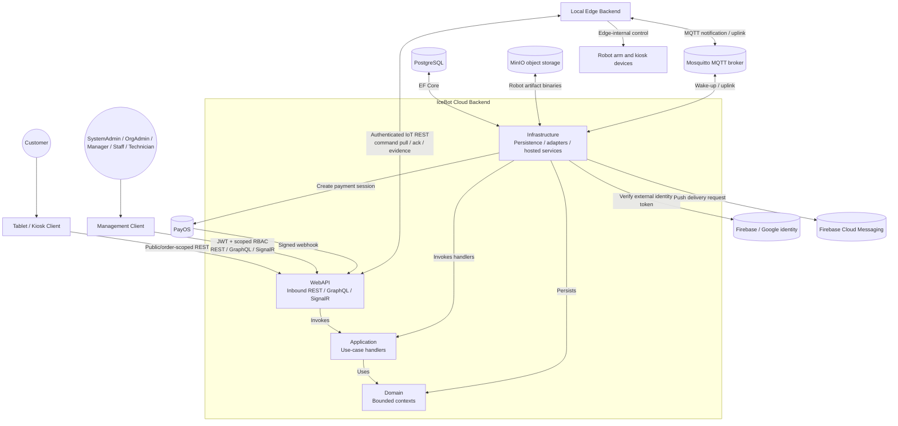
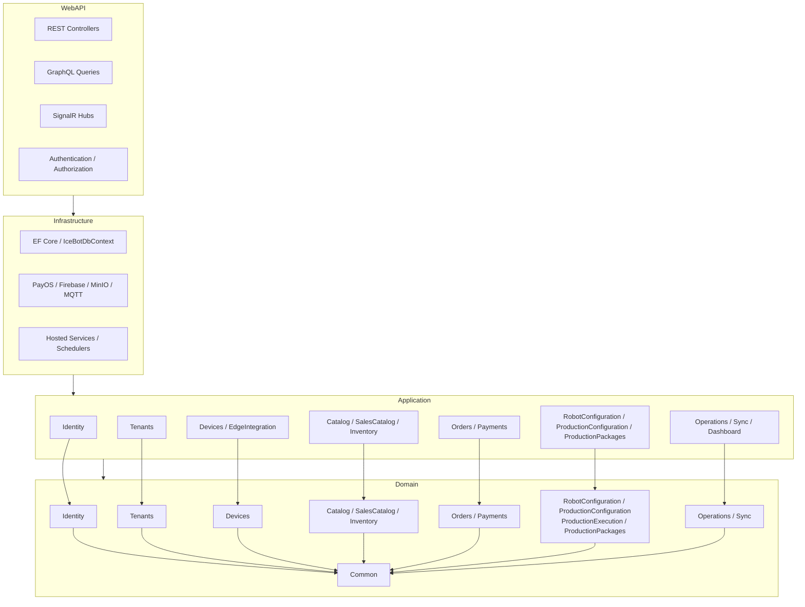
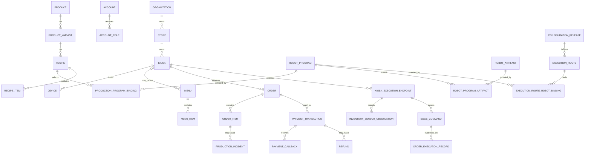
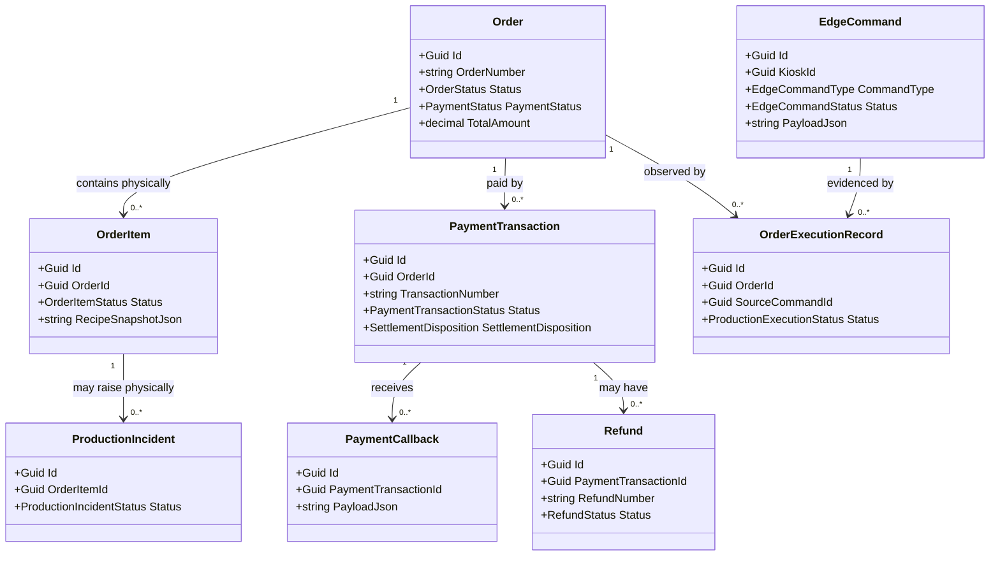
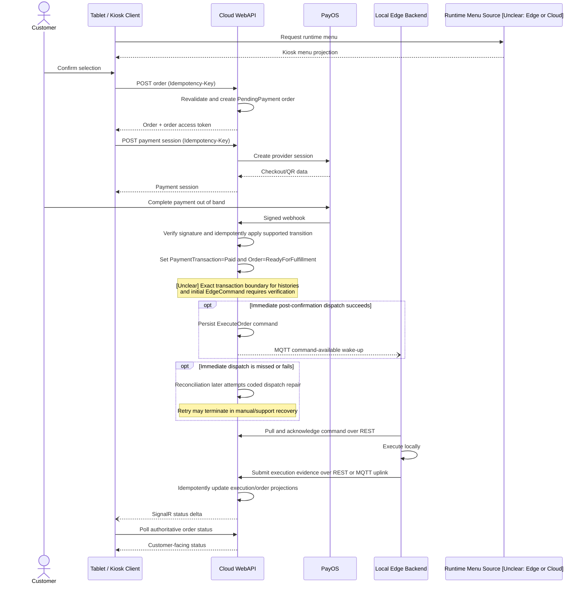

# CAPSTONE PROJECT REPORT

## REPORT 4 — SOFTWARE DESIGN DOCUMENT

**Project name:** `[PLACEHOLDER: PROJECT METADATA]`

**Working product name:** IceBot Backend

**Project code:** `[PLACEHOLDER: PROJECT METADATA]`

**Group name:** `[PLACEHOLDER: PROJECT METADATA]`

**Location and date:** `[PLACEHOLDER: PROJECT METADATA]`

# I. Record of Changes

*A — Added; M — Modified; D — Deleted*

| Date | A/M/D | In charge | Change Description |
|---|---|---|---|
| `[PLACEHOLDER: PROJECT METADATA]` | A | `[PLACEHOLDER: TEAM INFO]` | Initial school-template Software Design Document prepared from the current evidence set. `[PLACEHOLDER: MANUAL VERIFICATION]` Confirm the approved baseline before submission. |

# II. Software Design Document

Draft-DOCX rule: unresolved architecture, cardinality, client/Edge, and physical-outcome statements retain their technical labels and require `[PLACEHOLDER: MANUAL VERIFICATION]`. Missing rendered diagrams use `[PLACEHOLDER: UI SCREENSHOT]` only when a UI image is required; Mermaid design figures require final rendering and citation under `[PLACEHOLDER: FINAL CITATION]`.

Status notation used in this report:

| Label | Meaning |
|---|---|
| Supported | Directly established by the cited repository evidence. |
| `[Inferred]` | A reasonable conclusion drawn indirectly from supported evidence. |
| `[Assumption]` | A design or scope premise that requires confirmation outside the current evidence. |
| `[Unclear]` | The available repository evidence is insufficient or internally inconsistent. |
| `[Open Question]` | A decision or verification result is required from the responsible team. |

The phrases “team review” and “UI review” identify the expected reviewer; they do not create additional evidence-status categories.

## 1. System Design

### 1.1 System Architecture

#### Overall Architecture Description

IceBot Backend is implemented as an ASP.NET Core modular monolith with Clean Architecture dependency boundaries. Business capabilities are divided into bounded contexts within a single Domain assembly and a single PostgreSQL persistence model. The compile-time dependency direction is `WebAPI → Infrastructure → Application → Domain`; the Domain layer has no outward dependency. Application features use command/query handlers for workflow composition, while Entity Framework Core provides the principal unit of work and persistence mechanism.

The Cloud backend owns centralized tenant, catalog, order, payment, configuration, reporting, and synchronization coordination. The Local Edge Backend owns local execution, robot/device communication, local queuing, telemetry, and offline-tolerant runtime behavior. The Cloud does not directly control the robot arm. It stores durable commands, makes them available to Edge, and accepts Edge execution evidence. A missing acknowledgement or report is therefore an observation gap and does not prove a physical success or failure.

REST is the principal command and integration surface. GraphQL provides management-oriented reads, SignalR publishes user-interface deltas, and MQTT provides best-effort command-available notifications and Edge uplink ingestion. PostgreSQL stores relational business and evidence data. MinIO stores robot artifact binaries. PayOS provides payment sessions and signed callbacks. Firebase/Google supports external identity verification, and Firebase Cloud Messaging supports push delivery where evidenced.

Evidence: `repo_truth_map.md` §§1–8; `report3_srs.md` §§1, 3.1.4, 4.1; `functional_inventory.md`.

#### Runtime / Container Architecture Diagram



This diagram shows runtime communication and invocation, not compile-time project references. The compile-time direction remains `WebAPI → Infrastructure → Application → Domain`, as documented by the repository evidence and shown separately in Section 1.2. The diagram represents the backend evidence boundary. `[Open Question]` Frontend, Local Edge Backend, broker, deployment, and robot-runtime internals require confirmation from their owning repositories or teams before this is treated as a complete deployment view.

#### Component Explanation

| Component | Responsibility | Interfaces / dependencies | Evidence status |
|---|---|---|---|
| WebAPI | Hosts REST controllers, GraphQL, SignalR hubs, authentication/authorization, and provider/Edge entry points. | Application handlers; Infrastructure registration. | Supported |
| Application | Owns command/query handlers, validation, and the use-case logic invoked by requests and scheduled workflows. | Domain model and abstractions implemented by Infrastructure. | Supported |
| Domain | Owns bounded-context entities, lifecycle rules, enums, and shared primitives. | No outward project dependency. | Supported |
| Infrastructure | Implements EF Core persistence, external adapters, hosted-service scheduling/timers, and evidenced coordination mechanisms such as advisory locks. | PostgreSQL, PayOS, external identity verification, FCM, MinIO, MQTT. | Supported |
| PostgreSQL | Persists business aggregates, projections, callback/evidence records, commands, retries, and dead letters. | EF Core/Npgsql. | Supported |
| MinIO | Stores robot `.lua` artifact binaries outside the relational database. | Presigned and backend object-storage operations. | Supported; startup/readiness behavior remains an `[Open Question]`. |
| PayOS | Creates checkout/payment sessions and sends signed payment callbacks. | Payment service and webhook endpoint. | Supported for current provider integration. |
| Firebase / Google identity | Verifies external identity tokens for the cited login path. | Identity integration adapter. | Supported for the cited path. |
| Firebase Cloud Messaging | Receives push-delivery requests for the cited notification paths. | Notification integration adapter. | Supported for cited paths. |
| MQTT broker | Carries command-available wake-ups and Edge uplink messages. It is not the durable command source of truth. | Cloud publisher/consumer and Local Edge Backend. | Supported |
| Local Edge Backend | Pulls and acknowledges durable commands, controls local execution, and reports evidence. | IoT REST and MQTT contracts. | Interface supported; implementation outside this repository. |
| Robot arm and devices | Perform physical production under Edge control. | Edge-internal protocols. | `[Unclear]` Internal behavior is outside backend evidence. |

### 1.2 Package Diagram

#### Layer and Logical Context Diagram



The grouped arrows show project-level dependency direction and logical context participation. Boxes that combine several names are presentation groups, not claims that those names form one physical namespace. Cross-context references are intentional and limited; contexts should exchange identifiers and snapshots instead of forming large navigation graphs. Sync infrastructure must not become the owner of business rules.

#### Package and Context Descriptions

The repository uses four physical projects/layers—`WebAPI`, `Infrastructure`, `Application`, and `Domain`. Domain namespaces follow `Domain.<Context>`. Application folders generally mirror the business contexts, with additional application/integration capabilities such as `Dashboard` and `EdgeIntegration`. Dashboard and EdgeIntegration are not presented as Domain bounded contexts.

| Physical project / package | Domain context status | Responsibility / participation | Dependency boundary |
|---|---|---|---|
| `Domain.Identity` | Bounded context | Owns accounts, roles, invitations, credentials, current-session records, and notification-device registrations. | Organization-owned account administration is enforced at the application/API boundary. |
| `Domain.Tenants` | Bounded context | Owns organizations, stores, kiosks, operational state, onboarding state, and tenant scope. | Domain boundary; referenced by identifier/supported relationships. |
| `Domain.Devices` | Bounded context | Owns device catalog/instances, execution endpoints/credentials, observations, and projections. | Domain boundary. |
| `Domain.Catalog` | Bounded context | Owns ingredients, products, variants, options, recipes, templates, and lifecycle. | Domain boundary. |
| `Domain.SalesCatalog` | Bounded context | Owns menus, menu items, and sellable offers; reads catalog/configuration data through participating use cases. | Does not own Product/Recipe. |
| `Domain.Inventory` | Bounded context | Owns dispenser state/topology, stock movements, calibration, readiness data, and persisted Edge sensor observations. | References tenant/device/catalog identities where evidenced. |
| `Domain.Orders` | Bounded context | Owns order lifecycle, line snapshots, fulfilment history, and production incidents. | Does not own payment or Sync transport state. |
| `Domain.Payments` | Bounded context | Owns payment methods, transactions, callbacks, refunds, and payment reconciliation state. | References Order; provider adapter resides in Infrastructure. |
| `Domain.Operations` | Bounded context | Owns alerts, tickets, operation logs, and notification-delivery records. | Consumes supported evidence from other contexts through use cases/events. |
| `Domain.RobotConfiguration` | Bounded context | Owns artifact metadata/contracts, ordered programs, and authoring imports. | Binary adapter resides in Infrastructure. |
| `Domain.ProductionConfiguration` | Bounded context | Owns immutable production-program bindings, releases, execution routes/bindings, and deployment records. | References catalog, robot configuration, tenant, and endpoint identities as evidenced. |
| `Domain.ProductionExecution` | Bounded context | Owns Cloud execution/audit projections derived from accepted executor evidence. | Does not directly control or schedule the robot. |
| `Domain.ProductionPackages` | Bounded context | Owns versioned package definitions, installations, materializations, and upgrade provenance. | Participates in catalog/configuration materialization workflows. |
| `Domain.Sync` | Bounded context | Owns Edge commands, delivery attempts, inbox/dead-letter records, checkpoints, and state summaries. | Owns integration state, not other contexts' business rules. |
| `Domain.Common` | Shared primitives | Contains base entities and genuinely shared primitives. | Must not become a generic business-logic package. |
| `Application/<Context>` | Application package | Orchestrates the corresponding commands/queries and uses Domain rules. | Depends on Domain; external implementations supplied by Infrastructure. |
| `Application/Dashboard` | Application capability, not Domain context | Aggregates scoped management reads and invalidation behavior. | Reads through supported query paths; owns no separate Domain aggregate in evidence. |
| `Application/EdgeIntegration` | Integration capability, not Domain context | Coordinates MQTT/Edge-facing application handlers where evidenced. | Does not own Devices/Sync/Execution domain data. |
| `Infrastructure` | Adapter/host package | EF Core, provider/object-storage/MQTT/push adapters, hosted scheduling, and external I/O. | Depends inward on Application/Domain abstractions. |
| `WebAPI` | Inbound adapter/host package | REST, GraphQL, SignalR, authentication, authorization, and provider/Edge endpoints. | Invokes application use cases; does not own domain rules. |

Evidence: `repo_truth_map.md` §§2, 4; `functional_inventory.md`; `report3_srs.md` §3.2. `[Open Question]` The package diagram does not describe frontend, mobile, tablet, or Edge-runtime source packages because those implementations are not present in the evidence set.

## 2. Database Design

### Database Overview

The backend uses Entity Framework Core with the Npgsql provider and one `IceBotDbContext` against PostgreSQL. The current deployment configuration identifies PostgreSQL 17, but this version is an `[Assumption]` rather than an approved product constraint. The merged source exposes 100 `DbSet<T>` declarations, eight non-designer migrations, and 101 cumulative `CreateTable` operations. These static counts are not an authoritative live-schema count. Evidence: `backend_update_impact_2026-08-11.md` §4.

Keys follow two principal strategies. `GuidEntity` identifiers are assigned by the application (`ValueGeneratedNever`), while `LongEntity` identifiers are generated on insert. Global conventions apply `decimal(18,4)`, default string length 500, `jsonb` mapping for string properties ending in `Json`, indexes for sync origin/version and organization scope, and a global `Restrict` delete-behavior loop. `[Unclear]` The effective behavior of explicitly configured Cascade relationships after that loop remains unresolved.

### Database Relationship Diagram

The following compact SDD ERD is the current corrected summary for the principal design chain used by the detailed flows. The fuller baseline ERD remains a supporting draft and is not authoritative where its cardinalities conflict with the qualifications below.



`Menu.KioskId` is nullable; a menu may instead use broader organization/store scope. The optional Kiosk association above therefore does not assert exclusive Kiosk ownership. The mapped physical model permits zero-to-many `ProductionIncident` rows per `OrderItem` because no unique constraint on `ProductionIncident.OrderItemId` was identified. An `ExecutionRouteRobotBinding` may reference zero-or-one `ProductionProgramBinding`; one Production Program Binding may be snapshotted by zero-to-many route bindings. `[Open Question]` The intended ProductionIncident business maximum must be confirmed. The diagram does not assert that a command always has execution evidence or that evidence proves a physical outcome.

`[Needs Team Review]` Upstream blockers remain in the full baseline artifacts: the full ERD still overstates Production Program Binding optionality, ProductionIncident multiplicity, and Kiosk/Menu scope, while the logical `ExecutionRouteRobotBinding` catalogue row remains stale. Until those items are corrected, this compact view and the qualifications in this section take precedence for Report 4; exact physical columns and constraints still require the corrected logical/physical database designs.

### Conceptual, Logical, and Physical Design Summary

| Level | Purpose | Current design basis |
|---|---|---|
| Conceptual | Defines subject areas and business relationships without implementation detail. | Thirteen numbered subject areas: Tenants, Identity, Catalog, Sales Catalog, Inventory, Orders, Payments, Devices, Robot Configuration, Production Configuration/Execution, Production Packages, Operations, and Sync. |
| Logical | Defines entity identities, significant attributes, relationship shapes, and business constraints. | Bounded-context entities, GUID/long identifier strategy, tenant scope, snapshots, lifecycle/status fields, and join entities carrying business meaning. |
| Physical | Defines PostgreSQL/EF table names, columns, keys, indexes, filters, checks, JSON mapping, delete behavior, and operational notes. | `IceBotDbContext`, EF configurations, migrations, and the evidence summarized by `database_inventory.md`. |

### Table and Entity Descriptions

The table groups below summarize the physical inventory without claiming unlisted columns or constraints. Most mapped entity types derive an `Id` key from the documented GUID/long base types, but this statement does not establish the key shape of implicit joins or every physical table. Exact verified definitions remain in `physical_database_design.md` and `database_inventory.md`.

| Context | Principal physical tables | Key relationship / purpose |
|---|---|---|
| Tenants | `Organizations`, `Stores`, `Kiosks`, `KioskOperationalStateTransitions`, `FranchiseOnboardings` | Organization → Store → Kiosk tenant hierarchy and onboarding evidence. |
| Identity | `Accounts`, `AccountRoles`, `Roles`, `AccountNotificationDevices`, `AccountInvitations`, `PasswordResetRequests`, `RefreshTokens`, `AccountStores` | Account identity, scoped roles, credentials, sessions, and implicit account/store join. |
| Catalog | `ProductCategories`, `Products`, `ProductVariants`, `OptionGroups`, `ProductOptions`, `ProductOptionIngredientRequirements`, `Recipes`, `RecipeItems`, `Ingredients` | Product/recipe authoring, options, ingredient requirements, and template lineage. |
| Sales Catalog | `Menus`, `MenuItems`, `MenuItemProductOptions` | Sellable offer and option selection projection. |
| Inventory | `IngredientDispenserStates`, `InventoryTopologyChangeRecords`, `InventoryTopologyRebindRecords`, `StockMovements`, `InventorySensorObservations` | Physical ingredient topology, estimates, audit, stock ledger, and idempotent Edge observation evidence. |
| Orders | `Orders`, `OrderItems`, `OrderItemOptions`, `OrderItemOptionIngredientRequirements`, `OrderStatusHistories`, `OrderItemStatusHistories`, `ProductionIncidents`, `ProductionIncidentHistories` | Checkout snapshots, lifecycle history, fulfilment, and incident resolution. |
| Payments | `PaymentMethods`, `PaymentTransactions`, `PaymentCallbacks`, `Refunds` | Provider attempts, callback evidence, settlement selection, and manual refunds. |
| Devices | `DeviceTypes`, `DeviceModels`, `Devices`, `DeviceEvents`, `KioskHeartbeats`, connectivity/readiness/capability projections, execution endpoints, credentials, nonces, and robot targets | Device and endpoint configuration plus Edge security and observations. |
| Robot Configuration | `RobotPrograms`, `RobotProgramArtifacts`, `RobotArtifacts`, templates, technical-contract children, authoring imports/items | Artifact metadata, ordered program composition, contracts, and import workspace. |
| Production Configuration / Execution / Packages | Production-program bindings, releases, routes/bindings, deployments, execution records, package/version/definition/installation/materialization/upgrade tables | Versioned production design, declared capability evidence, deployment, execution evidence, and package provenance. |
| Operations | `Alerts`, `MaintenanceTickets`, `OperationLogs`, `NotificationDeliveries` | Operational issue, support, diagnostic, and delivery records. |
| Sync | `SyncEventInbox`, checkpoints, state summaries, dead letters/retries, `EdgeCommands`, delivery attempts | Durable ingestion, Edge command dispatch, retries, and failure handling. |

Representative key matrix for the principal entities shown in this report:

| Physical table / entity | Primary key | Principal foreign keys or referenced key | Design note |
|---|---|---|---|
| `Organizations` / `Organization` | `Id` | — | Tenant root. |
| `Stores` / `Store` | `Id` | `OrganizationId → Organizations.Id` | Store code is unique within an organization for active rows. |
| `Kiosks` / `Kiosk` | `Id` | `StoreId → Stores.Id`; organization ownership is also retained | Kiosk code is tenant-scoped; serial number has active-row uniqueness. |
| `AccountRoles` / `AccountRole` | `Id` | `AccountId → Accounts.Id`; `RoleId → Roles.Id`; optional scope references | Role and scope must be evaluated together. |
| `AccountStores` (implicit join) | Composite `(AccountId, StoreId)` | `AccountId → Accounts.Id`; `StoreId → Stores.Id` | No surrogate key and no domain class/`DbSet` of its own. |
| `ProductVariants` / `ProductVariant` | `Id` | `ProductId → Products.Id` | Owns variant lifecycle beneath a product. |
| `Recipes` / `Recipe` | `Id` | `ProductVariantId → ProductVariants.Id`; optional template lineage | Partial unique index limits the default non-retired recipe. |
| `MenuItems` / `MenuItem` | `Id` | `MenuId → Menus.Id`; catalog references described in the logical design | Represents a sellable offer, not an owned product copy. |
| `OrderItems` / `OrderItem` | `Id` | `OrderId → Orders.Id` | Retains order-time snapshots rather than depending on mutable catalog state for historical meaning. |
| `PaymentTransactions` / `PaymentTransaction` | `Id` | `OrderId → Orders.Id` | Partial unique index permits at most one Primary settlement transaction per order. |
| `PaymentCallbacks` / `PaymentCallback` | `Id` | `PaymentTransactionId → PaymentTransactions.Id` | Stores provider callback evidence. |
| `ProductionIncidents` / `ProductionIncident` | `Id` | `OrderItemId → OrderItems.Id` | Physical zero-to-many is Supported; the intended business maximum is an `[Open Question]`. |
| `RobotProgramArtifacts` / `RobotProgramArtifact` | `Id` | `RobotProgramId → RobotPrograms.Id`; `RobotArtifactId → RobotArtifacts.Id` | Explicit ordered join entity. |
| `ExecutionRouteRobotBindings` / `ExecutionRouteRobotBinding` | `[Unclear]` exact identifier not itemized | `ExecutionRouteId → ExecutionRoutes.Id`; `RobotProgramId → RobotPrograms.Id` | Explicit route/program binding entity; key shape requires model reconciliation. |
| `InventorySensorObservations` / `InventorySensorObservation` | `Id` | Dispenser, device, kiosk, and endpoint references as mapped | Append-only Edge observation evidence with unique source executor/event identity. Retention remains `[Needs Team Review]`. |
| `ProductionProgramBindings` / `ProductionProgramBinding` | `Id` | Organization, ProductVariant, Recipe, and RobotProgram references as mapped | Immutable binding with unique checksum and snapshotted option/capability evidence; it does not certify Lua behavior or physical safety. |
| `EdgeCommands` / `EdgeCommand` | `Id` | `(TargetExecutionEndpointId, KioskId) → KioskExecutionEndpoints(Id, KioskId)` | Composite FK protects the enumerated tenant relationship. |
| `OrderExecutionRecords` / `OrderExecutionRecord` | `Id` | `OrderId → Orders.Id`; command/endpoint composite relationship described in the physical design | Accepted evidence may be absent, delayed, or repeated; physical outcome is not inferred. |

This matrix is intentionally representative rather than a complete schema dictionary. Tables and relationships not listed here remain governed by `physical_database_design.md` and `database_inventory.md`; omission does not imply that a table lacks a key or constraint.

#### Database Catalogue Completion Status

The supplied evidence does not contain a complete, reconciled table-by-table catalogue of every physical PK, FK, FK nullability, unique/check constraint, and index. `physical_database_design.md` explicitly limits detailed design to objects itemized by `database_inventory.md`. `AccountStores` is a supported implicit many-to-many join with composite primary key `(AccountId, StoreId)` and no domain class/`DbSet`; other nonstandard key shapes, such as the exact identifier of `ExecutionRouteRobotBinding`, remain `[Unclear]`. Consequently, this draft references the full physical-name inventory but does not invent missing column-level definitions. Completing the university table catalogue remains an `[Open Question]` pending EF model-snapshot or live-schema reconciliation.

### Primary Keys, Foreign Keys, Constraints, and Indexes

- **Primary keys:** Application-assigned GUIDs are used by `GuidEntity` derivatives; database-generated long identifiers are used by `LongEntity` derivatives. Exact table-level key types are listed in the logical/physical database designs.
- **Foreign keys:** The default relationship is many-to-one with `Restrict`. Supported composite tenant-consistency FKs include `DeviceEvents(DeviceId,KioskId) → Devices(Id,KioskId)`, `EdgeCommands(TargetExecutionEndpointId,KioskId) → KioskExecutionEndpoints(Id,KioskId)`, execution records to commands/endpoints, deployments to releases/kiosks within an organization, and selected notification/sync relationships.
- **True one-to-one relationships:** `KioskExecutionEndpoint ↔ ExecutionEndpointMqttCredential`, `KioskExecutionEndpoint ↔ ExecutionEndpointReadinessProjection`, and `Kiosk ↔ KioskConnectivityProjection` are supported by unique FK evidence.
- **Soft-delete-aware uniqueness:** Active-row filtered unique indexes protect organization/store/kiosk codes, account names/emails/Google subjects, scoped product/recipe/menu/program identifiers, device codes/serials, artifact identity, and ticket number where enumerated by `physical_database_design.md` §4.1.
- **Unfiltered business identifiers:** `Order.OrderNumber`, `PaymentTransaction.TransactionNumber`, `Refund.RefundNumber`, and specified onboarding keys remain unique across retained rows.
- **Filtered business invariants:** Six supported partial indexes enforce one default option per group, one default non-retired recipe per variant, one Primary settlement transaction per order, one Pending/Installed deployment per kiosk, one active package upgrade per installation, and one active dispenser binding per device slot. `[Unclear]` Numeric enum literals in several predicates require team verification.
- **Check constraints:** The endpoint profile/identity constraint and the package-installation kiosk/store constraint are the two check constraints established by current evidence.
- **Time-oriented indexes:** Supported indexes exist for heartbeats, device events, operation logs, sync inbox, and dead letters. `[Unclear]` `EdgeCommandDeliveryAttempts` lacks the documented `SentAt` index; no native table partitioning is configured.

### Soft-Delete Behavior

The global convention applies a `DeletedAt IS NULL` query filter to applicable soft-deletable types. Twelve principal types are excluded because required non-soft-deleted evidence dependents reference them: `Account`, `Organization`, `Store`, `Kiosk`, `Device`, `Product`, `Ingredient`, `IngredientDispenserState`, `Order`, `PaymentTransaction`, `ConfigurationRelease`, and `KioskExecutionEndpoint`. Callers must apply `WhereNotDeleted()` where required; `[Unclear]` universal query coverage for these exceptions has not been audited.

Soft-delete-aware unique indexes are a separate mechanism and are confirmed only for the enumerated identifiers in `physical_database_design.md` §4.1; they are not claimed for every soft-deletable entity. The six business-invariant partial indexes in §4.3 are also distinct from the general active-row uniqueness group. Unfiltered keys such as order, transaction, and refund numbers can continue to block key reuse after soft deletion. `[Open Question]` Approved purge, restore, and key-reuse behavior is not established.

### Open Database Questions

- `[Open Question]` What are the authoritative mapped-entity, current physical-table, and migration-creation counts after model-snapshot/live-schema reconciliation?
- `[Open Question]` Does the global `Restrict` loop override explicitly configured Cascade relationships?
- `[Open Question]` Are all required queries for the twelve soft-delete-filter exceptions correctly filtered?
- `[Open Question]` Which additional cross-tenant relationships rely only on application validation rather than composite FKs?
- `[Open Question]` Are missing/soft lineage relationships, history/audit asymmetries, JSON schema-version asymmetries, public-key length, and numeric filtered-index predicates intentional?
- `[Open Question]` What are the approved retention, physical purge, partitioning, restore, and key-reuse rules?
- `[Open Question]` What is the intended ProductionIncident business maximum, and which remaining ERD relationships require correction, including Menu scope and execution-evidence optionality?

Evidence for Section 2: `database_inventory.md`; `conceptual_database_design.md`; `logical_database_design.md`; `physical_database_design.md`; `erd.md`; RTM data requirements DR-01–DR-16.

## 3. Detailed Design

### Detailed-Design Coverage

| Design area | Requirements covered | Design artifacts in this report | Coverage status |
|---|---|---|---|
| Order, payment, dispatch, and customer status | FR-057–FR-078, FR-125, FR-130 | Workflow-specific class subset, primary sequence, exception table | Partial: refund/reconciliation details remain evidence-qualified. |
| Cloud/Edge command and execution evidence | FR-120–FR-132 | Component table and Cloud/Edge sequence | Partial: Edge/robot internals and exact transport priority are outside/unclear. |
| Catalog, menu, inventory, artifact/configuration/package design | FR-033–FR-056, FR-088–FR-119 | Component and workflow-collaboration tables | Partial: no evidence-backed end-to-end client/Edge sequences for every workflow. |
| Tenant, authentication, and authorization | FR-001–FR-021 | Component and workflow-collaboration tables | Partial: universal authorization coverage and frontend behavior remain unresolved. |
| Operations, Sync, jobs, realtime, GraphQL, and dashboard | FR-079–FR-087, FR-128–FR-133 | Component and workflow-collaboration tables | Partial: exact failure/retry behavior varies by handler/job. |

This table maps design coverage rather than context ownership: a requirement may involve several contexts and adapters. `[Open Question]` The university/team must confirm which remaining requirements require standalone class and sequence diagrams. This draft does not imply complete feature-level design coverage where only a collaboration table is provided.

### 3.1 Order and Payment Flow

#### 3.1.1 Class Diagram



This is a workflow-specific persistence subset, not the complete domain class diagram or an API DTO specification. Multiplicities describe the mapped physical optionality evidenced for these relationships; they do not assert aggregate-creation or business minimums. Attribute lists are intentionally limited to fields established by `class_diagram.md` and `database_inventory.md`. The intended ProductionIncident business maximum remains an `[Open Question]` as described in Section 2. Displayed status/type names are presentation-level names from the baseline model; omitted methods and invariants must not be inferred.

Principal class specifications:

| Type | Responsibility | Supported operations/invariants | Collaborators |
|---|---|---|---|
| `Order` | Owns customer order and payment/fulfilment status. | Checkout creation, customer/management cancellation guards, readiness/fulfilment transitions, immutable order-time totals/snapshots. | `OrderItem`, Payments use cases, dispatch workflow. |
| `OrderItem` | Retains ordered-unit snapshot and fulfilment state. | Fulfilment events, remake linkage, incident association. | `Order`, `ProductionIncident`, execution projections. |
| `PaymentTransaction` | Records a provider payment attempt and settlement disposition. | Session lifecycle, callback-applied state, at most one Primary settlement per order. | `Order`, `PaymentCallback`, `Refund`, PayOS adapter. |
| `PaymentCallback` | Retains provider callback evidence. | Signature verification occurs before state application; duplicate/conflict details remain `[Unclear]`. | Payment webhook handler and transaction. |
| `ProductionIncident` | Tracks inspection and resolution of a production problem. | Resolution cannot be selected before inspection; business maximum per item is open. | `OrderItem`, incident history, refund/remake workflows. |
| `EdgeCommand` | Stores durable Cloud-to-Edge intent. | Idempotent dispatch identity and target endpoint; MQTT wake-up is not payload delivery. | Sync/dispatch handler, endpoint, delivery attempts. |
| `OrderExecutionRecord` | Stores Cloud observation/audit data derived from accepted Edge evidence. | Does not independently prove physical outcome. | `Order`, `EdgeCommand`, evidence-ingestion handler. |

#### 3.1.2 Sequence Diagram — Order/Payment/Dispatch Flow



#### 3.1.3 Design Explanation

- FR-057 revalidates the supported tenant/store/kiosk, menu/product/option, price/currency, and production-configuration conditions before creating the order; tablet/cart state is not authoritative. `[Unclear]` Inventory participation must not be inferred without handler-level confirmation.
- Order placement and payment-session creation use idempotency keys. Provider payment occurs outside the backend.
- FR-070 requires signature verification before applying the callback. The evidence states that payment confirmation and `ReadyForFulfillment` are committed together; `[Open Question]` the exact transaction boundary including history and initial `EdgeCommand` requires verification.
- Payment confirmation and physical execution are decoupled. Dispatch failure does not reverse the confirmed payment automatically; reconciliation attempts the coded repair and may terminate in manual/support recovery.
- SignalR is a user-interface delta channel. The customer status API remains the authoritative refetch path.
- Refund processing is currently a manual workflow. Automatic provider payout and voucher representation must not be inferred.

Material alternatives and failures:

| Condition | Supported design response | Remaining uncertainty |
|---|---|---|
| Repeated order/session request with the same idempotency key | Return/reuse the original logical result rather than duplicate the operation. | Exact retention/window per family is `[Unclear]`. |
| Invalid payment signature | Do not apply provider state. | Exact error envelope is outside this SDD evidence. |
| Duplicate, late, or conflicting callback | Callback application is designed to be idempotent. | `[Open Question]` Exact deduplication key, replay window, and conflict precedence. |
| Payment confirmed but initial dispatch absent | Reconciliation detects a ready order and attempts dispatch. | Exact commit boundary and terminal retry/manual-recovery rule are `[Unclear]`. |
| Edge rejects or cannot accept command | Project the evidenced acknowledgement/observation and use separate redispatch/remake/support workflows where allowed. | Physical outcome must not be inferred. |
| Ack/report timeout | Mark observation stale/delayed/unreachable/pending-recovery/support-required as coded. | Timeout does not prove execution failure or success. |
| Refund requested | Use the manual refund lifecycle and required reasons. | Voucher representation and automatic provider payout are not established. |

Evidence: FR-057–FR-078, FR-125, FR-130; `sequence_order_flow.md`; `activity_order_flow.md`; `functional_inventory.md` ORD/PAY/SYNC/MQTT rows.

### 3.2 Robot / Edge Execution Flow

#### 3.2.1 Relevant Classes/Components

| Class / component | Design role | Evidence status |
|---|---|---|
| `EdgeCommand` | Durable Cloud command with target endpoint, payload, lifecycle, and dispatch identity. | Supported |
| `EdgeCommandDeliveryAttempt` | Records command delivery attempts. | Supported |
| `KioskExecutionEndpoint` | Identifies and authenticates the Edge execution endpoint for a kiosk. | Supported |
| `OrderExecutionRecord` / `ProductionExecutionRecord` | Cloud audit/read projections derived from accepted Edge evidence. | Supported |
| `SyncEventInbox` / `SyncDeadLetter` | Durable ingestion, retry state, and unresolved event evidence. | Supported |
| `ProductionEventCheckpoint` / `EdgeStateSummary` | Stores checkpoint/state-summary synchronization evidence. | Supported |
| MQTT publisher/consumer | Publishes command wake-ups and consumes uplink messages through shared subscriptions. | Supported |
| Dispatch/timeout reconciliation job | Creates/repairs dispatch and changes observation status when evidence is late. | Supported; general automatic recovery is `[Inferred]`. |
| Local Edge Backend | Pulls/acks commands, controls local execution, and sends evidence. | Contract supported; internal implementation outside scope. |
| Robot arm/devices | Execute physical actions under Edge control. | `[Unclear]` outside backend evidence. |

#### 3.2.2 Sequence Diagram — Cloud/Edge/Robot Execution

```mermaid
sequenceDiagram
    participant Job as Dispatch / Reconciliation Job
    participant Cloud as Cloud Command and Evidence Store
    participant Broker as MQTT Broker
    participant Edge as Local Edge Backend
    participant Robot as Robot Arm / Devices

    Job->>Cloud: Create or locate ExecuteOrder EdgeCommand
    Cloud--)Broker: Publish command-available wake-up
    Broker--)Edge: Best-effort delivery
    alt Wake-up received
        Edge->>Cloud: Pull commands over REST
    else Wake-up missed
        Edge->>Cloud: Periodic REST pull
    end
    Cloud-->>Edge: Pending commands; artifact URLs enriched where documented by IOT-05
    Edge->>Cloud: Acknowledge Received / Accepted / Rejected / ExecutorBusy / DeliveryFailed
    alt Accepted
        Note over Edge,Robot: [Assumption] Edge/robot implementation is outside this repository
        Edge->>Robot: Request robot-program execution (Edge-internal)
        Robot-->>Edge: Edge-observed physical result (not independently known to Cloud)
        Edge->>Cloud: Report execution evidence via REST or MQTT uplink
        Cloud->>Cloud: Validate provenance and apply idempotently
        Cloud->>Cloud: Update audit/read projections
    else Not accepted
        Cloud->>Cloud: Project rejection/observation state
    end
    opt Ack/report missing after threshold
        Job->>Cloud: Mark Stale / Delayed / Unreachable / PendingRecovery / SupportRequired
        Note over Job,Cloud: Observation only; no physical outcome is asserted
    end
```

#### 3.2.3 Design Explanation

- MQTT wake-up never carries the durable command payload and is not the command source of truth. Edge always pulls commands over REST.
- REST and MQTT uplink handlers can route execution evidence to the same Application handler. `[Open Question]` Whether MQTT is primary and REST fallback, or both are equivalent, requires an explicit contract decision.
- Execution-report application uses provenance validation and `(SourceEventId, SequenceNumber)` idempotency where evidenced by FR-122. This key is not generalized to every message family.
- Timeout reconciliation changes observation state only. It must not claim that the robot did or did not dispense a product.
- Manual redispatch, remake, incident inspection, or support escalation may follow rejection or uncertain execution; the complete transition invariant remains an `[Open Question]`.
- Robot program authoring/deployment is a configuration-time responsibility of the Cloud. Live robot scheduling and device control remain Edge responsibilities.

Message-family identity and deduplication boundaries:

| Family | Supported identity / behavior | Qualification |
|---|---|---|
| Order dispatch | `(OrderId, DispatchAttemptNo)` identifies a dispatch attempt where documented. | Does not prove exactly-once physical execution. |
| Execution report | `(SourceEventId, SequenceNumber)` supports idempotent application; provenance checksum is validated against the accepted command. | Supported for FR-122; not a universal Edge-event key. |
| Production-event batch | Uses the production-sync ingestion/checkpoint contract and durable inbox/dead-letter behavior. | Exact key scope and conflict precedence remain `[Unclear]`. |
| Heartbeat, telemetry, readiness, and device events | REST and MQTT routes invoke the corresponding application handlers where documented. | Each family's exact retry/deduplication key must be read from its owning contract; no shared key is asserted here. |
| Command acknowledgement | Uses the acknowledgement contract states shown in `sequence_robot_execution.md`. | `[Unclear]` Exact DTO fields and every legal transition require contract-level verification. |

Artifact URL enrichment on command pull is retained because `functional_inventory.md` IOT-05 and `sequence_robot_execution.md` explicitly record it. Artifact retrieval/execution after receipt is an Edge responsibility and is not expanded into unsupported backend behavior.

Evidence: FR-120–FR-132; `sequence_robot_execution.md`; `repo_truth_map.md` §8; `functional_inventory.md` IOT/MQTT/SYNC rows.

### 3.3 Catalog / Inventory / Production Configuration

#### 3.3.1 Relevant Classes/Components

| Area | Relevant classes/components | Responsibility |
|---|---|---|
| Catalog | `Product`, `ProductVariant`, `OptionGroup`, `ProductOption`, `ProductOptionIngredientRequirement`, `Recipe`, `RecipeItem`, `Ingredient` | Versioned product/recipe definitions, options, ingredient requirements, and lifecycle validation. |
| Sales Catalog | `Menu`, `MenuItem`, `MenuItemProductOption`, runtime-menu query/cache | Scoped sellable offers and kiosk-specific runtime projection. |
| Inventory | `IngredientDispenserState`, `StockMovement`, topology change/rebind records, readiness evaluator | Maps ingredients to physical containers, records quantity changes, and evaluates production readiness. |
| Robot Configuration | `RobotArtifact`, `RobotArtifactTechnicalContract`, `RobotProgram`, `RobotProgramArtifact`, authoring import entities, MinIO adapter | Validates/stores artifact metadata and binaries and composes ordered programs. |
| Production Configuration | `ProductionProgramBinding`, `ConfigurationRelease`, `ExecutionRoute`, `ExecutionRouteRobotBinding`, deployment entities | Records an immutable Recipe/program decision, snapshots its evidence into routes, and deploys a versioned configuration. |
| Production Packages | Package/version/definition/installation/materialization/upgrade entities | Produces deterministic tenant installations and upgrade provenance. |

Workflow collaboration summary:

| Workflow | Entry point / actor | Owning and participating design | State / persistence effect | Failure, concurrency, and evidence boundary | Requirements |
|---|---|---|---|---|---|
| Catalog and recipe authoring | Authorized management REST request | Catalog handlers and Catalog entities | Creates/updates lifecycle-controlled products, variants, options, recipes, and items. | Publication/activation preflight can reject invalid composition; recipes are retired rather than deleted. | FR-033–FR-041 |
| Menu publication and runtime projection | Management authoring; tablet runtime-menu request | Sales Catalog with Catalog and production-route reads | Stores Menu/MenuItem state and produces a bounded-cache projection with ETag. | `[Unclear]` Deployed tablet source is Edge, Cloud, or both. Runtime-menu evidence does not establish an inventory stock gate. | FR-042–FR-047 |
| Inventory refill/adjustment/consumption | Staff/Technician request or execution-driven handler | Inventory with Device/Tenant/Catalog identities | Appends stock movement and changes dispenser estimate/topology as specified. | Rebind/retire operations are guarded during active execution; `[Inferred]` end-to-end execution-consumption completeness is unverified. | FR-048–FR-056 |
| Artifact authoring and publication | Authorized management upload/import/publish | Robot Configuration plus MinIO adapter | Stores artifact metadata/checksum/contract/program order; binary content resides in object storage. | Publish requires compatible contract and verified object checksum/size; object-store/DB partial-failure recovery remains open. | FR-088–FR-101 |
| Production binding, release, and deployment | Authorized bind/preview/publish/deploy/rollback request | Production Configuration, Inventory readiness query, endpoint/command adapters | Records immutable binding evidence, release/routes, deployment audit request and reported deployment state. | Missing optional declarations create no capability claim; stale revision/deployment concurrency can reject; reported state does not prove physical deployment. | FR-102–FR-110, FR-135 |
| Package install and upgrade | Authorized preview/install/upgrade/cutover/rollback request or reconciliation job | Production Packages with Catalog/Configuration materialization | Records version, installation, materialization, upgrade and rollback provenance. | Idempotency and active-upgrade constraint are supported where cited; recovery/lease/terminal semantics remain open. | FR-111–FR-119 |

#### 3.3.2 Design Explanation

Catalog authoring is separated from Sales Catalog publication. A `MenuItem` references catalog definitions but is a sellable offer rather than a copy of the product. Runtime-menu projection re-evaluates current kiosk/store/menu availability and caches the result for a bounded interval with ETag support.

Recipes follow a controlled Draft → Published → Active → Retired lifecycle. Order items retain order-time product, recipe, option, and price snapshots so later catalog changes do not rewrite historical meaning. Inventory links ingredients to device/container state and records refills, adjustments, consumption, and topology changes. `[Inferred]` Execution-driven consumption is supported as an integration path, but complete end-to-end inventory accuracy has not been runtime-verified.

Robot artifacts and optional technical declarations are authored before deployment. Binary `.lua` content is stored in MinIO; relational tables store metadata, checksum, size, declarations, and program composition. Draft programs also support bounded raw-Lua import. A declaration is operator-provided metadata and does not certify the script's behavior. `RobotProgramArtifact`, `ProductionProgramBinding`, and `ExecutionRouteRobotBinding` carry distinct ordering, decision, and route-snapshot meaning and must not be flattened into ownership relationships.

Configuration publication and deployment requests are gated by validation and inventory readiness. Release authoring uses revision/concurrency tokens, and deployment requests record supported audit/reason/concurrency information. Full Edge and low-cost controller paths differ. Execute-order schema v5 carries required-capability arrays per robot-program binding while Cloud retains schemas 3–5 decoding. Package workflows retain version and materialization provenance and reported state; none independently proves physical installation or successful execution. Remaining recovery, lease, cutover, rollback, and installation-to-release questions stay `[Open Question]`.

Evidence: FR-033–FR-056, FR-088–FR-119; `class_diagram.md`; database designs; `functional_inventory.md` Catalog/Sales Catalog/Inventory/Robot/Production rows.

### 3.4 Tenant / Identity / Authorization

#### 3.4.1 Relevant Classes/Components

| Class / component | Responsibility |
|---|---|
| `Organization`, `Store`, `Kiosk` | Defines the tenant hierarchy and operating locations. |
| `KioskOperationalStateTransition` | Preserves operational-state change evidence. |
| `FranchiseOnboarding` | Coordinates idempotent, resumable tenant provisioning checkpoints. |
| `Account`, `Role`, `AccountRole` | Stores identity and scoped role assignments. |
| `RefreshToken`, `PasswordResetRequest`, `AccountInvitation` | Stores hashed session/recovery/onboarding credentials and lifecycle state. |
| Authentication controllers/services | Implements local login, Google/Firebase login, refresh, logout, password recovery, and invitations. |
| Authorization policy handlers | Enforces required role plus matching organization/store/kiosk scope. |

Workflow collaboration summary:

| Workflow | Entry point / actor | State / validation | Failure and consistency behavior | Requirements |
|---|---|---|---|---|
| Local/external login | Anonymous authentication request | Validates active account and local password or verified external token; issues access/refresh pair. | Failed local attempts accumulate toward lockout; external subject mismatch is rejected. | FR-001–FR-003 |
| Session/password lifecycle | Authenticated session-list/revoke/logout/change or public reset flow | Lists owned active sessions and revokes one/all refresh tokens; reset/change sets credentials and revokes sessions as specified. | A caller cannot revoke another account's session; UI privacy/retention presentation is `[Needs Team/UI Review]`. | FR-004–FR-006 |
| Invitation onboarding | Authorized management invitation; invited account acceptance | Creates Invited account, single-use invitation, scoped role assignment, and acceptance transition. | At most one active invitation; temporary-password first-login lifecycle remains `[Unclear]`. | FR-009–FR-010 |
| Account/role administration | Organization-owned request by SystemAdmin or authorized OrgAdmin | Applies legal organization scope, assignable-role rules, and caller-scope validation before account/role changes. | OrgAdmin cannot grant SystemAdmin or cross the route organization; universal endpoint coverage remains `[Unclear]`. | FR-009–FR-016 |
| Tenant lifecycle/onboarding | SystemAdmin/OrgAdmin/Manager workflow as specified | Creates/updates organization/store/kiosk and advances resumable onboarding checkpoints. | Start is idempotent; resume uses claim/lease behavior; cancellation does not delete provisioned resources. | FR-017–FR-021 |

#### 3.4.2 Design Explanation

The tenant root is `Organization → Store → Kiosk`. Some configuration entities support override resolution using Device > Kiosk > Store > Organization > Global, but legal scope subsets differ by entity; for example, the shared enum does not prove that every entity accepts Global scope.

Internal authorization uses the roles `SystemAdmin`, `OrgAdmin`, `Manager`, `Staff`, and `Technician`. Policy evaluation combines a role and scope from the same `AccountRole` and rejects cross-scope composition where represented by FR-016. `[Unclear]` Universal enforcement across every REST action, GraphQL resolver, and SignalR method has not been exhaustively audited.

Refresh, reset, and invitation tokens are stored as hashes. Local login applies a 15-minute lock after five cumulative failures, while forgot-password returns a generic result to reduce account enumeration. The invitation path is supported; `[Unclear]` the temporary-password onboarding variant lacks an evidenced complete first-login/forced-change lifecycle.

The backend security rule is Supported: server authorization must be enforced independently of client visibility. `[Assumption]` A frontend may hide unauthorized navigation as a usability measure, but frontend behavior is outside this evidence set. `[Open Question]` Screen visibility, client-side role routing, and UI permission matrices require evidence from the client implementations if included in Report 4 scope.

Evidence: FR-001–FR-021; NFR-007, NFR-009–NFR-011; `repo_truth_map.md` §§3–4; `database_inventory.md` Identity/Tenants sections.

### 3.5 Operations / Sync / Background Processing

#### 3.5.1 Relevant Classes/Components

| Class / component | Responsibility | Qualification |
|---|---|---|
| `Alert` | Correlated operational issue raised manually or from device/inventory evidence. | Supported |
| `MaintenanceTicket` | Tracks maintenance work lifecycle and required reasons. | Supported |
| `OperationLog` | Stores curated/diagnostic operational evidence. | Supported |
| `NotificationDelivery` | Persists delivery attempts and retry state for notifications. | Supported |
| `SyncEventInbox` | Provides durable, idempotent Edge event ingestion and retry state. | Supported |
| `SyncDeadLetter` / retry attempts | Preserves failed events for inspection and limited replay/resolve/ignore. | Replay supports only `ExecutionReport.*`; broader replay remains `[Unclear]`/an open product decision. |
| `EdgeCommand` / delivery attempts | Stores durable Cloud-to-Edge intent and delivery evidence. | Supported |
| Connectivity/payment/deployment/package/order jobs | Detects and applies coded reconciliation transitions. | Supported job paths; guaranteed recovery is `[Inferred]`. Verified unmatched PayOS callbacks create no payment/order/fulfilment state and increment only bounded diagnostic metrics. |
| Retention/cleanup/notification jobs | Performs bounded deletion, orphan cleanup, and delivery retries. | Supported for cited jobs. |
| Metrics publisher | Publishes stale/unreachable execution counts periodically. | Supported |
| SignalR publishers | Sends order/payment/operations/dashboard invalidation deltas. | Supported for cited events. |

Workflow collaboration summary:

| Workflow | Entry point / owner | Durable state / output | Failure, retry, and consistency behavior | Requirements |
|---|---|---|---|---|
| Alert and maintenance handling | Device/inventory evidence or authorized operator | `Alert`, `MaintenanceTicket`, histories/timestamps, realtime/push events where cited | Correlation avoids duplicate active alerts where specified; ticket transitions require permitted status/reasons. | FR-079–FR-084, FR-087 |
| Operational diagnostics and notification delivery | Authorized diagnostics request or delivery worker | `OperationLog`, `NotificationDelivery`, retry/provenance fields | Curated/raw separation is supported only for cited paths; failed delivery may be requeued/automatically retried as coded. | FR-085–FR-086 |
| Edge event ingestion | Authenticated Edge REST or MQTT uplink | Inbox/business evidence, checkpoints/state summaries, result publication where cited | Per-family validation/idempotency applies; retained/oversize MQTT messages are rejected. No universal dedup key is asserted. | FR-122–FR-127 |
| Dead-letter handling | Failed ingestion or authorized operator | `SyncDeadLetter` and retry-attempt/audit state | Automated retry is limited to `ExecutionReport.*`; other types require resolve/ignore/manual handling. | FR-132 |
| Reconciliation/background jobs | Hosted timer/service in Infrastructure invoking Application handler | Coded state transitions, notifications, metrics, cleanup or bounded retention | Job existence does not guarantee recovery; retries may terminate in manual/support state. Advisory locking is used only where evidenced. | FR-031, FR-065, FR-073, FR-086, FR-101, FR-110, FR-119, FR-130–FR-131; NFR-014, NFR-024 |
| Realtime/GraphQL/dashboard reads | Authenticated client request or committed application change | Scoped query result or SignalR invalidation delta | Push is not robot transport and should not replace authoritative refetch; GraphQL mutation scope remains an open verification item. | FR-128–FR-129, FR-133 |

#### 3.5.2 Design Explanation

Operations is separated from raw diagnostics where evidenced: curated reads omit raw payloads, while diagnostics-scoped reads expose retry/provenance data through a dedicated policy. `[Unclear]` This separation has not been audited across every raw-payload surface.

Sync uses a durable inbox, typed idempotency/correlation data, retries, and dead letters. Business contexts own their rules; Sync owns transport and durable integration state. MQTT shared subscriptions permit broker-level load sharing, but do not alone prove duplicate-free processing.

Background jobs reconcile stale connectivity, payment sessions, configuration deployments, package upgrades, and order dispatch; other jobs handle retention, cleanup, metrics, and notification delivery. Each job's supported behavior is the specific coded transition. Some workflows intentionally terminate at manual intervention or `SupportRequired`, so the design does not claim universal automatic recovery.

Scheduled retention operates in bounded batches (`BatchSize=1000`, `MaxBatchesPerRun=20`) for the cited data classes. PostgreSQL advisory locks coordinate singleton/distributed jobs where evidenced, such as robot-artifact orphan cleanup. `[Open Question]` The team must identify which jobs are mandatory in each deployment profile and approve backup, recovery, monitoring, availability, and incident-response requirements.

Evidence: FR-079–FR-087, FR-120–FR-133; NFR-002–NFR-003, NFR-014, NFR-016, NFR-020–NFR-021, NFR-024; `functional_inventory.md`; `database_inventory.md`; `open_questions.md`.

---

**Submission-readiness checklist:** This draft is not ready for final DOCX submission until the following evidence/decision blockers are closed or formally accepted in `deliverables/05_team_review/open_questions.md`:

- complete official project metadata, accountable author/reviewer, and dated change history;
- approve the deployed-system boundary and the normal/fallback tablet runtime-menu source;
- verify the payment-confirmation, history, command-creation, and post-commit dispatch transaction boundaries;
- reconcile the EF model snapshot/live schema with the physical table, PK, FK, nullability, index, filter, and delete-behavior catalogue;
- align ERD cardinalities, including Menu scope, ProductionIncident business maximum, and optional execution evidence;
- confirm the exact Edge acknowledgement/report contracts and provide external Edge/robot evidence for any physical-runtime claims;
- confirm which SRS features require additional standalone class/sequence designs for university acceptance;
- supply frontend package/UI design evidence if frontend behavior remains within Report 4 scope;
- verify that Mermaid diagrams remain readable after DOCX rendering and retain all uncertainty qualifications.
