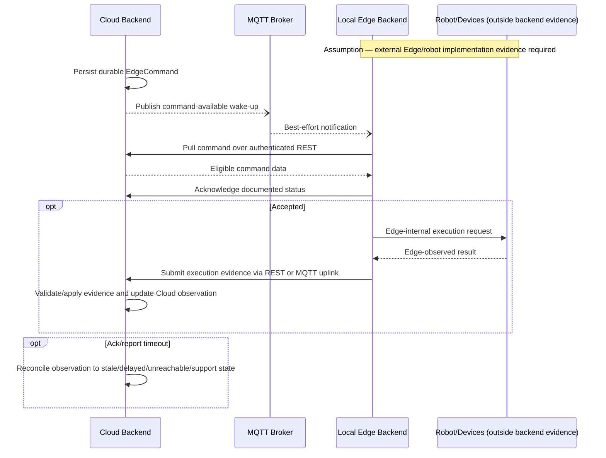

# CAPSTONE PROJECT REPORT

## REPORT 6 — SOFTWARE USER GUIDES

**Project name:** `[Official project name — Needs Team Review]`

**Working product name:** IceBot Backend

**Project code:** `[Project code — Needs Team Review]`

**Group name:** `[Group name — Needs Team Review]`

**Location and date:** `[Location and date — Needs Team Review]`

# I. Record of Changes

*A — Added; M — Modified; D — Deleted*

| Date | A/M/D | In charge | Change Description |
|---|---|---|---|
| `[Date — Needs Team Review]` | A | `[Author/team member — Needs Team Review]` | Initial school-template Release Package and Software User Guides draft prepared from the repository evidence and school-report baseline. |

# II. Release Package & User Guides

This document is a school-report draft for IceBot Backend. It is not a verified production runbook, final release manifest, or approved UI manual. Repository paths and supported contracts are documented where evidence exists. Release versions, checksums, package locations, credentials, deployment commands, client navigation, screenshots, and physical Edge/robot procedures remain team-owned inputs.

Status notation:

- **Available in workspace** — the item exists in the current repository/deliverable workspace, but is not thereby approved as a release artifact.
- `[Needs Team Review]` — a team-supplied value, decision, procedure, environment, or external-repository confirmation is required.
- `[Needs UI/Team Review]` — the backend establishes a role/contract workflow but not the owning client screen, layout, navigation, or message text.
- `[Unclear]` — the supplied evidence is incomplete or inconsistent.

## 1. Deliverable Package

No approved, versioned release-package manifest exists in the evidence set. The following inventory identifies candidate items and the work required before submission or delivery.

| No. | Deliverable Item | Description | Status / Notes |
|---:|---|---|---|
| 1 | Source code | IceBot Backend implementation, including WebAPI, Infrastructure, Application, and Domain projects. | Available in workspace. Release commit/tag, archive name, checksum, license notice, and approved exclusions are `[Needs Team Review]`. |
| 2 | Backend API contract artifact | Candidate packaged OpenAPI document, GraphQL schema, SignalR/IoT contract, examples, or client contract for the evidenced API surfaces. | No approved versioned API artifact is established. The SRS/evidence inventory is not itself a released client contract; artifact choice/version/location are `[Needs Team Review]`. |
| 3 | Database scripts and migrations | EF Core model/configurations, eight current non-designer migrations, model snapshot, and manual migration-step classes. | Available in source. Release migration set, execution/rollback procedure, checksums, and live-schema reconciliation are `[Needs Team Review]`. Static DbSet/CreateTable counts are not a verified live-table count. |
| 4 | Configuration files | Current repository configuration includes application settings and container definitions. Runtime database configuration reads `CONNECTIONSTRING`; design-time creation reads `ConnectionStrings:IceBot_DB` / `ConnectionStrings__IceBot_DB`. | Files exist. Approved non-secret templates, environment matrix, secret injection procedure, and resolution of the two database keys are `[Needs Team Review]`. |
| 5 | Project Introduction | Report 1 school draft and team-facing project-introduction baseline. | Available under `deliverables/01_project_introduction/` and `deliverables/06_school_reports/report1_project_introduction/`; approval/version `[Needs Team Review]`. |
| 6 | Software Requirements Specification | Baseline SRS, RTM, and school-template Report 3. | Available. Approved baseline/revision and resolution/acceptance of open requirements are `[Needs Team Review]`. |
| 7 | Software Design Document | UML/database baselines and school-template Report 4. | Available. Diagram rendering and unresolved schema/Edge/design items remain `[Needs Team Review]`. |
| 8 | Software Test Documentation | School-template Report 5 with planned cases, future report placeholders, and required companion-workbook controls. | Draft available; no executed results are claimed. Case count/version must be generated from the approved Report 5 manifest. Companion workbooks, environment manifest, defects, statistics, evidence, and sign-off are `[Needs Team Review]`. |
| 9 | UML and database-design documents | Use-case, class, sequence, activity, ERD, conceptual, logical, and physical database-design baselines. | Available under `deliverables/03_uml/` and `deliverables/04_database_design/`; unresolved cardinality/model questions remain. |
| 10 | Deployment and infrastructure notes | Evidence identifies ASP.NET Core, container files, PostgreSQL, MinIO, Mosquitto, and external adapters. | Partial evidence only. Approved topology, environment files, startup/rollback/backup/monitoring procedures, domains, certificates, ports, and owners are `[Needs Team Review]`. |
| 11 | Software User Guide | This Report 6 draft covering installation boundaries and role-based workflows. | Draft available. UI screenshots and verified installation/user-acceptance evidence are not available. |
| 12 | Known issues and open questions | Consolidated unresolved product, authorization, API, payment, Edge, database, deployment, and report questions. | Available at `deliverables/05_team_review/open_questions.md`; triage, owners, severity, decisions, and closure evidence are `[Needs Team Review]`. |
| 13 | Project management schedule/backlog | University package examples expect schedule and tracking artifacts. | Not established in the supplied deliverables; `[Needs Team Review]`. |
| 14 | Defect and issue exports | Executed test defects and release-known issues for the final package. | `[To Be Updated After Test Execution]`; approved tracker/export format and location `[Needs Team Review]`. |
| 15 | Presentation/slides and final package index | Submission presentation and final reproducible file manifest. | Not established; filenames, versions, checksums, and owner are `[Needs Team Review]`. |
| 16 | Project Management Plan — Report 2 | University Project Management Plan and its approved schedule/resource/risk/quality baselines. | Not established in the supplied school-report directory; `[Needs Team Review]`. |
| 17 | Final Project Report — Report 7 | Final consolidated university report, distinct from the release-package index. | Not established; `[Needs Team Review]`. |
| 18 | Release-known issues / accepted limitations | Verified defects and formally accepted limitations applicable to the release. | Must be separate from unresolved questions. Content, severity, owner, workaround, and approval are `[Needs Team Review]`. |

Before release, the package owner must record for every item: filename/path, document or binary version, source commit/build, size, checksum, owner, approval status, confidentiality, and replacement/supersession relationship. `[Needs Team Review]`

Release-manifest control fields:

| Item No. | Approved filename / packaged relative path | Artifact/document version | Source commit/build | Checksum | Owner | Approval status | Confidentiality |
|---:|---|---|---|---|---|---|---|
| 1–18 | `[Needs Team Review]` | `[Needs Team Review]` | `[Needs Team Review]` | `[Needs Team Review]` | `[Needs Team Review]` | `[Needs Team Review]` | `[Needs Team Review]` |

The final manifest must contain one row per actual artifact rather than one combined `1–18` row. The compact placeholder above reserves the university version/audit fields without inventing release values.

## 2. Installation Guides

### 2.1 System Requirements

#### Server and Backend Requirements

| Requirement | Evidence-based requirement | Status / qualification |
|---|---|---|
| Application runtime | ASP.NET Core Web API. | Exact .NET SDK/runtime version, operating system/container support, CPU architecture, CPU, memory, disk, network, and capacity/scaling profile are `[Needs Team Review]`. The compile-time layer direction is documented in Report 4 rather than treated as an installer prerequisite. |
| Build source | Repository solution/source and dependency restoration access. | Repository exists. Approved release revision and restore/build command sequence are `[Needs Team Review]`. |
| Container support | `docker/Dockerfile` and `docker/docker-compose.yml` are referenced by the evidence. | Containerization is supported. Container engine/version, compose profile, image registry, tags, resources, and production suitability are `[Needs Team Review]`. |
| Time | Reliable system time is required for token expiry, callback timestamps, request signatures/nonces, acknowledgement skew, retries, leases, and reconciliation. | `[Inferred]` from evidenced time-sensitive contracts. Time source, zone, skew tolerance, and monitoring are `[Needs Team Review]`. |

#### Database Requirements

| Requirement | Evidence-based requirement | Status / qualification |
|---|---|---|
| DBMS/provider | PostgreSQL through Npgsql and Entity Framework Core. Current compose evidence uses PostgreSQL 17 and database name `IceBotDB`. | PostgreSQL integration supported; version/name are current configuration, not an approved permanent production requirement. |
| Runtime connection | Runtime registration reads configuration key `CONNECTIONSTRING`. | Supported. Value, TLS requirements, user/role, rotation, pool settings, and secret source are `[Needs Team Review]`. |
| Design-time connection | Design-time factory reads `ConnectionStrings:IceBot_DB` or environment variable `ConnectionStrings__IceBot_DB`. | Supported divergence. The team must document whether both keys are required and how consistency is enforced. |
| Schema deployment | EF Core migrations and a model snapshot exist; two migration groups include manual-step classes. | Exact invocation order, manual-step execution, preflight handling, rollback, backup, and audit record are `[Needs Team Review]`. Do not generate new migrations from this guide. |
| Data safety | Default FK behavior is intended to be restrictive; selected explicit Cascade configuration may be overridden by the global convention. | `[Unclear]` Effective delete behavior requires final model/migration verification before operational use. |

#### External Service Requirements

| Service | Backend use | Required team input |
|---|---|---|
| PayOS | Payment-session creation and signed payment webhook. | Account/environment, approved sandbox/production endpoints, signing-secret procedure, callback URL/domain/TLS, replay/late-event policy, and incident owner `[Needs Team Review]`. |
| Firebase/Google identity | Verification of external Google/Firebase identity tokens. | Project/application identity, credentials, allowed issuers/audiences, rotation, and environment separation `[Needs Team Review]`. |
| Firebase Cloud Messaging | Push-notification delivery for cited notification paths. | Project credentials, device-token handling, quotas, retry policy, and monitoring `[Needs Team Review]`. |
| MinIO/S3-compatible object storage | Robot artifact binary storage; PostgreSQL stores metadata/checksum/size rather than `.lua` bytes. | Endpoint, bucket, access policy, credentials, TLS, lifecycle/backup, startup readiness, and orphan-recovery procedure `[Needs Team Review]`. |
| Mosquitto-compatible MQTT broker | Best-effort command wake-up, Edge uplink, and per-endpoint credential provisioning. | Broker endpoint, protocol/TLS settings, Dynamic Security setup, admin credentials, topic ACLs, shared group, payload limit, monitoring, and recovery `[Needs Team Review]`. |

#### Network and API Requirements

- HTTPS and trusted certificates are required for externally exposed HTTP interfaces. Exact domains, ports, reverse proxy, firewall rules, CORS, rate limits, upload/request limits, and certificate management are `[Needs Team Review]`.
- Public/customer routes use `/api/v1/kiosks/...` and `/api/v1/orders...`, with order-scoped bearer access where specified.
- Authentication/current-account/management surfaces use `/api/v1/authentication...`, `/api/v1/me...`, and `/api/v1/management/...`; management access requires JWT plus scoped RBAC.
- PayOS sends a signature-verified webhook through `/api/v1/payments/.../webhook`.
- Edge REST uses `/api/v1/iot/execution-endpoints/{endpointId}/...`; Full Edge uses mTLS certificate-fingerprint identity, while low-cost controllers use ECDSA P-256 signed requests and nonce protection.
- GraphQL is exposed at `/graphql`; the evidence describes management reads, but mutation scope remains `[Unclear]`.
- SignalR hubs are `/hubs/orders`, `/hubs/operations`, and `/hubs/management-dashboard` with authenticated/scoped group joins.
- Health/info probes use `/health...` and `/info`. The exact readiness/liveness route set, disclosure, dependency checks, and deployment acceptance criteria are `[Needs Team Review]`.

#### Edge, Robot, IoT, and Client Assumptions

- The Local Edge Backend is a separate system. It owns local execution, device/robot communication, local queueing, telemetry, and offline tolerance. Its build, installation, configuration, update, rollback, and safety procedure are outside this repository and `[Needs Team Review]`.
- The Cloud backend authors/distributes robot artifacts and sends durable commands to execution endpoints. It does not directly operate the robot arm.
- MQTT wake-up is not the durable command payload/source of truth. Edge must pull and acknowledge commands through the documented REST contract and may send supported evidence through REST or MQTT uplink.
- Full Edge and low-cost controller endpoint profiles use different authentication material. Certificate/key generation, secure delivery, rotation, revocation, overlap, recovery, and broker credential compensation are `[Needs Team Review]`.
- Tablet/management client implementations and screenshots are not present. Their supported runtime versions, installation procedures, API base URL, kiosk assignment, offline behavior, and normal runtime-menu source (Edge, Cloud, or both) are `[Needs UI/Team Review]`.
- Physical robot compatibility, Fairino Studio/runtime version, device firmware, wiring, calibration, motion safety, and acceptance tests are `[Needs Team Review]`.

### 2.2 Installation Instruction

The sequence below is a controlled installation framework. Commands or values are included only when supported; all release-specific values must be obtained from the deployment owner. Do not use production credentials in documentation, source control, screenshots, or shared logs.

#### Step 1 — Approve the Installation Baseline

1. Record the source commit/tag, release version, package checksum, and report/migration revisions. `[Needs Team Review]`
2. Choose the supported deployment profile: local development, test, staging, or production. `[Needs Team Review]`
3. Approve the topology: backend instances, PostgreSQL, object storage, MQTT broker, reverse proxy/TLS, external services, Local Edge Backend, and clients. `[Needs Team Review]`
4. Assign installation, database, security, provider, broker, Edge, rollback, and verification owners. `[Needs Team Review]`
5. Back up any target data and document RPO/RTO and rollback conditions. `[Needs Team Review]`

**Expected result:** `[Recommendation / Needs Team Review]` An approved installation manifest exists before any environment changes. The approval mechanism and authorized signatories must be defined by the team.

#### Step 2 — Obtain and Inspect the Repository

1. Obtain the approved repository revision using the team-approved source-control procedure. `[Needs Team Review]`
2. Confirm that the solution/source projects, container definitions, WebAPI settings, EF Core migrations/model snapshot, and manual migration-step classes match the manifest. The synchronized source also contains CI workflows for validation and GHCR publication; release approval, secrets, environments, and successful-run evidence remain `[Needs Team Review]`.
3. Confirm that no secret is committed in the package and that configuration templates contain placeholders only.
4. The release owner must triage release-blocking database, deployment, payment, Edge, and authorization questions before packaging. The installer receives the approved blocker/waiver list and must not decide unresolved product or architecture questions during installation. `[Needs Team Review]`

**Expected result:** The workspace matches the approved checksum/revision and contains all declared artifacts.

#### Step 3 — Prepare Prerequisites

1. Install the team-approved .NET SDK/runtime and/or container runtime. Exact versions and installation commands are `[Needs Team Review]`.
2. Provision an isolated PostgreSQL instance compatible with the approved build. The repository default is PostgreSQL 17; the supported environment matrix is `[Needs Team Review]`.
3. Provision MinIO/S3-compatible storage and a Mosquitto-compatible MQTT broker if those integrations are enabled.
4. Obtain approved PayOS, identity, push, broker, object-storage, and Edge credentials through the designated secret-management process.
5. Configure DNS/TLS/firewall/reverse-proxy rules using the approved network design. Exact values are `[Needs Team Review]`.

**Warning:** Never reuse development secrets, test endpoint credentials, or production customer data across environments.

#### Step 4 — Configure the Backend

Prepare an environment-specific configuration record without placing secret values in this document.

| Configuration area | Supported key/need | Required value/status |
|---|---|---|
| Runtime database | `CONNECTIONSTRING` | `[Secret/value source — Needs Team Review]` |
| Design-time database | `ConnectionStrings:IceBot_DB` / `ConnectionStrings__IceBot_DB` | `[Secret/value source — Needs Team Review]` |
| PayOS | Provider credentials, signing verification, callback address | Exact key names/values `[Needs Team Review]` |
| Firebase/Google identity | Token-verification project/credentials | Exact key names/values `[Needs Team Review]` |
| FCM | Push-delivery credentials/settings | Exact key names/values `[Needs Team Review]` |
| MinIO/S3 | Endpoint, bucket, credentials, TLS | Exact key names/values `[Needs Team Review]` |
| MQTT | Broker/TLS/admin/dynamic-security/shared-group/topic limits | Exact key names/values `[Needs Team Review]` |
| Edge security | Endpoint profile, certificate fingerprint or ECDSA public-key binding, nonce/time policy | Provisioning procedure `[Needs Team Review]` |
| Email/notifications | Sender/provider settings where enabled | Exact integration/configuration `[Needs Team Review]` |
| Jobs/retention | Enabled hosted jobs, schedules, timeouts, batch/retention options | Deployment-profile matrix `[Needs Team Review]` |
| Logging/health/metrics | Levels, sinks, redaction, probes, metric export | Operations policy `[Needs Team Review]` |

The approved release must add a non-secret configuration catalogue with the following fields. Only the two database paths are currently established by the supplied evidence; all other exact keys must be generated from the approved release code/configuration rather than guessed.

| Configuration ID | Environment-variable name / configuration path | Purpose | Type/format | Default | Required profile | Secret classification/source | Validation | Restart/reload behavior | Example placeholder |
|---|---|---|---|---|---|---|---|---|---|
| CFG-DB-RUNTIME | `CONNECTIONSTRING` | Runtime PostgreSQL connection | Connection string | `[Needs Team Review]` | `[Needs Team Review]` | Secret; source `[Needs Team Review]` | `[Needs Team Review]` | `[Needs Team Review]` | `[REDACTED CONNECTION STRING]` |
| CFG-DB-DESIGN | `ConnectionStrings:IceBot_DB` / `ConnectionStrings__IceBot_DB` | Design-time PostgreSQL connection | Connection string | `[Needs Team Review]` | Migration/design-time profile | Secret; source `[Needs Team Review]` | `[Needs Team Review]` | `[Needs Team Review]` | `[REDACTED CONNECTION STRING]` |
| CFG-EXT-xxx | `[Exact approved key/path — Needs Team Review]` | `[PayOS / identity / FCM / MinIO / MQTT / email / jobs / health]` | `[Needs Team Review]` | `[Needs Team Review]` | `[Needs Team Review]` | `[Needs Team Review]` | `[Needs Team Review]` | `[Needs Team Review]` | `[NON-SECRET PLACEHOLDER]` |

Before packaging configuration, produce a redacted template and record a secret scan. Actual secret values must never appear in Report 6 or the release archive's documentation.

Directional network completion matrix:

| Source | Destination/service | Protocol and port | DNS/base address | TLS/mTLS | Authentication | Firewall direction | Environment owner |
|---|---|---|---|---|---|---|---|
| Client applications | Backend HTTP/GraphQL/SignalR | `[Needs Team Review]` | `[Needs Team Review]` | `[Needs Team Review]` | Public/order token or JWT/scoped RBAC as applicable | `[Needs Team Review]` | `[Needs Team Review]` |
| PayOS | Backend webhook | HTTPS; exact port `[Needs Team Review]` | `[Needs Team Review]` | TLS `[Needs Team Review]` | Provider signature | Inbound `[Needs Team Review]` | `[Needs Team Review]` |
| Backend | PayOS / Firebase-Google / FCM | HTTPS; exact ports `[Needs Team Review]` | `[Needs Team Review]` | `[Needs Team Review]` | Provider credentials/tokens `[Needs Team Review]` | Outbound `[Needs Team Review]` | `[Needs Team Review]` |
| Backend | PostgreSQL | `[Needs Team Review]` | `[Needs Team Review]` | `[Needs Team Review]` | Database role/secret `[Needs Team Review]` | Outbound `[Needs Team Review]` | `[Needs Team Review]` |
| Backend | MinIO/S3 | `[Needs Team Review]` | `[Needs Team Review]` | `[Needs Team Review]` | S3-compatible credentials `[Needs Team Review]` | Outbound `[Needs Team Review]` | `[Needs Team Review]` |
| Backend and Edge | MQTT broker | `[Needs Team Review]` | `[Needs Team Review]` | `[Needs Team Review]` | Cloud/endpoint broker credentials | Inbound/outbound `[Needs Team Review]` | `[Needs Team Review]` |
| Edge runtime | Backend IoT REST | HTTPS; exact port `[Needs Team Review]` | `[Needs Team Review]` | mTLS or TLS with signed request by profile | Endpoint credential | Inbound `[Needs Team Review]` | `[Needs Team Review]` |

Integration profile matrix:

| Integration | Profile status (Required / Optional / Disabled) | Startup behavior if absent | Degraded features | Health status | Retry/log-noise behavior | Operator alert |
|---|---|---|---|---|---|---|
| PostgreSQL | `[Needs Team Review]` | `[Needs Team Review]` | `[Needs Team Review]` | `[Needs Team Review]` | `[Needs Team Review]` | `[Needs Team Review]` |
| PayOS | `[Needs Team Review]` | `[Needs Team Review]` | Payment session/callback behavior `[Needs Team Review]` | `[Needs Team Review]` | `[Needs Team Review]` | `[Needs Team Review]` |
| Firebase/Google and FCM | `[Needs Team Review]` | `[Needs Team Review]` | External login/push behavior `[Needs Team Review]` | `[Needs Team Review]` | `[Needs Team Review]` | `[Needs Team Review]` |
| MinIO | `[Needs Team Review]` | `[Needs Team Review]` | Artifact workflows `[Needs Team Review]` | `[Needs Team Review]` | `[Needs Team Review]` | `[Needs Team Review]` |
| MQTT broker | `[Needs Team Review]` | `[Needs Team Review]` | Wake-up/uplink behavior; durable REST pull remains contractually distinct | `[Needs Team Review]` | `[Needs Team Review]` | `[Needs Team Review]` |

Credential and trust-material lifecycle matrix:

| Credential / trust material | Provisioning / issuer | Storage and delivery | Expiry / rotation / overlap | Revocation / recovery | Owner and audit evidence |
|---|---|---|---|---|---|
| JWT, refresh, invitation, reset, and order-access tokens | Backend-supported flows; exact operational policy `[Needs Team Review]` | Secret/token handling procedure `[Needs Team Review]` | `[Needs Team Review]` | Session/token revocation and incident procedure `[Needs Team Review]` | `[Needs Team Review]` |
| PostgreSQL role secret | `[Needs Team Review]` | Approved secret source `[Needs Team Review]` | `[Needs Team Review]` | `[Needs Team Review]` | `[Needs Team Review]` |
| PayOS signing/provider material | Provider/team process `[Needs Team Review]` | Approved secret source `[Needs Team Review]` | `[Needs Team Review]` | `[Needs Team Review]` | `[Needs Team Review]` |
| Firebase/Google and FCM material | Provider/team process `[Needs Team Review]` | Approved secret source `[Needs Team Review]` | `[Needs Team Review]` | `[Needs Team Review]` | `[Needs Team Review]` |
| MinIO/S3 and MQTT credentials | Team/broker process `[Needs Team Review]` | Approved secret source and endpoint delivery `[Needs Team Review]` | `[Needs Team Review]` | Partial-failure compensation `[Needs Team Review]` | `[Needs Team Review]` |
| Edge mTLS certificate/fingerprint or ECDSA P-256 key binding | Profile-specific provisioning `[Needs Team Review]` | Private-key custody/delivery `[Needs Team Review]` | `[Needs Team Review]` | Replacement, overlap, and compromised-endpoint recovery `[Needs Team Review]` | `[Needs Team Review]` |

**Expected result:** Runtime and design-time database settings resolve to the intended database, all required adapters are configured through approved secret sources, and disabled integrations have an explicit supported behavior.

#### Step 5 — Prepare the Database

Before execution, identify which approved schema-deployment artifact is shipped. Source migrations, generated SQL, a migration bundle, an application startup action, and manual-step runbooks are different deliverables and must not be treated as interchangeable.

| Database deployment control | Approved value / evidence |
|---|---|
| Shipped migration artifact and checksum | `[Needs Team Review]` |
| Required tool/runtime and least-privilege operator role | `[Needs Team Review]` |
| Migration order and manual-step invocation point | `[Needs Team Review]` |
| Preflight query/result and go/no-go authority | `[Needs Team Review]` |
| Tested backup restore or forward-fix procedure | `[Needs Team Review]` |
| Lock/timeout/downtime expectations | `[Needs Team Review]` |
| Post-migration reconciliation evidence | `[Needs Team Review]` |

1. Verify connectivity with the approved database user and TLS policy without printing the connection string.
2. Compare the release migration list and model snapshot with the manifest.
3. Review manual migration-step classes and execute their data-safety preflights according to an approved runbook. Their invocation is not established merely by their presence in source and remains `[Needs Team Review]`.
4. Apply migrations using the team-approved command and operator account. The exact command, transaction/lock behavior, timeout, and rollback procedure are `[Needs Team Review]`.
5. Reconcile tables, PKs, FKs, indexes, filters, and delete behavior against the approved model/schema. Do not use the current 100 `DbSet<T>` declarations or 101 cumulative `CreateTable` operations as the physical-table count.
6. Record migration identifiers, start/end time, operator, output, backup reference, and verification result.

**Expected result:** The database schema matches the approved release model, manual preflights are recorded, and no unresolved destructive/model discrepancy is silently accepted.

#### Step 6 — Build and Package the Backend

1. Restore dependencies through the approved package sources. Exact restore command and offline/cache policy are `[Needs Team Review]`.
2. Build the repository solution. The repository operational guide identifies `dotnet build IceBot.slnx` only as a direct compile check; it does not define the release publish, image-build, deployment, or acceptance procedure.
3. Run the approved unit/integration/preflight checks and retain their output. Exact release gate is defined by Report 5 and remains `[Needs Team Review]`; no test result is claimed here.
4. Produce the approved deployable artifact/container image with version, checksum, SBOM/license/security scan if required. `[Needs Team Review]`

**Expected result:** A reproducible, identified build exists and satisfies the approved release gate.

#### Step 7 — Configure External Integrations

1. Configure MinIO bucket/access and verify metadata/binary storage without exposing credentials.
2. Configure Mosquitto Dynamic Security, endpoint identities/ACLs, shared subscription group, and Cloud publisher/consumer access.
3. Register PayOS callback address and signing material; use an approved sandbox before production.
4. Configure Firebase/Google token verification and FCM delivery with environment-specific credentials.
5. Provision execution endpoints with the correct Full Edge or low-cost controller profile and credentials.

**Expected result:** Each adapter passes an approved isolated connectivity/contract check. A fake-only test must not be reported as live provider interoperability.

#### Step 8 — Deploy and Start

1. Deploy the identified artifact using the approved container/orchestrator/service procedure. Exact commands, ports, replicas, startup order, and service account are `[Needs Team Review]`.
2. Start required infrastructure and backend services according to the approved dependency/startup policy.
3. Verify that required hosted jobs are enabled for the selected deployment profile. `[Needs Team Review]`
4. Record deployment time, operator, artifact/image digest, configuration revision, database migration, and rollback point.

**Expected result:** The backend starts under the approved identity/configuration and does not expose secrets in startup output.

#### Step 9 — Verify the Installation

| Check | Expected verification | Status |
|---|---|---|
| Process/container | Approved backend artifact is running with expected revision. | `[Needs Team Review]` |
| Health/info | Each approved liveness/readiness/info endpoint, dependency inclusion, expected status/body, timeout, authentication, and disclosure rule is verified. | Exact route and acceptance matrix `[Needs Team Review]`. |
| Database | Backend connects to intended schema; migration/model identifiers match manifest. | `[Needs Team Review]` |
| Authentication | Approved test account can authenticate; unauthorized request is rejected. | `[Needs Team Review]` |
| Scoped management | Test role can access allowed tenant data and cannot access another tenant. | `[Needs Team Review]` |
| Object storage | Approved test artifact can be stored/read and cleaned up. | `[Needs Team Review]` |
| MQTT | Wake-up/uplink connectivity works under test credentials; retained/unauthorized messages are rejected as specified. | `[Needs Team Review]` |
| PayOS | Approved sandbox/fake session and signed callback scenario succeeds without claiming provider-production certification. | `[Needs Team Review]` |
| Edge contract | Simulator/runtime can authenticate, pull, acknowledge, and report using the approved contract. | `[Needs Team Review]` |
| Realtime/reads | Approved GraphQL/SignalR/read scenario respects scope and authoritative refetch. | `[Needs Team Review]` |
| Jobs/observability | Mandatory jobs, logs, metrics, alerts, and redaction behavior match deployment profile. | `[Needs Team Review]` |
| Backup/recovery | For staging/production, a tested restore or approved forward-fix procedure, recovery owner, go/no-go condition, and evidence reference exist. A disposable development environment may omit backup only under an approved environment policy. | `[Needs Team Review]` |

No installation shall be marked complete until the checklist contains dated evidence, environment/build identifiers, defects/waivers, and authorized sign-off.

#### Troubleshooting Placeholders

| Symptom | Evidence-based check | Escalation / unresolved procedure |
|---|---|---|
| Runtime cannot connect to database | Confirm runtime uses `CONNECTIONSTRING`, correct secret source, network/TLS, and target schema. | Credential/network owner `[Needs Team Review]`. |
| Migrations work but runtime does not | Compare design-time `ConnectionStrings:IceBot_DB`/`ConnectionStrings__IceBot_DB` with runtime `CONNECTIONSTRING`. | Decide whether key divergence is intentional `[Needs Team Review]`. |
| Migration preflight fails | Stop; preserve output and data backup; inspect the named manual-step invariant. | Remediation/rollback authority `[Needs Team Review]`. |
| Artifact upload/review fails | Check MinIO endpoint/bucket/access/TLS and DB/object metadata consistency without logging secrets. | Object-store compensation/recovery procedure `[Needs Team Review]`. |
| MQTT wake-up is missed | Confirm durable command exists and Edge periodic REST pull works; do not treat MQTT as command payload delivery. | Broker/Edge owner `[Needs Team Review]`. |
| MQTT authentication/uplink fails | Check endpoint credential lifecycle, topic/ACL, retained/payload guards, and broker logs. | Credential partial-failure recovery `[Needs Team Review]`. |
| PayOS callback is rejected | Check approved callback URL, canonical fixture, signature configuration, and non-secret diagnostic evidence. | Late/duplicate/conflict policy `[Needs Team Review]`. |
| Edge acknowledgement/report is late or absent | Inspect command/delivery/evidence records and reconciliation observation state. | Do not infer physical outcome; escalate using approved support procedure `[Needs Team Review]`. |
| User receives 401/403 | Confirm token validity, account status, exact policy, role and scope from the same assignment, and target tenant. | Authorization matrix/owner `[Needs Team Review]`. |
| Deleted data appears or key reuse fails | Check the twelve soft-delete-filter exceptions, explicit `WhereNotDeleted()`, and exact filtered/unfiltered unique indexes. | Data lifecycle decision `[Needs Team Review]`. |

## 3. User Manual

This section is a role-based workflow design draft for team validation, not a final screen-by-screen manual. Human-client screen identifiers, navigation paths, fields, messages, recovery actions, accessibility checks, and screenshots must be completed from an approved UI build. Integration-system steps describe contracts for implementers; they are not end-user button instructions.

### 3.1 Overview

IceBot is a multi-location automated vending platform. This manual describes how actors interact with the Cloud backend through supported contracts and role-based workflows. It does not document concrete screen names, button positions, screenshots, or frontend navigation because those client implementations are absent from the evidence set.

| User group / system | High-level use | Access boundary |
|---|---|---|
| Customer | View kiosk menu, place an order, initiate payment, view/cancel an eligible order, and contact staff through an approved support channel. | Public/customer APIs plus order-scoped access token where required. The support channel and UI steps are `[Needs UI/Team Review]`. |
| SystemAdmin | System-wide accounts, roles, tenants, technical configuration, and platform operations permitted by exact policies. | JWT plus system-level policy/scope. |
| OrgAdmin | Manage allowed organization resources, accounts, catalog/configuration, and operational data. | JWT plus organization scope and exact policy. |
| Manager | Manage business/operations functions for assigned scope, including catalog/menu/order/payment/maintenance paths where authorized. | JWT plus assigned scope and exact policy. |
| Staff | Perform on-site operational work such as inventory, issue handling, order support, and permitted refund actions. | JWT plus assigned scope and exact policy. |
| Technician | Provision/troubleshoot devices/endpoints and permitted robot/configuration/maintenance operations. | JWT plus assigned scope and exact policy. |
| Local Edge Backend | Pull/acknowledge commands and send heartbeat, telemetry, readiness, execution, and sync evidence. | mTLS or ECDSA-signed Edge authentication plus MQTT credentials where provisioned. |
| PayOS | Return session data and submit signed webhook notifications. | Provider signature verification. |

Role names in this table are summaries, not an authorization matrix. The exact policy and tenant scope for each operation are authoritative; UI visibility never replaces backend enforcement.

Workflow and authorization completion matrix:

| Workflow area | Evidence coverage | Human UI / integration classification | Exact authorized roles/scopes | UI and acceptance evidence |
|---|---|---|---|---|
| Identity self-service and effective access | FR-001–FR-008 | Human client | `[Needs Team Review]` | `[Needs UI/Team Review]` |
| Account, role, and access administration | FR-009–FR-016 | Human client | `[Needs Team Review]` | `[Needs UI/Team Review]` |
| Organization, store, kiosk, onboarding | FR-017–FR-021 | Human client | `[Needs Team Review]` | `[Needs UI/Team Review]` |
| Device and execution-endpoint administration | FR-022–FR-032 | Human client plus integration provisioning | `[Needs Team Review]` | `[Needs UI/Team Review]` |
| Catalog, inventory, and production configuration | FR-033–FR-056; FR-088–FR-119 | Human client | `[Needs Team Review]` | `[Needs UI/Team Review]` |
| Order, payment, and refund | FR-057–FR-078 | Human client plus PayOS integration | `[Needs Team Review]` | `[Needs UI/Team Review]` |
| Operations, incidents, and dashboards | FR-079–FR-087; FR-128–FR-133 | Human client/operator | `[Needs Team Review]` | `[Needs UI/Team Review]` |
| Edge command and evidence exchange | FR-120–FR-127 | System integration; operator monitoring only | Endpoint profile and operator scopes `[Needs Team Review]` | Contract/monitoring acceptance `[Needs Team Review]` |

For every human workflow below, the final manual must complete this UI evidence row rather than infer screens from API routes:

| Approved screen ID/name | Client and navigation | Fields/actions and authorization | Success, validation, and recovery messages | Screenshot/caption/build | Owner/approval |
|---|---|---|---|---|---|
| `[Needs UI/Team Review]` | `[Needs UI/Team Review]` | `[Needs UI/Team Review]` | `[Needs UI/Team Review]` | `[Needs UI/Team Review]` | `[Needs Team Review]` |

### 3.2 Administration Workflow

#### Identity Self-Service

**Actors:** Account holder through an approved client; external identity provider where configured.

1. Sign in through the supported local or external-identity path; the exact screen, session presentation, and error text are `[Needs UI/Team Review]`.
2. View the current account's active sessions and revoke one owned session or all sessions through the supported current-account contracts. Do not expose raw token material; display of recorded IP/user-agent metadata is `[Needs UI/Team Review]`.
3. Use forgot-password, reset-password, or change-password flows only through their supported single-use/expiry and revocation behavior.
4. Review/update the supported profile fields and review effective access through the approved client.
5. Register or remove a notification device only through an approved client flow. Permission prompts, token replacement, and lost-device guidance are `[Needs UI/Team Review]`.

**Completion evidence:** Approved screens, field validation, safe user-facing messages, account-recovery escalation, session behavior, and screenshots are `[Needs UI/Team Review]`.

#### Account and Access Administration

**Actors:** SystemAdmin, OrgAdmin, Manager where permitted by the exact policy/scope.

1. Authenticate through the approved management client. `[Needs UI/Team Review]`
2. Review the caller's effective access and available role/scope options.
3. Create an internal account using invitation onboarding and assign only a role/scope the caller is authorized to assign.
4. Deliver the invitation through the approved secure channel. Email/client presentation is `[Needs UI/Team Review]`.
5. The invited user accepts the single-use, unexpired invitation and establishes the supported login credential.
6. Update, disable, set/reset password, regenerate invitation, or replace role assignments only within the permitted scope.
7. Verify that disabled/password-changed accounts have the documented session revocation behavior. Account administration uses organization-owned routes and is limited to SystemAdmin or an authorized OrgAdmin; OrgAdmin cannot grant SystemAdmin or cross the route organization.

**Expected backend outcomes:** Role hierarchy/scope is validated; duplicate role/scope entries are rejected; cross-scope access is rejected; sensitive tokens are stored hashed.

**Known limitation:** `[Unclear]` Temporary-password onboarding does not have an evidenced complete first-login/forced-password-change lifecycle. Use the approved invitation path unless the team formally accepts another procedure.

The final manual must separately document account listing/detail/update, invitation handling, password administration, role hierarchy/tree selection, scope assignment, and authorization-denial recovery. Exact screens and the role/policy/scope matrix are `[Needs UI/Team Review]`.

#### Tenant Administration

1. Create or update an organization using an authorized SystemAdmin operation.
2. Create stores within an active organization; configure validated business details such as opening hours/time zone through the approved client. `[Needs UI/Team Review]`
3. Pause/resume sales or change store lifecycle according to the supported guards.
4. Create a kiosk beneath an active store and manage lifecycle separately from operational state.
5. Do not move a kiosk into maintenance/cleaning/restocking while an execution is Accepted/Running where the guard applies.
6. For franchise onboarding, supply an idempotency key, monitor checkpoints, resume from the last completed checkpoint, and cancel only an eligible onboarding.

**Warning:** Cancelling onboarding does not delete resources already provisioned. Exact cleanup/escalation is `[Needs Team Review]`.

#### Device and Execution-Endpoint Administration

1. Create or update supported devices/endpoints under the authorized organization/store/kiosk scope.
2. Select the correct endpoint profile before credential provisioning; profile-specific identity material must not be copied into screenshots or tickets.
3. Activate, disable, replace, or rotate an endpoint only through the approved lifecycle and credential procedure.
4. Verify scoped connectivity/credential status without interpreting it as proof of physical robot readiness.

Exact screens, credential display-once behavior, rotation/revocation procedure, device replacement flow, and authorization matrix are `[Needs UI/Team Review]` and `[Needs Team Review]`.

### 3.3 Catalog and Inventory Workflow

#### Catalog and Sales Catalog

**Actors:** Authorized OrgAdmin/Manager/SystemAdmin according to the owning operation.

1. Define ingredient master data and product categories.
2. Create a global template or tenant-scoped product, variants, option groups/options, and ingredient requirements within the allowed scope.
3. Create a recipe in Draft, replace recipe items only while Draft, and move through Published → Active → Retired using supported lifecycle operations.
4. Create a Menu and MenuItems for the intended organization/store/kiosk scope.
5. Before activation, review currency, recipe, option-group, and production-route validation results.
6. Publish/activate only after preflight succeeds; retrieve the runtime menu projection for the kiosk.
7. Treat runtime-menu caching as an optional bounded backend optimization: sales admission is evaluated before cache access, cache failures fall back to the database projection, and clients continue using revision/ETag semantics.

**Expected backend outcomes:** Invalid lifecycle/composition is rejected; a MenuItem references catalog data rather than owning a copy; customer order items later retain order-time snapshots.

**UI/deployment qualification:** Screen layout and the deployed tablet's normal runtime-menu source—Edge, Cloud, or both—are `[Needs UI/Team Review]`. Runtime-menu evidence does not establish an inventory-stock availability gate.

#### Inventory and Production Readiness

**Actors:** Staff, Technician, Manager where permitted.

1. Provision/configure an ingredient dispenser/container against a compatible device and ingredient.
2. Refill or adjust the estimated quantity with the required reason/data.
3. Use rebind/replacement procedures when hardware changes; review topology/rebind history.
4. Do not rebind, retire, or replace protected resources while an active execution violates the documented guard.
5. Validate level-to-quantity calibration profiles before use.
6. Review inventory summary and production-readiness results before configuration publication/deployment where required.
7. Monitor persisted Edge inventory sensor observations where an approved operator surface exists. These observations may update the latest dispenser projection but do not create stock movements or prove recipe consumption. The operator UI, retention, replay, and diagnostic procedures are `[Needs Team Review]`.

**Expected backend outcomes:** Stock movements and topology evidence are recorded; incompatible/guarded operations are rejected. `[Inferred]` Execution-driven consumption exists as a supported integration path, but this document does not claim end-to-end physical quantity accuracy.

#### Robot Artifact, Configuration, and Package Authoring

**Actors:** Authorized technical/administrative roles, especially Technician/SystemAdmin/OrgAdmin as specified per function.

1. Upload or clone robot `.lua` artifacts and, where applicable, import `.icebot.json` technical-contract sidecars.
2. Validate artifact checksum/size, compatible Published technical contract, declared effects, and program composition.
3. Compose `RobotProgram` using ordered `RobotProgramArtifact` entries.
4. Create or select an immutable Recipe-to-Published-RobotProgram Production Program Binding, then create a Configuration Release with execution routes that snapshot the selected evidence. Missing optional technical declarations must not be presented as proven capabilities.
5. Run route/binding and inventory-readiness preflight, then publish the release if valid. Use revision/concurrency values supplied by the backend; stale authoring input must be refreshed rather than overwritten.
6. Preview and request Full Edge or low-cost controller deployment for the correct endpoint profile, supplying the supported reason/audit/concurrency data.
7. Monitor backend deployment records/reports and request rollback where supported.
8. For reusable packages, preview/install a version, inspect materialization/workspace, repair/fork where allowed, and use preview/upgrade/cutover/rollback/abandon operations under the supported lifecycle.

**Boundary:** A Production Program Binding, successful Cloud request, or reported deployment/package state does not independently prove Lua behavior, physical safety, installation, or robot execution. Execute-order schema v5 carries capability arrays; compatibility and rollout procedures for Edge consumers are `[Needs Team Review]`.

### 3.4 Order and Payment Workflow

#### Customer / Tablet Flow

**Actors:** Customer and Tablet/Kiosk Client.

```mermaid
flowchart LR
    Menu[Obtain runtime menu<br/>source Needs UI/Team Review] --> Select[Customer selects items/options]
    Select --> Checkout[Cloud validates and creates PendingPayment order]
    Checkout --> Session[Create PayOS payment session]
    Session --> Pay[Customer pays outside backend]
    Pay --> Callback[PayOS sends signed callback]
    Callback --> Ready[Cloud records Paid / ReadyForFulfillment]
    Ready --> Dispatch[Durable Edge dispatch workflow]
    Dispatch --> Status[Push delta and/or authoritative order-status refetch]
```

1. Obtain the kiosk runtime menu through the approved tablet/Edge/Cloud path. `[Needs UI/Team Review]`
2. Select sellable items and options; the tablet owns only transient cart/QR presentation.
3. Submit checkout with an idempotency key. Cloud revalidates supported kiosk/store/menu/catalog/price/configuration conditions and creates an order in `PendingPayment`.
4. Retain the returned order-scoped access token securely for customer status/cancellation requests.
5. Request a payment session with an idempotency key and display the returned PayOS checkout/QR information. Exact UI is `[Needs UI/Team Review]`.
6. Complete payment through the external provider/bank flow; the backend does not control this step.
7. PayOS sends a signed callback. Cloud verifies it before applying supported payment/order state.
8. Observe status through SignalR deltas and authoritative order-status polling/refetch.
9. Cancel only while the customer cancellation contract permits it; otherwise request staff support.

**Warnings:**

- Do not treat a displayed QR, provider redirect, or client message as payment confirmation; use the authoritative backend status.
- Payment confirmation and robot execution are decoupled. Exact transaction boundaries and late/conflicting callback precedence are `[Needs Team Review]`.
- A timeout or missing Edge report is not proof of whether a product was physically produced.

#### Management Payment and Refund Flow

1. Maintain the supported payment-method catalogue only through an authorized management workflow. Exact fields, lifecycle, role policy, and UI are `[Needs UI/Team Review]`.
2. Use scoped management reads/diagnostics to inspect the order and payment transaction.
3. Reconcile an eligible payment session manually, or allow the configured background job to apply its coded transition.
4. Review intervention notifications when retries cannot complete automatically.
5. For an eligible case, request a refund with the required reason.
6. Mark the refund processed, reject it, or cancel it only through allowed transitions and required audit reasons.

**Current boundary:** The evidenced refund workflow is manual cash refund handling. Automatic provider refund/payout and voucher representation must not be inferred.

### 3.5 Robot / Edge Operation Workflow

**Actors:** Local Edge Backend, Technician/operations users for monitoring, Cloud background processing.

The pull/acknowledge/report steps in this section are an implementer-facing integration contract. Human operators monitor and escalate through an approved operations client; they do not manually perform protocol acknowledgements or fabricate execution evidence.

**Edge integration contract:**

1. Edge may receive an MQTT wake-up but must independently pull the durable command through REST.
2. Edge acknowledges using the documented values `Received`, `Accepted`, `Rejected`, `ExecutorBusy`, or `DeliveryFailed`, together with applicable timestamp/rejection/physical-output/local-state fields.
3. Only after acceptance does the external Edge runtime decide and perform its local robot/device workflow.
4. Edge submits execution evidence through a supported REST or MQTT uplink path. Evidence is validated and applied using the owning message-family rules.

**Operator workflow:**

1. Provision and activate the Kiosk Execution Endpoint only after its profile, supported targets, identity, and credential requirements are approved.
2. Monitor Cloud order/execution observation, delivery attempts, diagnostics, and support state through an authorized client. Exact screens are `[Needs UI/Team Review]`.
3. If acknowledgement/report is missing, treat reconciliation as an observation-state change only and follow the approved redispatch/remake/incident/support procedure.

**Physical boundary:** Cloud records commands and evidence reported by Edge. It does not independently verify robot motion, dispensed quantity, product quality, or safety. Physical procedures, emergency stop, calibration, cleaning, recovery, and sign-off are `[Needs Team Review]` and must come from the Edge/robot owners.

### 3.6 Operations and Incident Handling Workflow

#### Operational Dashboard and Alert Review

1. Open only the dashboard/read surface authorized for the caller's tenant and scope.
2. Review order, payment, execution, connectivity, and operational projections as available in the approved client; exact widgets, filters, refresh behavior, and drill-down navigation are `[Needs UI/Team Review]`.
3. Treat realtime notifications as change signals and refetch authoritative state where the contract requires it.
4. Acknowledge or escalate an alert through the supported workflow; alert ownership, notification recipients, severity rules, and user-facing messages are `[Needs Team Review]`.

#### Device and Kiosk Monitoring

1. Review the scoped kiosk-status overview, connectivity projection, and curated telemetry history.
2. Inspect heartbeat, readiness, device-event, and telemetry evidence through the permitted curated or diagnostics surface.
3. Acknowledge/resolve alerts using permitted transitions and reasons.
4. Create or update a Maintenance Ticket; progress through the supported work lifecycle.
5. Use raw payload/provenance only through the dedicated diagnostics permission where evidenced.

**Boundary:** Curated-versus-diagnostics separation is supported for cited paths but has not been exhaustively audited across every raw-payload surface.

#### Production Incident, Redispatch, Remake, and Refund

1. When production is rejected, uncertain, defective, or requires support, inspect the order item and execution evidence without assuming the physical outcome.
2. Use manual redispatch only when the order state permits it.
3. Request an exact-unit production remake through the supported workflow where appropriate.
4. Open or inspect a Production Incident. Record inspection outcome before selecting a resolution.
5. Apply the approved resolution path: remake, discard/support handling, or refund-related action as supported.
6. Record required reasons and review order/item/incident histories.

`[Needs Team Review]` The intended maximum number of incidents per order item and the complete invariant aligning order, payment, refund, and incident states remain open. The physical schema permits multiple incident rows per item.

#### Sync and Dead-Letter Recovery

1. Monitor Sync inbox/dead-letter and execution metrics through approved operational interfaces.
2. List and inspect a dead letter before choosing an action.
3. Retry only supported `ExecutionReport.*` dead-letter types through the automated replay operation.
4. For unsupported production-event/state-summary replay, use the approved manual investigation and resolve/ignore procedure.
5. Add the required audit note/reason and verify the resulting state.

**Warning:** Resolve/ignore closes the operational record; it does not prove that the missing physical or business action occurred. The broader operator recovery procedure is `[Needs Team Review]`.

#### Background Processing and Escalation

Background jobs detect and apply coded transitions for stale connectivity, payment sessions, configuration deployments, package upgrades, missed order dispatch, notification delivery, retention, cleanup, and metrics where evidenced. Some transitions end in manual intervention or support-required state. The deployment owner must document which jobs are enabled, schedules/timeouts, concurrency/locking, retry limits, alerts, recipients, and escalation owners for each environment. `[Needs Team Review]`

---

**Team completion register**

The following register converts recurring placeholders into owned completion work. One row must be expanded for each concrete item, and a placeholder may be closed only with an approved source and resolution evidence.

| Placeholder ID | Area / required input | Owner | Environment/build | Secret-sensitive? | Release blocking? | Due date | Approved source and resolution evidence | Status |
|---|---|---|---|---|---|---|---|---|
| R6-REL | Release artifacts, versions, checksums, approvals, known issues | `[Needs Team Review]` | `[Needs Team Review]` | No | `[Needs Team Review]` | `[Needs Team Review]` | `[Needs Team Review]` | Open |
| R6-CONFIG | Non-secret configuration catalogue and integration profiles | `[Needs Team Review]` | `[Needs Team Review]` | Yes—values excluded | `[Needs Team Review]` | `[Needs Team Review]` | `[Needs Team Review]` | Open |
| R6-NET | Directional network, TLS, endpoint, and health acceptance matrix | `[Needs Team Review]` | `[Needs Team Review]` | No values in report | `[Needs Team Review]` | `[Needs Team Review]` | `[Needs Team Review]` | Open |
| R6-DB | Migration artifact, manual steps, backup/recovery, reconciliation | `[Needs Team Review]` | `[Needs Team Review]` | Possibly | `[Needs Team Review]` | `[Needs Team Review]` | `[Needs Team Review]` | Open |
| R6-UI | Screens, navigation, authorization, messages, recovery, screenshots | `[Needs UI/Team Review]` | `[Needs UI/Team Review]` | Redact all sensitive data | `[Needs Team Review]` | `[Needs Team Review]` | `[Needs UI/Team Review]` | Open |
| R6-PAY | PayOS environment, callback, reconciliation, and incident procedure | `[Needs Team Review]` | `[Needs Team Review]` | Yes—values excluded | `[Needs Team Review]` | `[Needs Team Review]` | `[Needs Team Review]` | Open |
| R6-EDGE | Edge installation, credential lifecycle, physical safety, acceptance | `[Needs Team Review]` | `[Needs Team Review]` | Yes—values excluded | `[Needs Team Review]` | `[Needs Team Review]` | `[Needs Team Review]` | Open |
| R6-OPS | Jobs, monitoring, alerts, support, escalation, recovery | `[Needs Team Review]` | `[Needs Team Review]` | Possibly | `[Needs Team Review]` | `[Needs Team Review]` | `[Needs Team Review]` | Open |

For the submitted release package, replace repository-only references with manifest-controlled relative links or embedded appendices so reviewers can open every referenced report, diagram, runbook, test artifact, and known-issues record without access to a developer workspace. `[Needs Team Review]`

For DOCX conversion, render each Mermaid source as a numbered, high-resolution figure; retain the editable Mermaid source; add a caption, accessible description, and in-text cross-reference; verify page breaks and legibility; and record the renderer/version in the document-production manifest. `[Needs Team Review]`

**Draft completion checklist:** Before final DOCX submission or operational use, replace project/package placeholders, approve the release manifest and reproducible installation runbook, resolve deployment/configuration/security ownership, execute and sign off installation verification, add approved client screenshots with secrets/personal data redacted, validate every role workflow against the final authorization matrix and UI build, link known issues/defects to release evidence, and retain every `[Needs Team Review]`, `[Needs UI/Team Review]`, or `[Unclear]` item until formally resolved.
