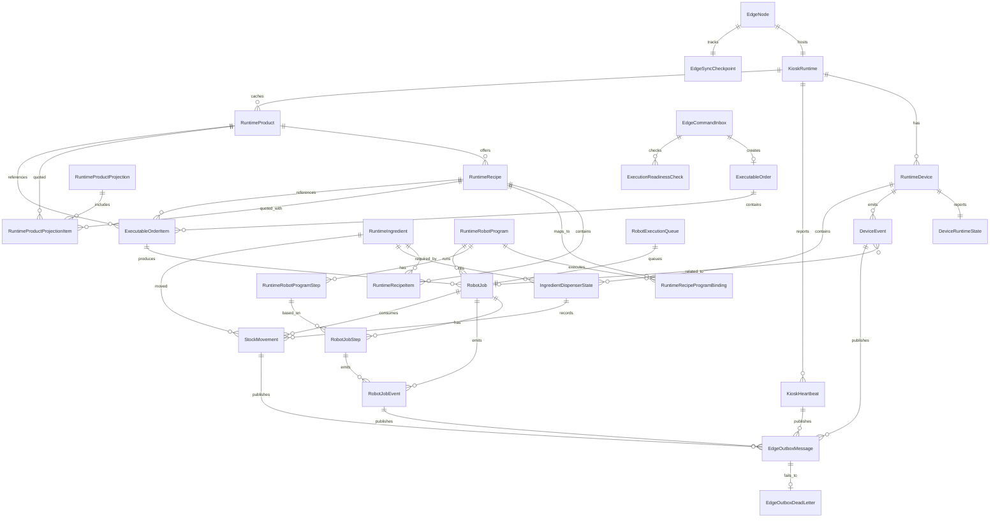

# Local Edge Runtime ERD

This document defines the proposed Local Edge PostgreSQL relationship model for the kiosk robot runtime.

Scope:

- Relationship/table design only.
- No table attributes yet.
- Local DB is not a 1:1 copy of Cloud DB.
- Local DB stores runtime snapshots, executable commands, robot execution state, inventory runtime state, and sync evidence.
- Cloud remains the source of truth for payment, central order lifecycle, tenant management, reporting, and admin identity.

## Design Principles

- Keep the local schema runtime-focused.
- Store cloud ids and immutable snapshots where the robot runtime needs historical truth.
- Do not mirror Cloud administration, payment provider, refund, account, role, organization, or reporting tables.
- Treat MQTT as notification only. Do not persist MQTT as the source of executable work.
- Edge command pull and local command inbox are the source of executable work.
- Local execution must be idempotent by cloud command/order ids.
- Local events must be syncable and replay-safe.

## Required Local Tables

### Node And Kiosk Runtime

- `EdgeNode`
- `KioskRuntime`
- `EdgeSyncCheckpoint`

Purpose:

- Identify the local edge node and kiosk runtime.
- Track command pull and event sync checkpoint.

### Runtime Configuration Snapshots

- `RuntimeProduct`
- `RuntimeRecipe`
- `RuntimeRecipeItem`
- `RuntimeIngredient`
- `RuntimeRobotProgram`
- `RuntimeRobotProgramStep`
- `RuntimeRecipeProgramBinding`

Purpose:

- Store the subset of product, recipe, ingredient, and robot program configuration required by the local kiosk.
- These are local runtime snapshots, not full Cloud catalog/config tables.

### Runtime Devices And Inventory

- `RuntimeDevice`
- `DeviceRuntimeState`
- `IngredientDispenserState`
- `StockMovement`

Purpose:

- Track installed runtime devices.
- Track current dispenser level state.
- Record stock movements generated by refill, adjustment, and robot execution.

### Tablet Runtime Projection

- `RuntimeProductProjection`
- `RuntimeProductProjectionItem`

Purpose:

- Cache short-lived runtime availability responses returned to the tablet.
- Support checkout freshness checks and debug/audit of what the tablet saw.
- This is not inventory reservation.

If the first implementation builds projections fully in memory, these two tables can be delayed.

### Cloud Commands And Executable Orders

- `EdgeCommandInbox`
- `ExecutableOrder`
- `ExecutableOrderItem`
- `ExecutionReadinessCheck`

Purpose:

- Store commands pulled from Cloud.
- Persist minimal executable order snapshot needed by Edge.
- Store fast runtime check result before creating robot jobs.

### Robot Execution

- `RobotExecutionQueue`
- `RobotJob`
- `RobotJobStep`
- `RobotJobEvent`

Purpose:

- Queue robot work locally.
- Execute jobs using the local robot SDK integration.
- Record append-only execution evidence.

### Device And Telemetry Events

- `DeviceEvent`
- `KioskHeartbeat`

Purpose:

- Capture runtime device evidence and heartbeat telemetry.

### Edge Outbox

- `EdgeOutboxMessage`
- `EdgeOutboxDeadLetter`

Purpose:

- Sync local runtime events/results back to Cloud.
- Retry failed uploads.
- Dead-letter messages that cannot be uploaded or accepted after retry.

## Relationship ERD

## Table Groups

### Runtime Snapshot Group

These tables are copied from Cloud as scoped, versioned runtime snapshots:

- `RuntimeProduct`
- `RuntimeRecipe`
- `RuntimeRecipeItem`
- `RuntimeIngredient`
- `RuntimeRobotProgram`
- `RuntimeRobotProgramStep`
- `RuntimeRecipeProgramBinding`

They should not attempt to model all Cloud catalog/config fields. Keep only what the local runtime needs to:

- Build product availability.
- Validate recipe feasibility.
- Execute robot programs.
- Produce stable historical snapshots for jobs.

### Command And Order Group

These tables bridge Cloud payment/order truth into Edge execution truth:

- `EdgeCommandInbox`
- `ExecutableOrder`
- `ExecutableOrderItem`
- `ExecutionReadinessCheck`

`ExecutableOrder` is not a full Cloud `Order` copy. It is the local executable snapshot after payment is verified.

Payment provider data should not be local. Keep only ids needed for correlation and idempotency.

### Execution Group

These tables are Edge-owned runtime truth:

- `RobotExecutionQueue`
- `RobotJob`
- `RobotJobStep`
- `RobotJobEvent`

Cloud may receive synced events and final states, but Edge owns the live execution state.

### Inventory Group

These tables are Edge-owned runtime truth:

- `IngredientDispenserState`
- `StockMovement`

`IngredientDispenserState` can stay at hardware level: `Low`, `Medium`, `Full`.

`StockMovement` records estimated or measured quantity movements for reporting and later Cloud sync.

### Sync Group

These tables are local infrastructure for reliable edge-cloud communication:

- `EdgeSyncCheckpoint`
- `EdgeOutboxMessage`
- `EdgeOutboxDeadLetter`

Cloud-side equivalents are `SyncEventInbox` and `SyncDeadLetter`; local DB only needs the outbound side plus command pull checkpoint.

## Tables Not In Local Runtime DB

Do not copy these Cloud tables into local runtime DB unless a concrete local runtime use case appears:

- `Organization`
- `Store`
- full `Kiosk` management table
- `Account`
- `Role`
- `AccountRole`
- `PaymentMethod`
- `PaymentTransaction`
- `PaymentCallback`
- `Refund`
- full `OrderStatusHistory`
- admin operation/audit tables
- global catalog templates
- reporting/analytics tables

Local DB may store cloud ids from these tables as scalar fields later, but should not model their full relationships.

## Optional Later Tables

Add only if the local runtime needs them:

- `LocalTabletSession`: if the edge must persist tablet sessions beyond memory/local storage.
- `LocalPaymentObservation`: if tablet-edge UX needs local evidence of payment status, not provider truth.
- `RuntimeAvailabilityPolicy`: if availability rules become configurable locally.
- `RobotSdkCommandLog`: if Fairino SDK calls need detailed local debug/audit separate from `RobotJobEvent`.
- `MqttNotificationInbox`: only if MQTT notifications need local diagnostics. It should not drive execution directly.

## Relationship Notes

- `RuntimeRecipeProgramBinding` avoids assuming a recipe maps directly to exactly one robot program forever.
- `RuntimeRobotProgramStep` stores workflow actions and local Fairino point/frame references. It does not require a separate teaching point table in v1.
- `ExecutableOrderItem` creates one or more `RobotJob` rows because quantity or serving workflow may require multiple robot executions.
- `RobotExecutionQueue` is separate from `RobotJob` so queue policy can evolve without rewriting job history.
- `EdgeOutboxMessage` can publish different local event sources. The relationship is logical; implementation can use typed source fields or a payload envelope.
- `RuntimeProductProjection` is short-lived and does not reserve inventory.

## Related Docs

- [IoT Contract](IOT_CONTRACT.md)
- [Boundary Contexts](BOUNDARY_CONTEXTS.md)
- [Idempotency and Retry Rules](IDEMPOTENCY_RETRY_RULES.md)
- [JSON Field Rules](JSON_FIELD_RULES.md)
