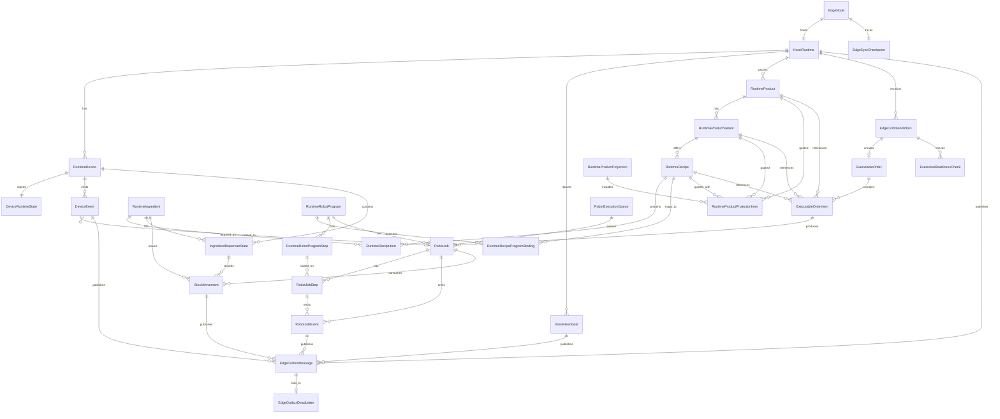

# Local Edge Runtime ERD

This document defines the proposed Local Edge PostgreSQL relationship model for the kiosk robot runtime.

Scope:

- Relationship/table design with the minimum attributes needed for implementation.
- Local DB is not a 1:1 copy of Cloud DB.
- Local DB stores runtime snapshots, executable commands, robot execution state, inventory runtime state, and sync evidence.
- Cloud remains the source of truth for payment, central order lifecycle, tenant management, reporting, and admin identity.

## Search Keywords

`local edge DB`, `edge runtime ERD`, `local PostgreSQL`, `runtime snapshot`, `executable order`, `edge command inbox`, `robot execution queue`, `RobotJob`, `RobotJobStep`, `RobotJobEvent`, `RuntimeProductProjection`, `RuntimeRecipeProgramBinding`, `RuntimeRobotProgramStep`, `KioskRuntime`, `IngredientDispenserState`, `StockMovement`, `EdgeOutboxMessage`, `heartbeat`, `sync checkpoint`, `Fairino`

## Table Lookup

| Area | Main tables |
| --- | --- |
| Node and kiosk runtime | `EdgeNode`, `KioskRuntime`, `EdgeSyncCheckpoint` |
| Runtime catalog/config snapshots | `RuntimeProduct`, `RuntimeProductVariant`, `RuntimeIngredient`, `RuntimeRecipe`, `RuntimeRecipeItem`, `RuntimeRobotProgram`, `RuntimeRobotProgramStep`, `RuntimeRecipeProgramBinding` |
| Devices and inventory | `RuntimeDevice`, `DeviceRuntimeState`, `IngredientDispenserState`, `StockMovement` |
| Tablet runtime projection | `RuntimeProductProjection`, `RuntimeProductProjectionItem` |
| Cloud commands and orders | `EdgeCommandInbox`, `ExecutableOrder`, `ExecutableOrderItem`, `ExecutionReadinessCheck` |
| Robot execution | `RobotExecutionQueue`, `RobotJob`, `RobotJobStep`, `RobotJobEvent` |
| Telemetry and sync outbox | `DeviceEvent`, `KioskHeartbeat`, `EdgeOutboxMessage`, `EdgeOutboxDeadLetter` |

## Design Principles

- Keep the local schema runtime-focused.
- Store cloud ids and immutable snapshots where the robot runtime needs historical truth.
- Do not mirror Cloud administration, payment provider, refund, account, role, organization, or reporting tables.
- Treat MQTT as notification only. Do not persist MQTT as the source of executable work.
- Edge command pull and local command inbox are the source of executable work.
- Local execution must be idempotent by cloud command/order ids.
- Local events must be syncable and replay-safe.

## Attribute Conventions

- Local primary keys use `Id`.
- Cloud-owned ids are stored as scalar reference fields named `Cloud...Id`.
- Local edge-generated business/runtime ids use explicit names such as `CommandId`, `EventId`, `RobotJobId`, and `BatchId`.
- All timestamps use UTC.
- JSON fields are snapshots or payload evidence. They must not hide idempotency keys, status, retry state, or timestamps.
- Append-only event/outbox tables should not use soft delete.
- Status fields should become enums in code once implementation starts.

## Table Attributes

### `EdgeNode`

Identifies the local edge process/node.

| Field | Role |
| --- | --- |
| `Id` | PK |
| `NodeId` | stable local node id, unique |
| `CloudKioskId` | cloud kiosk reference |
| `NodeName` | display/debug name |
| `AppVersion` | local edge app version |
| `RobotSdkVersion` | Fairino SDK/runtime version |
| `Status` | local node status |
| `LastSeenAt` | last local heartbeat/update |
| `CreatedAt` / `UpdatedAt` | audit timestamps |

Indexes:

- unique `NodeId`
- index `CloudKioskId`

### `KioskRuntime`

Stores the latest local runtime state for this kiosk.

| Field | Role |
| --- | --- |
| `Id` | PK |
| `EdgeNodeId` | FK to `EdgeNode` |
| `CloudKioskId` | cloud kiosk reference |
| `KioskCode` | local/cloud kiosk code |
| `ConfigurationVersion` | latest applied config version |
| `ConfigurationChecksum` | latest applied config checksum |
| `MachineStatus` | available/degraded/offline/error |
| `RuntimeStateTimestamp` | latest state calculation time |
| `LastCommandPulledAt` | latest command pull time |
| `LastEventSyncedAt` | latest event sync success time |
| `CreatedAt` / `UpdatedAt` | audit timestamps |

Indexes:

- unique `EdgeNodeId`
- unique `CloudKioskId`

### `EdgeSyncCheckpoint`

Tracks pull/sync progress for offline retry.

| Field | Role |
| --- | --- |
| `Id` | PK |
| `EdgeNodeId` | FK to `EdgeNode` |
| `LastCommandSequence` | latest cloud command sequence seen |
| `LastCommandPulledAt` | latest successful command pull |
| `LastEventSequence` | latest local event sequence generated |
| `LastEventSyncedAt` | latest successful outbox sync |
| `ClockSkewMs` | optional cloud-edge clock skew estimate |
| `UpdatedAt` | checkpoint update time |

Indexes:

- unique `EdgeNodeId`

### `RuntimeProduct`

Local product snapshot used for tablet projection grouping and execution references.

| Field | Role |
| --- | --- |
| `Id` | PK |
| `KioskRuntimeId` | FK to `KioskRuntime` |
| `CloudProductId` | cloud product reference |
| `ProductCode` | stable product code |
| `DisplayName` | tablet display name |
| `IsActive` | whether product is currently sellable by config |
| `ProductSnapshotSchemaVersion` | snapshot schema |
| `ProductSnapshotJson` | immutable/latest local product snapshot |
| `ConfigurationVersion` | config package version |
| `SyncedAt` | last config sync time |

Indexes:

- unique `KioskRuntimeId`, `ProductCode`, `ConfigurationVersion`
- index `CloudProductId`

### `RuntimeProductVariant`

Local product variant snapshot for size, portion, flavor, package, or other sellable variant dimensions.

| Field | Role |
| --- | --- |
| `Id` | PK |
| `KioskRuntimeId` | FK to `KioskRuntime` |
| `RuntimeProductId` | FK to `RuntimeProduct` |
| `CloudProductVariantId` | cloud product variant reference |
| `VariantCode` | stable variant code |
| `DisplayName` | tablet display name |
| `VariantType` | size/portion/flavor/package/etc. |
| `SizeCode` | optional S/M/L-style size code |
| `BasePrice` / `Currency` | local reference price |
| `IsActive` | whether variant is active in config |
| `ProductVariantSnapshotSchemaVersion` | snapshot schema |
| `ProductVariantSnapshotJson` | local product variant snapshot |
| `ConfigurationVersion` | config package version |
| `SyncedAt` | last config sync time |

Indexes:

- unique `RuntimeProductId`, `VariantCode`, `ConfigurationVersion`
- index `CloudProductVariantId`

### `RuntimeIngredient`

Local ingredient definition snapshot used by recipe and inventory state.

| Field | Role |
| --- | --- |
| `Id` | PK |
| `KioskRuntimeId` | FK to `KioskRuntime` |
| `CloudIngredientId` | cloud ingredient reference |
| `IngredientCode` | stable ingredient code |
| `DisplayName` | local display/debug name |
| `UnitCode` | reporting unit |
| `IsActive` | whether ingredient is active in config |
| `IngredientSnapshotJson` | local ingredient snapshot |
| `ConfigurationVersion` | config package version |
| `SyncedAt` | last config sync time |

Indexes:

- unique `KioskRuntimeId`, `IngredientCode`, `ConfigurationVersion`
- index `CloudIngredientId`

### `RuntimeRecipe`

Local recipe snapshot for a product variant.

| Field | Role |
| --- | --- |
| `Id` | PK |
| `KioskRuntimeId` | FK to `KioskRuntime` |
| `RuntimeProductVariantId` | FK to `RuntimeProductVariant` |
| `CloudRecipeId` | cloud recipe reference |
| `RecipeCode` | stable recipe code |
| `RecipeVersion` | business recipe version |
| `IsActive` | whether recipe can be used |
| `RecipeSnapshotSchemaVersion` | snapshot schema |
| `RecipeSnapshotJson` | execution/reporting snapshot |
| `ConfigurationVersion` | config package version |
| `SyncedAt` | last config sync time |

Indexes:

- unique `KioskRuntimeId`, `RecipeCode`, `RecipeVersion`
- index `CloudRecipeId`

### `RuntimeRecipeItem`

Ingredient requirements for one local recipe.

| Field | Role |
| --- | --- |
| `Id` | PK |
| `RuntimeRecipeId` | FK to `RuntimeRecipe` |
| `RuntimeIngredientId` | FK to `RuntimeIngredient` |
| `StepOrder` | ingredient/recipe order |
| `Quantity` | expected quantity |
| `UnitCode` | quantity unit |
| `IsRequired` | whether this ingredient gates availability |
| `RecipeItemSnapshotJson` | optional recipe item snapshot |

Indexes:

- unique `RuntimeRecipeId`, `RuntimeIngredientId`, `StepOrder`

### `RuntimeRobotProgram`

Local robot program snapshot deployed to this kiosk/device.

| Field | Role |
| --- | --- |
| `Id` | PK |
| `KioskRuntimeId` | FK to `KioskRuntime` |
| `RuntimeDeviceId` | FK to robot `RuntimeDevice` |
| `CloudRobotProgramId` | cloud robot program reference |
| `ProgramCode` | stable program code |
| `ProgramVersion` | business program version |
| `ExecutionMode` | SDK command sequence or vendor program file |
| `Vendor` | `Fairino` |
| `VendorProgramId` / `VendorProgramVersion` | Fairino reference if available |
| `PointStatus` | point/frame sync status |
| `ProgramPayloadSchemaVersion` | program payload schema |
| `ProgramPayloadJson` | source-of-truth local program payload |
| `PointSnapshotSchemaVersion` | point snapshot schema |
| `PointSnapshotJson` | local Fairino point/frame backup snapshot |
| `SafetyZoneSchemaVersion` | safety zone schema |
| `SafetyZoneJson` | safety zone/config payload |
| `ConfigurationVersion` | config package version |
| `IsActive` | active locally |
| `SyncedAt` | last config sync time |

Indexes:

- unique `KioskRuntimeId`, `RuntimeDeviceId`, `ProgramCode`, `ProgramVersion`
- index `CloudRobotProgramId`

### `RuntimeRobotProgramStep`

Workflow action/instruction. Motion steps reference local Fairino point/frame names directly; there is no separate teaching point table in v1.

| Field | Role |
| --- | --- |
| `Id` | PK |
| `RuntimeRobotProgramId` | FK to `RuntimeRobotProgram` |
| `CloudRobotProgramStepId` | cloud step reference |
| `StepNumber` | workflow order |
| `StepCode` | stable step code |
| `Name` | display/debug name |
| `StepCommandType` | `MoveL`, `MoveJ`, `Wait`, `SetDO`, `CallProgram`, etc. |
| `TargetPointCode` | local symbolic point code |
| `VendorPointName` | Fairino controller point name/id |
| `CoordinateSystem` | cartesian/joint/tool/workpiece marker if needed |
| `ToolFrameCode` | local Fairino tool frame |
| `WorkpieceFrameCode` | local Fairino workpiece frame |
| `MotionProfileCode` | speed/accel profile reference |
| `SpeedScale` | optional local speed multiplier |
| `SafetyClearanceMm` | optional safety clearance |
| `ExpectedDurationMs` | expected step duration |
| `ParametersSchemaVersion` | parameters schema |
| `ParametersJson` | command parameters |
| `PointSnapshotSchemaVersion` | point snapshot schema |
| `PointSnapshotJson` | optional Fairino point/frame backup for this step |
| `RetryPolicySchemaVersion` | retry policy schema |
| `RetryPolicyJson` | step retry policy |
| `IsRequired` | required workflow step |
| `NextOnSuccessStepNumber` / `NextOnFailureStepNumber` | optional branch |

Indexes:

- unique `RuntimeRobotProgramId`, `StepNumber`
- unique `RuntimeRobotProgramId`, `StepCode`
- index `CloudRobotProgramStepId`

### `RuntimeRecipeProgramBinding`

Maps recipes to robot programs without assuming a permanent 1:1 relationship. This is the Edge runtime form of Cloud `KioskRecipeExecutionProfile`.

| Field | Role |
| --- | --- |
| `Id` | PK |
| `RuntimeRecipeId` | FK to `RuntimeRecipe` |
| `RuntimeRobotProgramId` | FK to `RuntimeRobotProgram` |
| `CloudKioskRecipeExecutionProfileId` | cloud execution profile reference |
| `BindingCode` | stable binding code |
| `Priority` | selection priority |
| `IsDefault` | default program for recipe |
| `IsActive` | active locally |

Indexes:

- unique `RuntimeRecipeId`, `RuntimeRobotProgramId`
- index `CloudKioskRecipeExecutionProfileId`

### `RuntimeDevice`

Installed local device snapshot.

| Field | Role |
| --- | --- |
| `Id` | PK |
| `KioskRuntimeId` | FK to `KioskRuntime` |
| `CloudDeviceId` | cloud device reference |
| `DeviceCode` | local device code |
| `DeviceTypeCode` | robot/dispenser/sensor/etc. |
| `DeviceModelCode` | model code |
| `Vendor` | vendor name |
| `SerialNumber` | hardware serial if available |
| `ConnectionEndpoint` | local endpoint/ip/port if needed |
| `CapabilitiesJson` | runtime capability snapshot |
| `IsActive` | active locally |
| `SyncedAt` | last config sync time |

Indexes:

- unique `KioskRuntimeId`, `DeviceCode`
- index `CloudDeviceId`
- index `SerialNumber`

### `DeviceRuntimeState`

Latest runtime state for a device.

| Field | Role |
| --- | --- |
| `Id` | PK |
| `RuntimeDeviceId` | FK to `RuntimeDevice` |
| `Status` | online/offline/error/maintenance |
| `IsAvailable` | availability gate for execution |
| `LastSeenAt` | latest heartbeat/status time |
| `LastErrorCode` / `LastErrorMessage` | latest error |
| `RuntimeStateJson` | latest vendor/runtime state payload |
| `UpdatedAt` | latest state update |

Indexes:

- unique `RuntimeDeviceId`
- index `Status`, `UpdatedAt`

### `IngredientDispenserState`

Latest local dispenser state for one ingredient/container.

| Field | Role |
| --- | --- |
| `Id` | PK |
| `KioskRuntimeId` | FK to `KioskRuntime` |
| `RuntimeDeviceId` | FK to dispenser device |
| `RuntimeIngredientId` | FK to `RuntimeIngredient` |
| `ContainerCode` | local container identifier |
| `LevelStatus` | `Unknown`, `Low`, `Medium`, `Full` |
| `EstimatedQuantity` | local estimate for reporting |
| `UnitCode` | estimate unit |
| `LevelToQuantityProfileJson` | local conversion profile |
| `SensorPayloadJson` | latest sensor/debug payload |
| `MeasuredAt` | latest measurement time |
| `UpdatedAt` | latest state update |

Indexes:

- unique `RuntimeDeviceId`, `ContainerCode`
- index `RuntimeIngredientId`

### `StockMovement`

Append-only inventory movement generated locally.

| Field | Role |
| --- | --- |
| `Id` | PK |
| `EventId` | local/cloud event id, unique |
| `KioskRuntimeId` | FK to `KioskRuntime` |
| `IngredientDispenserStateId` | FK to `IngredientDispenserState` |
| `RuntimeIngredientId` | FK to `RuntimeIngredient` |
| `RobotJobId` | optional FK to `RobotJob` |
| `RobotJobStepId` | optional FK to `RobotJobStep` |
| `MovementType` | consume/refill/adjust/waste |
| `Quantity` | signed or positive quantity based on implementation rule |
| `UnitCode` | movement unit |
| `SourceType` | robot job/manual refill/adjustment/sensor |
| `SourceEventId` | upstream event that caused this movement |
| `OccurredAt` | business occurrence time |
| `SyncedAt` | cloud sync success time |

Indexes:

- unique `EventId`
- unique `SourceEventId` where not null
- index `KioskRuntimeId`, `OccurredAt`
- index `RobotJobId`

### `RuntimeProductProjection`

Short-lived availability projection served to the tablet.

| Field | Role |
| --- | --- |
| `Id` | PK |
| `SnapshotId` | external snapshot id returned to tablet |
| `KioskRuntimeId` | FK to `KioskRuntime` |
| `GeneratedAt` | projection generation time |
| `ExpiresAt` | tablet freshness expiry |
| `RuntimeStateTimestamp` | state timestamp used to build projection |
| `MachineAvailable` | machine availability at generation |
| `ProjectionPayloadJson` | full response/debug snapshot |

Indexes:

- unique `SnapshotId`
- index `KioskRuntimeId`, `GeneratedAt`

### `RuntimeProductProjectionItem`

One product row in a short-lived projection.

| Field | Role |
| --- | --- |
| `Id` | PK |
| `RuntimeProductProjectionId` | FK to `RuntimeProductProjection` |
| `RuntimeProductId` | FK to `RuntimeProduct` |
| `RuntimeProductVariantId` | FK to `RuntimeProductVariant` |
| `RuntimeRecipeId` | FK to `RuntimeRecipe` |
| `Available` | availability result |
| `UnavailableReason` | reason if unavailable |
| `Price` / `Currency` | displayed quote |
| `EstimatedLevelsJson` | ingredient level snapshot for this product |

Indexes:

- unique `RuntimeProductProjectionId`, `RuntimeProductVariantId`, `RuntimeRecipeId`

### `EdgeCommandInbox`

Durable local record of commands pulled from Cloud.

| Field | Role |
| --- | --- |
| `Id` | PK |
| `KioskRuntimeId` | FK to `KioskRuntime` |
| `CommandId` | cloud command id, unique |
| `CommandSequence` | cloud command sequence |
| `CommandType` | command type |
| `CloudOrderId` | cloud order reference |
| `CloudPaymentTransactionId` | cloud payment reference |
| `IdempotencyKey` | command idempotency key |
| `CorrelationId` / `CausationId` | trace ids |
| `IssuedAt` / `ExpiresAt` | cloud command window |
| `ReceivedAt` | local receive time |
| `Status` | received/accepted/rejected/processed/failed |
| `PayloadSchemaVersion` | payload schema |
| `PayloadJson` | command payload |
| `ProcessedAt` | local processing time |
| `LastErrorCode` / `LastErrorMessage` | latest error |

Indexes:

- unique `CommandId`
- unique `IdempotencyKey`
- index `KioskRuntimeId`, `Status`
- index `CommandSequence`
- index `CloudOrderId`

### `ExecutableOrder`

Minimal local executable snapshot after payment is verified by Cloud.

| Field | Role |
| --- | --- |
| `Id` | PK |
| `EdgeCommandInboxId` | FK to `EdgeCommandInbox` |
| `CloudOrderId` | cloud order reference |
| `OrderNumber` | order display/reference |
| `CloudPaymentTransactionId` | cloud payment reference |
| `Status` | pending/accepted/rejected/executing/completed/failed |
| `IdempotencyKey` | order execution idempotency key |
| `OrderSnapshotSchemaVersion` | snapshot schema |
| `OrderSnapshotJson` | executable order snapshot |
| `CreatedAt` / `AcceptedAt` / `RejectedAt` / `CompletedAt` | lifecycle timestamps |
| `RejectionReason` / `FailureReason` | final failure reason |

Indexes:

- unique `CloudOrderId`
- unique `IdempotencyKey`
- unique `EdgeCommandInboxId`

### `ExecutableOrderItem`

Local executable order line.

| Field | Role |
| --- | --- |
| `Id` | PK |
| `ExecutableOrderId` | FK to `ExecutableOrder` |
| `CloudOrderItemId` | cloud order item reference |
| `ClientLineId` | tablet/client line id if available |
| `RuntimeProductId` | FK to `RuntimeProduct` |
| `RuntimeProductVariantId` | FK to `RuntimeProductVariant` |
| `RuntimeRecipeId` | FK to `RuntimeRecipe` |
| `ProductCode` | immutable copied code |
| `ProductVariantCode` | immutable copied variant code |
| `RecipeVersion` | copied recipe version |
| `Quantity` | ordered quantity |
| `UnitPrice` / `Currency` | copied price |
| `ItemSnapshotJson` | immutable line snapshot |

Indexes:

- unique `ExecutableOrderId`, `CloudOrderItemId`
- index `RuntimeProductId`
- index `RuntimeProductVariantId`
- index `RuntimeRecipeId`

### `ExecutionReadinessCheck`

Fast runtime check before accepting an executable command.

| Field | Role |
| --- | --- |
| `Id` | PK |
| `EdgeCommandInboxId` | FK to `EdgeCommandInbox` |
| `ExecutableOrderId` | optional FK to `ExecutableOrder` |
| `CheckedAt` | check time |
| `CheckDurationMs` | elapsed check duration |
| `IsReady` | final readiness result |
| `RobotAvailable` | robot gate |
| `DeviceHealthy` | device gate |
| `InventorySufficient` | inventory gate |
| `QueueCapacityAvailable` | queue gate |
| `RuntimeStateTimestamp` | runtime state used |
| `RejectionReason` | reason if not ready |
| `ReadinessSnapshotJson` | full debug snapshot |

Indexes:

- index `EdgeCommandInboxId`, `CheckedAt`
- index `ExecutableOrderId`

### `RobotExecutionQueue`

Queue entry for local robot execution.

| Field | Role |
| --- | --- |
| `Id` | PK |
| `RobotJobId` | FK to `RobotJob`, unique |
| `QueueNumber` | local queue order |
| `Priority` | execution priority |
| `Status` | queued/locked/running/completed/cancelled |
| `LockedBy` / `LockedUntil` | worker lock |
| `QueuedAt` / `StartedAt` / `CompletedAt` | queue lifecycle timestamps |

Indexes:

- unique `RobotJobId`
- unique `QueueNumber`
- index `Status`, `Priority`, `QueuedAt`

### `RobotJob`

Local robot execution aggregate.

| Field | Role |
| --- | --- |
| `Id` | PK |
| `ExecutableOrderItemId` | FK to `ExecutableOrderItem` |
| `RuntimeRobotProgramId` | FK to `RuntimeRobotProgram` |
| `RuntimeDeviceId` | FK to robot device |
| `CloudOrderId` | cloud order reference |
| `CloudOrderItemId` | cloud order item reference |
| `CommandId` | source command id |
| `JobNumber` | local job number |
| `IdempotencyKey` | unique execution key |
| `CorrelationId` / `CausationId` | trace ids |
| `Status` | queued/running/paused/completed/failed/cancelled |
| `ProductCode` | copied product code |
| `ProductVariantCode` | copied product variant code |
| `RecipeVersion` | copied recipe version |
| `RecipeSnapshotSchemaVersion` | recipe snapshot schema |
| `RecipeSnapshotJson` | immutable job recipe snapshot |
| `RequestedAt` / `StartedAt` / `CompletedAt` / `FailedAt` | lifecycle timestamps |
| `RetryCount` / `MaxRetries` / `NextRetryAt` | retry state |
| `LastErrorCode` / `LastErrorMessage` | latest error |

Indexes:

- unique `JobNumber`
- unique `IdempotencyKey`
- index `CloudOrderId`
- index `CommandId`
- index `Status`, `RequestedAt`

### `RobotJobStep`

Runtime copy of a robot program step.

| Field | Role |
| --- | --- |
| `Id` | PK |
| `RobotJobId` | FK to `RobotJob` |
| `RuntimeRobotProgramStepId` | FK to `RuntimeRobotProgramStep` |
| `StepNumber` | execution order |
| `StepCode` | copied step code |
| `StepCommandType` | copied command type |
| `TargetPointCode` | copied local point code |
| `VendorPointName` | copied Fairino point name |
| `CoordinateSystem` | copied coordinate marker |
| `ToolFrameCode` | copied tool frame |
| `WorkpieceFrameCode` | copied workpiece frame |
| `MotionProfileCode` | copied motion profile |
| `ParametersSchemaVersion` | parameter schema |
| `ParametersJson` | immutable runtime parameters |
| `Status` | pending/running/completed/failed/skipped/cancelled |
| `StartedAt` / `CompletedAt` / `FailedAt` | lifecycle timestamps |
| `DurationMs` | measured duration |
| `RetryCount` / `MaxRetries` / `NextRetryAt` | retry state |
| `LastErrorCode` / `LastErrorMessage` | latest error |

Indexes:

- unique `RobotJobId`, `StepNumber`
- index `RuntimeRobotProgramStepId`

### `RobotJobEvent`

Append-only robot execution event.

| Field | Role |
| --- | --- |
| `Id` | PK |
| `EventId` | unique event id |
| `EventSequence` | local event sequence |
| `RobotJobId` | FK to `RobotJob` |
| `RobotJobStepId` | optional FK to `RobotJobStep` |
| `RuntimeDeviceId` | optional FK to robot device |
| `EventType` | event type |
| `OccurredAt` | event time |
| `CorrelationId` / `CausationId` | trace ids |
| `PayloadSchemaVersion` | payload schema |
| `PayloadJson` | event payload/evidence |
| `SyncedAt` | cloud sync success time |

Indexes:

- unique `EventId`
- unique `EventSequence`
- index `RobotJobId`, `OccurredAt`

### `DeviceEvent`

Append-only device event.

| Field | Role |
| --- | --- |
| `Id` | PK |
| `EventId` | unique event id |
| `EventSequence` | local event sequence |
| `RuntimeDeviceId` | FK to `RuntimeDevice` |
| `RobotJobId` | optional FK to `RobotJob` |
| `EventType` | event type |
| `Severity` | info/warning/error/critical |
| `OccurredAt` | event time |
| `PayloadSchemaVersion` | payload schema |
| `PayloadJson` | vendor/runtime evidence |
| `SyncedAt` | cloud sync success time |

Indexes:

- unique `EventId`
- index `RuntimeDeviceId`, `OccurredAt`
- index `RobotJobId`

### `KioskHeartbeat`

Append-only heartbeat telemetry.

| Field | Role |
| --- | --- |
| `Id` | PK |
| `MessageId` | unique heartbeat message id |
| `KioskRuntimeId` | FK to `KioskRuntime` |
| `OriginNodeId` | node id from edge |
| `HeartbeatSequence` | local heartbeat sequence |
| `ReportedAt` | heartbeat report time |
| `Status` | online/degraded/offline |
| `AppVersion` | edge app version |
| `RobotSdkVersion` | Fairino SDK version |
| `NetworkStatus` | local/cloud network status |
| `RuntimeStateTimestamp` | latest runtime state timestamp |
| `PayloadJson` | extra telemetry |
| `SyncedAt` | cloud sync success time |

Indexes:

- unique `KioskRuntimeId`, `OriginNodeId`, `HeartbeatSequence`
- unique `MessageId`
- index `KioskRuntimeId`, `ReportedAt`

### `EdgeOutboxMessage`

Reliable outbound sync message to Cloud.

| Field | Role |
| --- | --- |
| `Id` | PK |
| `KioskRuntimeId` | FK to `KioskRuntime` |
| `MessageId` | unique outbound message id |
| `BatchId` | optional sync batch id |
| `SourceTable` | source table name |
| `SourceId` | source row id |
| `EventId` | source business event id if available |
| `MessageType` | cloud event/message type |
| `PayloadSchemaVersion` | payload schema |
| `PayloadJson` | outbound payload |
| `Status` | pending/sending/sent/failed/dead-lettered |
| `AttemptCount` / `MaxAttempts` | retry state |
| `LastAttemptAt` / `NextRetryAt` | retry timestamps |
| `LastErrorCode` / `LastErrorMessage` | latest failure |
| `CreatedAt` / `SentAt` | lifecycle timestamps |

Indexes:

- unique `MessageId`
- unique `SourceTable`, `SourceId`, `MessageType`
- index `KioskRuntimeId`, `Status`
- index `Status`, `NextRetryAt`
- index `BatchId`

### `EdgeOutboxDeadLetter`

Failed outbound message requiring manual or automated resolution.

| Field | Role |
| --- | --- |
| `Id` | PK |
| `EdgeOutboxMessageId` | FK to `EdgeOutboxMessage` |
| `FailedAt` | failure time |
| `FailureCode` / `FailureMessage` | failure reason |
| `PayloadJson` | failed payload snapshot |
| `Status` | open/resolved/ignored |
| `ResolvedAt` | resolution time |
| `ResolutionNote` | resolution note |

Indexes:

- unique `EdgeOutboxMessageId`
- index `Status`, `FailedAt`

## Required Local Tables

### Node And Kiosk Runtime

- `EdgeNode`
- `KioskRuntime`
- `EdgeSyncCheckpoint`

Purpose:

- Identify the local edge node and kiosk runtime.
- Track command pull and event sync checkpoint.

### Runtime Configuration Snapshots

- `RuntimeProduct`
- `RuntimeProductVariant`
- `RuntimeRecipe`
- `RuntimeRecipeItem`
- `RuntimeIngredient`
- `RuntimeRobotProgram`
- `RuntimeRobotProgramStep`
- `RuntimeRecipeProgramBinding`

Purpose:

- Store the subset of product, product variant, recipe, ingredient, and robot program configuration required by the local kiosk.
- These are local runtime snapshots, not full Cloud catalog/config tables.

### Runtime Devices And Inventory

- `RuntimeDevice`
- `DeviceRuntimeState`
- `IngredientDispenserState`
- `StockMovement`

Purpose:

- Track installed runtime devices.
- Track current dispenser level state.
- Record stock movements generated by refill, adjustment, and robot execution.

### Tablet Runtime Projection

- `RuntimeProductProjection`
- `RuntimeProductProjectionItem`

Purpose:

- Cache short-lived runtime availability responses returned to the tablet.
- Support checkout freshness checks and debug/audit of what the tablet saw.
- This is not inventory reservation.

If the first implementation builds projections fully in memory, these two tables can be delayed.

### Cloud Commands And Executable Orders

- `EdgeCommandInbox`
- `ExecutableOrder`
- `ExecutableOrderItem`
- `ExecutionReadinessCheck`

Purpose:

- Store commands pulled from Cloud.
- Persist minimal executable order snapshot needed by Edge.
- Store fast runtime check result before creating robot jobs.

### Robot Execution

- `RobotExecutionQueue`
- `RobotJob`
- `RobotJobStep`
- `RobotJobEvent`

Purpose:

- Queue robot work locally.
- Execute jobs using the local robot SDK integration.
- Record append-only execution evidence.

### Device And Telemetry Events

- `DeviceEvent`
- `KioskHeartbeat`

Purpose:

- Capture runtime device evidence and heartbeat telemetry.

### Edge Outbox

- `EdgeOutboxMessage`
- `EdgeOutboxDeadLetter`

Purpose:

- Sync local runtime events/results back to Cloud.
- Retry failed uploads.
- Dead-letter messages that cannot be uploaded or accepted after retry.

## Relationship ERD

The relationship diagram intentionally stays focused on table ownership/cardinality. Required attributes are listed in the table sections above.

## Table Groups

### Runtime Snapshot Group

These tables are copied from Cloud as scoped, versioned runtime snapshots:

- `RuntimeProduct`
- `RuntimeProductVariant`
- `RuntimeRecipe`
- `RuntimeRecipeItem`
- `RuntimeIngredient`
- `RuntimeRobotProgram`
- `RuntimeRobotProgramStep`
- `RuntimeRecipeProgramBinding`

They should not attempt to model all Cloud catalog/config fields. Keep only what the local runtime needs to:

- Build product availability.
- Validate recipe feasibility.
- Execute robot programs.
- Produce stable historical snapshots for jobs.

### Command And Order Group

These tables bridge Cloud payment/order truth into Edge execution truth:

- `EdgeCommandInbox`
- `ExecutableOrder`
- `ExecutableOrderItem`
- `ExecutionReadinessCheck`

`ExecutableOrder` is not a full Cloud `Order` copy. It is the local executable snapshot after payment is verified.

Payment provider data should not be local. Keep only ids needed for correlation and idempotency.

### Execution Group

These tables are Edge-owned runtime truth:

- `RobotExecutionQueue`
- `RobotJob`
- `RobotJobStep`
- `RobotJobEvent`

Cloud may receive synced events and final states, but Edge owns the live execution state.

### Inventory Group

These tables are Edge-owned runtime truth:

- `IngredientDispenserState`
- `StockMovement`

`IngredientDispenserState` can stay at hardware level: `Low`, `Medium`, `Full`.

`StockMovement` records estimated or measured quantity movements for reporting and later Cloud sync.

### Sync Group

These tables are local infrastructure for reliable edge-cloud communication:

- `EdgeSyncCheckpoint`
- `EdgeOutboxMessage`
- `EdgeOutboxDeadLetter`

Cloud-side equivalents are `SyncEventInbox` and `SyncDeadLetter`; local DB only needs the outbound side plus command pull checkpoint.

## Tables Not In Local Runtime DB

Do not copy these Cloud tables into local runtime DB unless a concrete local runtime use case appears:

- `Organization`
- `Store`
- full `Kiosk` management table
- `Account`
- `Role`
- `AccountRole`
- `PaymentMethod`
- `PaymentTransaction`
- `PaymentCallback`
- `Refund`
- full `OrderStatusHistory`
- admin operation/audit tables
- global catalog templates
- reporting/analytics tables

Local DB may store cloud ids from these tables as scalar fields later, but should not model their full relationships.

## Optional Later Tables

Add only if the local runtime needs them:

- `LocalTabletSession`: if the edge must persist tablet sessions beyond memory/local storage.
- `LocalPaymentObservation`: if tablet-edge UX needs local evidence of payment status, not provider truth.
- `RuntimeAvailabilityPolicy`: if availability rules become configurable locally.
- `RobotSdkCommandLog`: if Fairino SDK calls need detailed local debug/audit separate from `RobotJobEvent`.
- `MqttNotificationInbox`: only if MQTT notifications need local diagnostics. It should not drive execution directly.

## Relationship Notes

- `RuntimeRecipeProgramBinding` is the Edge runtime form of Cloud `KioskRecipeExecutionProfile`.
- `RuntimeRecipeProgramBinding` avoids assuming a recipe maps directly to exactly one robot program forever.
- `RuntimeRobotProgramStep` stores workflow actions and local Fairino point/frame references. It does not require a separate teaching point table in v1.
- `ExecutableOrderItem` creates one or more `RobotJob` rows because quantity or serving workflow may require multiple robot executions.
- `RobotExecutionQueue` is separate from `RobotJob` so queue policy can evolve without rewriting job history.
- `EdgeOutboxMessage` can publish different local event sources. The relationship is logical; implementation can use typed source fields or a payload envelope.
- `RuntimeProductProjection` is short-lived and does not reserve inventory.

## Related Docs

- [IoT Contract](IOT_CONTRACT.md)
- [Boundary Contexts](../architecture/BOUNDARY_CONTEXTS.md)
- [Idempotency and Retry Rules](../data/IDEMPOTENCY_RETRY_RULES.md)
- [JSON Field Rules](../data/JSON_FIELD_RULES.md)
